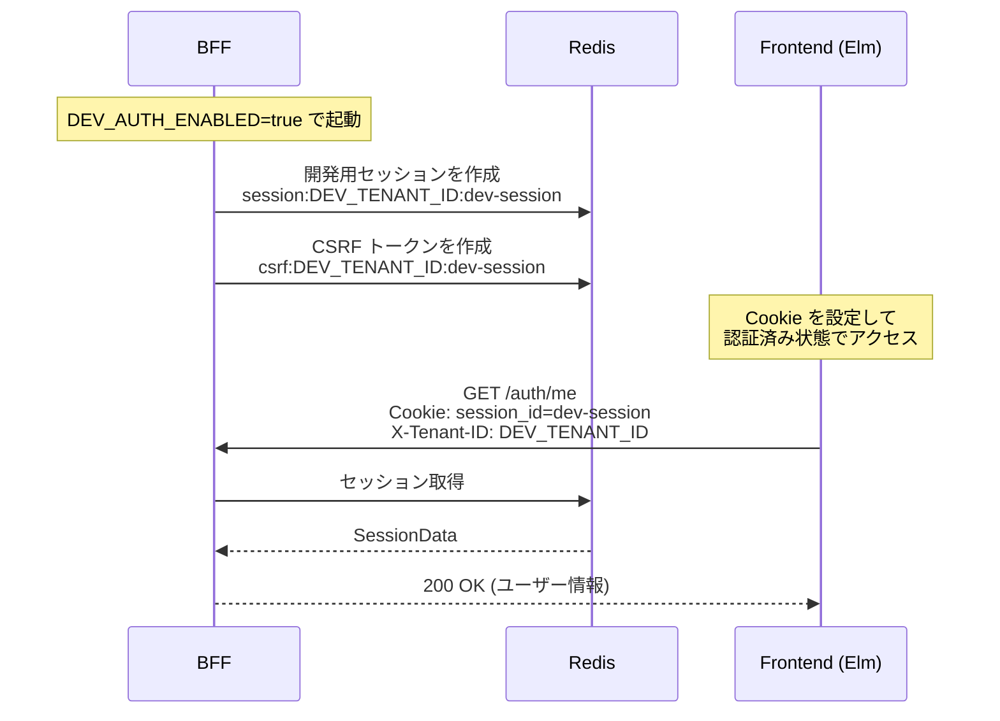

# DevAuth（開発用認証バイパス）

## 概要

開発環境でフロントエンド開発を先行させるため、ログイン画面なしで認証済み状態を実現する仕組み。

## 背景

- 認証 API（/auth/login, /auth/logout, /auth/me, /auth/csrf）は実装済み
- フロントエンド（Elm）のログイン画面は未実装
- ログイン画面を作る前に、コア機能（ダッシュボード、ワークフロー管理等）を開発したい

## 仕組み



## 使い方

### 1. 環境変数を設定

`.env` ファイルに追加:

```bash
DEV_AUTH_ENABLED=true
```

### 2. BFF を起動

```bash
cargo run -p ringiflow-bff
```

起動時に以下のログが出力される:

```
WARN  ========================================
WARN  ⚠️  DevAuth が有効です！
WARN     本番環境では絶対に有効にしないでください
WARN  ========================================
INFO  DevAuth: 開発用セッションを作成しました
INFO    Tenant ID: 00000000-0000-0000-0000-000000000001
INFO    User ID: 00000000-0000-0000-0000-000000000001
INFO    Session ID: dev-session
INFO    CSRF Token: <64文字のトークン>
```

### 3. フロントエンドの Cookie 設定

`frontend/src/main.js` で自動的に設定される:

```javascript
if (import.meta.env.DEV || import.meta.env.VITE_DEV_AUTH === "true") {
  document.cookie = "session_id=dev-session; path=/";
}
```

- 開発モード（`import.meta.env.DEV`）: Vite dev server 起動時に自動有効
- デモビルド（`VITE_DEV_AUTH=true`）: ビルド時に環境変数で有効化

### 4. API リクエスト時にヘッダーを設定

```
X-Tenant-ID: 00000000-0000-0000-0000-000000000001
```

## 開発用ユーザー情報

| 項目 | 値 |
|------|-----|
| Tenant ID | `00000000-0000-0000-0000-000000000001` |
| User ID | `00000000-0000-0000-0000-000000000001` |
| Email | `admin@example.com` |
| Name | `管理者` |
| Roles | `["tenant_admin"]` |
| Session ID | `dev-session` |

## 安全策

1. **Cargo feature flag によるコンパイル時除外**: `dev-auth` feature が無効の場合、DevAuth のコードは本番バイナリに一切含まれない（[ADR-034](../../05_ADR/034_DevAuthのFeatureFlag導入.md)）
2. **環境変数による実行時制御**: feature 有効時でも `DEV_AUTH_ENABLED=true` が設定されていない場合は無効
3. **警告ログ**: 起動時に目立つ警告を出力
4. **固定の値**: セッション ID やユーザー情報が固定のため、本番データと混同しにくい
5. **CI での検証**: 本番ビルド（`--no-default-features`）がコンパイルできることを CI で継続的に検証

### ビルドモードと DevAuth の関係

| ビルドモード | コマンド | DevAuth |
|-------------|---------|---------|
| 開発（デフォルト） | `cargo run` / `cargo build` | 含まれる（default feature） |
| デモ（Lightsail） | `docker build --build-arg CARGO_FEATURES=""` | 含まれる（default feature） |
| 本番 | `cargo build --release --no-default-features` | 除外される |
| テスト | `cargo test --all-features` | 含まれる（全 feature テスト） |

## デモ環境（Lightsail）での使用

デモ環境ではログインページが未実装のため、DevAuth を使用して認証済み状態を実現する。

### 仕組み

1. Backend Dockerfile のビルド引数 `CARGO_FEATURES=""` で `dev-auth` feature を含めてビルド
2. Frontend Dockerfile のビルド引数 `VITE_DEV_AUTH=true` で Cookie 設定コードを有効化
3. docker-compose の `DEV_AUTH_ENABLED: "true"` で BFF 起動時に開発用セッションを作成
4. ブラウザアクセス時に `main.js` が `session_id=dev-session` Cookie を設定
5. Elm アプリが CSRF トークンとユーザー情報を自動取得

### デプロイ方法

`infra/lightsail/deploy.sh` が自動的にデモ用ビルド引数を付与する:

```bash
./deploy.sh  # フルデプロイ（DevAuth 有効ビルド）
```

## 本番環境での注意

Dockerfile はデフォルトで `--no-default-features`（`ARG CARGO_FEATURES="--no-default-features"`）を使用するため、ビルド引数なしでビルドすると DevAuth コードは含まれない。

本番環境では:
- Backend: ビルド引数を指定しない（デフォルトで DevAuth 除外）
- Frontend: `VITE_DEV_AUTH` を設定しない（デフォルトで Cookie 設定無効）
- `DEV_AUTH_ENABLED` 環境変数を設定しないこと

## 関連

- 実装: `backend/apps/bff/src/dev_auth.rs`
- Feature flag 設計: [ADR-034: DevAuth の Feature Flag 導入](../../05_ADR/034_DevAuthのFeatureFlag導入.md)
- Issue: [#79 開発用認証バイパス（DevAuth）を実装](https://github.com/ka2kama/ringiflow/issues/79)
- Issue: [#288 本番ビルドで DevAuth が有効化されることを防止する](https://github.com/ka2kama/ringiflow/issues/288)
- Issue: [#274 デモ環境の認証セットアップ](https://github.com/ka2kama/ringiflow/issues/274)
- 認証機能設計: [07_認証機能設計.md](../03_詳細設計書/07_認証機能設計.md)
