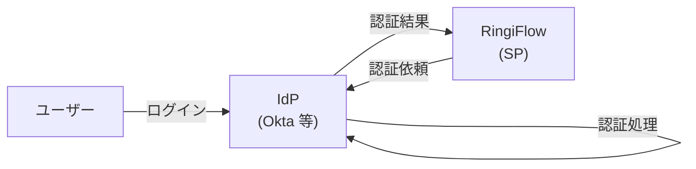
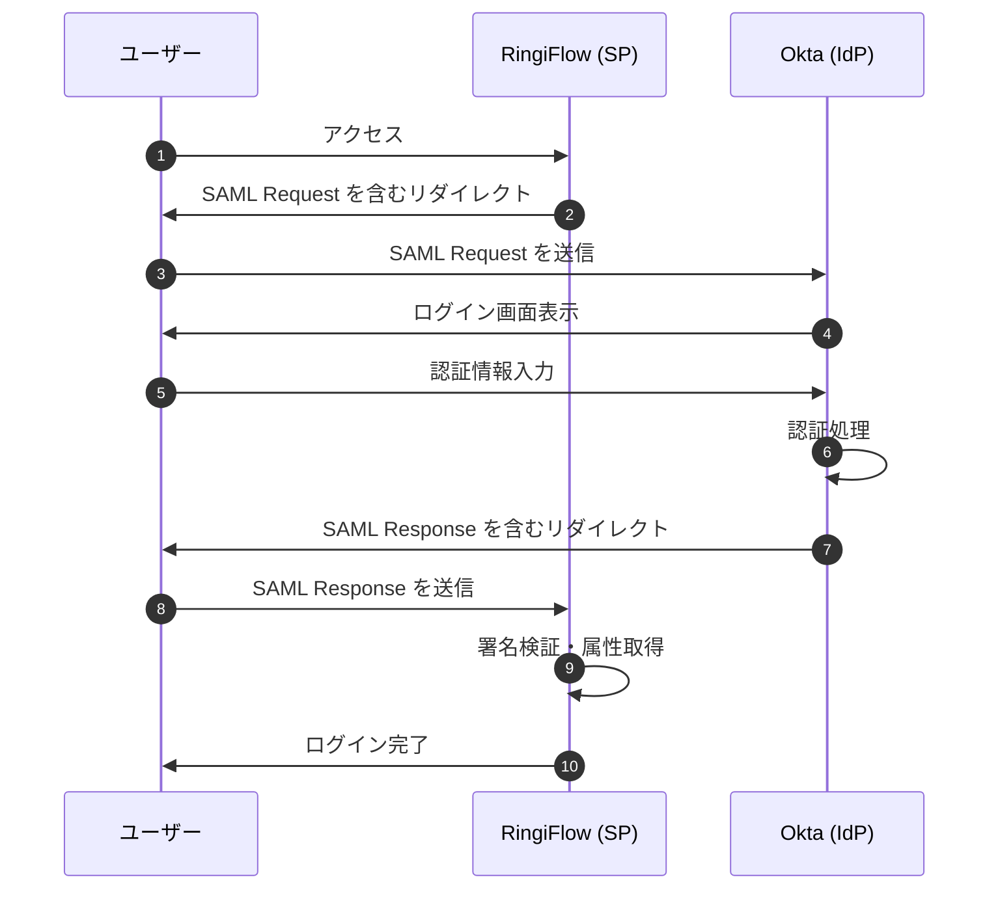
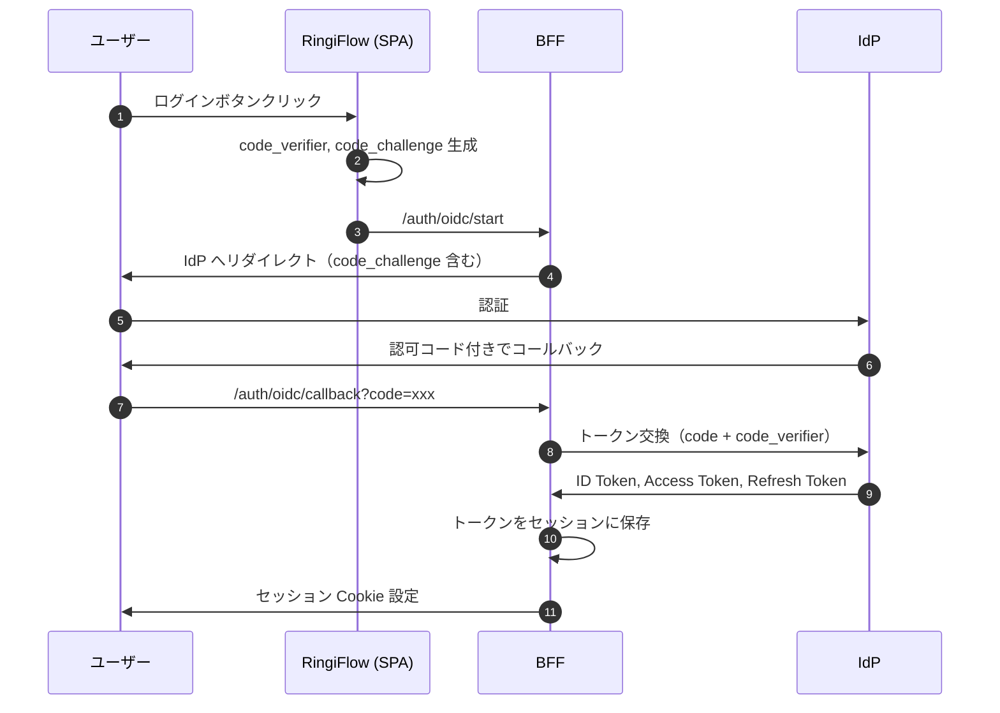
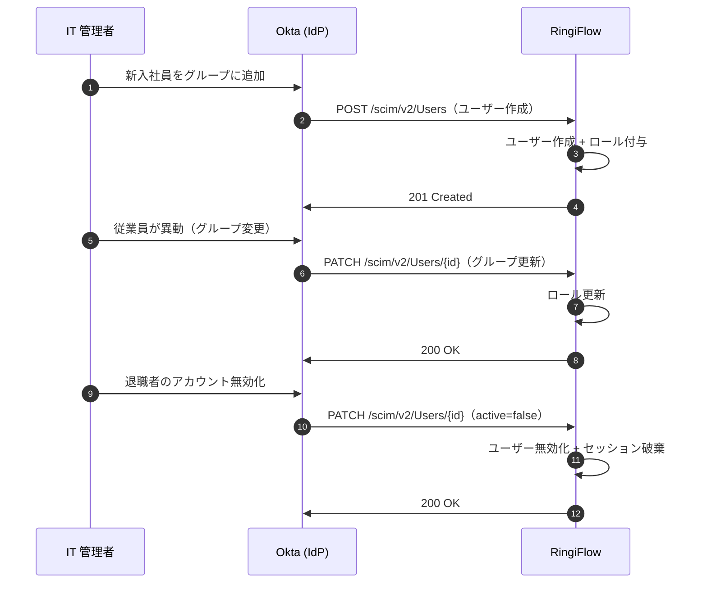
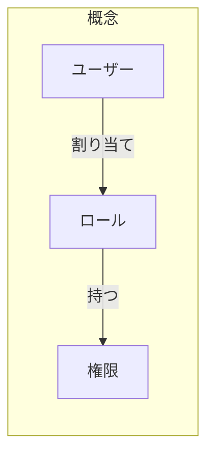
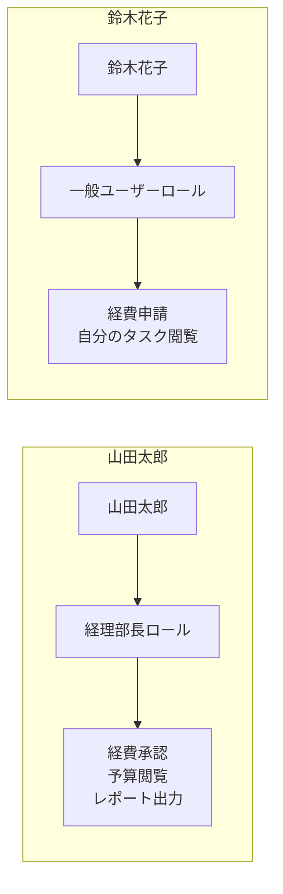

# エンタープライズ認証と ID 管理

エンタープライズ向け SaaS で必要となる認証・ID 管理の用語と概念を解説する。

## 概要

企業向けシステムでは、セキュリティと利便性の両立が求められる。特に以下の課題がある:

1. **従業員の認証情報管理**: 入社・異動・退職に伴うアカウント管理
2. **複数システムへのアクセス**: 一度のログインで複数サービスを利用したい
3. **セキュリティポリシーの統一**: パスワードポリシー、MFA の強制等

これらを解決するのが、本ノートで解説する技術群である。

---

## SSO（シングルサインオン）

**Single Sign-On** の略。一度の認証で複数のシステムにアクセスできる仕組み。

### なぜ必要か

企業では従業員が多数のシステムを使う:
- メール（Google Workspace, Microsoft 365）
- チャット（Slack, Teams）
- 業務システム（Salesforce, Workday）
- 社内システム（RingiFlow 等）

SSO なしの場合:
- システムごとにログインが必要
- パスワードが増え、メモ書きや使い回しが発生
- 退職時にアカウント削除漏れのリスク

SSO ありの場合:
- 1 回ログインすれば全システムにアクセス可能
- パスワードは IdP（後述）で一元管理
- 退職時は IdP のアカウントを無効化するだけで全システムへのアクセスを遮断

### 実現方式

SSO を実現するプロトコルとして **SAML 2.0** と **OIDC** がある。

---

## IdP（Identity Provider）

**アイデンティティプロバイダー**。ユーザーの認証を担当するサービス。



### 主要な IdP サービス

| サービス | 提供元 | 特徴 |
|---------|--------|------|
| Okta | Okta | エンタープライズ向け ID 管理の代表格 |
| Azure AD (Entra ID) | Microsoft | Microsoft 365 との統合が強力 |
| Google Workspace | Google | Gmail/Google Apps ユーザー向け |
| OneLogin | OneLogin | 中小企業にも人気 |
| Auth0 | Okta (買収) | 開発者フレンドリー |

### SP（Service Provider）

IdP に対して、認証を依頼する側のサービス（RingiFlow など）を **SP** と呼ぶ。

---

## SAML 2.0

**Security Assertion Markup Language 2.0**。XML ベースの認証連携規格。2005 年に標準化され、エンタープライズで広く普及している。

### 認証フロー（SP-Initiated）



### 用語

| 用語 | 説明 |
|------|------|
| SAML Request | SP から IdP への認証依頼（XML） |
| SAML Response | IdP から SP への認証結果（XML、署名付き） |
| SAML Assertion | Response 内のユーザー情報（メール、名前、グループ等） |
| メタデータ | SP/IdP の設定情報（エンドポイント URL、証明書等） |

### 特徴

- **メリット**: 長い実績、エンタープライズで広く採用、属性（グループ等）の受け渡しが柔軟
- **デメリット**: XML ベースで冗長、モバイルアプリとの相性が悪い

---

## OIDC（OpenID Connect）

**OAuth 2.0** を拡張した認証プロトコル。2014 年に標準化され、モダンなアプリケーションで主流となっている。

### OAuth 2.0 との関係

```
OAuth 2.0 = 認可（Authorization）のためのフレームワーク
           「このアプリに Google ドライブへのアクセスを許可しますか？」

OIDC     = OAuth 2.0 + 認証（Authentication）
           「このユーザーは誰か？」を標準化
```

### 認証フロー（Authorization Code + PKCE）



### PKCE（ピクシー）

**Proof Key for Code Exchange**。認可コード横取り攻撃を防ぐ仕組み。

```
1. クライアントが code_verifier（ランダム文字列）を生成
2. code_challenge = SHA256(code_verifier) を認証リクエストに含める
3. トークン交換時に code_verifier を送信
4. IdP が SHA256(code_verifier) == code_challenge を検証

→ 認可コードを傍受しても、code_verifier がなければトークン取得不可
```

### トークンの種類

| トークン | 用途 | 有効期限 |
|---------|------|---------|
| ID Token | ユーザー情報（JWT 形式） | 短い（数分〜1時間） |
| Access Token | API アクセス用 | 短い（数分〜1時間） |
| Refresh Token | Access Token の更新用 | 長い（数日〜数週間） |

### SAML vs OIDC

| 観点 | SAML 2.0 | OIDC |
|------|----------|------|
| データ形式 | XML | JSON |
| トークン形式 | SAML Assertion | JWT |
| 主な用途 | Web アプリ | Web + モバイル + API |
| 実装の容易さ | やや複雑 | 比較的シンプル |
| 普及度（エンタープライズ） | 非常に高い | 高い（増加中） |

**RingiFlow では両方に対応**し、顧客の IdP に合わせて選択できるようにする。

---

## SCIM（スキム）

**System for Cross-domain Identity Management**。ユーザー・グループ情報を自動的に同期するための標準プロトコル。

### なぜ必要か

SSO だけでは不十分な場面がある:

```
【SSO だけの場合】
1. 新入社員が IdP にアカウント作成される
2. 新入社員が RingiFlow に初めてログイン
3. RingiFlow 側でユーザーが JIT（Just-In-Time）作成される
4. 管理者が手動でロールやグループを設定 ← 手間！

【SCIM がある場合】
1. 新入社員が IdP にアカウント作成される
2. IdP から RingiFlow に自動でユーザー情報が同期される
3. グループ情報も同期され、適切なロールが自動付与 ← 自動！
```

### SCIM の動作



### SCIM API エンドポイント

| メソッド | パス | 説明 |
|---------|------|------|
| GET | /scim/v2/Users | ユーザー一覧取得 |
| POST | /scim/v2/Users | ユーザー作成 |
| GET | /scim/v2/Users/{id} | ユーザー詳細取得 |
| PUT | /scim/v2/Users/{id} | ユーザー更新（全体） |
| PATCH | /scim/v2/Users/{id} | ユーザー更新（部分） |
| DELETE | /scim/v2/Users/{id} | ユーザー削除 |
| GET | /scim/v2/Groups | グループ一覧取得 |
| POST | /scim/v2/Groups | グループ作成 |

### ユーザーリソースの例

```json
{
  "schemas": ["urn:ietf:params:scim:schemas:core:2.0:User"],
  "id": "2819c223-7f76-453a-919d-413861904646",
  "userName": "yamada@example.com",
  "name": {
    "familyName": "山田",
    "givenName": "太郎"
  },
  "emails": [
    {
      "value": "yamada@example.com",
      "primary": true
    }
  ],
  "active": true,
  "groups": [
    {
      "value": "経理部",
      "$ref": "/scim/v2/Groups/xxx"
    }
  ]
}
```

### SCIM と JIT プロビジョニングの比較

| 観点 | JIT（Just-In-Time） | SCIM |
|------|---------------------|------|
| ユーザー作成タイミング | 初回ログイン時 | IdP で作成された時点 |
| グループ/ロール同期 | 手動または限定的 | 自動 |
| 退職者対応 | ログイン不可になるだけ | 即座にユーザー無効化 |
| 実装コスト | 低い | やや高い |
| 導入企業 | 小〜中規模 | 大規模エンタープライズ |

**RingiFlow では Enterprise プランで SCIM に対応**し、大企業の ID 管理要件を満たす。

---

## MFA（多要素認証）

**Multi-Factor Authentication**。パスワードに加えて、追加の認証要素を要求する仕組み。

### 認証の 3 要素

| 要素 | 説明 | 例 |
|------|------|-----|
| 知識（Something you know） | 本人だけが知っている情報 | パスワード、PIN、秘密の質問 |
| 所有（Something you have） | 本人だけが持っているもの | スマートフォン、セキュリティキー |
| 生体（Something you are） | 本人の身体的特徴 | 指紋、顔、虹彩 |

MFA = 2 つ以上の要素を組み合わせた認証

### TOTP（トトピー）

**Time-based One-Time Password**。時刻に基づいて生成されるワンタイムパスワード。

```
1. 初回設定時に秘密鍵（シード）を共有（QR コード等）
2. 認証時:
   - アプリが 秘密鍵 + 現在時刻 から 6 桁コードを生成
   - サーバーも同じ計算を行い、一致を確認
3. コードは 30 秒ごとに変化
```

対応アプリ: Google Authenticator, Microsoft Authenticator, Authy 等

### その他の MFA 方式

| 方式 | 説明 | セキュリティ |
|------|------|-------------|
| SMS | 電話番号に確認コードを送信 | 中（SIM スワップ攻撃のリスク） |
| メール | メールアドレスに確認コードを送信 | 中 |
| TOTP | 認証アプリでコード生成 | 高 |
| プッシュ通知 | アプリに承認リクエスト | 高 |
| FIDO2/WebAuthn | セキュリティキーや生体認証 | 非常に高 |

---

## RBAC と ABAC

アクセス制御（認可）のモデル。

### RBAC（ロールベースアクセス制御）

**Role-Based Access Control**。ユーザーに「ロール（役割）」を割り当て、ロールに権限を付与する。



例:



**メリット**: シンプル、理解しやすい、監査しやすい
**デメリット**: きめ細かな制御が難しい（ロール爆発の問題）

### ABAC（属性ベースアクセス制御）

**Attribute-Based Access Control**。ユーザーやリソースの「属性」に基づいてアクセスを制御する。

```
ポリシー例:
「部署が '経理部' かつ 役職が '課長以上' のユーザーは、
 金額が 100万円以上 の経費申請を承認できる」

属性:
- ユーザー属性: 部署、役職、勤続年数
- リソース属性: 金額、カテゴリ、申請者の部署
- 環境属性: 時刻、アクセス元 IP
```

**メリット**: 非常に柔軟、きめ細かな制御が可能
**デメリット**: 複雑、ポリシー管理が難しい

### RingiFlow での使い分け

| モデル | 用途 |
|--------|------|
| RBAC | 基本的な権限管理（管理者/一般ユーザー等） |
| ABAC | ワークフローの承認ルール（金額条件、部署条件等） |

---

## 関連ドキュメント

- [01_コア要件.md](../../01_要件定義書/01_コア要件.md) - 4.1 認証・認可機能
- [04_運用設計.md](../../02_基本設計書/04_運用設計.md) - セキュリティ運用

---

## 変更履歴

| 日付 | 変更内容 |
|------|---------|
| 2026-01-17 | 初版作成 |
