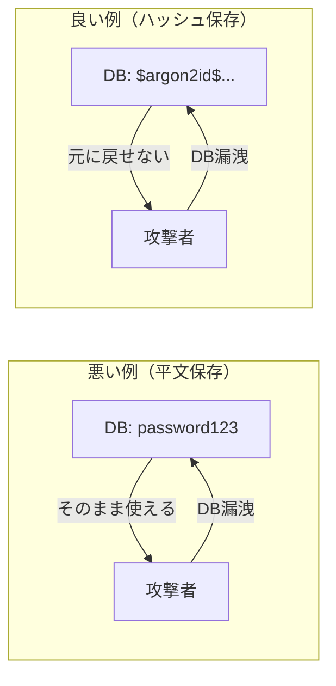
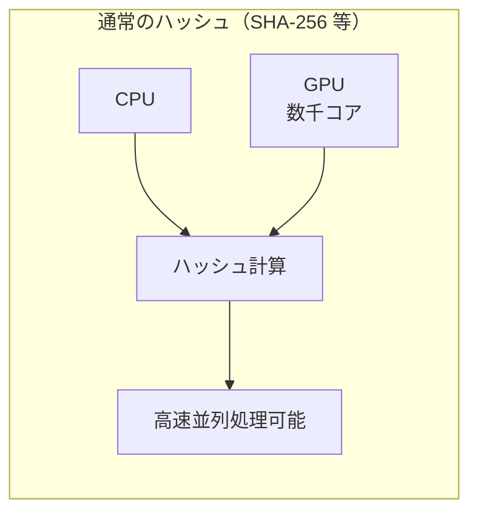
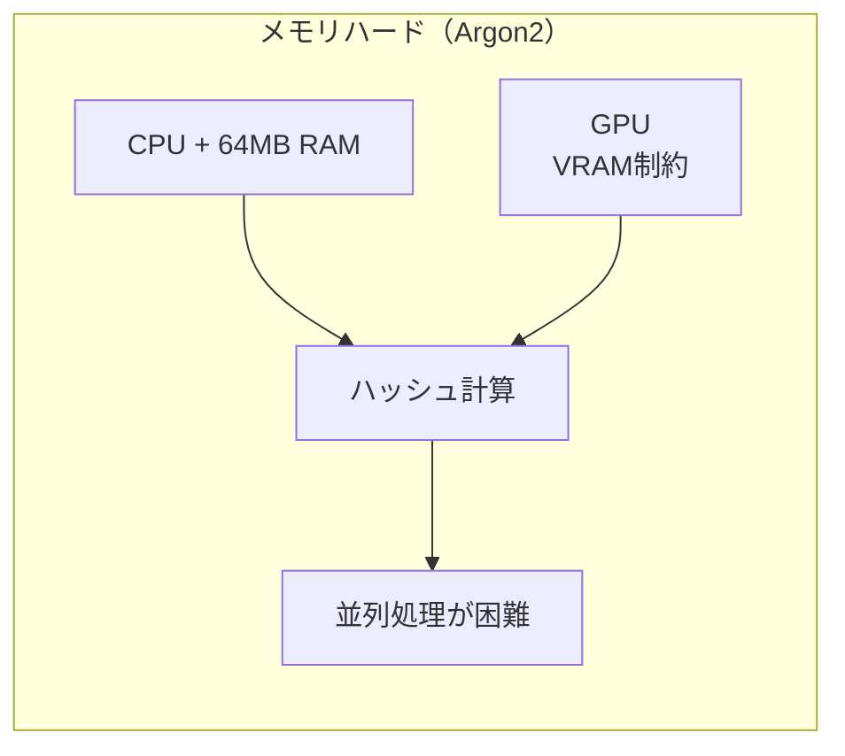
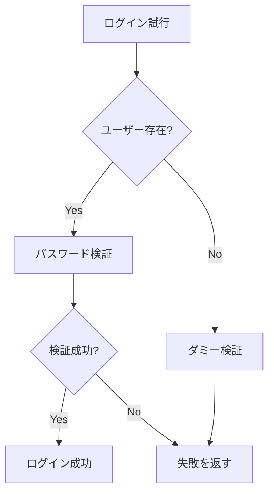

# パスワードハッシュ

## 概要

パスワードを安全に保存するための技術。平文のパスワードを保存せず、一方向ハッシュ関数で変換した値を保存する。

## なぜハッシュ化が必要か



DB が漏洩した場合でも、ハッシュ値から元のパスワードを復元することは計算上困難。

## アルゴリズムの選択

### 比較

| アルゴリズム | 特徴 | 推奨度 |
|-------------|------|--------|
| MD5, SHA-1 | 高速すぎる（ブルートフォースに弱い）、脆弱性あり | ❌ 使用禁止 |
| SHA-256 | 高速すぎる、ソルト管理が別途必要 | ❌ パスワードには不適 |
| bcrypt | 歴史があり実績豊富、メモリハードではない | ⚠️ 許容（既存システム） |
| scrypt | メモリハード、パラメータ調整が難しい | ⚠️ 許容 |
| **Argon2** | 最新の推奨、メモリハード、柔軟なパラメータ | ✅ 推奨 |

### メモリハードとは

**メモリハード関数**とは、計算に大量のメモリを必要とする関数のこと。





**なぜ重要か:**

| 攻撃手法 | 通常のハッシュ | メモリハード |
|---------|--------------|-------------|
| GPU による並列計算 | 数千コアで同時実行可能 | メモリ帯域がボトルネック |
| ASIC（専用ハードウェア） | 高速化しやすい | メモリチップが必要でコスト増 |
| クラウドでの分散攻撃 | CPU 追加で線形にスケール | メモリも比例して必要 |

**具体例:**

- SHA-256: GPU 1 台で毎秒数十億回のハッシュ計算が可能
- Argon2（64 MB）: GPU のコアごとに 64 MB のメモリが必要
  - VRAM 8 GB の GPU → 最大 128 並列（8192 MB ÷ 64 MB）
  - 実際はメモリ帯域の制約でさらに遅くなる

bcrypt は CPU バウンド（時間コストのみ）なので、GPU の大量コアで高速化されやすい。
Argon2 はメモリバウンドなので、メモリ帯域が攻撃速度の上限になる。

### Argon2 の種類

| 種類 | 特徴 | ユースケース |
|------|------|-------------|
| Argon2d | GPU 攻撃に強い、サイドチャネル攻撃に弱い | バックエンドでの暗号化 |
| Argon2i | サイドチャネル攻撃に強い | 共有環境でのパスワードハッシュ |
| **Argon2id** | Argon2d と Argon2i のハイブリッド | **汎用（推奨）** |

**本プロジェクトでは Argon2id を採用**（OWASP 推奨）。

## Argon2id パラメータ

### 本プロジェクトの設定

```
Memory:      65536 KB (64 MB)
Iterations:  1
Parallelism: 1
Salt length: 16 bytes
Hash length: 32 bytes
```

### パラメータの意味

| パラメータ | 説明 | 増やすと | 減らすと |
|-----------|------|---------|---------|
| Memory (m) | ハッシュ計算に使用するメモリ量 | より安全（並列攻撃のコスト増）、サーバーメモリ消費増 | 攻撃者に有利 |
| Iterations (t) | ハッシュ計算の反復回数 | ハッシュ化時間が増える | 攻撃者に有利 |
| Parallelism (p) | 並列スレッド数 | CPU 使用率が上がる | ハッシュ化が遅くなる |

### なぜこの値を選んだか

**Memory: 64 MB**
- RFC 9106 推奨値
- 攻撃者が GPU で並列にクラックする際のコストを上げる

**Iterations: 1**
- Argon2 はメモリハードな設計のため、反復回数は 1 で十分
- bcrypt のように反復回数で計算コストを調整する設計ではない

**Parallelism: 1**
- サーバー負荷を抑える初期設定
- 負荷テスト後、余裕があれば増やすことを検討

### パラメータ調整の指針

```
目標: ハッシュ化に 0.5〜1.0 秒かかる設定

1. まず Memory を増やす（最優先）
   - 64 MB → 128 MB → 256 MB

2. 次に Iterations を増やす
   - 1 → 2 → 3

3. 最後に Parallelism を調整
   - サーバーの CPU コア数に応じて
```

## ハッシュ形式

Argon2 のハッシュ値は以下の形式で保存される:

```
$argon2id$v=19$m=65536,t=1,p=1$<salt>$<hash>
```

| フィールド | 説明 |
|-----------|------|
| `$argon2id$` | アルゴリズム識別子 |
| `v=19` | Argon2 のバージョン |
| `m=65536` | メモリ（KB） |
| `t=1` | 反復回数 |
| `p=1` | 並列度 |
| `<salt>` | Base64 エンコードされたソルト |
| `<hash>` | Base64 エンコードされたハッシュ値 |

**ポイント:** パラメータがハッシュ値に含まれるため、将来パラメータを変更しても既存のハッシュを検証できる。

## 実装パターン

### Rust での実装例

```rust
use argon2::{
    password_hash::{PasswordHash, PasswordHasher, PasswordVerifier, SaltString},
    Argon2, Params,
};
use rand::rngs::OsRng;

pub struct PasswordHasherService {
    argon2: Argon2<'static>,
}

impl PasswordHasherService {
    pub fn new() -> Self {
        // OWASP 推奨パラメータ
        let params = Params::new(
            65536,  // memory (KB) = 64 MB
            1,      // iterations
            1,      // parallelism
            None,   // output length (default: 32)
        ).expect("Invalid params");

        Self {
            argon2: Argon2::new(argon2::Algorithm::Argon2id, argon2::Version::V0x13, params),
        }
    }

    pub fn hash(&self, password: &str) -> Result<String, Error> {
        let salt = SaltString::generate(&mut OsRng);
        let hash = self.argon2
            .hash_password(password.as_bytes(), &salt)?
            .to_string();
        Ok(hash)
    }

    pub fn verify(&self, password: &str, hash: &str) -> Result<bool, Error> {
        let parsed = PasswordHash::new(hash)?;
        Ok(self.argon2.verify_password(password.as_bytes(), &parsed).is_ok())
    }
}
```

### テストでの考慮事項

```rust
// テスト用に軽量なパラメータを使う
#[cfg(test)]
fn test_params() -> Params {
    Params::new(
        1024,  // 1 MB（テスト用に軽量）
        1,
        1,
        None,
    ).unwrap()
}
```

## セキュリティ上の考慮事項

### タイミング攻撃対策

ユーザーが存在しない場合もダミーのパスワード検証を実行する:



**理由:** ユーザーの存在/不存在で応答時間が異なると、攻撃者がユーザー名を列挙できてしまう。

```rust
use std::hint::black_box;

pub async fn verify_login(&self, email: &str, password: &str) -> Result<User, AuthError> {
    match self.user_repo.find_by_email(email).await? {
        Some(user) => {
            if self.hasher.verify(password, &user.password_hash)? {
                Ok(user)
            } else {
                Err(AuthError::InvalidCredentials)
            }
        }
        None => {
            // ダミー検証（タイミング攻撃対策）
            // black_box で最適化による削除を防ぐ
            let _ = black_box(self.hasher.verify(password, &self.dummy_hash));
            Err(AuthError::InvalidCredentials)
        }
    }
}
```

**`black_box` を使う理由:**

`let _ = expr` は式を実行して返り値を捨てるが、コンパイラの最適化で呼び出し自体が削除される可能性がある:

- 外部クレートの関数は通常消えない（コンパイラが内部を見れないため）
- しかし LTO（Link Time Optimization）有効時は消える可能性がある
- 将来のコンパイラ改善で消える可能性もある

`std::hint::black_box` はコンパイラに「この値を最適化で消すな」と伝える。セキュリティ上重要なコードでは明示的に使うのが安全。

注意: `black_box` はベストエフォートであり、完全な保証はない（コンパイラへの「ヒント」）。実用上は十分だが、より確実な方法が必要な場合は `volatile read` や `#[inline(never)]` 関数を検討する。

### パスワードポリシー

ハッシュ化の前にパスワードポリシーを検証する:

| 項目 | 値 | 理由 |
|------|-----|------|
| 最小長 | 8 文字 | NIST SP 800-63B 推奨 |
| 最大長 | 128 文字 | DoS 攻撃防止（長すぎるパスワードはハッシュ計算に時間がかかる） |
| 必須文字 | 英字 + 数字 | 辞書攻撃への耐性 |

## 関連リソース

- [OWASP Password Storage Cheat Sheet](https://cheatsheetseries.owasp.org/cheatsheets/Password_Storage_Cheat_Sheet.html)
- [RFC 9106 - Argon2 Memory-Hard Function](https://www.rfc-editor.org/rfc/rfc9106.html)
- [argon2 crate (Rust)](https://docs.rs/argon2/latest/argon2/)

---

## 変更履歴

| 日付 | 変更内容 |
|------|---------|
| 2026-01-17 | タイミング攻撃対策に `black_box` の説明を追加 |
| 2026-01-17 | 「メモリハードとは」セクションを追加 |
| 2026-01-17 | 初版作成 |
