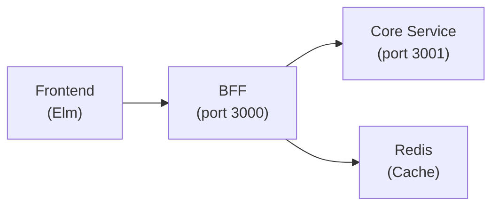
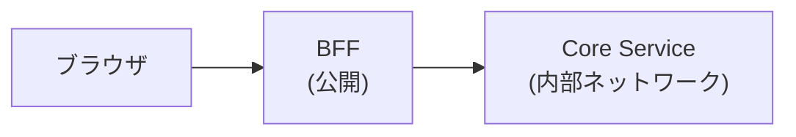
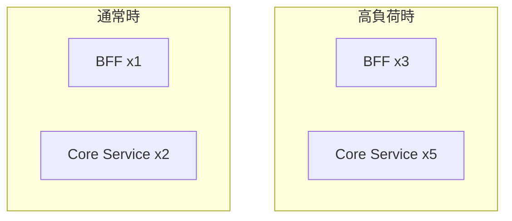

# BFF（Backend for Frontend）パターン

## 概要

BFF は、フロントエンド専用のバックエンドサーバーを設けるアーキテクチャパターン。
フロントエンドと内部 API の間に位置し、フロントエンド固有の要件を処理する。

## アーキテクチャ



## BFF の責務

| 責務 | 説明 |
|------|------|
| 認証・セッション管理 | Cookie ベースのセッション、JWT 発行・検証 |
| CSRF 防御 | トークン生成・検証 |
| レスポンス最適化 | フロントエンドに最適な形式にデータを変換 |
| アグリゲーション | 複数の API 呼び出しを 1 つにまとめる |
| キャッシュ | Redis を使用したレスポンスキャッシュ |
| レート制限 | クライアントごとのリクエスト制限 |
| セキュリティヘッダ | CORS、CSP などのヘッダ付与 |

## Core Service の責務

| 責務 | 説明 |
|------|------|
| ビジネスロジック | ドメインルールの実行 |
| データ永続化 | データベース操作 |
| 認可チェック | リソースへのアクセス権限検証 |
| 内部サービス通信 | 他のマイクロサービスとの連携 |

## なぜ分離するか

### 1. セキュリティ



- Core Service は内部ネットワークに配置
- 外部からの直接アクセスを防止
- 攻撃対象を BFF に限定

### 2. 関心の分離

- BFF: フロントエンド固有の要件（セッション、CSRF、レスポンス形式）
- Core Service: ビジネスロジック（フロントエンドに依存しない）

### 3. 独立したスケーリング



- BFF と Core Service を別々にスケールアウト可能
- 負荷特性に応じたリソース配分

### 4. 障害分離

- BFF がダウンしても Core Service は影響を受けない
- Core Service がダウンしても BFF はエラーレスポンスを返せる

## セッション管理

BFF は HTTPOnly Cookie + Redis でセッションを管理する。

```
1. ブラウザ → BFF: POST /auth/login
2. BFF → Core Service: 認証リクエスト
3. Core Service → BFF: ユーザー情報
4. BFF → Redis: セッション保存
5. BFF → ブラウザ: Set-Cookie: session_id=xxx; HttpOnly; Secure
```

### Cookie 属性

| 属性 | 値 | 目的 |
|------|-----|------|
| HttpOnly | true | JavaScript からのアクセス禁止（XSS 対策） |
| Secure | true | HTTPS のみで送信 |
| SameSite | Lax | CSRF 対策（後述） |
| Path | / | 全パスで有効 |

### SameSite 属性の選択

| 値 | 動作 | ユースケース |
|----|------|-------------|
| Strict | クロスサイトリクエストで一切 Cookie を送らない | 最も安全だが、外部リンクからのアクセスでログアウト状態になる |
| Lax | トップレベルナビゲーション（リンククリック）の GET のみ Cookie を送る | 実用性と安全性のバランス |
| None | 常に Cookie を送る（Secure 必須） | サードパーティ Cookie が必要な場合のみ |

**本プロジェクトでは `Lax` を採用:**

- CSRF 対策は CSRF トークンで担保しているため、Strict の制約は不要
- 外部サイトからのリンクや、将来の SSO リダイレクト後もセッションが維持される
- POST/PUT/DELETE は SameSite=Lax でもクロスサイトから Cookie が送られないため、CSRF の主要な攻撃を防げる

## CSRF 防御

BFF はサーバサイドトークン方式で CSRF を防御する。

```
1. ブラウザ → BFF: GET /auth/csrf
2. BFF → Redis: CSRF トークン生成・保存（セッションに紐付け）
3. BFF → ブラウザ: { "token": "xxx" }
4. ブラウザ → BFF: POST /api/... (X-CSRF-Token: xxx)
5. BFF → Redis: トークン検証（セッションの値と照合）
```

### Double Submit Cookie との違い

| 方式 | トークン保存場所 | 検証方法 |
|------|----------------|---------|
| Double Submit Cookie | Cookie（別の Cookie） | Cookie とヘッダーの値を比較 |
| サーバサイドトークン（本方式） | Redis | Redis の値とヘッダーを比較 |

**サーバサイドトークン方式のメリット:**

- トークンが Cookie に露出しない
- サブドメイン攻撃に強い（Cookie を共有するサブドメインからの攻撃を防げる）

**デメリット:**

- Redis への依存が増える（セッション + CSRF トークン）

エンタープライズ SaaS として安全性を優先し、サーバサイドトークン方式を採用。

## アグリゲーション

複数の API 呼び出しを 1 つにまとめて、フロントエンドのリクエスト数を削減。

```rust
// BFF: ダッシュボード用エンドポイント
async fn get_dashboard() -> Result<Json<DashboardData>, ApiError> {
    // 並列で複数の API を呼び出し
    let (tasks, workflows, stats) = tokio::join!(
        core_api.get_my_tasks(),
        core_api.get_my_workflows(),
        core_api.get_dashboard_stats(),
    );

    Ok(Json(DashboardData {
        tasks: tasks?,
        workflows: workflows?,
        stats: stats?,
    }))
}
```

## レスポンス変換

フロントエンドに最適な形式にデータを変換する。

```rust
// Core Service のレスポンス
struct InternalWorkflow {
    id: Uuid,
    definition_id: Uuid,
    status_code: i32,
    metadata: serde_json::Value,
    created_at: DateTime<Utc>,
}

// BFF が変換して返すレスポンス
struct WorkflowResponse {
    id: String,
    title: String,
    status: String,  // "pending", "approved" など人間可読
    created_at: String,  // ISO 8601 形式
}
```

## プロジェクトでの使用

| クレート | ポート | 役割 |
|---------|--------|------|
| `apps/bff` | 13000 | BFF |
| `apps/core-api` | 13001 | Core Service |

## 関連リソース

- [Sam Newman - Pattern: Backends For Frontends](https://samnewman.io/patterns/architectural/bff/)
- [Microsoft - Gateway Aggregation pattern](https://learn.microsoft.com/en-us/azure/architecture/patterns/gateway-aggregation)

---

## 変更履歴

| 日付 | 変更内容 |
|------|---------|
| 2026-01-17 | SameSite 属性の選択理由、CSRF 防御方式の詳細を追記 |
| 2026-01-14 | 初版作成 |
