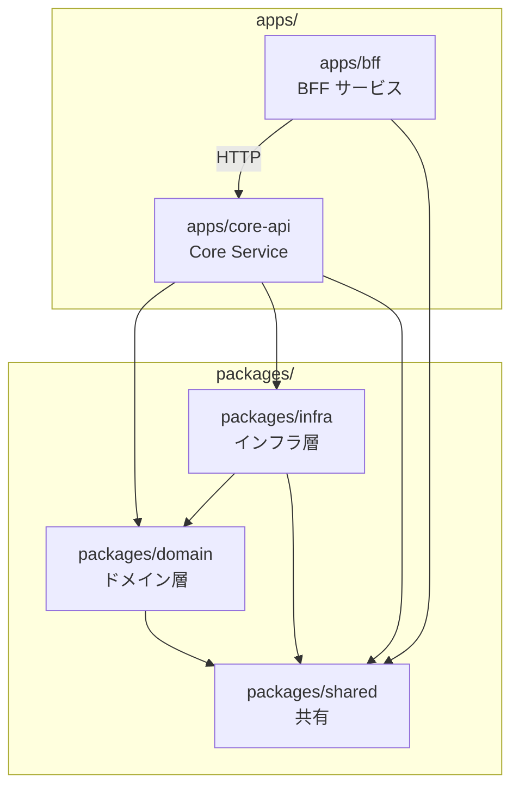
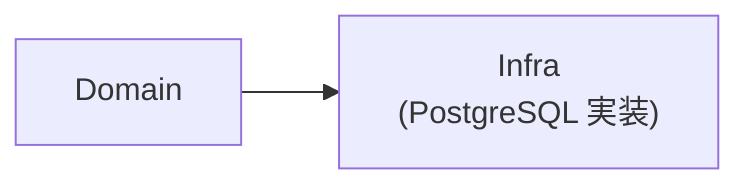
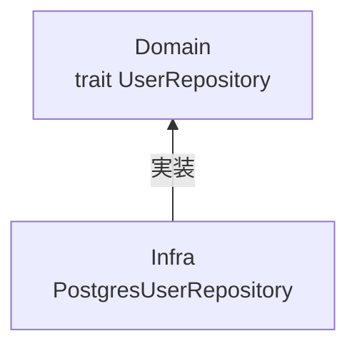
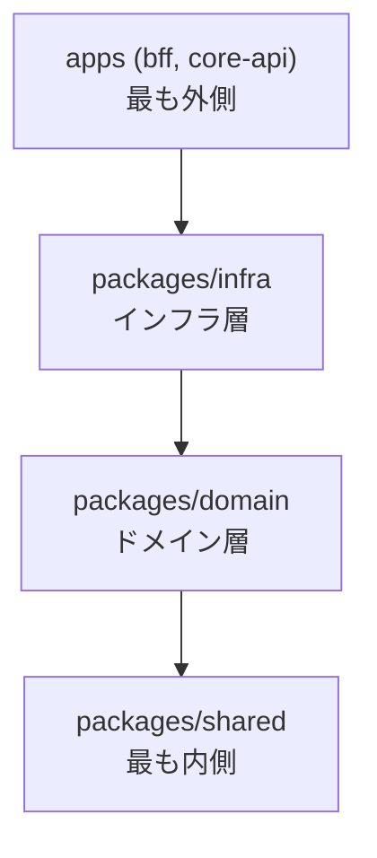

# Cargo（カーゴ）ワークスペースと依存性逆転

## 概要

Rust のモノレポ構成において、Cargo Workspace を使用してクレートを管理し、
依存性逆転の原則（DIP）を適用する方法を解説する。

## Cargo Workspace とは

複数のクレートを 1 つのワークスペースとして管理する Cargo の機能。

```toml
# Cargo.toml（ルート）
[workspace]
resolver = "2"
members = [
    "apps/bff",
    "apps/core-api",
    "packages/domain",
    "packages/infra",
    "packages/shared",
]
```

### メリット

| 観点 | 説明 |
|------|------|
| 依存関係の統一 | 全クレートで同じバージョンの依存を使用 |
| ビルドの効率化 | 共通の `target/` ディレクトリを共有 |
| テストの一括実行 | `cargo test --workspace` で全クレートをテスト |
| 依存管理の簡略化 | `workspace.dependencies` で一元管理 |

## ワークスペース依存の定義

```toml
# Cargo.toml（ルート）
[workspace.dependencies]
# 内部クレート
ringiflow-domain = { path = "packages/domain" }
ringiflow-infra = { path = "packages/infra" }
ringiflow-shared = { path = "packages/shared" }

# 外部クレート（バージョンを一元管理）
axum = "0.8"
tokio = { version = "1", features = ["full"] }
serde = { version = "1", features = ["derive"] }
sqlx = { version = "0.8", features = ["runtime-tokio", "postgres"] }
```

各クレートでは `workspace = true` で参照:

```toml
# packages/domain/Cargo.toml
[dependencies]
ringiflow-shared = { workspace = true }
serde = { workspace = true }
```

## クレート構成



## 依存性逆転の原則（DIP）

「上位モジュールは下位モジュールに依存すべきでない。両者は抽象に依存すべき。」

### 従来の依存関係（問題あり）



ドメイン層が PostgreSQL の詳細に依存してしまう。

### 依存性逆転後



## 実装例

### 1. ドメイン層でインターフェースを定義

```rust
// packages/domain/src/repositories/user_repository.rs

use crate::entities::User;
use crate::error::DomainError;

/// ユーザーリポジトリのインターフェース
///
/// インフラ層の詳細（PostgreSQL, Redis 等）を知らない
#[async_trait::async_trait]
pub trait UserRepository: Send + Sync {
    async fn find_by_id(&self, id: UserId) -> Result<Option<User>, DomainError>;
    async fn find_by_email(&self, email: &str) -> Result<Option<User>, DomainError>;
    async fn save(&self, user: &User) -> Result<(), DomainError>;
}
```

### 2. インフラ層で実装

```rust
// packages/infra/src/database/repositories/user_repository.rs

use ringiflow_domain::repositories::UserRepository;
use ringiflow_domain::entities::User;
use sqlx::PgPool;

pub struct PostgresUserRepository {
    pool: PgPool,
}

#[async_trait::async_trait]
impl UserRepository for PostgresUserRepository {
    async fn find_by_id(&self, id: UserId) -> Result<Option<User>, DomainError> {
        let row = sqlx::query_as!(
            UserRow,
            "SELECT * FROM users WHERE id = $1",
            id.as_uuid()
        )
        .fetch_optional(&self.pool)
        .await
        .map_err(|e| DomainError::Infrastructure(e.to_string()))?;

        Ok(row.map(User::from))
    }
    // ...
}
```

### 3. Core Service 層で注入

```rust
// apps/core-api/src/main.rs

use ringiflow_domain::repositories::UserRepository;
use ringiflow_infra::database::PostgresUserRepository;

#[tokio::main]
async fn main() {
    let pool = PgPool::connect(&database_url).await.unwrap();

    // 具体的な実装を注入
    let user_repository: Arc<dyn UserRepository> =
        Arc::new(PostgresUserRepository::new(pool));

    // ハンドラに渡す
    let app = Router::new()
        .route("/users/:id", get(get_user))
        .with_state(AppState { user_repository });
}
```

## 依存方向の原則



重要: domain は infra に依存しない

| クレート | 役割 | 依存先 |
|---------|------|--------|
| `shared` | 共通ユーティリティ | なし |
| `domain` | ビジネスロジック、trait 定義 | `shared` のみ |
| `infra` | trait の実装、外部連携 | `domain`, `shared` |
| `bff` | BFF サービス | `shared` のみ |
| `core-api` | Core Service、HTTP ハンドラ、DI | 全クレート |

## メリット

### 1. テストが容易

```rust
// ドメイン層のテスト（モックを使用）
struct MockUserRepository {
    users: Vec<User>,
}

#[async_trait::async_trait]
impl UserRepository for MockUserRepository {
    async fn find_by_id(&self, id: UserId) -> Result<Option<User>, DomainError> {
        Ok(self.users.iter().find(|u| u.id == id).cloned())
    }
}

#[tokio::test]
async fn test_user_service() {
    let repo = MockUserRepository { users: vec![...] };
    let service = UserService::new(Arc::new(repo));
    // テスト
}
```

### 2. データベースの変更が容易

PostgreSQL → DynamoDB に変更しても、ドメイン層は影響を受けない。

### 3. ビジネスルールが明確

ドメイン層にビジネスロジックが集約され、インフラの詳細と分離される。

## プロジェクトでの使用

| クレート | 場所 |
|---------|------|
| bff | `apps/bff/` |
| core-api | `apps/core-api/` |
| domain | `packages/domain/` |
| infra | `packages/infra/` |
| shared | `packages/shared/` |

## Cargo.lock の管理

### アプリケーション vs ライブラリ

| プロジェクト種別 | Cargo.lock | 理由 |
|-----------------|------------|------|
| **アプリケーション** | コミットする | ビルドの再現性を保証 |
| ライブラリ | gitignore | 利用者の依存解決を妨げない |

### アプリケーションでコミットする理由

1. **ビルドの再現性**: 全開発者が同じ依存バージョンでビルドできる
2. **CI の安定性**: `cargo build` のたびに依存が変わらない
3. **セキュリティ監査**: どのバージョンを使っているか追跡可能
4. **デプロイの信頼性**: 本番環境で予期しない依存更新が起きない

### ライブラリで含めない理由

ライブラリは他のプロジェクトの依存として使われる。
`Cargo.lock` をコミットしても利用者側では無視される。
むしろ開発時に古いバージョンに固定され、互換性テストの妨げになる。

### Rust 公式の推奨

Cargo Book より:

> If you're building a non-end product, such as a rust library that other rust
> packages will depend on, put `Cargo.lock` in your `.gitignore`.

RingiFlow は SaaS アプリケーション（エンドプロダクト）なので、
`Cargo.lock` はコミット対象。

## 関連リソース

- [The Cargo Book - Workspaces](https://doc.rust-lang.org/cargo/reference/workspaces.html)
- [The Cargo Book - Cargo.toml vs Cargo.lock](https://doc.rust-lang.org/cargo/guide/cargo-toml-vs-cargo-lock.html)
- [Clean Architecture - Robert C. Martin](https://blog.cleancoder.com/uncle-bob/2012/08/13/the-clean-architecture.html)

---

## 変更履歴

| 日付 | 変更内容 |
|------|---------|
| 2026-01-14 | 初版作成 |
| 2026-01-17 | Cargo.lock の管理方針を追加 |
