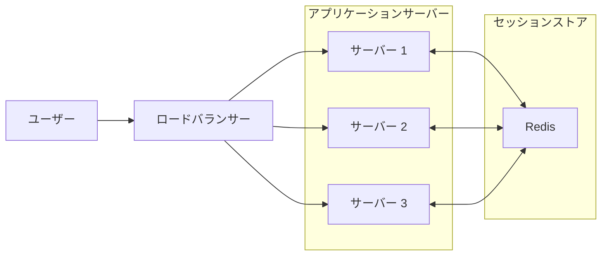
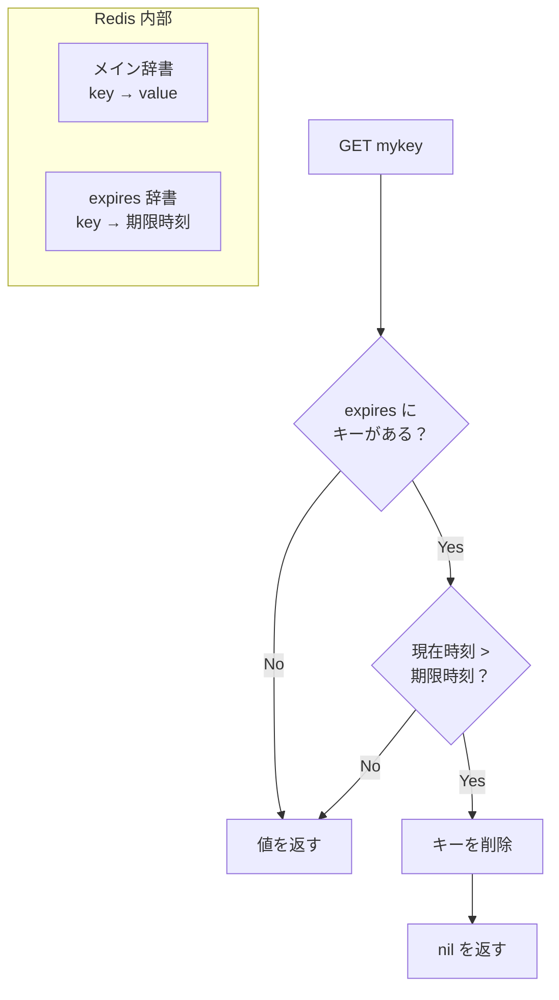
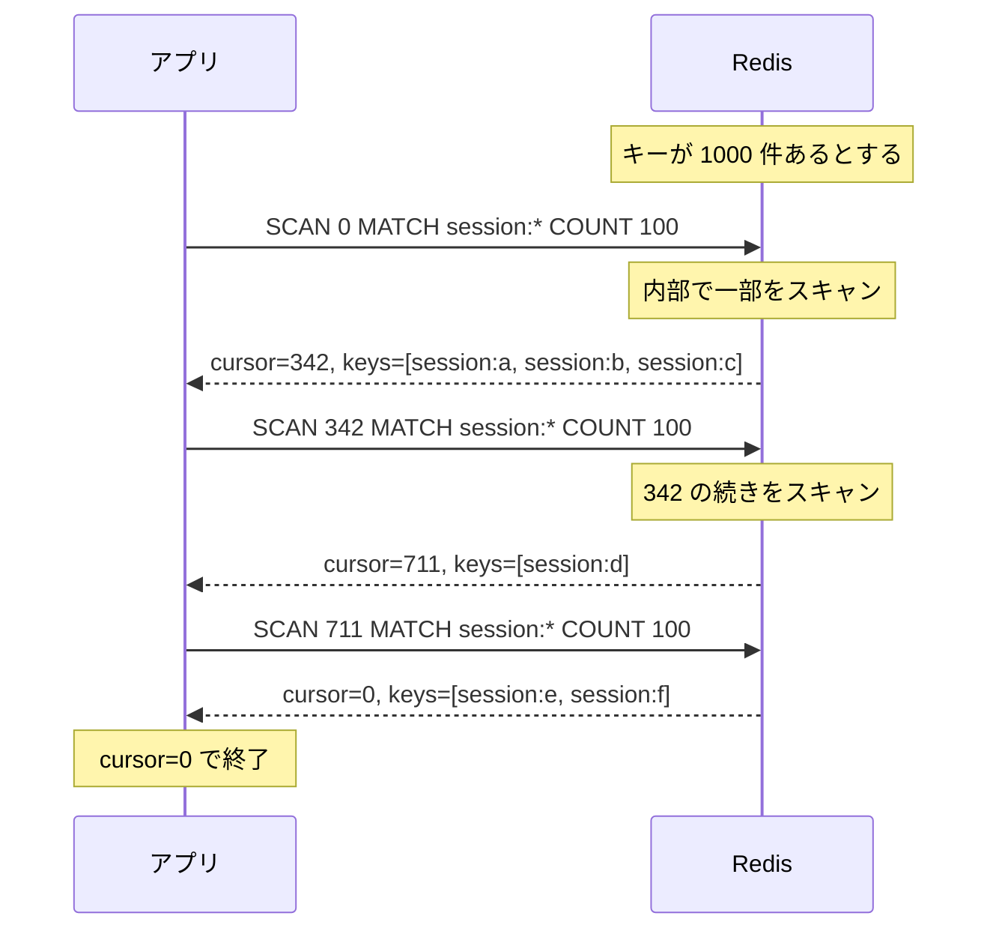
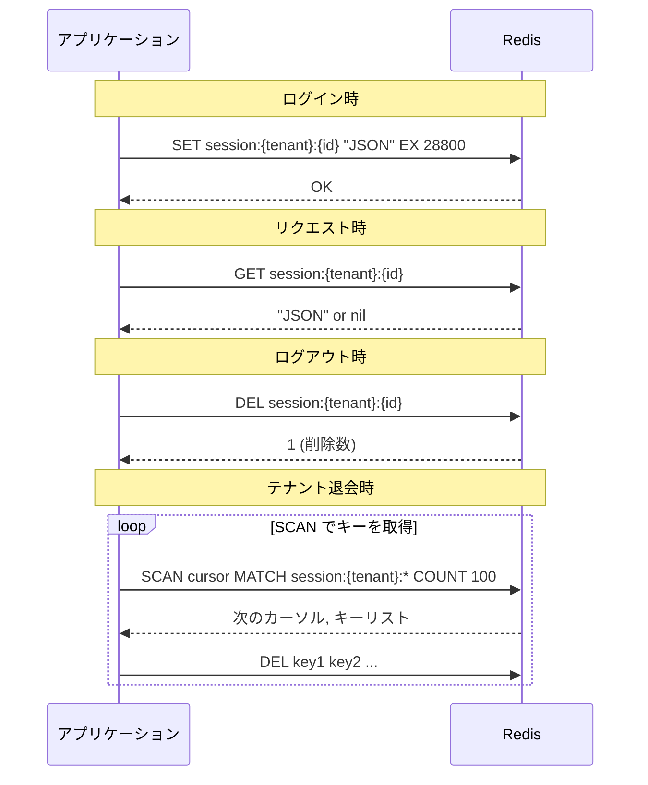

# Redis

## 概要

Redis（Remote Dictionary Server）は、インメモリのキー・バリュー型データストア。データをメモリ上に保持するため、非常に高速な読み書きが可能。

主な用途:
- セッションストア
- キャッシュ
- メッセージキュー（Pub/Sub）
- リアルタイムランキング

## なぜセッション管理に Redis を使うか



| 方式 | メリット | デメリット |
|------|---------|-----------|
| メモリ（サーバー内） | シンプル | スケールアウト不可、サーバー再起動で消失 |
| DB（PostgreSQL） | 永続化される | 遅い、DB への負荷 |
| **Redis** | 高速、スケール可能 | 別途インフラが必要 |

複数サーバーでセッションを共有する場合、外部のセッションストアが必要。Redis はインメモリで高速なため、セッション管理に最適。

## データ型

Redis は単純なキー・バリュー以外にも、様々なデータ構造をサポートする。

| データ型 | 説明 | 用途例 |
|---------|------|--------|
| String | 文字列、数値、バイナリ | セッションデータ（JSON）、カウンター |
| List | 順序付きリスト | メッセージキュー、タイムライン |
| Set | 重複なしの集合 | タグ、ユニークユーザー |
| Sorted Set | スコア付き集合 | ランキング、優先度キュー |
| Hash | フィールドと値のマップ | オブジェクトの保存 |

本プロジェクトでは **String**（JSON 形式）を使用してセッションデータを保存。

## 基本コマンド

### 接続

```bash
# Redis CLI で接続
redis-cli -h localhost -p 6379

# 開発環境（Docker）
redis-cli -h localhost -p 16379
```

### String 操作

```bash
# 設定
SET mykey "value"

# 取得
GET mykey

# TTL 付きで設定（EX: 秒、PX: ミリ秒）
SET session:abc "data" EX 28800

# 存在しない場合のみ設定
SET mykey "value" NX

# 削除
DEL mykey
```

### TTL（有効期限）

```bash
# TTL を設定（秒）
EXPIRE mykey 3600

# 残り時間を確認
TTL mykey
# 結果: 3599（残り秒数）、-1（TTL なし）、-2（キーが存在しない）

# TTL を削除（永続化）
PERSIST mykey
```

**TTL が切れるとどうなるか:**

キーは自動的に削除される。`GET` すると `nil`（存在しない）が返る。

```bash
SET mykey "value" EX 3   # 3秒後に期限切れ
GET mykey                 # → "value"
# ... 3秒後 ...
GET mykey                 # → nil（キーが消えている）
TTL mykey                 # → -2（キーが存在しない）
```

**削除のタイミング:**

Redis は2つの方法で期限切れキーを削除する:

| 方式 | 説明 |
|------|------|
| パッシブ | アクセス時に期限切れをチェックして削除 |
| アクティブ | 定期的にランダムなキーをサンプリングして削除 |

→ 期限切れ直後に即座に消えるわけではないが、アクセスすれば必ず `nil` が返る。メモリ上に残っていても、アプリからは「存在しない」ように見える。

**（応用）内部の仕組み:**

Redis は TTL 付きキーの期限を別の辞書（expires dict）で管理している:

```
メインの辞書:
  mykey → "value"
  session:abc → "{...}"

expires 辞書:
  mykey → 1737200000000（Unix ミリ秒）
  session:abc → 1737228800000
```



**パッシブ削除（Lazy）:**
- `GET` などでアクセス時に expires 辞書をチェック
- 期限切れなら即座に削除して `nil` を返す
- 計算量: O(1)

**アクティブ削除（定期サンプリング）:**
- 毎秒 10 回、以下を実行:
  1. expires 辞書からランダムに 20 個サンプリング
  2. 期限切れのキーを削除
  3. 25% 以上が期限切れなら、もう一度サンプリング
- なぜ全件チェックしないか → O(N) はブロックを招くため

```
アクティブ削除のループ:
  while true:
    sample = random 20 keys from expires dict
    expired = filter(sample, is_expired)
    delete(expired)
    if expired.count / 20 < 0.25:
      break  # 期限切れが少なくなったら終了
```

**なぜ2つの方式を併用するか:**

| 方式のみ | 問題 |
|---------|------|
| パッシブのみ | アクセスされないキーがメモリに残り続ける |
| アクティブのみ | アクセス時に期限切れキーが見えてしまう可能性 |
| 両方 | パッシブで確実性、アクティブでメモリ回収 |

**セッション管理での意味:**

```
ログイン時: SET session:xxx "data" EX 28800  # 8時間後に自動削除
         ↓
8時間後:   GET session:xxx → nil（セッション切れ）
         → アプリは「未認証」として扱う
```

明示的に `DEL` しなくても、TTL で自動的にセッションが無効化される。

### キー操作

```bash
# キーの存在確認
EXISTS mykey

# パターンでキーを検索（本番では非推奨）
KEYS session:*

# パターンでキーをスキャン（本番推奨）
SCAN 0 MATCH session:* COUNT 100
```

### KEYS vs SCAN

| コマンド | 動作 | 本番環境 |
|---------|------|---------|
| KEYS | 全キーを一度に取得、Redis をブロック | **使用禁止** |
| SCAN | カーソルベースで分割取得 | **推奨** |

**KEYS の問題:**

```bash
KEYS session:*
# → Redis 全体をブロックして全キーを一度に返す
# → キーが 100 万件あると数秒〜数分ブロック
# → その間、他のリクエストが全て待たされる
```

**SCAN の仕組み:**

Redis 内部のハッシュテーブルを「少しずつ」スキャンする。

```
SCAN <cursor> MATCH <pattern> COUNT <hint>
      ↑                             ↑
      │                             └─ アプリ → Redis: 「1回でこのくらい見て」
      └─ Redis → アプリ: 「次はここから続けて」
```



**具体例:**

```bash
# 1回目: カーソル 0 から開始
127.0.0.1:6379> SCAN 0 MATCH session:* COUNT 100
1) "342"                    # ← 次のカーソル（内部的な位置）
2) 1) "session:abc"         # ← 見つかったキー
   2) "session:def"
   3) "session:ghi"

# 2回目: カーソル 342 から続き
127.0.0.1:6379> SCAN 342 MATCH session:* COUNT 100
1) "711"
2) 1) "session:jkl"

# 3回目: カーソル 711 から続き
127.0.0.1:6379> SCAN 711 MATCH session:* COUNT 100
1) "0"                      # ← カーソル 0 = 終了
2) 1) "session:mno"
   2) "session:pqr"
```

**ポイント:**

| 項目 | 方向 | 説明 |
|------|------|------|
| cursor | Redis → アプリ | 「次はここから」の位置。Redis が返す。数値自体に意味はない |
| COUNT | アプリ → Redis | 「1回でこのくらい見て」のヒント。返却件数ではない |
| 終了条件 | - | カーソルが `0` になったら全スキャン完了 |
| ブロック | - | 各 SCAN は一瞬で完了。他のリクエストを妨げない |

**COUNT の注意点:**

```bash
SCAN 0 COUNT 100
# → 100 件返すとは限らない
# → 0 件のこともある（そのスロット範囲にキーがなければ）
# → 100 件以上返ることもある
```

COUNT はあくまで「ヒント」。Redis はこの値を参考に、1 回のイテレーションでスキャンするスロット数を決める。

## セッション管理での使用パターン

### キー設計

```
session:{tenant_id}:{session_id}
```

例:
```
session:550e8400-e29b-41d4-a716-446655440001:a1b2c3d4-e5f6-7890-abcd-ef1234567890
```

**設計のポイント:**

1. **プレフィックス**: `session:` で他の用途のキーと区別
2. **テナント ID**: マルチテナント対応、一括削除に使用
3. **セッション ID**: UUID v4（推測困難）

### 保存データ（JSON）

```json
{
  "user_id": "550e8400-e29b-41d4-a716-446655440000",
  "tenant_id": "550e8400-e29b-41d4-a716-446655440001",
  "email": "user@example.com",
  "name": "山田 太郎",
  "roles": ["user"],
  "created_at": "2026-01-18T10:00:00Z",
  "last_accessed_at": "2026-01-18T10:30:00Z"
}
```

### 操作フロー



## 永続化

Redis はインメモリだが、永続化オプションがある。

| 方式 | 説明 | 特徴 |
|------|------|------|
| RDB | 定期的にスナップショットを保存 | コンパクト、復旧が速い、データ損失の可能性 |
| AOF | 全ての書き込み操作をログに記録 | 堅牢、ファイルが大きくなる |
| RDB + AOF | 両方を組み合わせ | 推奨（本番環境） |

### Append-Only とは

**Append-Only（追記のみ）** = ファイルの末尾に追加するだけで、既存の内容を変更しない書き込み方式。

```
通常のファイル更新:
┌─────────────────┐
│ 既存データ       │ ← ここを上書き（破損リスク）
└─────────────────┘

Append-Only:
┌─────────────────┐
│ 操作1: SET a 1  │
│ 操作2: SET b 2  │
│ 操作3: DEL a    │
│ 操作4: SET c 3  │ ← 常に末尾に追加
└─────────────────┘
```

**メリット:**

| 観点 | 説明 |
|------|------|
| 安全性 | 書き込み中にクラッシュしても、既存データは無傷 |
| シンプル | 「末尾に追加」だけなので実装が単純 |
| 復旧 | ファイルを先頭から再生すれば状態を復元できる |

**AOF の動作イメージ:**

```bash
# Redis への操作
SET user:1 "Alice"
SET user:2 "Bob"
DEL user:1
SET user:2 "Bob Smith"

# AOF ファイルの中身（実際は Redis プロトコル形式）
*3\r\n$3\r\nSET\r\n$6\r\nuser:1\r\n$5\r\nAlice\r\n
*3\r\n$3\r\nSET\r\n$6\r\nuser:2\r\n$3\r\nBob\r\n
*2\r\n$3\r\nDEL\r\n$6\r\nuser:1\r\n
*3\r\n$3\r\nSET\r\n$6\r\nuser:2\r\n$9\r\nBob Smith\r\n
```

復旧時は、このファイルを先頭から順に再実行して状態を再構築する。

**Event Sourcing との関係:**

AOF は Event Sourcing パターンと同じ考え方。

| 概念 | Event Sourcing | Redis AOF |
|------|----------------|-----------|
| 保存するもの | イベント（起きたこと） | コマンド（実行した操作） |
| 現在の状態 | イベントを再生して導出 | コマンドを再生して導出 |
| 利点 | 監査ログ、時間遡行 | クラッシュ復旧 |

```
Event Sourcing:
  Event 1: UserCreated { id: 1, name: "Alice" }
  Event 2: UserRenamed { id: 1, name: "Alice Smith" }
  → 現在の状態: User { id: 1, name: "Alice Smith" }

Redis AOF:
  Command 1: SET user:1 "Alice"
  Command 2: SET user:1 "Alice Smith"
  → 現在の状態: user:1 = "Alice Smith"
```

参考: [Event Sourcing とデータ削除](./EventSourcingとデータ削除.md)

**RDB との比較:**

```
RDB（スナップショット）:
  10:00 [スナップショット保存]
  10:01 SET a 1
  10:02 SET b 2
  10:03 [クラッシュ] → 10:01〜10:02 のデータは失われる

AOF（操作ログ）:
  10:00 SET x 1 → ログに記録
  10:01 SET a 1 → ログに記録
  10:02 SET b 2 → ログに記録
  10:03 [クラッシュ] → ログを再生すれば全て復旧
```

**セッションストアの場合:**

セッションは一時的なデータなので、永続化の重要度は低い。Redis が再起動してセッションが消えても、ユーザーは再ログインすればよい。

本番環境では RDB を有効にしておくと、Redis 再起動時の影響を軽減できる。

## Rust での使用

### クレート

```toml
[dependencies]
redis = { version = "0.28", features = ["tokio-comp", "connection-manager"] }
```

### 接続

```rust
use redis::aio::ConnectionManager;

// ConnectionManager: 自動再接続機能付き
let client = redis::Client::open("redis://localhost:6379")?;
let conn = ConnectionManager::new(client).await?;
```

### 基本操作

```rust
use redis::AsyncCommands;

let mut conn = conn.clone();  // Clone は安価（内部は Arc）

// SET with TTL
let _: () = conn.set_ex("key", "value", 28800).await?;

// GET
let value: Option<String> = conn.get("key").await?;

// DEL
let _: () = conn.del("key").await?;

// TTL 確認
let ttl: i64 = conn.ttl("key").await?;
```

### SCAN の実装

```rust
let pattern = format!("session:{}:*", tenant_id);
let mut cursor = 0u64;

loop {
    let (next_cursor, keys): (u64, Vec<String>) = redis::cmd("SCAN")
        .arg(cursor)
        .arg("MATCH")
        .arg(&pattern)
        .arg("COUNT")
        .arg(100)
        .query_async(&mut conn)
        .await?;

    if !keys.is_empty() {
        let _: () = conn.del(&keys).await?;
    }

    cursor = next_cursor;
    if cursor == 0 {
        break;  // 全キーをスキャン完了
    }
}
```

## 開発環境

### Docker Compose

```yaml
services:
  redis:
    image: redis:7-alpine
    ports:
      - "16379:6379"
    command: redis-server --appendonly yes
```

### 起動

```bash
# 開発用 Redis を起動
just dev-deps

# または直接
docker compose up -d redis
```

### 動作確認

```bash
# Redis CLI で接続
docker compose exec redis redis-cli

# または
redis-cli -p 16379

# PING で疎通確認
127.0.0.1:6379> PING
PONG

# データを確認
127.0.0.1:6379> KEYS *
```

## 本番環境での考慮事項

### ElastiCache（AWS）

本プロジェクトでは AWS ElastiCache for Redis を使用予定。

| 設定 | 推奨値 | 理由 |
|------|--------|------|
| ノードタイプ | cache.t3.micro〜 | MVP では小さく始める |
| レプリケーション | マルチ AZ | 可用性確保 |
| 暗号化 | 有効（転送中 + 保存時） | セキュリティ要件 |
| AUTH | 有効 | 認証必須 |

### 接続設定

```rust
// 本番環境（TLS + AUTH）
let url = "rediss://:password@elasticache-endpoint:6379";
let client = redis::Client::open(url)?;
```

`rediss://` は TLS 接続を意味する（`redis://` + SSL）。

## トラブルシューティング

### 接続エラー

```
Error: Connection refused (os error 111)
```

→ Redis が起動していない。`just dev-deps` で起動。

### メモリ不足

```
OOM command not allowed when used memory > 'maxmemory'
```

→ `maxmemory-policy` を設定（例: `volatile-lru` で TTL 付きキーを優先削除）。

### 遅いコマンドの検出

```bash
# スロークエリログを確認
SLOWLOG GET 10
```

`KEYS *` や巨大な値の操作が原因の可能性。

## 関連リソース

- [Redis 公式ドキュメント](https://redis.io/docs/)
- [Redis Commands](https://redis.io/commands/)
- [redis crate (Rust)](https://docs.rs/redis/latest/redis/)
- [AWS ElastiCache for Redis](https://docs.aws.amazon.com/AmazonElastiCache/latest/red-ug/WhatIs.html)

---

## 変更履歴

| 日付 | 変更内容 |
|------|---------|
| 2026-01-18 | 初版作成 |
