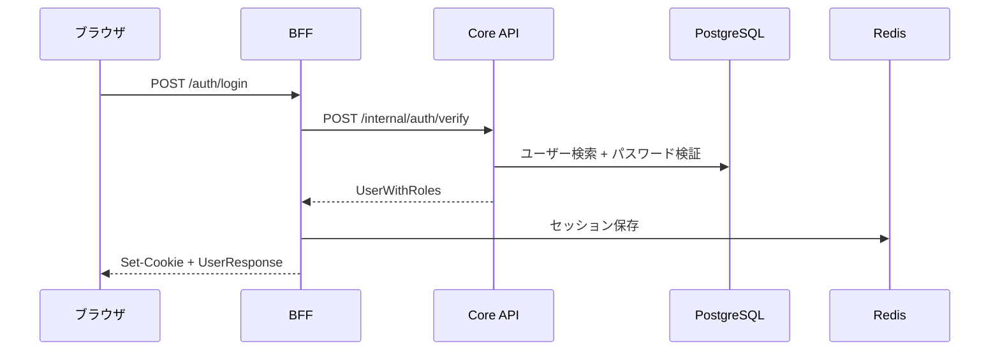

# 認証機能 実装解説

## 対応 Issue

[#34 ユーザー認証（ログイン/ログアウト）](https://github.com/ka2kama/ringiflow/issues/34)

## 機能概要

メール/パスワードでのログイン・ログアウト機能を実装する。

### 完了基準

- [ ] POST /auth/login でログインできる
- [ ] POST /auth/logout でログアウトできる
- [ ] GET /auth/me で現在のユーザー情報を取得できる

## アーキテクチャ

### 責務分担

| レイヤー | 責務 |
|---------|------|
| **BFF** | セッション管理、Cookie 処理、CSRF 防御 |
| **Core API** | パスワード検証、ユーザー情報取得 |
| **Redis** | セッションストア |
| **PostgreSQL** | ユーザー永続化 |

## 実装フェーズ

| Phase | 内容 | 状態 |
|-------|------|------|
| [Phase 1](01_Phase1_UserRepository.md) | UserRepository | 完了 |
| [Phase 2](02_Phase2_PasswordHasher.md) | PasswordChecker | 完了 |
| Phase 3 | SessionManager | 未着手 |
| Phase 4 | Core API エンドポイント | 未着手 |
| Phase 5 | BFF ハンドラ | 未着手 |
| Phase 6 | 統合テスト | 未着手 |

## 関連ドキュメント

- 設計書: [07_認証機能設計.md](../../03_詳細設計書/07_認証機能設計.md)
- 技術ノート: [エンタープライズ認証とID管理.md](../../06_技術ノート/エンタープライズ認証とID管理.md)
