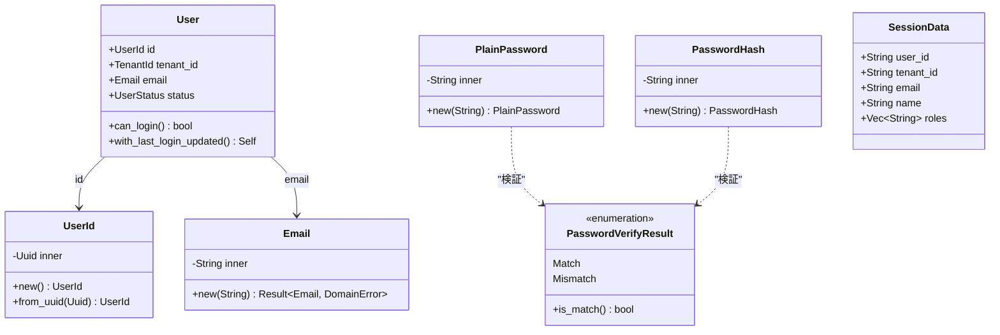
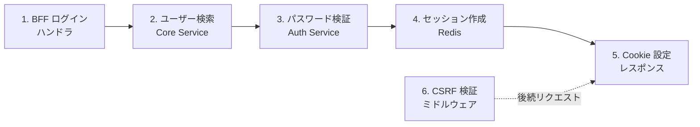
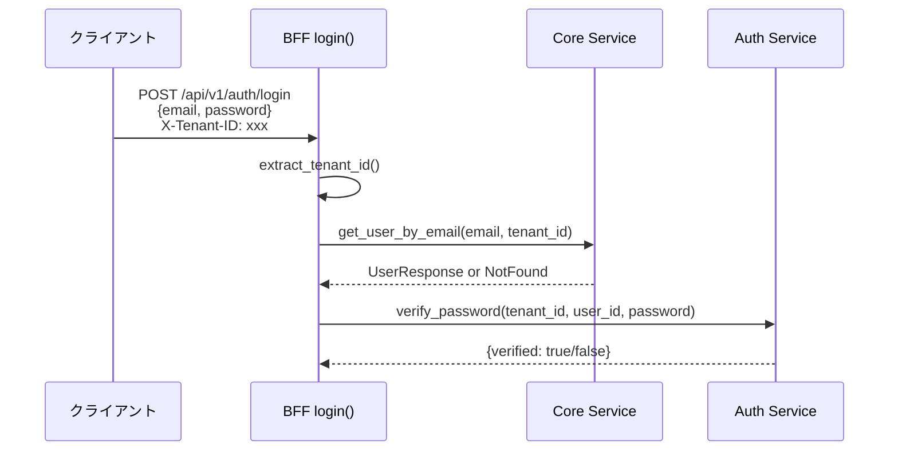
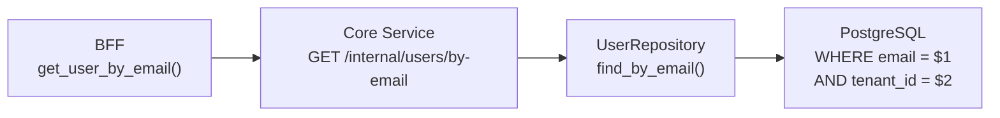
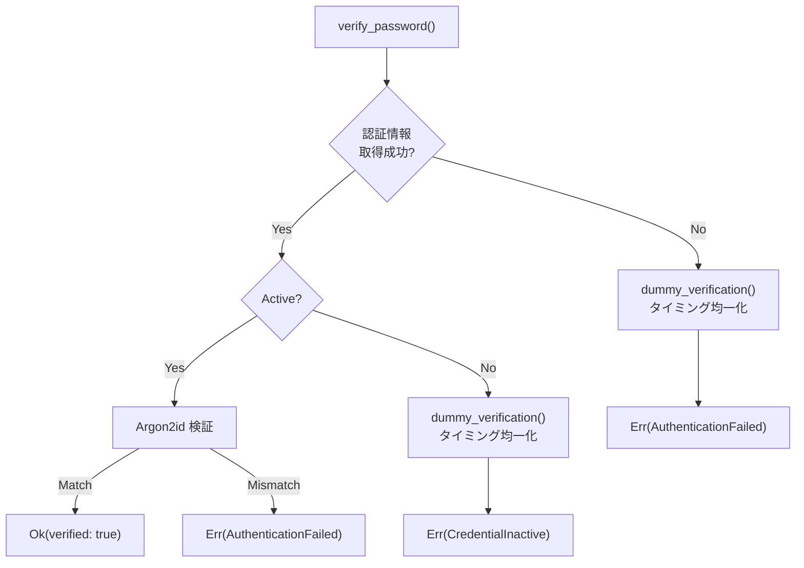
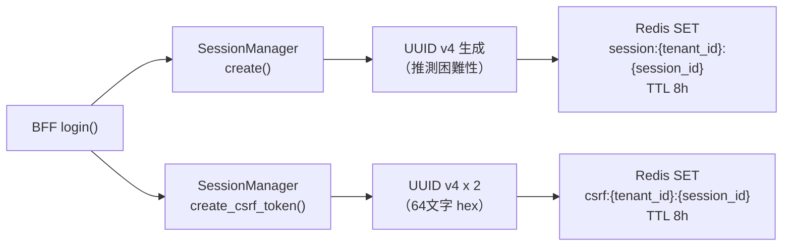
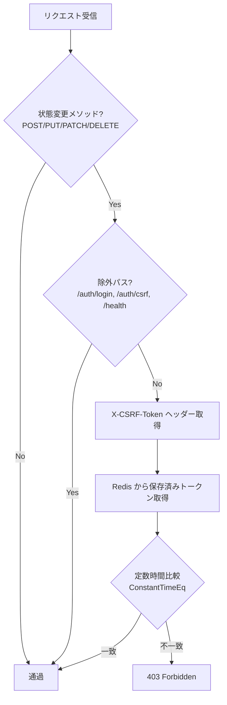
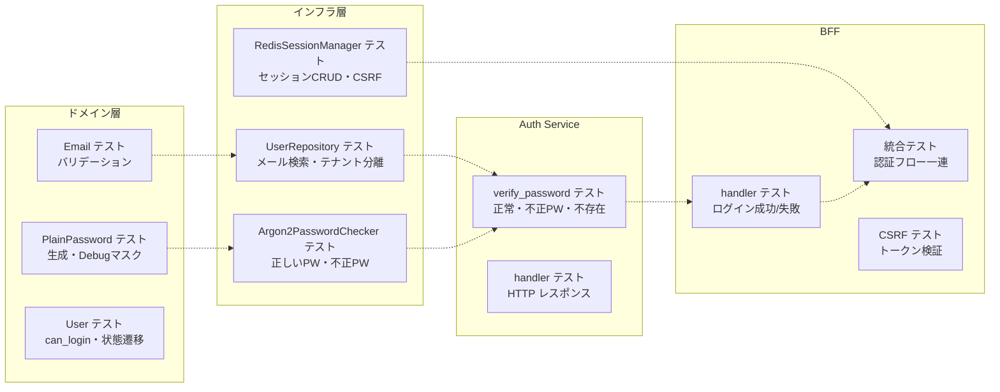

# 認証機能 - コード解説

対応 PR: #46
対応 Issue: #34

## 主要な型・関数

> ⚠️ PR #46 実装時点ではパスワード検証は Core API（現 Core Service）に含まれていた。PR #93/#97 で Auth Service に分離されたため、以下の行番号は現在のコードを参照する。

| 型/関数 | ファイル | 責務 |
|--------|---------|------|
| `User` | [`domain/src/user.rs:199`](../../../backend/crates/domain/src/user.rs) | ユーザーエンティティ（id, email, name, status） |
| `UserId` | [`domain/src/user.rs:62`](../../../backend/crates/domain/src/user.rs) | UUID v7 ベースの Newtype |
| `Email` | [`domain/src/user.rs:92`](../../../backend/crates/domain/src/user.rs) | バリデーション済みメールアドレス値オブジェクト |
| `UserStatus` | [`domain/src/user.rs:162`](../../../backend/crates/domain/src/user.rs) | Active / Inactive / Deleted 列挙型 |
| `PlainPassword` | [`domain/src/password.rs:22`](../../../backend/crates/domain/src/password.rs) | 平文パスワード（Debug でマスク） |
| `PasswordHash` | [`domain/src/password.rs:47`](../../../backend/crates/domain/src/password.rs) | Argon2id ハッシュ値ラッパー |
| `PasswordVerifyResult` | [`domain/src/password.rs:73`](../../../backend/crates/domain/src/password.rs) | 検証結果（Match / Mismatch） |
| `PasswordChecker` | [`infra/src/password.rs:18`](../../../backend/crates/infra/src/password.rs) | パスワード検証トレイト |
| `Argon2PasswordChecker` | [`infra/src/password.rs:37`](../../../backend/crates/infra/src/password.rs) | Argon2id 実装（OWASP 推奨パラメータ） |
| `UserRepository` | [`infra/src/repository/user_repository.rs:29`](../../../backend/crates/infra/src/repository/user_repository.rs) | ユーザー CRUD トレイト |
| `SessionManager` | [`infra/src/session.rs:106`](../../../backend/crates/infra/src/session.rs) | セッション + CSRF トークン管理トレイト |
| `SessionData` | [`infra/src/session.rs:39`](../../../backend/crates/infra/src/session.rs) | セッション情報（user_id, tenant_id, roles 等） |
| `RedisSessionManager` | [`infra/src/session.rs:212`](../../../backend/crates/infra/src/session.rs) | Redis 実装 |
| `login()` | [`bff/handler/auth.rs:144`](../../../backend/apps/bff/src/handler/auth.rs) | BFF ログインハンドラ |
| `logout()` | [`bff/handler/auth.rs:257`](../../../backend/apps/bff/src/handler/auth.rs) | BFF ログアウトハンドラ |
| `me()` | [`bff/handler/auth.rs:298`](../../../backend/apps/bff/src/handler/auth.rs) | BFF ユーザー情報取得ハンドラ |
| `csrf()` | [`bff/handler/auth.rs:349`](../../../backend/apps/bff/src/handler/auth.rs) | BFF CSRF トークン取得ハンドラ |
| `csrf_middleware()` | [`bff/middleware/csrf.rs:66`](../../../backend/apps/bff/src/middleware/csrf.rs) | CSRF 検証ミドルウェア |
| `AuthUseCase` | [`auth-service/src/usecase.rs:24`](../../../backend/apps/auth-service/src/usecase.rs) | 認証ユースケーストレイト |
| `verify_password()` | [`auth-service/src/usecase/auth.rs:54`](../../../backend/apps/auth-service/src/usecase/auth.rs) | パスワード検証 + タイミング攻撃対策 |
| `dummy_verification()` | [`auth-service/src/usecase/auth.rs:144`](../../../backend/apps/auth-service/src/usecase/auth.rs) | タイミング均一化用ダミー検証 |

### 型の関係



## コードフロー

コードをライフサイクル順に追う。各ステップの構造を図で示した後、対応するコードを解説する。



### 1. BFF ログインハンドラ（リクエスト受信時）

BFF が認証リクエストを受信し、テナント ID を抽出してから Core Service と Auth Service に処理を委任する。



```rust
// bff/handler/auth.rs:144-252
pub async fn login(
    State(state): State<AuthState>,                    // ① 共有状態（クライアント + セッション）
    TypedHeader(tenant_id): TypedHeader<XTenantId>,    // ② テナント ID ヘッダー
    jar: CookieJar,
    Json(req): Json<LoginRequest>,
) -> Result<impl IntoResponse, Response> {
    let tenant_id = extract_tenant_id(&tenant_id)?;

    // Core Service でユーザー検索
    let user_response = state
        .core_client
        .get_user_by_email(&req.email, &tenant_id)     // ③ テナント分離されたユーザー検索
        .await;
    // ...
}
```

注目ポイント:

- ① `AuthState` はジェネリクス `<C: CoreServiceUserClient, A: AuthServiceClient, S: SessionManager>` を使い、テスト時にスタブを注入可能にする
- ② `X-Tenant-ID` ヘッダーはマルチテナントの識別に使用。MVP ではヘッダー直接指定、本番ではサブドメインから解決予定
- ③ テナント ID でフィルタリングし、他テナントのユーザーが検索されないことを保証する

### 2. ユーザー検索（Core Service）

Core Service が PostgreSQL からテナント分離されたユーザーを検索する。



```rust
// infra/src/repository/user_repository.rs（UserRepository トレイト）
async fn find_by_email(
    &self,
    email: &Email,
    tenant_id: &TenantId,
) -> Result<Option<User>, InfraError>;
```

注目ポイント:

- `Email` 型を引数に取ることで、バリデーション済みのメールアドレスのみを受け付ける
- テナント ID を必須パラメータとし、テナント分離を型レベルで強制する

### 3. パスワード検証（Auth Service）

Auth Service がパスワードを Argon2id で検証する。タイミング攻撃対策が組み込まれている。



```rust
// auth-service/src/usecase/auth.rs:54-102
pub async fn verify_password(
    &self,
    tenant_id: &TenantId,
    user_id: &UserId,
    password: &PlainPassword,
) -> Result<VerifyResult, AuthError> {
    let credential = self
        .credentials_repository
        .find_by_user_id(tenant_id, user_id)
        .await?;

    match credential {
        Some(cred) if cred.is_active() => {
            let result = self.password_checker                   // ① 本物の Argon2id 検証
                .verify(password, cred.password_hash()).await?;
            // ...
        }
        Some(_) => {
            self.dummy_verification(&plain_password);            // ② Inactive でもダミー検証
            Err(AuthError::CredentialInactive)
        }
        None => {
            self.dummy_verification(&plain_password);            // ③ 不存在でもダミー検証
            Err(AuthError::AuthenticationFailed)
        }
    }
}
```

注目ポイント:

- ① 有効な認証情報が見つかった場合のみ本物の検証を実行
- ② ③ 認証情報が見つからない or 無効の場合もダミーの Argon2id 検証を実行し、処理時間を均一化する。これにより攻撃者は応答時間からユーザーの存在を推測できない

```rust
// auth-service/src/usecase/auth.rs:144-151
fn dummy_verification(&self, password: &PlainPassword) {
    let dummy_hash = PasswordHash::new(
        "$argon2id$v=19$m=65536,t=1,p=1$dGVzdHNhbHQ$...".to_string()  // 固定ダミーハッシュ
    );
    let _ = self.password_checker.verify(password, &dummy_hash);       // 結果は捨てる
}
```

### 4. セッション作成（Redis）

認証成功後、BFF が Redis にセッションと CSRF トークンを作成する。



```rust
// infra/src/session.rs（SessionManager トレイト抜粋）
/// セッション作成。UUID v4 でセッション ID を生成
async fn create(
    &self, tenant_id: &TenantId, data: &SessionData,
) -> Result<String, InfraError>;

/// CSRF トークン作成。UUID v4 x 2 で 64 文字の hex トークンを生成
async fn create_csrf_token(
    &self, tenant_id: &TenantId, session_id: &str,
) -> Result<String, InfraError>;
```

注目ポイント:

- セッション ID に UUID v4（完全ランダム）を使用し、推測困難性を確保
- CSRF トークンは UUID v4 を2つ連結した 64 文字の hex 文字列
- Redis キーにテナント ID を含め、`session:{tenant_id}:{session_id}` でテナント分離を実現
- テナント退会時に `SCAN session:{tenant_id}:*` で該当テナントの全セッションを削除可能

### 5. Cookie 設定（レスポンス返却時）

```rust
// bff/handler/auth.rs:412-431
fn build_session_cookie(session_id: &str) -> Cookie<'static> {
    let mut cookie = Cookie::new("session_id", session_id.to_string());
    cookie.set_http_only(true);                           // ① XSS 対策
    cookie.set_same_site(SameSite::Lax);                  // ② CSRF 補助対策
    cookie.set_path("/");
    cookie.set_max_age(time::Duration::hours(8));
    if std::env::var("ENV").unwrap_or_default() == "production" {
        cookie.set_secure(true);                          // ③ 本番のみ HTTPS 必須
    }
    cookie
}
```

注目ポイント:

- ① `HttpOnly` で JavaScript からのアクセスを遮断し、XSS によるセッション窃取を防止
- ② `SameSite=Lax` で別サイトからの POST を遮断。CSRF 対策の補助レイヤー
- ③ `Secure` フラグは開発環境（HTTP）では無効化し、本番環境でのみ有効化

### 6. CSRF 検証ミドルウェア（後続リクエスト時）

ログイン後の状態変更リクエストで、CSRF トークンの一致を検証する。



```rust
// bff/middleware/csrf.rs:66-132
pub async fn csrf_middleware(
    State(state): State<CsrfState>,
    jar: CookieJar,
    request: Request,
    next: Next,
) -> Response {
    // ... メソッド・パスチェック省略 ...

    let stored_token = state.session_manager
        .get_csrf_token(&tenant_id, &session_id).await;

    // 定数時間比較（タイミング攻撃対策）
    let is_valid = request_token
        .as_bytes()
        .ct_eq(stored.as_bytes())                    // ① subtle::ConstantTimeEq
        .into();
    // ...
}
```

注目ポイント:

- ① `subtle` crate の `ConstantTimeEq` を使用し、トークン比較の時間が長さに依存しないことを保証。通常の `==` 比較では最初に不一致が見つかった時点で早期リターンし、正しいプレフィックスが推測される
- `CsrfState` を `AuthState` とは別の型で定義し、CSRF ミドルウェアが不要な依存（Core Service クライアント等）を持たないようにする

## フロントエンド

### CSRF トークン取得（Elm）

Elm アプリ起動時に CSRF トークンを取得し、`Shared` に設定する。

```elm
-- Api/Auth.elm:39-50
getCsrfToken :
    { config : RequestConfig, toMsg : Result ApiError String -> msg }
    -> Cmd msg
getCsrfToken { config, toMsg } =
    AuthApi.getCsrfToken
        { baseUrl = config.baseUrl
        , tenantId = config.tenantId
        , expect = Http.expectJson toMsg csrfTokenDecoder
        }
```

```elm
-- Shared.elm:61-67
type alias Shared =
    { user : Maybe User
    , tenantId : String
    , csrfToken : Maybe String        -- CSRF トークンを保持
    , apiBaseUrl : String
    , timeZone : Time.Zone
    }
```

注目ポイント:

- CSRF トークンは `Shared`（旧 `Session`）に保持され、全ページで共有される
- POST リクエスト時に `X-CSRF-Token` ヘッダーとして付与される
- 未認証時のエラーは無視し、ログイン後に再取得する設計

## テスト

各テストがライフサイクルのどのステップを検証しているかを示す。



| テスト | 検証対象 | 検証内容 |
|-------|---------|---------|
| `PlainPassword::new` | ドメイン | パスワード生成、Debug 出力で `[REDACTED]` |
| `Email::new` | ドメイン | 空文字・`@`なし・255文字超過の拒否 |
| `User::can_login` | ドメイン | Active のみ true |
| `find_by_email` | UserRepository | テナント分離されたメール検索 |
| `find_with_roles` | UserRepository | JOIN でロール一括取得 |
| `update_last_login` | UserRepository | 最終ログイン日時更新 |
| `verify（正しいPW）` | Argon2 | Match を返す |
| `verify（不正PW）` | Argon2 | Mismatch を返す |
| `create / get / delete` | SessionManager | セッション CRUD + TTL |
| `create_csrf / get_csrf` | SessionManager | CSRF トークン CRUD |
| `delete_all_for_tenant` | SessionManager | テナント単位の一括削除（SCAN） |
| `verify_password（正常）` | Auth UseCase | 正しい認証情報で verified: true |
| `verify_password（不正PW）` | Auth UseCase | 不正パスワードで AuthenticationFailed |
| `verify_password（不存在）` | Auth UseCase | ダミー検証後に AuthenticationFailed |
| `login（成功）` | BFF handler | 200 + Set-Cookie + ユーザー情報 |
| `login（失敗）` | BFF handler | 401 + 統一エラーメッセージ |
| 統合: ログインフロー | BFF 統合 | 実 Redis + スタブ Core/Auth で一連のフロー |
| 統合: CSRF 検証 | BFF 統合 | 正常トークン・不正トークン・トークンなし |

### 実行方法

```bash
# ドメイン層テスト
cd backend && cargo test --package ringiflow-domain

# インフラ層テスト（Redis + PostgreSQL 接続必要）
just test-rust-integration

# Auth Service テスト
cd backend && cargo test --package auth-service

# BFF テスト
cd backend && cargo test --package bff

# 全テスト
just check-all
```

## マイグレーション

### パスワードハッシュ更新

ファイル: `backend/migrations/20260115000009_update_seed_password_hash.sql`

```sql
-- 開発用ユーザーのパスワードハッシュを有効な Argon2id ハッシュに更新
-- パスワード: password123
UPDATE users SET password_hash = '$argon2id$v=19$m=65536,t=1,p=1$...' WHERE email = 'admin@example.com';
UPDATE users SET password_hash = '$argon2id$v=19$m=65536,t=1,p=1$...' WHERE email = 'user@example.com';
```

既存のシードデータにはダミーのハッシュが入っていたため、Argon2id で正しく検証できるハッシュに更新。

## 設計解説

コード実装レベルの判断を記載する。機能・仕組みレベルの判断は[機能解説](./01_機能解説.md#設計判断)を参照。

### 1. PasswordVerifyResult を bool ではなく専用型にした理由

場所: `domain/src/password.rs:73`

```rust
pub enum PasswordVerifyResult {
    Match,
    Mismatch,
}

impl PasswordVerifyResult {
    pub fn is_match(&self) -> bool {
        matches!(self, Self::Match)
    }
}
```

なぜこの実装か:

Make Illegal States Unrepresentable の原則に基づく。`bool` では `true` が何を意味するか文脈依存で曖昧になる（`true` = 一致? 不一致?）。専用型にすることで意図が自明になり、パターンマッチで網羅性チェックが効く。

代替案:

| 案 | メリット | デメリット | 判断 |
|----|---------|-----------|------|
| `bool` | シンプル | 意味が曖昧、取り違えのリスク | 見送り |
| **専用 enum（採用）** | 意図明確、網羅性チェック | 型が増える | 採用 |

### 2. PlainPassword に Debug マスクを実装した理由

場所: `domain/src/password.rs:22-40`

```rust
pub struct PlainPassword(String);

impl std::fmt::Debug for PlainPassword {
    fn fmt(&self, f: &mut std::fmt::Formatter<'_>) -> std::fmt::Result {
        f.debug_tuple("PlainPassword")
            .field(&"[REDACTED]")
            .finish()
    }
}
```

なぜこの実装か:

`#[derive(Debug)]` を使うとログ出力時に平文パスワードがそのまま記録される。エラーハンドリングのチェーンで `Debug` トレイトが呼ばれることは多く、意図せぬ漏洩を防ぐために `[REDACTED]` でマスクする。

### 3. ジェネリクスによるゼロコスト依存注入

場所: `bff/handler/auth.rs:52`

```rust
pub struct AuthState {
    pub core_client: Arc<dyn CoreServiceUserClient>,
    pub auth_client: Arc<dyn AuthServiceClient>,
    pub session_manager: Arc<dyn SessionManager>,
}
```

なぜこの実装か:

トレイトオブジェクト（`Arc<dyn Trait>`）を使い、テスト時にスタブ実装を注入可能にする。ハンドラ関数自体は具体型に依存せず、テスタビリティを確保する。

代替案:

| 案 | テスタビリティ | パフォーマンス | 実装コスト | 判断 |
|----|-------------|-------------|-----------|------|
| 具体型に直接依存 | 低（モック困難） | 最高（インライン化） | 低 | 見送り |
| **トレイトオブジェクト（採用）** | 高 | 動的ディスパッチ | 中 | 採用 |
| ジェネリクス型パラメータ | 高 | 最高（静的ディスパッチ） | 高（型パラメータ伝播） | 見送り |

トレイトオブジェクトの動的ディスパッチコストは認証フロー（ネットワーク I/O が支配的）では無視できるレベル。型パラメータの伝播を避けられるメリットが大きい。

### 4. CsrfState と AuthState の分離

場所: `bff/middleware/csrf.rs:35`

```rust
pub struct CsrfState {
    pub session_manager: Arc<dyn SessionManager>,
}
```

なぜこの実装か:

CSRF ミドルウェアが必要とするのは `SessionManager`（CSRF トークンの取得）のみ。`AuthState`（Core Service クライアント、Auth Service クライアントも含む）を渡すと、不要な結合が生じる。インターフェース分離の原則（ISP）に従い、必要な依存のみを持つ専用の State 型を定義する。

### 5. Redis Pipeline によるログアウト最適化

場所: `infra/src/session.rs`（`SessionManager::delete`）

ログアウト時にセッションと CSRF トークンの2つのキーを削除する。

| 案 | Redis RTT | メリット | 判断 |
|----|----------|---------|------|
| DEL x 2（個別呼び出し） | 2 RTT | シンプル | 見送り |
| **Pipeline DEL x 2（採用）** | 1 RTT | 2つの DEL を1回の往復で実行 | 採用 |

ネットワークレイテンシの削減のため、Redis Pipeline で2つの DEL コマンドを一括送信する。

### 6. SCAN パターンによるテナント単位セッション削除

場所: `infra/src/session.rs`（`delete_all_for_tenant`）

テナント退会時に該当テナントの全セッションを削除する必要がある。

| 案 | ブロッキング | メモリ使用量 | 判断 |
|----|-----------|-----------|------|
| `KEYS session:{tenant_id}:*` | 全キースキャンでブロック | 全結果をメモリに保持 | 見送り |
| **`SCAN` + カーソル（採用）** | カーソル単位で非ブロック | 増分的にメモリ使用 | 採用 |

`KEYS` コマンドは Redis 全体をブロッキングスキャンするため、本番環境では危険。`SCAN` はカーソルベースで他のリクエストをブロックしない。

## 関連ドキュメント

- [機能解説](./01_機能解説.md)
- [詳細設計書: 認証機能設計](../../03_詳細設計書/07_認証機能設計.md)
- [ナレッジベース: パスワードハッシュ](../../06_ナレッジベース/security/パスワードハッシュ.md)
- [ナレッジベース: CSRF](../../06_ナレッジベース/security/CSRF.md)
- [ナレッジベース: Redis](../../06_ナレッジベース/infra/Redis.md)
- [ナレッジベース: BFF パターン](../../06_ナレッジベース/architecture/BFFパターン.md)
