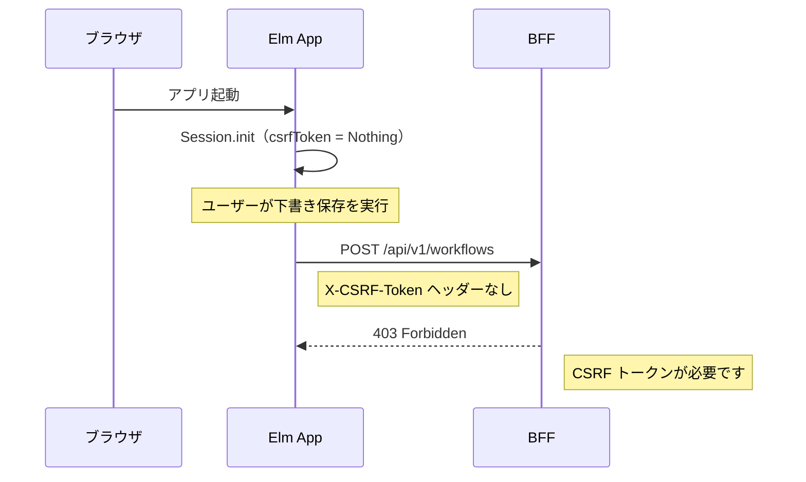
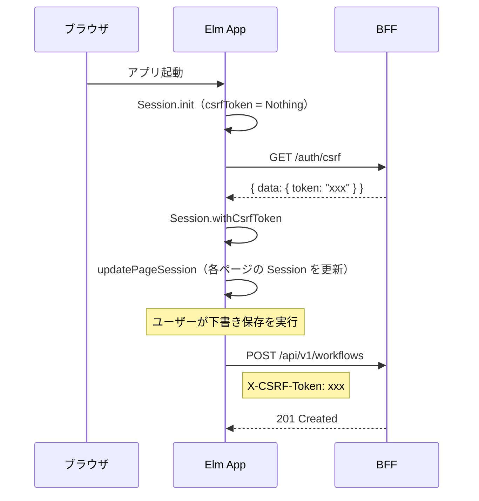

# Phase 9: フロントエンド CSRF トークン取得

## 概要

フロントエンドで CSRF トークンを取得し、POST リクエストに付与するフローを実装した。
起動時に `GET /auth/csrf` を呼び出して CSRF トークンを取得し、Session に設定する。

### 対応 Issue

[#144 フロントエンドで CSRF トークン取得フローを実装する](https://github.com/ka2kama/ringiflow/issues/144)

---

## 背景

Issue #36 の下書き保存機能をテスト中に 403 Forbidden エラーが発生。
調査の結果、フロントエンドで CSRF トークンを取得するフローが未実装であることが判明。

### 問題の構造



BFF の CSRF ミドルウェアは POST/PUT/PATCH/DELETE リクエストで `X-CSRF-Token` ヘッダーを要求する。
しかし、フロントエンドでは CSRF トークンを取得して Session に設定するフローが未実装だった。

---

## 実装したコンポーネント

| ファイル | 責務 |
|---------|------|
| [`frontend/src/Api/Auth.elm`](../../../frontend/src/Api/Auth.elm) | 認証 API クライアント（新規） |
| [`frontend/src/Main.elm`](../../../frontend/src/Main.elm) | 起動時の CSRF トークン取得 |
| [`frontend/src/Page/Workflow/New.elm`](../../../frontend/src/Page/Workflow/New.elm) | Session 更新の伝播 |
| [`frontend/src/Page/Workflow/List.elm`](../../../frontend/src/Page/Workflow/List.elm) | Session 更新の伝播 |
| [`frontend/src/Page/Workflow/Detail.elm`](../../../frontend/src/Page/Workflow/Detail.elm) | Session 更新の伝播 |

---

## 実装内容

### 1. Api.Auth モジュールの作成

CSRF トークン取得用の API クライアントを新規作成。

```elm
module Api.Auth exposing (getCsrfToken)

getCsrfToken :
    { config : RequestConfig
    , toMsg : Result ApiError String -> msg
    }
    -> Cmd msg
getCsrfToken { config, toMsg } =
    Api.get
        { config = config
        , url = "/auth/csrf"
        , decoder = csrfTokenDecoder
        , toMsg = toMsg
        }

csrfTokenDecoder : Decoder String
csrfTokenDecoder =
    Decode.at [ "data", "token" ] Decode.string
```

### 2. Main.elm での CSRF トークン取得

起動時に CSRF トークンを取得し、Session に設定。

```elm
init : Flags -> Url -> Nav.Key -> ( Model, Cmd Msg )
init flags url key =
    let
        -- ... 省略 ...
        csrfCmd =
            fetchCsrfToken session
    in
    ( model
    , Cmd.batch [ pageCmd, csrfCmd ]
    )

fetchCsrfToken : Session -> Cmd Msg
fetchCsrfToken session =
    AuthApi.getCsrfToken
        { config = Session.toRequestConfig session
        , toMsg = GotCsrfToken
        }
```

### 3. Session 更新の伝播

CSRF トークン取得後、現在表示中のページの Session も更新する必要がある。
各ページモジュールに `updateSession` 関数を追加。

```elm
-- Page/Workflow/New.elm
updateSession : Session -> Model -> Model
updateSession session model =
    { model | session = session }
```

Main.elm で Session 更新時に各ページの Session も同期。

```elm
GotCsrfToken result ->
    case result of
        Ok token ->
            let
                newSession =
                    Session.withCsrfToken token model.session

                newPage =
                    updatePageSession newSession model.page
            in
            ( { model | session = newSession, page = newPage }
            , Cmd.none
            )

        Err _ ->
            -- 未認証の場合は 401 が返されるが、無視する
            ( model, Cmd.none )
```

---

## 修正後のフロー



---

## 設計上のポイント

### Session の分散管理

Elm の Nested TEA パターンでは、各ページが独自の Model（Session を含む）を持つ。
Main.elm の Session が更新されても、既に初期化されたページの Session は自動では更新されない。

この問題を解決するため、`updatePageSession` ヘルパー関数を導入し、
グローバルな Session 更新時に各ページの Session も同期するようにした。

### エラーハンドリング

CSRF トークン取得に失敗した場合（未認証で 401 など）は、エラーを無視する。
ログイン後に再度取得されるため、起動時の失敗は問題にならない。

---

## 変更履歴

| 日付 | 変更内容 |
|------|---------|
| 2026-01-28 | 初版作成 |
