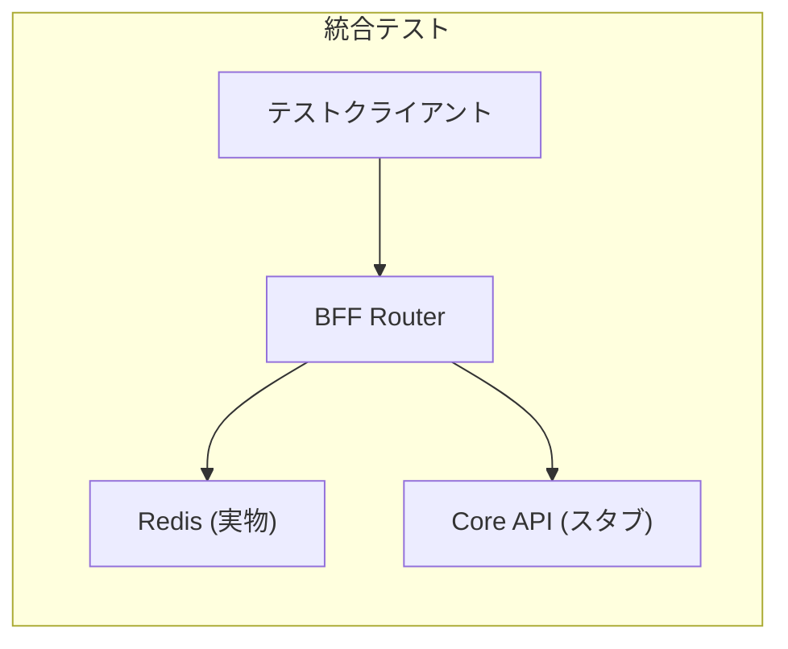
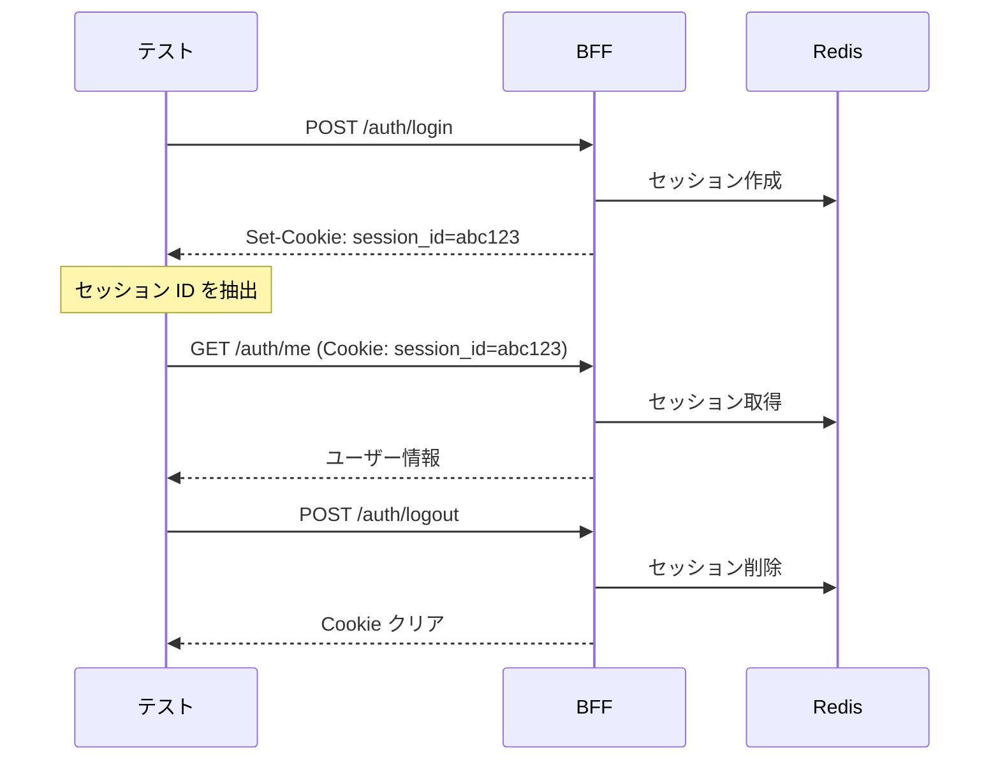

# Phase 6: 統合テスト

## 概要

BFF の認証フローを実際の Redis を使用してテストする統合テストを実装した。
Core API の呼び出しはスタブを使用し、セッション管理の一連の動作を検証する。

### 対応 Issue

- [#34 ユーザー認証（ログイン/ログアウト）](https://github.com/ka2kama/ringiflow/issues/34)

## 設計書との対応

| 設計書セクション | 実装内容 |
|-----------------|---------|
| [認証フロー](../../03_詳細設計書/07_認証機能設計.md#認証フロー) | ログイン → セッション → ログアウトの一連フロー |
| [セッション管理](../../03_詳細設計書/07_認証機能設計.md#セッション管理) | Redis を使用したセッションの作成・取得・削除 |

## 実装したコンポーネント

| ファイル | 責務 |
|---------|------|
| [`tests/auth_integration_test.rs`](../../../backend/apps/bff/tests/auth_integration_test.rs) | 統合テスト |
| [`lib.rs`](../../../backend/apps/bff/src/lib.rs) | クレートとしてのエクスポート |

## テスト設計

### テスト構成



### テストケース

| テスト | 説明 |
|-------|------|
| `test_ログインからログアウトまでの一連フロー` | 完全な認証フローを検証 |
| `test_ログアウト後にauthmeで401` | セッション無効化後のアクセス拒否 |
| `test_不正なパスワードでログインできない` | 認証失敗ケース |
| `test_存在しないメールでログインできない` | ユーザー不在ケース |
| `test_非アクティブユーザーはログインできない` | 停止ユーザーの拒否 |
| `test_未認証状態でauthmeにアクセスすると401` | Cookie なしでの拒否 |

### 統合テストが動く仕組み

#### axum の `oneshot` を使用

HTTP サーバーを起動せず、Router に直接リクエストを送る:

```rust
let app = Router::new()
    .route("/auth/login", post(login::<...>))
    .route("/auth/logout", post(logout::<...>))
    .route("/auth/me", get(me::<...>))
    .with_state(state);

// サーバーを起動せずにリクエストを処理
let response = app.oneshot(request).await.unwrap();
```

`oneshot` は axum の `tower::ServiceExt` トレイトが提供するメソッドで、
1 回限りのリクエストを処理できる。これにより:

- HTTP サーバーの起動が不要（高速）
- ポート競合が発生しない
- テストの並列実行が可能

#### 実 Redis を使用

セッション管理は実際の Redis に接続:

```rust
let session_manager = RedisSessionManager::new(&redis_url()).await?;
```

これにより、セッションの作成・取得・削除が実際に動作することを検証できる。

#### Core API はスタブ

`CoreApiClient` トレイトを実装したスタブを使用:

```rust
struct StubCoreApiClient {
    config: CoreApiStubConfig,  // 認証成功/失敗を設定
}

#[async_trait]
impl CoreApiClient for StubCoreApiClient {
    async fn verify_credentials(...) -> Result<VerifyResponse, CoreApiError> {
        if !self.config.auth_success {
            return Err(CoreApiError::AuthenticationFailed);
        }
        Ok(VerifyResponse { ... })
    }
}
```

#### Cookie の流れ



#### なぜこの構成か

| 要素 | 選択 | 理由 |
|------|------|------|
| Redis | 実物 | セッション管理はシステムの重要部分。実際の動作を確認したい |
| Core API | スタブ | Phase 4 で既にテスト済み。認証ロジックのテストに集中 |
| HTTP | oneshot | サーバー起動不要で高速。ポート競合も回避 |

### 実行方法

```bash
# 前提: Redis が起動していること
just dev-deps

# テスト実行
cd backend && cargo test -p ringiflow-bff --test auth_integration_test
```

## 関連ドキュメント

- [07_認証機能設計.md](../../03_詳細設計書/07_認証機能設計.md)
- [Phase 5: BFF 認証ハンドラ](./05_Phase5_BFF認証ハンドラ.md)
- [Phase 3: SessionManager](./03_Phase3_SessionManager.md)

---

## 設計解説

### 1. 実 Redis を使用したテスト

**場所:** [`tests/auth_integration_test.rs:176-207`](../../../backend/apps/bff/tests/auth_integration_test.rs#L176-L207)

```rust
async fn create_test_app(
    config: CoreApiStubConfig,
) -> (Router, Arc<AuthState<StubCoreApiClient, RedisSessionManager>>) {
    let session_manager = RedisSessionManager::new(&redis_url())
        .await
        .expect("Redis への接続に失敗");
    // ...
}
```

**なぜこの設計か:**

セッション管理はシステムの重要な部分であり、モックではなく実際の Redis を使用することで以下を確認できる:

- セッションの永続化が正しく動作する
- TTL が正しく設定される
- 削除後にセッションが取得できなくなる

**代替案:**

- Redis のモックを使用する
  - トレードオフ: 実際の動作との乖離がある可能性
- インメモリ実装を作成する
  - トレードオフ: 本番と異なる実装をテストすることになる

実際の Redis を使用することで、本番環境により近い条件でテストできる。

### 2. Core API のスタブ設計

**場所:** [`tests/auth_integration_test.rs:62-105`](../../../backend/apps/bff/tests/auth_integration_test.rs#L62-L105)

```rust
#[derive(Clone)]
struct CoreApiStubConfig {
    auth_success: bool,
    user_active: bool,
    user_exists: bool,
}

impl CoreApiStubConfig {
    fn success() -> Self { ... }
    fn wrong_password() -> Self { ... }
    fn user_not_found() -> Self { ... }
    fn user_inactive() -> Self { ... }
}
```

**なぜこの設計か:**

設定ベースのスタブにすることで:

- テストケースごとに異なるシナリオを簡潔に表現できる
- 新しいシナリオの追加が容易
- テストコードの可読性が向上

**代替案:**

- 各シナリオごとに別のスタブクラスを作成する
  - トレードオフ: コード量が増える、重複が多くなる
- mockall 等のモックライブラリを使用する
  - トレードオフ: 依存関係が増える、設定が複雑になる

設定ベースのスタブはシンプルで理解しやすく、テストの意図が明確になる。

### 3. Cookie からのセッション ID 抽出

**場所:** [`tests/auth_integration_test.rs:258-265`](../../../backend/apps/bff/tests/auth_integration_test.rs#L258-L265)

```rust
fn extract_session_id(set_cookie: &str) -> Option<String> {
    set_cookie
        .split(';')
        .next()
        .and_then(|s| s.strip_prefix("session_id="))
        .map(|s| s.to_string())
}
```

**なぜこの設計か:**

ログインレスポンスの `Set-Cookie` ヘッダーからセッション ID を抽出し、
後続のリクエストで使用する。これにより、実際のブラウザの動作に近いテストができる。

**テストフロー:**

```
1. ログイン → Set-Cookie: session_id=xxx; Path=/; ...
2. セッション ID を抽出
3. /auth/me へアクセス（Cookie: session_id=xxx）
4. ログアウト
5. 再度 /auth/me へアクセス → 401
```

### 4. クリーンアップの実装

**場所:** [`tests/auth_integration_test.rs:326-333`](../../../backend/apps/bff/tests/auth_integration_test.rs#L326-L333)

```rust
// クリーンアップ: セッションが削除されていることを確認
let tenant_id = TenantId::from_uuid(test_tenant_id());
let session = state
    .session_manager
    .get(&tenant_id, &session_id)
    .await
    .unwrap();
assert!(session.is_none(), "セッションが削除されていない");
```

**なぜこの設計か:**

テスト終了時にセッションが正しく削除されていることを確認し、テスト間の副作用を防ぐ。
ログアウトのテストでは、実際にセッションが Redis から削除されていることも検証する。

### 5. lib.rs の追加

**場所:** [`lib.rs`](../../../backend/apps/bff/src/lib.rs)

```rust
pub mod client;
pub mod handler;
```

**なぜこの設計か:**

統合テストからクレート内のモジュールを使用するために、`lib.rs` を追加して
`client` と `handler` モジュールをエクスポートした。

Rust のクレート構成:

```
src/
├── lib.rs    ← ライブラリとしてのエントリポイント（テストから使用）
├── main.rs   ← バイナリとしてのエントリポイント
├── client/
└── handler/
```

これにより、テストから `ringiflow_bff::handler::AuthState` のようにアクセスできる。
