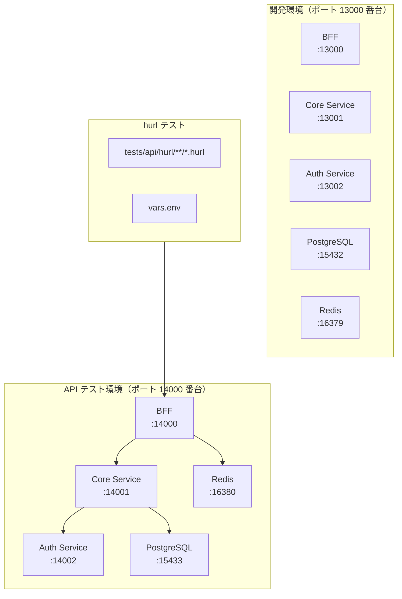
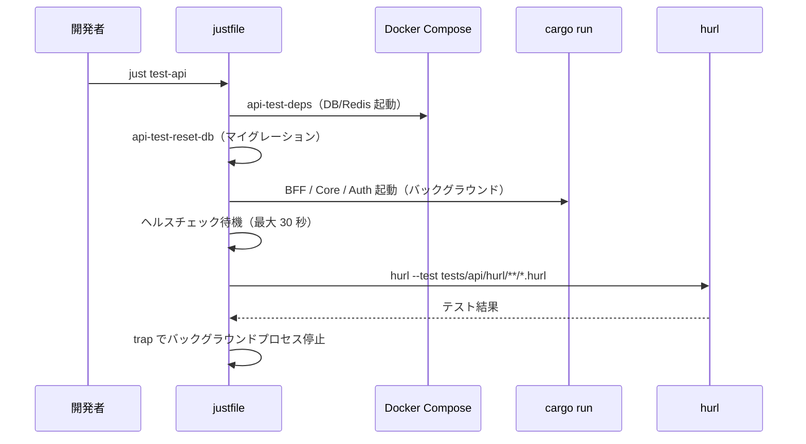
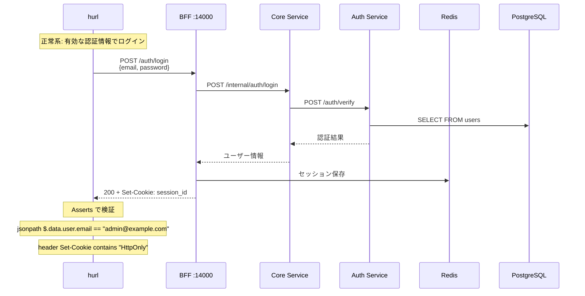

# API テスト環境構築 - 機能解説

対応 PR: #105
対応 Issue: #98

## 概要

BFF の API テストを [hurl](https://hurl.dev/) で実装した。Auth Service 分離により認証フローが BFF → Core Service → Auth Service と複数サービスにまたがるようになり、サービス間通信を含めた HTTP レベルのテストが必要になった。テスト環境は開発環境と完全に分離し、ポート番号・DB・Redis をすべて独立させている。

## 背景

### Auth Service 分離による検証の必要性

Auth Service 分離以前は、BFF 内で認証処理が完結していた。分離後はログイン 1 回で BFF → Core Service → Auth Service → DB と 3 サービスを経由するため、単体テストやスタブを使った統合テストだけでは連携の正しさを検証できない。

### テストピラミッドでの位置づけ

```
                    /\
                   /  \      API テスト（本 PR で導入）
                  /    \     全サービス起動、HTTP レベル
                 /──────\
                /        \   rust-integration
               /          \  Repository/Session + BFF 部分統合
              /────────────\
             /              \ rust (unit)
            /                \ モック使用、高速
           /──────────────────\
```

| テスト種別 | 実行コマンド | 本物のサービス | スタブ/モック | 検証対象 |
|-----------|-------------|--------------|-------------|---------|
| rust (unit) | `cargo test --lib --bins` | なし | 全部 | 各関数/モジュールの動作 |
| rust-integration | `cargo test --test '*'` | DB, Redis | 外部サービス | Repository/Session 層 |
| API テスト | `just test-api` | 全部 | なし | サービス間連携 |

## 用語・概念

| 用語 | 説明 | 関連コード |
|------|------|-----------:|
| hurl | HTTP リクエストをテキスト形式で記述・実行するツール。Cookie 自動管理、変数キャプチャ、アサーション機能を持つ | `tests/api/hurl/` |
| API テスト | 全サービスを起動した状態で HTTP レベルのリクエスト/レスポンスを検証するテスト。E2E テスト（ブラウザ操作）とは区別する | `just test-api` |
| Given-When-Then | テストの意図を明示するコメント形式。前提条件・実行・期待結果を構造化する | 各 `.hurl` ファイル |
| Cookie 自動管理 | hurl が同一ファイル内でリクエスト間の Cookie を自動的に引き継ぐ機能 | — |

## アーキテクチャ



### 環境分離のポイント

| コンポーネント | 開発環境 | API テスト環境 |
|---------------|---------|---------------|
| PostgreSQL | 15432 | 15433 |
| Redis | 16379 | 16380 |
| BFF | 13000 | 14000 |
| Core Service | 13001 | 14001 |
| Auth Service | 13002 | 14002 |

## データフロー

### フロー 1: API テスト実行（`just test-api`）



### フロー 2: ログインテスト（login.hurl）



#### 処理ステップ

| # | レイヤー | ファイル:関数 | 処理内容 |
|---|---------|-------------|---------:|
| 1 | テスト | `vars.env` | 共通変数（URL、テナント ID、テストユーザー）の定義 |
| 2 | テスト | `login.hurl` | ログインリクエスト送信 + Cookie キャプチャ |
| 3 | テスト | `csrf.hurl` | CSRF トークン取得（状態変更リクエストの前提） |
| 4 | テスト | `logout.hurl` | CSRF トークン付きでログアウト + セッション無効化検証 |
| 5 | CI | `.github/workflows/ci.yaml` | `api-test` ジョブとして並列実行 |

## 設計判断

機能・仕組みレベルの判断を記載する。コード実装レベルの判断は[コード解説](./02_コード解説.md#設計解説)を参照。

### 1. テスト種別の名称: 「API テスト」vs「E2E テスト」

当初 `tests/e2e/` として設計したが、実装途中で名称を変更した。

| 案 | 正確性 | 既存テストとの混同 |
|----|--------|------------------|
| **API テスト（採用）** | 高い（HTTP レベルのテスト） | なし |
| E2E テスト | 低い（ブラウザ操作を含まない） | なし |
| Integration テスト | 中（広義では該当） | rust-integration と混同 |

**採用理由**: 「E2E テスト」は一般的にブラウザを操作するユーザー視点のテストを指す。今回はブラウザを含まない HTTP レベルのリクエスト/レスポンス検証であり、「API テスト」が最も正確。

### 2. テスト環境の分離方式: 完全分離 vs 共有

開発用の DB/Redis を API テストで共有するか、完全に分離するか。

| 案 | データ独立性 | セットアップコスト |
|----|-------------|------------------|
| **完全分離（採用）** | 高い（相互干渉なし） | 高い（Docker Compose 追加） |
| 開発環境を共有 | 低い（データ競合リスク） | 低い |
| テスト毎にリセット | 中 | 中 |

**採用理由**: 開発中にデータを変更するとテストが壊れ、テストがデータを変更すると開発に影響する。Docker Compose のプロジェクト名（`-p ringiflow-api-test`）でコンテナ・ボリュームを分離することで、追加コストを最小限に抑えた。

### 3. Cookie 自動管理への対処: ファイル分離 vs Cookie リセット

hurl は同一ファイル内で Cookie を自動管理するため、ログイン後の未認証テストが意図通りに動かない。

| 案 | シンプルさ | テストの意図の明確さ |
|----|----------|-------------------|
| **ファイル分離（採用）** | 高い | 高い（ファイル名で状態が明確） |
| `--cookie-jar` でリセット | 低い（追加オプション） | 中 |
| ファイル冒頭で Cookie を明示的にクリア | 低い（hurl では非対応） | — |

**採用理由**: 認証済みテスト（`me.hurl`）と未認証テスト（`me_unauthorized.hurl`）をファイルで分離することで、各テストの前提条件がファイル名から自明になる。

### 4. テストの可読性: Given-When-Then 形式

hurl のテストは HTTP リクエスト/レスポンスの羅列になりがちで、テストの意図が伝わりにくい。

| 案 | 可読性 | 保守性 |
|----|--------|--------|
| **Given-When-Then コメント（採用）** | 高い | 高い（コメントは任意） |
| コメントなし | 低い | 低い |
| テスト名をファイル名で表現 | 中 | 中 |

**採用理由**: テストコードはドキュメントでもある。Given（前提条件）・When（実行）・Then（期待結果）の構造化コメントにより、テストの意図が将来の読者に伝わる。

## 関連ドキュメント

- [コード解説](./02_コード解説.md)
- [tests/api/README.md](../../../tests/api/README.md) — テスト実行手順
- [ナレッジベース: hurl](../../06_ナレッジベース/devtools/hurl.md)
