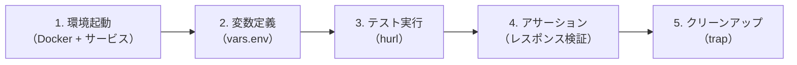
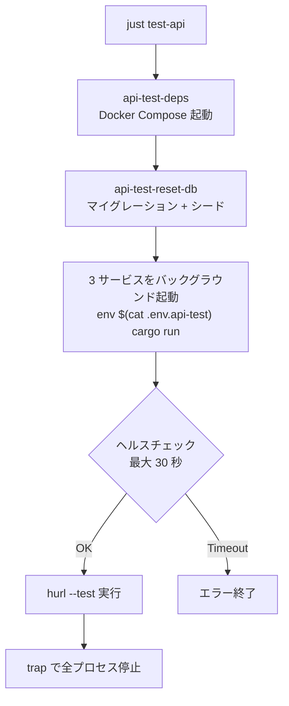
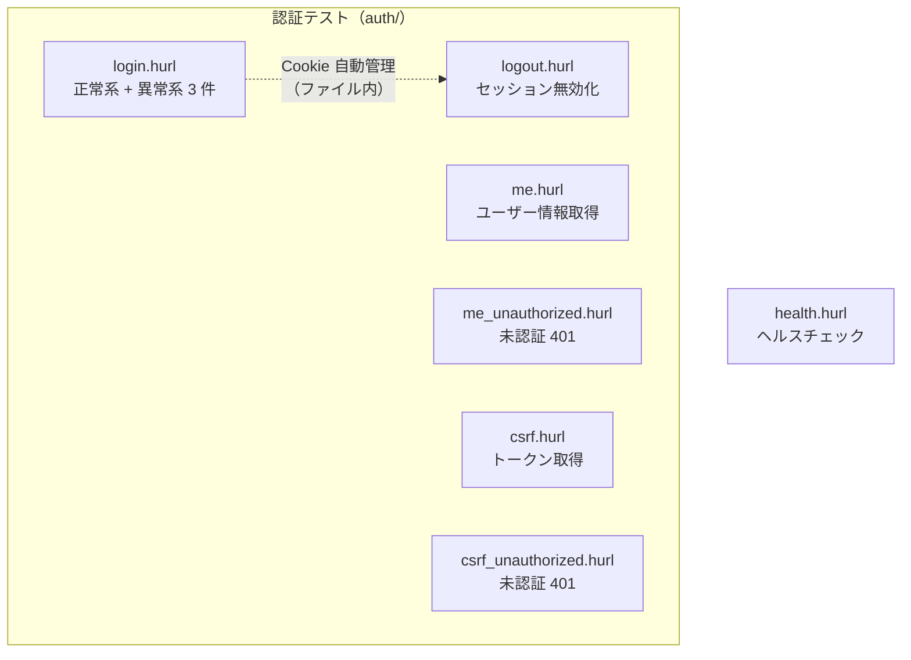
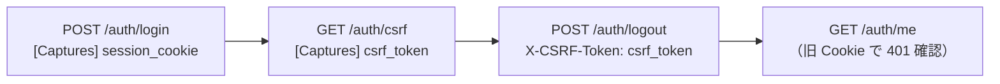
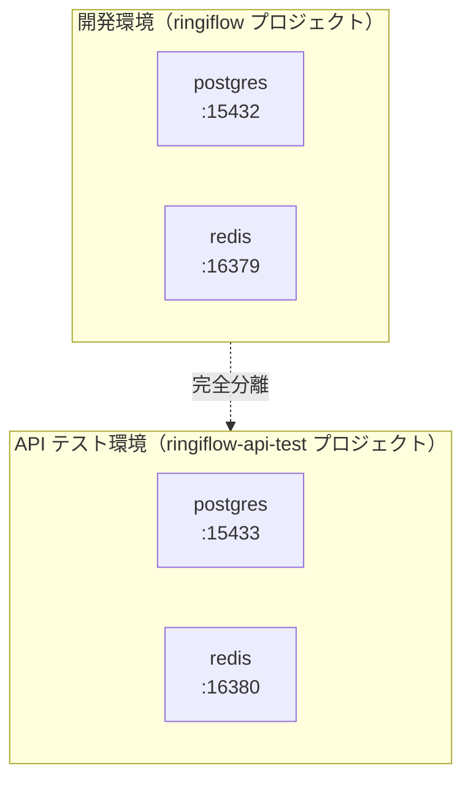

# API テスト環境構築 - コード解説

対応 PR: #105
対応 Issue: #98

## 主要な型・関数

| 型/関数 | ファイル | 責務 |
|--------|---------|------|
| `vars.env` | [`tests/api/hurl/vars.env`](../../../tests/api/hurl/vars.env) | BFF URL、テナント ID、テストユーザー情報の共通変数 |
| `login.hurl` | [`tests/api/hurl/auth/login.hurl`](../../../tests/api/hurl/auth/login.hurl) | ログインの正常系・異常系テスト（4 ケース） |
| `logout.hurl` | [`tests/api/hurl/auth/logout.hurl`](../../../tests/api/hurl/auth/logout.hurl) | ログアウト + セッション無効化の検証 |
| `me.hurl` | [`tests/api/hurl/auth/me.hurl`](../../../tests/api/hurl/auth/me.hurl) | 認証済みユーザー情報取得 |
| `me_unauthorized.hurl` | [`tests/api/hurl/auth/me_unauthorized.hurl`](../../../tests/api/hurl/auth/me_unauthorized.hurl) | 未認証時の 401 検証 |
| `csrf.hurl` | [`tests/api/hurl/auth/csrf.hurl`](../../../tests/api/hurl/auth/csrf.hurl) | CSRF トークン取得（認証済み） |
| `csrf_unauthorized.hurl` | [`tests/api/hurl/auth/csrf_unauthorized.hurl`](../../../tests/api/hurl/auth/csrf_unauthorized.hurl) | CSRF トークンの未認証 401 検証 |
| `health.hurl` | [`tests/api/hurl/health.hurl`](../../../tests/api/hurl/health.hurl) | ヘルスチェック |
| `test-api` | [`justfile`](../../../justfile) | ワンコマンドでの API テスト実行（環境起動 → テスト → 停止） |
| `.env.api-test` | [`backend/.env.api-test`](../../../backend/.env.api-test) | API テスト用環境変数（ポート 14000 番台） |
| `docker-compose.api-test.yaml` | [`infra/docker/docker-compose.api-test.yaml`](../../../infra/docker/docker-compose.api-test.yaml) | API テスト用 DB/Redis（ポート 15433/16380） |

## コードフロー

コードをライフサイクル順に追う。各ステップの構造を図で示した後、対応するコードを解説する。



### 1. 環境起動（`just test-api`）

ワンコマンドで API テスト環境を起動し、テストを実行して停止する。



```bash
# justfile: test-api
test-api: api-test-deps api-test-reset-db
    #!/usr/bin/env bash
    set -e
    trap 'kill $(jobs -p) 2>/dev/null' EXIT       # ① 終了時にバックグラウンドプロセスを停止

    # API テスト環境変数でサービスを起動（バックグラウンド）
    cd backend
    env $(cat .env.api-test | grep -v '^#' | xargs) cargo run -p ringiflow-bff &            # ②
    env $(cat .env.api-test | grep -v '^#' | xargs) cargo run -p ringiflow-core-service &
    env $(cat .env.api-test | grep -v '^#' | xargs) cargo run -p ringiflow-auth-service &

    # ヘルスチェック待機                            # ③
    for i in {1..30}; do
        if curl -sf http://localhost:14000/health > /dev/null 2>&1 && \
           curl -sf http://localhost:14001/health > /dev/null 2>&1 && \
           curl -sf http://localhost:14002/health > /dev/null 2>&1; then
            echo "✓ 全サービス起動完了"
            break
        fi
        sleep 1
    done

    # API テスト実行                                # ④
    hurl --test --variables-file tests/api/hurl/vars.env tests/api/hurl/**/*.hurl
```

注目ポイント:

- ① `trap ... EXIT` でスクリプト終了時（正常・異常問わず）にバックグラウンドプロセスを確実に停止
- ② `.env.api-test` を `env` コマンドで読み込み、API テスト用ポートでサービスを起動
- ③ 3 サービスすべてのヘルスチェックが通るまで最大 30 秒待機
- ④ glob パターンで全 `.hurl` ファイルを一括実行

### 2. 変数定義（vars.env）

テスト全体で共通の変数を定義する。

```bash
# tests/api/hurl/vars.env
bff_url=http://localhost:14000          # ① API テスト用ポート
tenant_id=00000000-0000-0000-0000-000000000001  # ② 開発用テナント
admin_email=admin@example.com           # ③ シードデータのユーザー
user_email=user@example.com
password=password123
```

注目ポイント:

- ① BFF の URL が開発環境（13000）ではなく API テスト環境（14000）を指している
- ② マルチテナント対応。全リクエストに `X-Tenant-ID` ヘッダーとして送信
- ③ シードデータで作成されるテストユーザーの認証情報

### 3. テスト実行（hurl テストファイル）

各 `.hurl` ファイルが Given-When-Then 形式で構造化されている。



```hurl
# tests/api/hurl/auth/login.hurl（正常系の抜粋）

# =============================================================================
# 正常系: 有効な認証情報でログインできる
# =============================================================================
# Given: シードデータの管理者ユーザーが存在する           # ①
# When: 正しいメールアドレスとパスワードでログインする
# Then: ユーザー情報とセッション Cookie が返される

POST {{bff_url}}/auth/login                              # ②
X-Tenant-ID: {{tenant_id}}
Content-Type: application/json
{
    "email": "{{admin_email}}",
    "password": "{{password}}"
}

HTTP 200
[Asserts]
jsonpath "$.data.user.email" == "admin@example.com"       # ③
jsonpath "$.data.user.name" == "管理者"
header "Set-Cookie" contains "session_id="                # ④
header "Set-Cookie" contains "HttpOnly"
```

注目ポイント:

- ① Given-When-Then コメントでテストの意図を明示
- ② `{{変数名}}` で `vars.env` の変数を参照。テスト環境固有の値を外部化
- ③ `jsonpath` アサーションで JSON レスポンスの値を検証
- ④ セキュリティ属性（HttpOnly）の検証も含む

### 4. CSRF トークンの取得と送信（logout.hurl）

状態変更リクエスト（POST）には CSRF トークンが必要。ログアウトテストでは、ログイン → CSRF 取得 → ログアウトの 3 段階を踏む。



```hurl
# tests/api/hurl/auth/logout.hurl（抜粋）

# 前提: ログイン
POST {{bff_url}}/auth/login
# ...
HTTP 200
[Captures]
session_cookie: cookie "session_id"        # ① Cookie をキャプチャ

# 前提: CSRF トークン取得
GET {{bff_url}}/auth/csrf
Cookie: session_id={{session_cookie}}       # ② キャプチャした Cookie を明示送信
HTTP 200
[Captures]
csrf_token: jsonpath "$.data.token"         # ③ トークンをキャプチャ

# ログアウト
POST {{bff_url}}/auth/logout
X-CSRF-Token: {{csrf_token}}               # ④ CSRF トークンをヘッダーに付与
Cookie: session_id={{session_cookie}}
HTTP 204
[Asserts]
header "Set-Cookie" contains "Max-Age=0"    # ⑤ Cookie 無効化を検証

# 確認: ログアウト後は認証失敗
GET {{bff_url}}/auth/me
Cookie: session_id={{session_cookie}}
HTTP 401                                    # ⑥ セッション無効化を検証
```

注目ポイント:

- ① `[Captures]` で Cookie の値を変数に保存
- ② hurl の Cookie 自動管理を使わず、明示的に Cookie を送信（意図の明確化）
- ③ CSRF トークンを `jsonpath` で抽出し変数に保存
- ④ 状態変更リクエストに `X-CSRF-Token` ヘッダーを付与
- ⑤ `Max-Age=0` でセッション Cookie が無効化されたことを検証
- ⑥ 無効化されたセッションでのアクセスが 401 を返すことを検証

### 5. テスト環境分離（Docker Compose）

API テスト専用の Docker Compose ファイルで DB/Redis を分離する。



```yaml
# infra/docker/docker-compose.api-test.yaml（抜粋）
services:
  postgres:
    image: postgres:17-alpine
    environment:
      POSTGRES_DB: ringiflow_api_test       # ① 専用 DB 名
    ports:
      - "15433:5432"                         # ② 開発（15432）と異なるポート
    volumes:
      - postgres_api_test_data:/var/lib/postgresql/data  # ③ 専用ボリューム

  redis:
    image: redis:7-alpine
    ports:
      - "16380:6379"                         # ④ 開発（16379）と異なるポート
```

注目ポイント:

- ① DB 名を `ringiflow_api_test` にして開発用 DB と区別
- ② ポート番号をオフセット（+1）して開発環境と並行起動可能
- ③ ボリュームも分離し、データの相互干渉を防止
- ④ Redis も同様にポートを分離

## テスト

| テスト | 検証対象のステップ | 検証内容 |
|-------|------------------|---------:|
| `health.hurl` | 1（環境起動） | サービスが稼働し healthy を返す |
| `login.hurl` 正常系 | 3（テスト実行） | 有効な認証情報でログイン成功 |
| `login.hurl` 異常系×3 | 3 | パスワード不一致、存在しないユーザー、テナント ID ヘッダー欠如 |
| `logout.hurl` | 4（アサーション） | ログアウトでセッション無効化 |
| `me.hurl` | 3 | 認証済みでユーザー情報取得 |
| `me_unauthorized.hurl` | 3 | 未認証で 401 |
| `csrf.hurl` | 3 | CSRF トークン取得（64 文字 hex） |
| `csrf_unauthorized.hurl` | 3 | 未認証で 401 |

### 実行方法

```bash
just test-api  # ワンコマンドで実行（推奨）
```

## 設計解説

コード実装レベルの判断を記載する。機能・仕組みレベルの判断は[機能解説](./01_機能解説.md#設計判断)を参照。

### 1. `.env.api-test` の環境変数注入方式

場所: `justfile` の `test-api` タスク

```bash
env $(cat .env.api-test | grep -v '^#' | xargs) cargo run -p ringiflow-bff &
```

なぜこの実装か:

`just` の `set dotenv-load` は 1 つの `.env` ファイルしか読み込めない。API テスト用には別の `.env.api-test` を使う必要があるため、`env` コマンドでファイルの内容を環境変数として渡す。`grep -v '^#'` でコメント行を除外し、`xargs` で `KEY=VALUE` 形式に展開する。

代替案:

| 案 | メリット | デメリット | 判断 |
|----|---------|-----------|------|
| `env $(cat .env.api-test)` パターン（採用） | シンプル、既存パターンに従う | コメント行の除外が必要 | 採用 |
| `source .env.api-test && cargo run` | シェル変数として読み込み | `export` が必要、サブシェルの問題 | 見送り |
| `dotenv-cli` ツール | `.env` ファイル専用ツール | 追加依存 | 見送り |

### 2. `trap` によるプロセス停止

場所: `justfile` の `test-api` タスク

```bash
trap 'kill $(jobs -p) 2>/dev/null' EXIT
```

なぜこの実装か:

3 つのサービスをバックグラウンドで起動するため、テスト終了時（正常・異常問わず）に確実に停止する必要がある。`trap ... EXIT` はスクリプト終了時に必ず実行されるため、プロセスのリーク防止に最適。`2>/dev/null` でプロセスが既に終了していた場合のエラーを無視する。

代替案:

| 案 | メリット | デメリット | 判断 |
|----|---------|-----------|------|
| `trap ... EXIT`（採用） | 確実、シンプル | PID 管理が不要 | 採用 |
| PID ファイルで管理 | 明示的 | ファイル管理が必要 | 見送り |
| Docker Compose でサービスも起動 | 完全コンテナ化 | ビルド済みバイナリが必要 | 見送り |

### 3. ヘルスチェックのポーリング方式

場所: `justfile` の `test-api` タスク

```bash
for i in {1..30}; do
    if curl -sf http://localhost:14000/health > /dev/null 2>&1 && \
       curl -sf http://localhost:14001/health > /dev/null 2>&1 && \
       curl -sf http://localhost:14002/health > /dev/null 2>&1; then
        break
    fi
    sleep 1
done
```

なぜこの実装か:

Rust のサービスは起動に時間がかかる（特に初回ビルド時）。3 サービスすべてがヘルスチェックに応答するまでポーリングで待機する。`curl -sf` で失敗時にエラー出力を抑制し、`&&` で全サービスの応答を確認する。

代替案:

| 案 | メリット | デメリット | 判断 |
|----|---------|-----------|------|
| `curl` ポーリング（採用） | シンプル、依存なし | 固定間隔 | 採用 |
| `wait-for-it.sh` | TCP レベルの待機 | HTTP レベルの確認ではない | 見送り |
| Docker healthcheck | Docker 標準 | サービスは Docker 外で起動 | 見送り |

## 依存関係

| ツール | バージョン | 追加理由 |
|-------|-----------|---------|
| `hurl` | — | HTTP リクエストをテキスト形式で記述・実行するテストツール |

## 関連ドキュメント

- [機能解説](./01_機能解説.md)
- [tests/api/README.md](../../../tests/api/README.md) — テスト実行手順
- [ナレッジベース: hurl](../../06_ナレッジベース/devtools/hurl.md)
