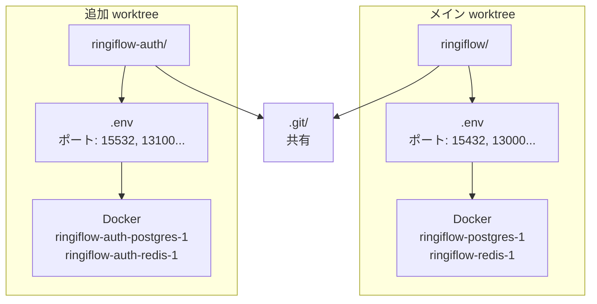

# 並行開発環境 実装解説

## 対応 Issue

[#96 git worktree による並行開発環境を構築](https://github.com/ka2kama/ringiflow/pull/96)

## 機能概要

複数のタスクを同時に進めるための、完全に分離された開発環境を構築する。

### 完了基準

- [x] `just worktree-add NAME BRANCH` で worktree を作成できる
- [x] ポートオフセットが自動で割り当てられる
- [x] 各 worktree で独立した Docker コンテナが起動できる
- [x] `just worktree-remove NAME` で worktree と Docker コンテナを削除できる

## アーキテクチャ



### 分離レイヤー

| レイヤー | 方式 | 分離されるもの |
|---------|------|---------------|
| コード | git worktree | 作業ディレクトリ、ブランチ |
| 環境変数 | `.env` 自動生成 | ポート番号 |
| コンテナ | Docker Compose `-p` | コンテナ名、ボリューム、ネットワーク |

## 実装したコンポーネント

| ファイル | 責務 |
|---------|------|
| [`scripts/generate-env.sh`](../../../scripts/generate-env.sh) | ポートオフセット付き `.env` 生成 |
| [`justfile`](../../../justfile) (worktree-*) | worktree 管理タスク |
| [`docker-compose.yaml`](../../../infra/docker/docker-compose.yaml) | プロジェクト名対応 |

## 実装内容

### 1. ポートオフセット自動割り当て

```bash
# justfile: worktree-add
used_offsets=()
while IFS= read -r wt_path; do
    # 各 worktree の .env から POSTGRES_PORT を読み取り
    port=$(grep -E '^POSTGRES_PORT=' "$wt_path/.env" | cut -d= -f2)
    offset=$(( (port - 15432) / 100 ))
    used_offsets+=("$offset")
done < <(git worktree list --porcelain | grep '^worktree ' | cut -d' ' -f2-)

# 空きオフセットを探す
for i in {1..9}; do
    if [[ ${#used_offsets[@]} -gt 0 ]]; then
        # 使用中かチェック
    fi
done
```

### 2. Docker Compose プロジェクト名

```bash
# justfile: dev-deps
PROJECT_NAME=$(basename "$(pwd)")
docker compose -p "$PROJECT_NAME" -f infra/docker/docker-compose.yaml up -d
```

`-p` オプションにより:
- コンテナ名: `{project}-postgres-1`
- ボリューム名: `{project}_postgres_data`
- ネットワーク: `{project}_default`

### 3. container_name の削除

```yaml
# Before: 固定名だとプロジェクト名機能が効かない
postgres:
  container_name: ringiflow-postgres

# After: プロジェクト名ベースの自動命名
postgres:
  # container_name は指定しない
```

## 関連ドキュメント

- ADR: [021_並行開発環境の構成.md](../../05_ADR/021_並行開発環境の構成.md)
- ナレッジベース: [git_worktree.md](../../06_ナレッジベース/devtools/git_worktree.md)
- 手順書: [04_並行開発（Worktree）.md](../../04_手順書/04_開発フロー/04_並行開発（Worktree）.md)

---

## 設計解説

### 1. なぜ git worktree + Docker Compose プロジェクト名か

**場所**: [`justfile:209-269`](../../../justfile#L209-L269)

**なぜこの設計か**:
- git worktree は Git 公式機能で安定している
- Docker Compose のプロジェクト名は、コンテナ・ボリューム・ネットワークを自動分離する
- 両者を組み合わせることで、コードと実行環境の両方を分離できる

**代替案**:

| 方式 | 利点 | 欠点 |
|-----|------|------|
| 複数クローン | シンプル | `.git` 重複、同期が煩雑 |
| Dev Container | 最高の隔離度 | オーバーヘッド大、IDE 連携複雑 |
| worktree + Compose（採用） | バランス良い | ポート管理が必要（自動化で解決） |

### 2. ポートオフセット自動割り当ての設計

**場所**: [`justfile:229-246`](../../../justfile#L229-L246)

**コード例**:
```bash
# 空配列チェックを明示的に行う
if [[ ${#used_offsets[@]} -gt 0 ]]; then
    for used in "${used_offsets[@]}"; do
        # ...
    done
fi
```

**なぜこの設計か**:
- 手動でオフセットを指定すると、重複ミスが起きやすい
- 既存の `.env` から使用中オフセットを逆算することで、空き番号を自動検出
- `set -euo pipefail` 環境でも安全に動作するよう、空配列チェックを明示

**代替案**:
- 手動指定: シンプルだが衝突リスクあり
- ランダム割り当て: 衝突は避けられるが予測不可能
- ファイルで管理: 状態管理が複雑化

### 3. エラーハンドリングのパターン

**場所**: [`justfile:286`](../../../justfile#L286)

**コード例**:
```bash
# Before: パイプラインで失敗する可能性
if docker compose ... ps -q | grep -q .; then

# After: コマンド置換 + || true でエラーを吸収
containers=$(docker compose ... ps -q 2>/dev/null || true)
if [[ -n "$containers" ]]; then
```

**なぜこの設計か**:
- `set -euo pipefail` が有効な場合、パイプラインのどこかで失敗するとスクリプト全体が終了する
- `|| true` を付けることで、コマンドが失敗しても exit code 0 を返す
- 結果を変数に格納し、空かどうかで判定する方が堅牢
