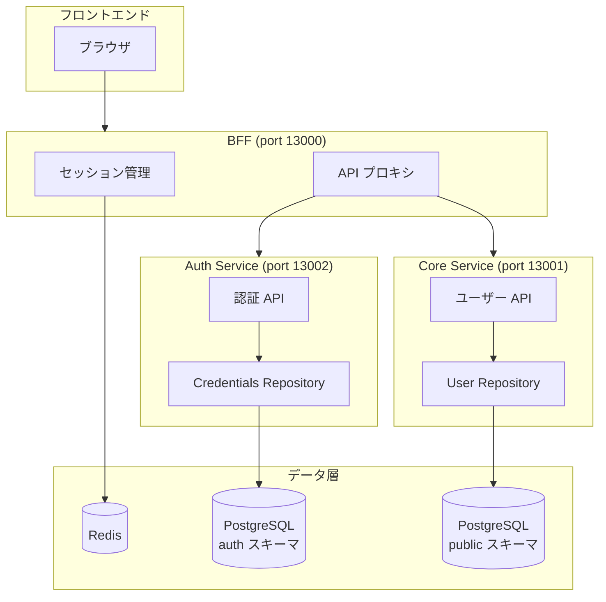

# Auth Service 分離 実装解説

## 対応 Issue

[#80 Auth Service を分離する](https://github.com/ka2kama/ringiflow/issues/80)

## 機能概要

認証機能を独立した Auth Service として分離する。将来の SSO/MFA/SCIM 対応を見据え、認証ドメインを Core Service から独立させる。

### 完了基準

- [x] auth スキーマと credentials テーブルを作成
- [x] 既存のパスワードハッシュを credentials に移行
- [x] POST /internal/auth/verify API を実装
- [x] POST /internal/auth/credentials API を実装
- [x] DELETE /internal/auth/credentials/{user_id} API を実装
- [x] BFF の認証フローを Auth Service 経由に変更（Phase 3）
- [x] Core Service から認証コードを削除（Phase 3）
- [x] users.password_hash カラムを削除（Phase 4）

## アーキテクチャ

### 責務分担

| コンポーネント | 責務 | 所有データ |
|--------------|------|----------|
| **BFF** | セッション管理、Cookie/CSRF、API 中継 | セッション（Redis） |
| **Auth Service** | パスワード認証、将来の SSO/MFA | credentials |
| **Core Service** | ユーザー情報管理、ビジネスロジック | users, roles |

## 実装フェーズ

| Phase | 内容 | 状態 |
|-------|------|------|
| [Phase 1](01_Phase1_インフラ.md) | auth スキーマ・credentials テーブル | 完了 |
| [Phase 2](02_Phase2_AuthService.md) | Auth Service 実装 | 完了 |
| [Phase 3](03_Phase3_BFF統合.md) | BFF 統合・Core Service 整理 | 完了 |
| [Phase 4](04_Phase4_レガシー削除.md) | users.password_hash カラム削除 | 完了 |

## 関連ドキュメント

- 設計書: [08_AuthService設計.md](../../03_詳細設計書/08_AuthService設計.md)
- ADR: [017_AuthService分離の方針.md](../../05_ADR/017_AuthService分離の方針.md)
- 技術ノート: [マイクロサービス間のデータ整合性.md](../../06_技術ノート/マイクロサービス間のデータ整合性.md)
- 技術ノート: [パスワードハッシュ.md](../../06_技術ノート/パスワードハッシュ.md)
