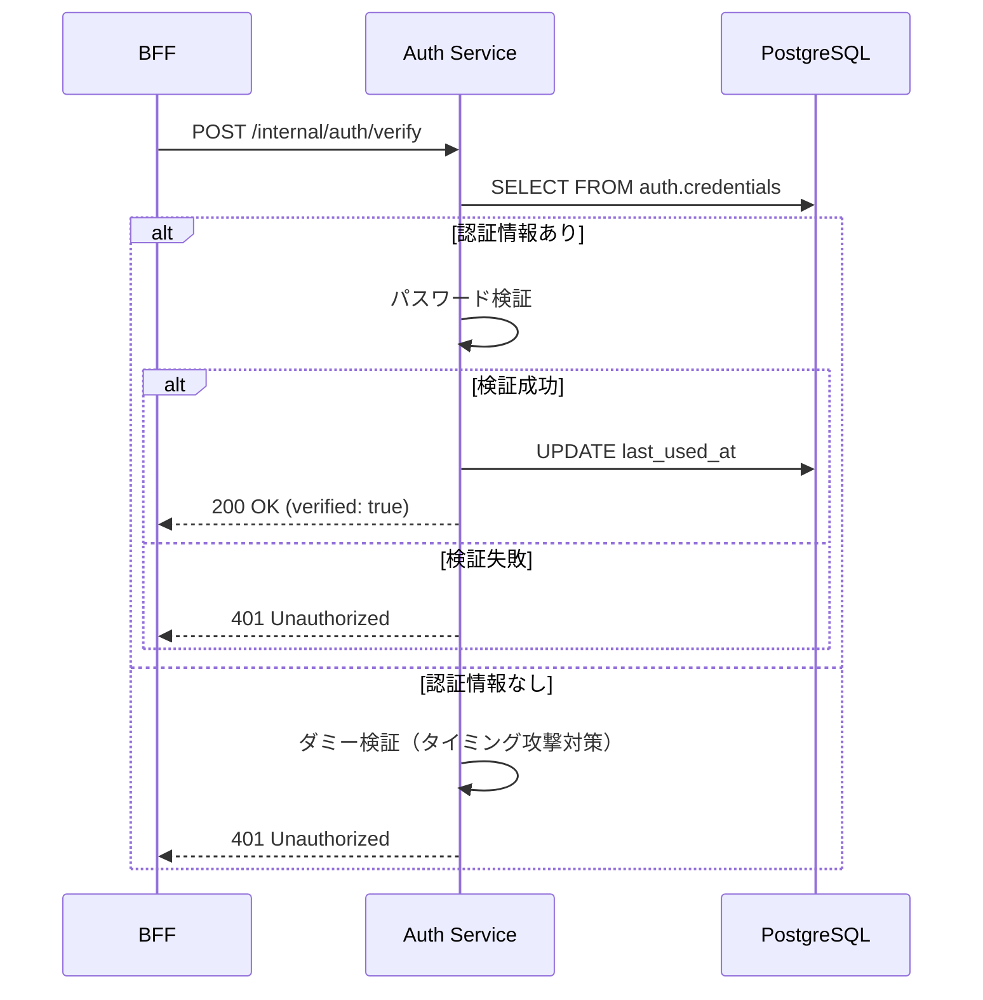

# Phase 2: Auth Service 実装

## 概要

認証処理を担当する Auth Service を実装する。パスワード認証の検証と認証情報の CRUD を提供する内部 API サーバー。

### 対応 Issue

[#80 Auth Service を分離する](https://github.com/ka2kama/ringiflow/issues/80)

## 設計書との対応

- [08_AuthService設計.md - API 設計](../../03_詳細設計書/08_AuthService設計.md#api-設計)
- [08_AuthService設計.md - 実装コンポーネント](../../03_詳細設計書/08_AuthService設計.md#実装コンポーネント)

## 実装したコンポーネント

### Auth Service (`backend/apps/auth-service`)

| ファイル | 責務 |
|---------|------|
| [`main.rs`](../../../backend/apps/auth-service/src/main.rs) | サーバーエントリーポイント |
| [`config.rs`](../../../backend/apps/auth-service/src/config.rs) | 環境変数からの設定読み込み |
| [`error.rs`](../../../backend/apps/auth-service/src/error.rs) | エラー定義と HTTP レスポンス変換 |
| [`handler/auth.rs`](../../../backend/apps/auth-service/src/handler/auth.rs) | 認証 API ハンドラ |
| [`handler/health.rs`](../../../backend/apps/auth-service/src/handler/health.rs) | ヘルスチェックハンドラ |
| [`usecase/auth.rs`](../../../backend/apps/auth-service/src/usecase/auth.rs) | 認証ビジネスロジック |

### CredentialsRepository (`backend/crates/infra`)

| ファイル | 責務 |
|---------|------|
| [`credentials_repository.rs`](../../../backend/crates/infra/src/repository/credentials_repository.rs) | credentials テーブルへの CRUD |

## 実装内容

### API エンドポイント

| メソッド | パス | 説明 |
|---------|------|------|
| POST | `/internal/auth/verify` | パスワード認証を実行 |
| POST | `/internal/auth/credentials` | 認証情報を作成 |
| DELETE | `/internal/auth/credentials/{user_id}` | ユーザーの全認証情報を削除 |
| GET | `/health` | ヘルスチェック |

### 主要な型

#### VerifyRequest / VerifyResponse

```rust
// リクエスト
pub struct VerifyRequest {
    pub tenant_id: Uuid,
    pub user_id: Uuid,
    pub password: String,
}

// レスポンス
pub struct VerifyResponse {
    pub verified: bool,
    pub credential_id: Option<Uuid>,
}
```

#### CredentialType

```rust
pub enum CredentialType {
    Password,  // パスワード認証
    Totp,      // TOTP（将来用）
    Oidc,      // OIDC SSO（将来用）
    Saml,      // SAML SSO（将来用）
}
```

#### Credential

```rust
pub struct Credential {
    pub id: Uuid,
    pub user_id: UserId,
    pub tenant_id: TenantId,
    pub credential_type: CredentialType,
    pub credential_data: String,
    pub is_active: bool,
    pub last_used_at: Option<DateTime<Utc>>,
    pub created_at: DateTime<Utc>,
    pub updated_at: DateTime<Utc>,
}
```

### 認証フロー



## テスト

### ユニットテスト

```bash
cargo test --package ringiflow-auth-service
```

| テストケース | 内容 |
|-------------|------|
| `test_verify_認証成功` | 正しいパスワードで認証成功 |
| `test_verify_認証失敗` | 不正なパスワードで 401 |
| `test_create_credentials_成功` | 認証情報作成で 201 |
| `test_delete_credentials_成功` | 認証情報削除で 204 |
| `test_verify_password_成功` | ユースケース: 認証成功 |
| `test_verify_password_パスワード不一致` | ユースケース: パスワード不一致 |
| `test_verify_password_認証情報なし` | ユースケース: 認証情報なし |
| `test_verify_password_無効な認証情報` | ユースケース: is_active=false |
| `test_create_credential_成功` | ユースケース: 作成成功 |
| `test_create_credential_不正な種別` | ユースケース: 不正な credential_type |

---

## 設計解説

### 1. タイミング攻撃対策

**場所**: [`usecase/auth.rs:139-151`](../../../backend/apps/auth-service/src/usecase/auth.rs)

**コード例**:

```rust
fn dummy_verification(&self, password: &PlainPassword) {
    let dummy_hash = ringiflow_domain::password::PasswordHash::new(
        "$argon2id$v=19$m=65536,t=1,p=1$AAAAAAAAAAAAAAAAAAAAAA$...",
    );
    let _ = self.password_checker.verify(password, &dummy_hash);
}
```

**なぜこの設計か**:

ユーザーが存在しない場合、パスワード検証をスキップすると処理時間が短くなり、攻撃者がユーザーの存在を推測できる（タイミング攻撃）。

固定の `sleep` ではなく、実際にダミーハッシュで Argon2id 検証を実行する。これにより:

- CPU/メモリ状況による自然な変動も含めて、実際の検証と同じ時間特性になる
- 統計的分析による検出が困難になる

**代替案**:

| 方式 | メリット | デメリット |
|------|---------|-----------|
| 固定 sleep | 実装が簡単 | 統計的に検出可能 |
| **ダミー検証（採用）** | 検出困難 | CPU コストがかかる |
| 常にユーザー検索 | 完全な均一化 | DB 負荷が増加 |

詳細: [ナレッジベース: パスワードハッシュ](../../06_ナレッジベース/security/パスワードハッシュ.md)

### 2. トレイトベースの設計

**場所**: [`usecase.rs:19-71`](../../../backend/apps/auth-service/src/usecase.rs)

**コード例**:

```rust
#[async_trait]
pub trait AuthUseCase: Send + Sync {
    async fn verify_password(
        &self,
        tenant_id: Uuid,
        user_id: Uuid,
        password: &str,
    ) -> Result<VerifyResult, AuthError>;

    async fn create_credential(...) -> Result<Uuid, AuthError>;
    async fn delete_credentials(...) -> Result<(), AuthError>;
}
```

**なぜこの設計か**:

1. **テスタビリティ**: ハンドラのテストでスタブ実装を注入できる
2. **依存性逆転**: ハンドラは具体的な実装ではなくトレイトに依存
3. **将来の拡張**: 認証方式の追加時にトレイトにメソッドを追加

**ハンドラのテスト例**:

```rust
struct StubAuthUseCase {
    verify_success: bool,
}

#[async_trait]
impl AuthUseCase for StubAuthUseCase {
    async fn verify_password(...) -> Result<VerifyResult, AuthError> {
        if self.verify_success {
            Ok(VerifyResult { verified: true, credential_id: Some(Uuid::now_v7()) })
        } else {
            Err(AuthError::AuthenticationFailed)
        }
    }
    // ...
}
```

### 3. エラーの HTTP レスポンス変換

**場所**: [`error.rs:47-99`](../../../backend/apps/auth-service/src/error.rs)

**コード例**:

```rust
impl IntoResponse for AuthError {
    fn into_response(self) -> Response {
        let (status, error_type, title, detail) = match &self {
            AuthError::AuthenticationFailed => (
                StatusCode::UNAUTHORIZED,
                "https://ringiflow.example.com/errors/authentication-failed",
                "Authentication Failed",
                "認証に失敗しました".to_string(),
            ),
            // ...
        };
        // RFC 9457 Problem Details 形式
        (status, Json(ErrorResponse { error_type, title, status, detail })).into_response()
    }
}
```

**なぜこの設計か**:

- **RFC 9457 準拠**: 標準的なエラーレスポンス形式
- **ユースケースの分離**: ユースケース層は `AuthError` を返すだけ、HTTP 変換はハンドラ層
- **セキュリティ**: 内部エラーの詳細は外部に漏らさない（`tracing::error!` でログに記録）

### 4. FromStr トレイト実装

**場所**: [`credentials_repository.rs:47-60`](../../../backend/crates/infra/src/repository/credentials_repository.rs)

**コード例**:

```rust
impl FromStr for CredentialType {
    type Err = String;

    fn from_str(s: &str) -> Result<Self, Self::Err> {
        match s {
            "password" => Ok(Self::Password),
            "totp" => Ok(Self::Totp),
            "oidc" => Ok(Self::Oidc),
            "saml" => Ok(Self::Saml),
            _ => Err(format!("不正な credential_type: {}", s)),
        }
    }
}
```

**なぜこの設計か**:

独自の `from_str` メソッドではなく、標準トレイト `FromStr` を実装する。これにより:

- `.parse()` メソッドが使える（`"password".parse::<CredentialType>()`）
- Clippy の `should_implement_trait` 警告を回避
- Rust の慣習に沿った設計

**呼び出し側**:

```rust
// 簡潔な記法が使える
let cred_type: CredentialType = credential_type.parse().map_err(AuthError::Internal)?;
```

## 関連ドキュメント

- 設計書: [08_AuthService設計.md](../../03_詳細設計書/08_AuthService設計.md)
- ナレッジベース: [パスワードハッシュ.md](../../06_ナレッジベース/security/パスワードハッシュ.md)
- ナレッジベース: [Rustエラーハンドリング.md](../../06_ナレッジベース/rust/Rustエラーハンドリング.md)
