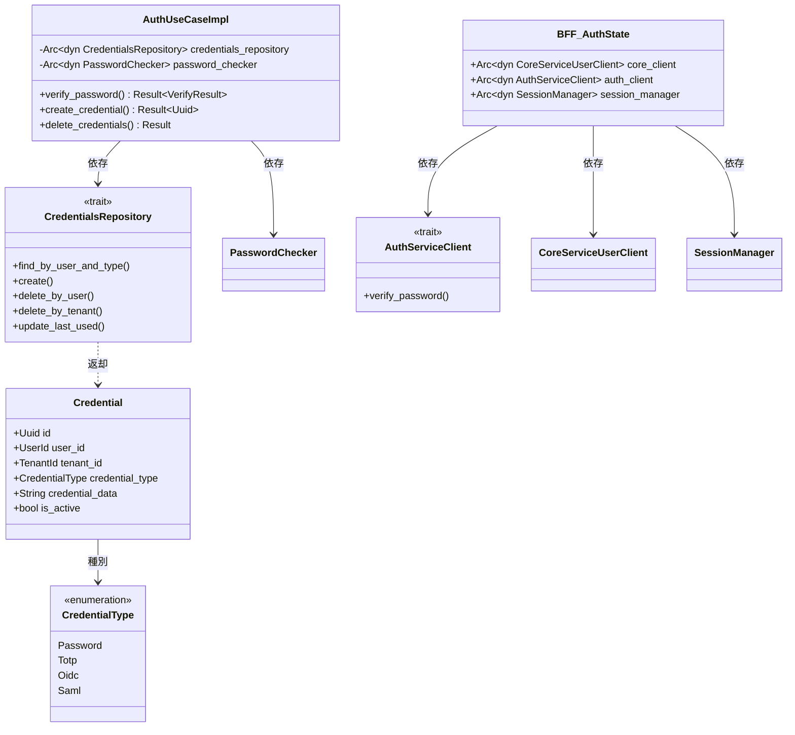
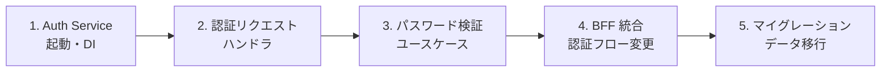
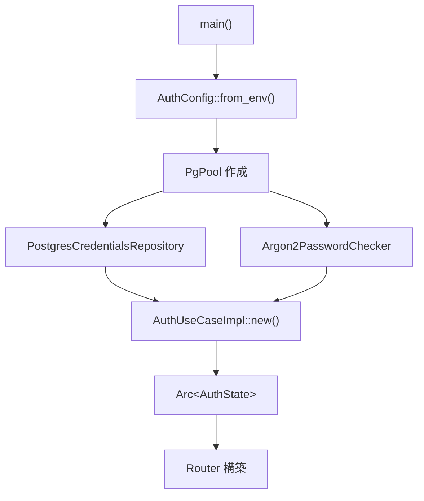
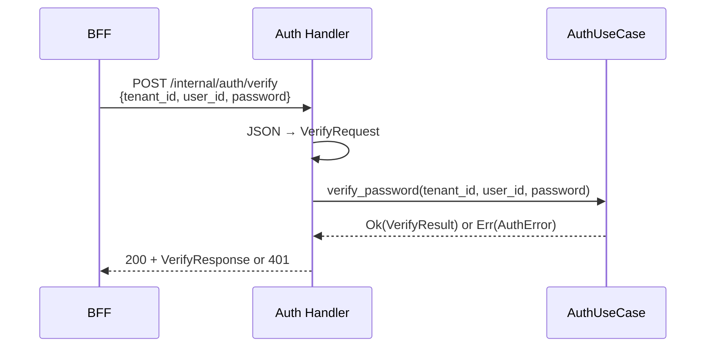
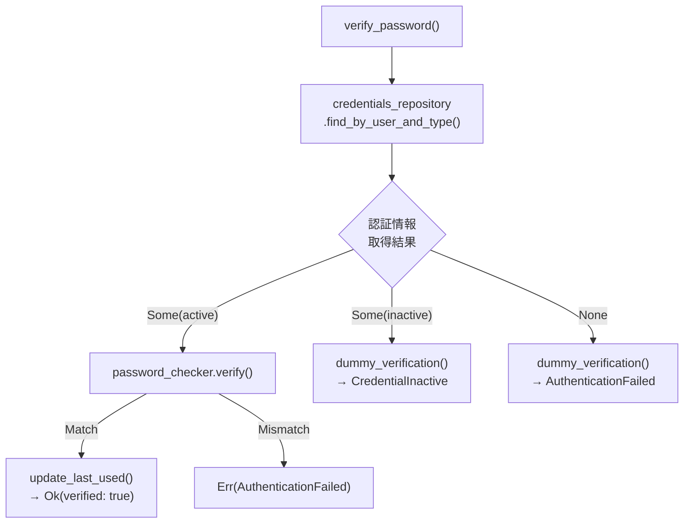
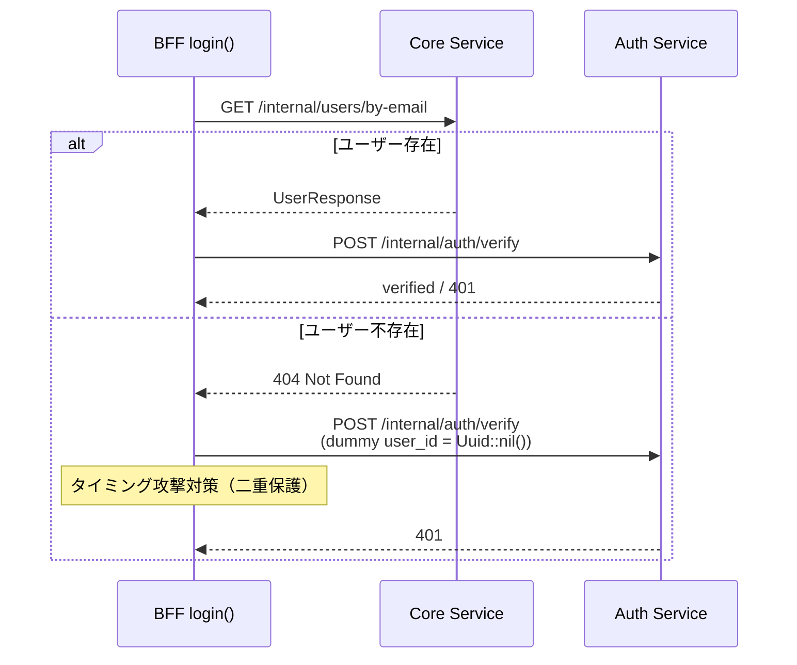
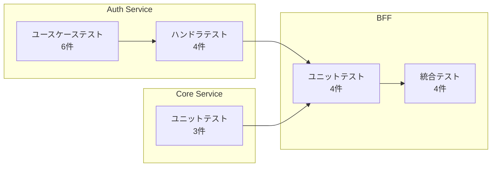

# Auth Service 分離 - コード解説

対応 PR: #93, #97
対応 Issue: #80

## 主要な型・関数

| 型/関数 | ファイル | 責務 |
|--------|---------|------|
| `Credential` | [`infra/src/repository.rs:20`](../../../backend/crates/infra/src/repository.rs)（re-export） | 認証情報エンティティ |
| `CredentialType` | [`infra/src/repository.rs:21`](../../../backend/crates/infra/src/repository.rs)（re-export） | 認証手段の種別（Password, Totp, Oidc, Saml） |
| `CredentialsRepository` | [`infra/src/repository.rs:22`](../../../backend/crates/infra/src/repository.rs)（re-export） | 認証情報 CRUD トレイト |
| `AuthUseCase` | [`auth-service/src/usecase.rs:24`](../../../backend/apps/auth-service/src/usecase.rs) | 認証ユースケーストレイト |
| `AuthUseCaseImpl` | [`auth-service/src/usecase/auth.rs:31`](../../../backend/apps/auth-service/src/usecase/auth.rs) | ユースケース実装 |
| `VerifyResult` | [`auth-service/src/usecase/auth.rs:25`](../../../backend/apps/auth-service/src/usecase/auth.rs) | 検証結果（verified, credential_id） |
| `verify_password()` | [`auth-service/src/usecase/auth.rs:54`](../../../backend/apps/auth-service/src/usecase/auth.rs) | パスワード検証 + タイミング攻撃対策 |
| `dummy_verification()` | [`auth-service/src/usecase/auth.rs:144`](../../../backend/apps/auth-service/src/usecase/auth.rs) | ダミー Argon2id 検証 |
| `AuthError` | [`auth-service/src/error.rs:15`](../../../backend/apps/auth-service/src/error.rs) | エラー型（AuthenticationFailed, CredentialInactive 等） |
| `AuthState`（Auth Service） | [`auth-service/src/handler/auth.rs:27`](../../../backend/apps/auth-service/src/handler/auth.rs) | Auth Service ハンドラの共有状態 |
| `verify()` | [`auth-service/src/handler/auth.rs:73`](../../../backend/apps/auth-service/src/handler/auth.rs) | パスワード検証ハンドラ |
| `create_credentials()` | [`auth-service/src/handler/auth.rs:91`](../../../backend/apps/auth-service/src/handler/auth.rs) | 認証情報作成ハンドラ |
| `delete_credentials()` | [`auth-service/src/handler/auth.rs:114`](../../../backend/apps/auth-service/src/handler/auth.rs) | 認証情報削除ハンドラ |
| `AuthServiceClient` | [`bff/client/auth_service.rs:67`](../../../backend/apps/bff/src/client/auth_service.rs) | BFF → Auth Service クライアントトレイト |
| `AuthServiceError` | [`bff/client/auth_service.rs:18`](../../../backend/apps/bff/src/client/auth_service.rs) | クライアントエラー型 |
| `AuthState`（BFF） | [`bff/handler/auth.rs:52`](../../../backend/apps/bff/src/handler/auth.rs) | BFF ハンドラの共有状態（3つの依存） |

### 型の関係



## コードフロー

コードをライフサイクル順に追う。Auth Service の起動から認証リクエストの処理まで。



### 1. Auth Service 起動と DI（サーバー起動時）

Auth Service のエントリポイントで依存コンポーネントを初期化し、ルーターを構築する。



```rust
// auth-service/src/main.rs:107-125
let credentials_repo: Arc<dyn CredentialsRepository> =
    Arc::new(PostgresCredentialsRepository::new(pool));         // ① DB リポジトリ
let password_checker: Arc<dyn PasswordChecker> =
    Arc::new(Argon2PasswordChecker::new());                     // ② Argon2id チェッカー

let usecase = AuthUseCaseImpl::new(credentials_repo, password_checker);
let state = Arc::new(AuthState {
    usecase: Arc::new(usecase) as Arc<dyn AuthUseCase>,         // ③ トレイトオブジェクト化
});

let app = Router::new()
    .route("/health", get(health_check))
    .route("/internal/auth/verify", post(verify))               // ④ 内部 API ルート
    .route("/internal/auth/credentials", post(create_credentials))
    .route("/internal/auth/credentials/{tenant_id}/{user_id}",
           delete(delete_credentials))
    .with_state(state);
```

注目ポイント:

- ① ② 具体型をトレイトオブジェクト（`Arc<dyn Trait>`）に変換し、ハンドラは抽象に依存する
- ③ `AuthUseCase` トレイトを経由することで、ハンドラテストでスタブを注入可能
- ④ `/internal/` プレフィックスは内部ネットワーク限定の API であることを示す

### 2. 認証ハンドラ（リクエスト受信時）

Auth Service のハンドラがリクエストを受信し、ドメイン型に変換してユースケースに委任する。



```rust
// auth-service/src/handler/auth.rs:73-86
pub async fn verify(
    State(state): State<Arc<AuthState>>,
    Json(req): Json<VerifyRequest>,
) -> Result<impl IntoResponse, AuthError> {
    let result = state
        .usecase
        .verify_password(req.tenant_id, req.user_id, &req.password)  // ① ユースケースに委任
        .await?;

    Ok(Json(VerifyResponse {
        verified: result.verified,
        credential_id: result.credential_id,
    }))
}
```

注目ポイント:

- ① ハンドラは HTTP 関心事のみを担い、ビジネスロジックはユースケースに完全に委任
- `AuthError` が `IntoResponse` を実装しており、エラー時の HTTP レスポンス変換はエラー型自身が行う（RFC 9457 準拠）

### 3. パスワード検証ユースケース（ビジネスロジック）

ユースケースが認証情報の取得、パスワード検証、タイミング攻撃対策を実行する。



```rust
// auth-service/src/usecase/auth.rs:54-102
pub async fn verify_password(
    &self,
    tenant_id: Uuid,
    user_id: Uuid,
    password: &str,
) -> Result<VerifyResult, AuthError> {
    let tenant_id = TenantId::from_uuid(tenant_id);
    let user_id = UserId::from_uuid(user_id);
    let plain_password = PlainPassword::new(password);            // ① ドメイン型に変換

    let credential = self
        .credentials_repository
        .find_by_user_and_type(
            &tenant_id, &user_id, CredentialType::Password,      // ② テナント分離
        )
        .await
        .map_err(AuthError::Database)?;

    match credential {
        Some(cred) if cred.is_active => {
            let hash = PasswordHash::new(&cred.credential_data);
            let result = self.password_checker
                .verify(&plain_password, &hash)                   // ③ Argon2id 検証
                .map_err(|e| AuthError::Internal(e.to_string()))?;

            if result.is_match() {
                // last_used_at を更新
                let _ = self.credentials_repository
                    .update_last_used(cred.id).await;
                Ok(VerifyResult { verified: true, credential_id: Some(cred.id) })
            } else {
                Err(AuthError::AuthenticationFailed)
            }
        }
        Some(_) => {
            self.dummy_verification(&plain_password);             // ④ Inactive でもダミー検証
            Err(AuthError::CredentialInactive)
        }
        None => {
            self.dummy_verification(&plain_password);             // ⑤ 不存在でもダミー検証
            Err(AuthError::AuthenticationFailed)
        }
    }
}
```

注目ポイント:

- ① プリミティブ型（`Uuid`, `&str`）をドメイン型（`TenantId`, `UserId`, `PlainPassword`）に変換して型安全性を確保
- ② `tenant_id` を必須パラメータとし、テナント分離を型レベルで強制。PR #97 のレビューで `tenant_id` フィルタ漏れが指摘され修正された経緯がある
- ③ `PasswordChecker` トレイトを経由し、テスト時にスタブ実装を注入可能
- ④ ⑤ タイミング攻撃対策: 認証情報が見つからない/無効でも Argon2id のダミー検証を実行し、処理時間を均一化

### 4. BFF 統合（認証フローの変更）

BFF のログインハンドラが 2 ステップ（ユーザー検索 + パスワード検証）に分離された。



```rust
// bff/handler/auth.rs（login 関数内、ユーザー不存在時の分岐）
Err(CoreServiceError::UserNotFound) => {
    // タイミング攻撃対策: ダミーの user_id で Auth Service に検証を送信
    let dummy_user_id = Uuid::nil();                              // ① ゼロ UUID
    let _ = state
        .auth_client
        .verify_password(tenant_id, dummy_user_id, &req.password) // ② 必ず失敗する
        .await;
    authentication_failed_response()                               // ③ 統一エラー
}
```

注目ポイント:

- ① `Uuid::nil()` は全ビットゼロの UUID で、実在するユーザーと一致することはない
- ② Auth Service はこの user_id の認証情報を見つけられず、ダミー検証を実行して 401 を返す
- ③ 結果として、ユーザー存在・不存在にかかわらず同等の処理時間で同じエラーが返る

### 5. マイグレーション（データ移行）

Phase 1 で `auth` スキーマと `credentials` テーブルを作成し、既存パスワードを移行する。

#### auth スキーマと credentials テーブル

```sql
-- 20260122000001_create_auth_credentials.sql
CREATE SCHEMA IF NOT EXISTS auth;

CREATE TABLE auth.credentials (
    id              UUID PRIMARY KEY DEFAULT gen_random_uuid(),
    user_id         UUID NOT NULL,
    tenant_id       UUID NOT NULL,
    credential_type VARCHAR(20) NOT NULL
        CHECK (credential_type IN ('password', 'totp', 'oidc', 'saml')),
    credential_data TEXT NOT NULL,
    is_active       BOOLEAN NOT NULL DEFAULT true,
    last_used_at    TIMESTAMPTZ,
    created_at      TIMESTAMPTZ NOT NULL DEFAULT NOW(),
    updated_at      TIMESTAMPTZ NOT NULL DEFAULT NOW(),
    UNIQUE (user_id, credential_type)
);
```

#### パスワードデータ移行

```sql
-- 20260122000002_migrate_password_to_credentials.sql
INSERT INTO auth.credentials (user_id, tenant_id, credential_type, credential_data)
SELECT id, tenant_id, 'password', password_hash
FROM users
WHERE password_hash IS NOT NULL;
```

#### レガシーカラム削除（Phase 4）

```sql
-- 20260122000003_drop_users_password_hash.sql
ALTER TABLE users DROP COLUMN password_hash;
```

## テスト

各テストがライフサイクルのどのステップを検証しているかを示す。



| テスト | 検証対象 | 検証内容 |
|-------|---------|---------|
| `test_verify_password_成功` | Auth UseCase | 正しい認証情報で verified: true |
| `test_verify_password_パスワード不一致` | Auth UseCase | 不正パスワードで AuthenticationFailed |
| `test_verify_password_認証情報なし` | Auth UseCase | ダミー検証後に AuthenticationFailed |
| `test_verify_password_無効な認証情報` | Auth UseCase | Inactive で CredentialInactive |
| `test_create_credential_成功` | Auth UseCase | 認証情報の新規作成 |
| `test_create_credential_不正な種別` | Auth UseCase | 不正な CredentialType で Internal |
| `test_verify_認証成功` | Auth Handler | 200 OK + verified: true |
| `test_verify_認証失敗` | Auth Handler | 401 Unauthorized |
| `test_create_credentials_成功` | Auth Handler | 201 Created |
| `test_delete_credentials_成功` | Auth Handler | 204 No Content |
| `test_login_成功` | BFF Handler | Cookie 設定 + ユーザー情報 |
| `test_login_パスワード不一致` | BFF Handler | 401（Auth Service 失敗時） |
| `test_login_ユーザー不存在` | BFF Handler | 401（ダミー検証経由） |
| `test_login_非アクティブユーザー` | BFF Handler | 401 |
| `test_ログインからログアウトまで` | BFF 統合 | E2E フロー（実 Redis + スタブ） |
| `test_get_user_by_email_正常系` | Core Handler | ユーザー検索の正常系 |
| `test_get_user_by_email_不存在` | Core Handler | 404 Not Found |
| `test_get_user_by_email_不正メール` | Core Handler | 400 Bad Request |

### 実行方法

```bash
# Auth Service テスト
cd backend && cargo test --package auth-service

# BFF テスト（統合テストは Redis 接続必要）
cd backend && cargo test --package bff
just test-rust-integration

# 全テスト
just check-all
```

## 依存関係

| クレート/パッケージ | バージョン | 追加理由 |
|-------------------|-----------|---------|
| `ringiflow-auth-service` | — | Auth Service アプリケーション（新規） |
| `reqwest` | — | BFF → Auth Service HTTP クライアント（BFF に追加） |

## 設計解説

コード実装レベルの判断を記載する。機能・仕組みレベルの判断は[機能解説](./01_機能解説.md#設計判断)を参照。

### 1. AuthUseCase トレイトとトレイトオブジェクトの組み合わせ

場所: `auth-service/src/usecase.rs:24`, `auth-service/src/handler/auth.rs:27`

```rust
// トレイト定義
pub trait AuthUseCase: Send + Sync {
    async fn verify_password(...) -> Result<VerifyResult, AuthError>;
    async fn create_credential(...) -> Result<Uuid, AuthError>;
    async fn delete_credentials(...) -> Result<(), AuthError>;
}

// ハンドラの State
pub struct AuthState {
    pub usecase: Arc<dyn AuthUseCase>,  // トレイトオブジェクト
}
```

なぜこの実装か:

`AuthUseCaseImpl` は `CredentialsRepository` と `PasswordChecker` に依存するが、ハンドラから見ると `AuthUseCase` トレイトのみに依存する。これによりハンドラのテストではスタブ `AuthUseCase` を注入できる。ユースケースの内部依存をハンドラに漏洩させない設計。

代替案:

| 案 | テスタビリティ | 型パラメータ伝播 | 判断 |
|----|-------------|----------------|------|
| **トレイトオブジェクト（採用）** | 高（スタブ注入容易） | なし | 採用 |
| ジェネリクス `AuthState<U: AuthUseCase>` | 高 | ハンドラ関数に伝播 | 見送り |
| 直接 `AuthUseCaseImpl` を渡す | 低（内部依存のスタブも必要） | なし | 見送り |

### 2. CredentialType の FromStr 実装

場所: `infra/src/repository/credentials_repository.rs`（re-export: `infra/src/repository.rs:21`）

```rust
pub enum CredentialType {
    Password,
    Totp,
    Oidc,
    Saml,
}

impl std::str::FromStr for CredentialType {
    // "password" → Password, "totp" → Totp, ...
}
```

なぜこの実装か:

`FromStr` は Rust 標準トレイトで、`.parse()` メソッドを自動的に利用可能にする。独自の `from_string()` メソッドを定義するよりも、Rust のエコシステム（`serde` のデシリアライザ等）との統合がスムーズ。

### 3. BFF AuthState の3依存構成

場所: `bff/handler/auth.rs:52`

```rust
pub struct AuthState {
    pub core_client: Arc<dyn CoreServiceUserClient>,
    pub auth_client: Arc<dyn AuthServiceClient>,
    pub session_manager: Arc<dyn SessionManager>,
}
```

なぜこの実装か:

PR #46 時点では `AuthState` は2つの依存（`CoreApiClient`, `SessionManager`）だったが、Auth Service 分離により3つに拡張された。各依存がトレイトで抽象化されているため、テスト時にスタブを選択的に注入できる。

代替案:

| 案 | 柔軟性 | テスタビリティ | 判断 |
|----|-------|-------------|------|
| **3 トレイトオブジェクト（採用）** | 高 | 各依存を個別にスタブ化可能 | 採用 |
| 単一の `AuthProvider` トレイトに統合 | 低 | スタブが複雑化 | 見送り |

### 4. エラー型の IntoResponse 実装

場所: `auth-service/src/error.rs:15-71`

```rust
pub enum AuthError {
    AuthenticationFailed,
    CredentialInactive,
    Database(InfraError),
    Internal(String),
}

impl IntoResponse for AuthError {
    fn into_response(self) -> Response {
        let (status, error_type, detail) = match &self {
            Self::AuthenticationFailed => (
                StatusCode::UNAUTHORIZED,
                "authentication-failed",
                "認証に失敗しました",
            ),
            // ...
        };
        // RFC 9457 Problem Details 形式で返却
    }
}
```

なぜこの実装か:

axum の `IntoResponse` トレイトを `AuthError` 自身に実装することで、ハンドラは `Result<_, AuthError>` を返すだけでよく、エラー変換の責務がエラー型に集約される。ハンドラ関数にマッチ式を書く必要がない。

## 関連ドキュメント

- [機能解説](./01_機能解説.md)
- [ADR: AuthService 分離の方針](../../05_ADR/017_AuthService分離の方針.md)
- [詳細設計書: AuthService 設計](../../03_詳細設計書/08_AuthService設計.md)
- [認証機能 - コード解説](../01_認証機能/02_コード解説.md)
