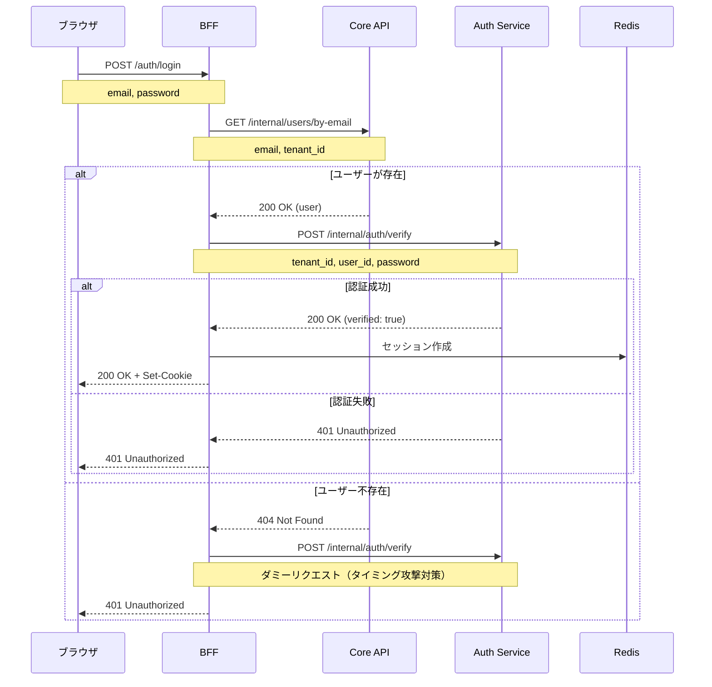

# Phase 3: BFF 統合・Core API 整理

## 概要

BFF の認証フローを Auth Service 経由に変更し、Core API から認証関連のコードを削除する。これにより認証ドメインが Auth Service に集約される。

### 対応 Issue

[#80 Auth Service を分離する](https://github.com/ka2kama/ringiflow/issues/80)

## 設計書との対応

- [08_AuthService設計.md - 認証フロー](../../03_詳細設計書/08_AuthService設計.md#認証フロー)
- [08_AuthService設計.md - BFF 変更](../../03_詳細設計書/08_AuthService設計.md#bff-変更)

## 実装したコンポーネント

### BFF (`backend/apps/bff`)

| ファイル | 変更内容 |
|---------|---------|
| [`client/auth_service.rs`](../../../backend/apps/bff/src/client/auth_service.rs) | Auth Service クライアント（新規作成） |
| [`client/core_api.rs`](../../../backend/apps/bff/src/client/core_api.rs) | `verify_credentials` を `get_user_by_email` に変更 |
| [`client.rs`](../../../backend/apps/bff/src/client.rs) | Auth Service クライアントのエクスポート追加 |
| [`handler/auth.rs`](../../../backend/apps/bff/src/handler/auth.rs) | 認証フローを Auth Service 経由に変更 |
| [`config.rs`](../../../backend/apps/bff/src/config.rs) | `auth_service_url` 追加 |
| [`main.rs`](../../../backend/apps/bff/src/main.rs) | Auth Service クライアント初期化追加 |

### Core API (`backend/apps/core-api`)

| ファイル | 変更内容 |
|---------|---------|
| [`handler/auth.rs`](../../../backend/apps/core-api/src/handler/auth.rs) | `POST /internal/auth/verify` を削除、`GET /internal/users/by-email` を追加 |
| [`main.rs`](../../../backend/apps/core-api/src/main.rs) | ルーティング変更、`AuthUseCase` 削除 |
| `usecase/auth.rs` | 削除 |
| `usecase.rs` | 削除 |

## 実装内容

### 新しい認証フロー



### 変更前後の比較

| 項目 | 変更前 | 変更後 |
|-----|--------|--------|
| 認証エンドポイント | Core API `/internal/auth/verify` | Auth Service `/internal/auth/verify` |
| ユーザー検索 | `verify_credentials` 内で実行 | `GET /internal/users/by-email` |
| パスワード検証 | Core API 内で実行 | Auth Service で実行 |
| 責務 | Core API が認証も担当 | 認証は Auth Service に集約 |

### 主要な型の変更

#### AuthState（BFF）

```rust
// 変更前: 2つの型パラメータ
pub struct AuthState<C, S>
where
    C: CoreApiClient,
    S: SessionManager,
{
    pub core_api_client: C,
    pub session_manager: S,
}

// 変更後: 3つの型パラメータ
pub struct AuthState<C, A, S>
where
    C: CoreApiClient,
    A: AuthServiceClient,
    S: SessionManager,
{
    pub core_api_client:     C,
    pub auth_service_client: A,
    pub session_manager:     S,
}
```

#### CoreApiClient トレイト

```rust
// 変更前
#[async_trait]
pub trait CoreApiClient: Send + Sync {
    async fn verify_credentials(
        &self,
        tenant_id: Uuid,
        email: &str,
        password: &str,
    ) -> Result<VerifyResponse, CoreApiError>;

    async fn get_user(&self, user_id: Uuid) -> Result<UserWithPermissionsResponse, CoreApiError>;
}

// 変更後
#[async_trait]
pub trait CoreApiClient: Send + Sync {
    async fn get_user_by_email(
        &self,
        tenant_id: Uuid,
        email: &str,
    ) -> Result<GetUserByEmailResponse, CoreApiError>;

    async fn get_user(&self, user_id: Uuid) -> Result<UserWithPermissionsResponse, CoreApiError>;
}
```

#### 新規: AuthServiceClient トレイト

```rust
#[async_trait]
pub trait AuthServiceClient: Send + Sync {
    async fn verify_password(
        &self,
        tenant_id: Uuid,
        user_id: Uuid,
        password: &str,
    ) -> Result<VerifyResponse, AuthServiceError>;
}
```

### Core API の変更

#### 削除したエンドポイント

| メソッド | パス | 理由 |
|---------|------|------|
| POST | `/internal/auth/verify` | Auth Service に移行 |

#### 追加したエンドポイント

| メソッド | パス | 説明 |
|---------|------|------|
| GET | `/internal/users/by-email` | メールアドレスでユーザーを検索 |

## テスト

### BFF ユニットテスト

```bash
cargo test --package ringiflow-bff --lib
```

| テストケース | 内容 |
|-------------|------|
| `test_login_成功時にセッションcookieが設定される` | Cookie 設定確認 |
| `test_login_成功時にユーザー情報が返る` | レスポンス確認 |
| `test_login_パスワード不一致で401` | Auth Service 失敗時 |
| `test_login_ユーザー不存在で401` | Core API 404 時 |

### BFF 統合テスト

```bash
just dev-deps
cargo test --package ringiflow-bff --test auth_integration_test
```

| テストケース | 内容 |
|-------------|------|
| `test_ログインからログアウトまでの一連フロー` | E2E フロー |
| `test_不正なパスワードでログインできない` | Auth Service 認証失敗 |
| `test_存在しないメールでログインできない` | Core API 404 |
| `test_非アクティブユーザーはログインできない` | Auth Service 認証失敗 |

### Core API ユニットテスト

```bash
cargo test --package ringiflow-core-api
```

| テストケース | 内容 |
|-------------|------|
| `test_get_user_by_email_ユーザーが見つかる` | 正常系 |
| `test_get_user_by_email_ユーザーが見つからない` | 404 |
| `test_get_user_by_email_不正なメールアドレス` | 400 |

---

## 設計解説

### 1. タイミング攻撃対策（BFF レベル）

**場所**: [`handler/auth.rs:297-306`](../../../backend/apps/bff/src/handler/auth.rs)

**コード例**:

```rust
Err(CoreApiError::UserNotFound) => {
    // タイミング攻撃対策: ユーザーが存在しない場合もダミー検証を実行
    // Auth Service にダミーの user_id を送信して処理時間を均一化
    let dummy_user_id = Uuid::nil();
    let _ = state
        .auth_service_client
        .verify_password(tenant_id, dummy_user_id, &req.password)
        .await;

    authentication_failed_response()
}
```

**なぜこの設計か**:

ユーザーが存在しない場合、すぐに 401 を返すと処理時間が短くなり、攻撃者がユーザーの存在を推測できる。BFF レベルでもダミーリクエストを送信することで、Auth Service 側のタイミング攻撃対策と合わせて二重の保護を実現。

**代替案**:

| 方式 | メリット | デメリット |
|------|---------|-----------|
| BFF でダミー検証なし | 実装が簡単 | タイミング攻撃に脆弱 |
| **BFF でもダミー検証（採用）** | 二重保護 | 不要な API 呼び出し |
| 固定 sleep | 実装が簡単 | 統計的に検出可能 |

### 2. 責務の分離

**場所**: [`handler/auth.rs:215-313`](../../../backend/apps/bff/src/handler/auth.rs)

**なぜこの設計か**:

認証フローを 2 つの独立したステップに分離:

1. **ユーザー検索**（Core API）: メールアドレスからユーザーを特定
2. **パスワード検証**（Auth Service）: ユーザー ID でパスワードを検証

これにより:

- Core API は「ユーザー情報管理」に専念
- Auth Service は「認証」に専念
- 将来の SSO/MFA 対応時も Auth Service のみ変更

**フロー図**:

```
BFF
 ├── Core API: "このメールアドレスのユーザーは誰？"
 └── Auth Service: "このユーザー ID とパスワードは正しい？"
```

### 3. トレイトベースの依存性注入

**場所**: [`handler/auth.rs:72-81`](../../../backend/apps/bff/src/handler/auth.rs)

**コード例**:

```rust
pub struct AuthState<C, A, S>
where
    C: CoreApiClient,
    A: AuthServiceClient,
    S: SessionManager,
{
    pub core_api_client:     C,
    pub auth_service_client: A,
    pub session_manager:     S,
}
```

**なぜこの設計か**:

3 つの外部依存をトレイトで抽象化することで:

1. **テスタビリティ**: 各コンポーネントをスタブに置き換えてテスト可能
2. **疎結合**: 実装の詳細から分離
3. **型安全**: コンパイル時に依存関係を検証

**テストでの使用例**:

```rust
fn create_test_app(
    core_client: StubCoreApiClient,
    auth_client: StubAuthServiceClient,
    session_manager: StubSessionManager,
) -> Router {
    let state = Arc::new(AuthState {
        core_api_client: core_client,
        auth_service_client: auth_client,
        session_manager,
    });
    // ...
}
```

### 4. Core API エンドポイントの再設計

**場所**: [`handler/auth.rs:116-192`](../../../backend/apps/core-api/src/handler/auth.rs)

**変更前**:

```rust
// POST /internal/auth/verify
// パスワード検証を含む認証エンドポイント
async fn verify_credentials(
    tenant_id: Uuid,
    email: &str,
    password: &str,
) -> Result<VerifyResponse, CoreApiError>
```

**変更後**:

```rust
// GET /internal/users/by-email?email=xxx&tenant_id=yyy
// 純粋なユーザー検索エンドポイント
async fn get_user_by_email<R>(
    State(state): State<Arc<UserState<R>>>,
    Query(query): Query<GetUserByEmailQuery>,
) -> impl IntoResponse
```

**なぜこの設計か**:

1. **単一責任**: Core API はユーザー情報の管理のみ
2. **RESTful**: GET はリソースの取得、パスワードは送信しない
3. **セキュリティ**: パスワードが Core API を経由しなくなる

**エンドポイント設計**:

| 設計 | エンドポイント | メリット | デメリット |
|------|--------------|---------|-----------|
| 変更前 | `POST /internal/auth/verify` | 1 回の呼び出し | Core API がパスワードを扱う |
| **変更後** | `GET /internal/users/by-email` | 責務が明確 | 2 回の呼び出しが必要 |

## 関連ドキュメント

- 設計書: [08_AuthService設計.md](../../03_詳細設計書/08_AuthService設計.md)
- 技術ノート: [パスワードハッシュ.md](../../06_技術ノート/パスワードハッシュ.md)
- ADR: [017_AuthService分離の方針.md](../../05_ADR/017_AuthService分離の方針.md)
