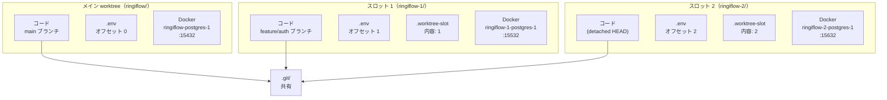
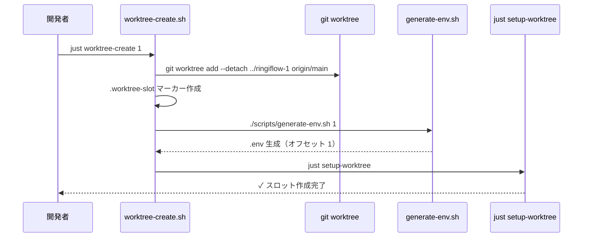
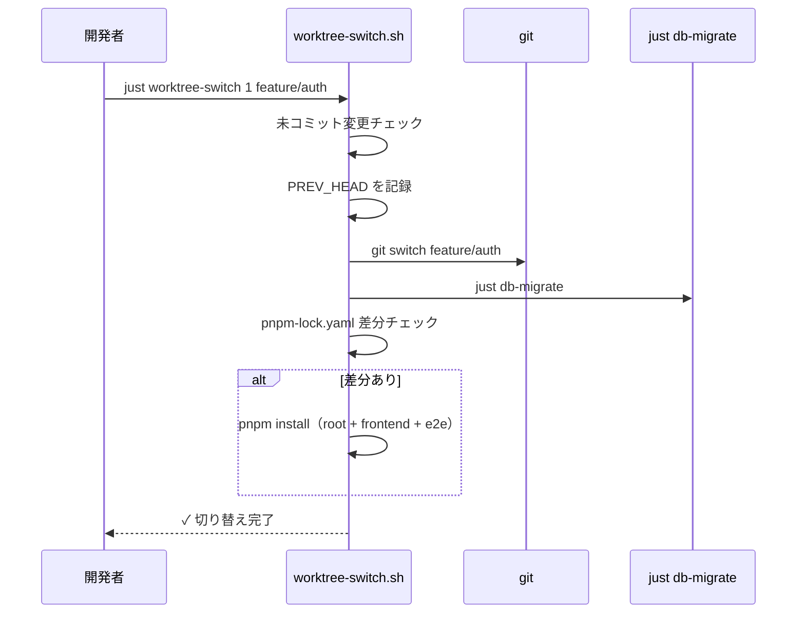
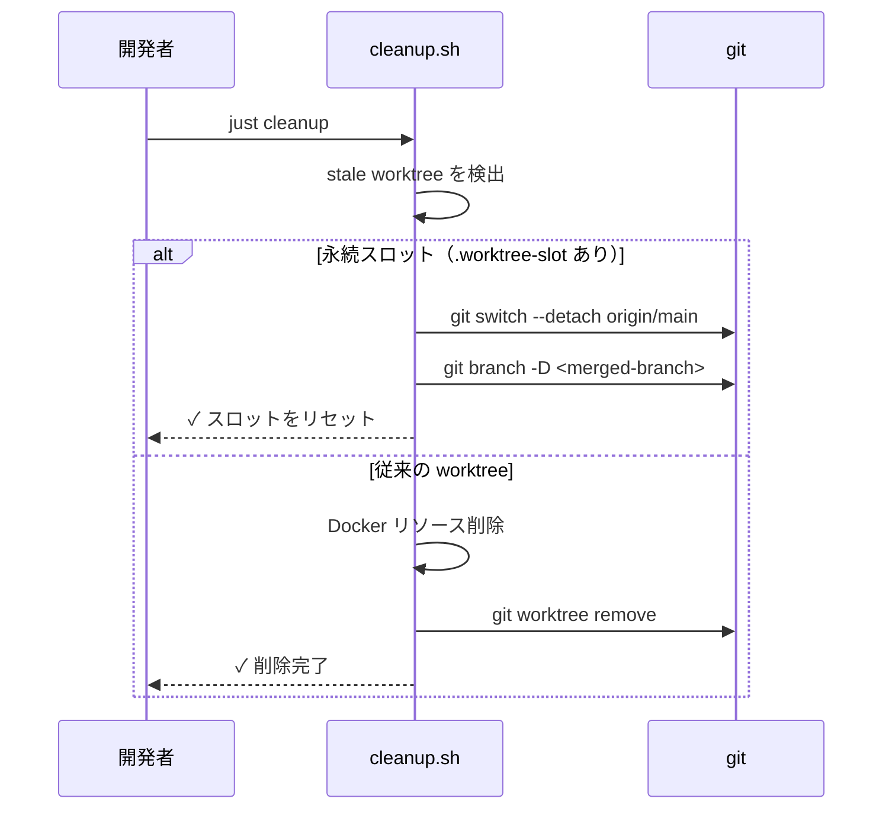

# 並行開発環境 - 機能解説

対応 PR: #96, #639

## 概要

git worktree と Docker Compose プロジェクト名を組み合わせた永続スロット方式の並行開発環境。固定の worktree スロットを 2〜3 個維持し、Issue 着手時はスロット内でブランチを切り替える。ポートオフセットはスロット番号と一致する決定的マッピング。

## 背景

### 並行作業の必要性

複数の Claude Code セッションを同時に動かしたり、機能開発中にホットフィックスが必要になる場面が増えていた。通常のブランチ切り替えでは作業が中断され、Docker コンテナやデータベースが共有されているためポートやデータが競合する問題があった。

### 永続スロット方式への移行

当初は Issue ごとに worktree を生成・破棄するモデルを採用していたが、セットアップコスト（`pnpm install`、初回ビルド、DB マイグレーション）が毎回発生する問題があった。永続スロット方式では `node_modules/`、`target/`、Docker ボリュームが永続化され、ブランチ切り替えのみで作業を開始できる。

### 分離すべき 3 つのレイヤー

コードだけを分けても意味がない。ローカル実行環境（DB、Redis）とアプリケーションサーバーも含めた完全分離が必要。

| レイヤー | 方式 | 分離されるもの |
|---------|------|---------------|
| コード | git worktree | 作業ディレクトリ、ブランチ |
| 環境変数 | `.env` 自動生成 | ポート番号 |
| コンテナ | Docker Compose `-p` | コンテナ名、ボリューム、ネットワーク |

## 用語・概念

| 用語 | 説明 | 関連コード |
|------|------|-----------:|
| 永続スロット | 固定の worktree ディレクトリ。削除せずに再利用する | `scripts/worktree-create.sh` |
| `.worktree-slot` | スロットを識別するマーカーファイル。内容はスロット番号 | `cleanup.sh` で参照 |
| ポートオフセット | スロット番号と一致する決定的マッピング（100 単位） | `scripts/generate-env.sh` |
| detached HEAD | ブランチに紐づかない状態。スロット作成時の初期状態 | `git worktree add --detach` |

## アーキテクチャ

### ポートオフセット表

| オフセット | PostgreSQL | Redis | BFF | Core Service | Vite |
|-----------|------------|-------|-----|-------------|------|
| 0（main） | 15432 | 16379 | 13000 | 13001 | 15173 |
| 1 | 15532 | 16479 | 13100 | 13101 | 15273 |
| 2 | 15632 | 16579 | 13200 | 13201 | 15373 |
| ... | +100 | +100 | +100 | +100 | +100 |

## データフロー

### フロー 1: スロット作成（`just worktree-create 1`）

### フロー 2: ブランチ切り替え（`just worktree-switch 1 feature/auth`）

### フロー 3: クリーンアップ（`just cleanup`）

## 設計判断

機能・仕組みレベルの判断を記載する。コード実装レベルの判断は[コード解説](./02_並行開発環境_コード解説.md#設計解説)を参照。

### 1. 永続スロット方式 vs Issue ごとの生成・破棄

| 案 | セットアップコスト | ディスク使用量 | ワークフロー |
|----|------------------|---------------|------------|
| **永続スロット（採用）** | 初回のみ | 常時使用 | シンプル（ブランチ切替のみ） |
| Issue ごとの生成・破棄 | 毎回 | 使用時のみ | 複雑（生成→作業→破棄） |

**採用理由**: セットアップコスト（`pnpm install`、cargo build、DB マイグレーション）の繰り返しを排除する。ディスク使用量の常時発生はトレードオフとして許容。

### 2. ポートオフセット: スロット番号との決定的マッピング vs 自動検出

| 案 | 予測可能性 | 柔軟性 |
|----|----------|--------|
| **決定的マッピング（採用）** | 高い（slot N = offset N） | 低い |
| 自動検出 | 低い（空き番号次第） | 高い |

**採用理由**: 永続スロットではオフセットが変わらないため、決定的マッピングの方がシンプルで予測可能。

### 3. スロット初期状態: detached HEAD vs 一時ブランチ

| 案 | 明確さ | 管理コスト |
|----|--------|----------|
| **detached HEAD（採用）** | 高い（未割当状態が明確） | なし |
| 一時ブランチ（slot/N） | 中 | ブランチ管理が必要 |

**採用理由**: detached HEAD は「ブランチが割り当てられていない」ことを明確に表現する。一時ブランチは不要な管理コストが発生する。

### 4. 環境分離方式: git worktree + Docker Compose vs 他の方式

→ [ADR-021](../../05_ADR/021_並行開発環境の構成.md) を参照

### 5. container_name の削除

→ [ADR-021](../../05_ADR/021_並行開発環境の構成.md) の「帰結」を参照

## 関連ドキュメント

- [コード解説](./02_並行開発環境_コード解説.md)
- ADR: [021_並行開発環境の構成](../../05_ADR/021_並行開発環境の構成.md)
- ナレッジベース: [git_worktree](../../06_ナレッジベース/devtools/git_worktree.md)
- 手順書: [並行開発（Worktree）](../../04_手順書/04_開発フロー/04_並行開発（Worktree）.md)
