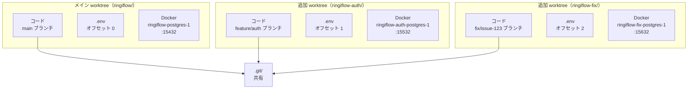
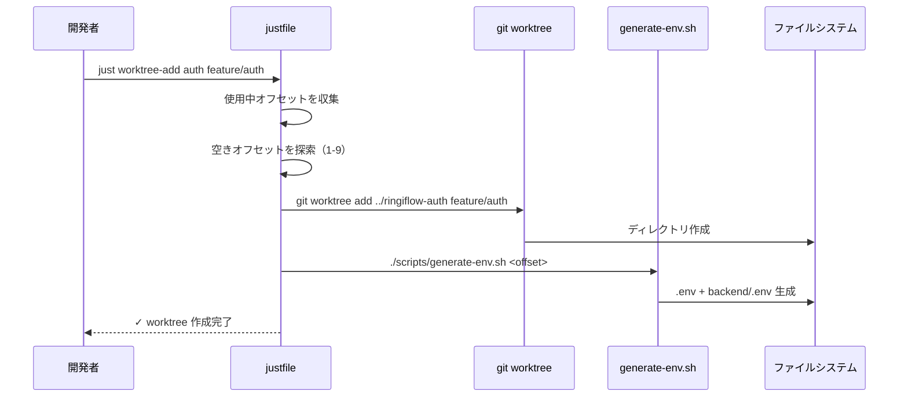
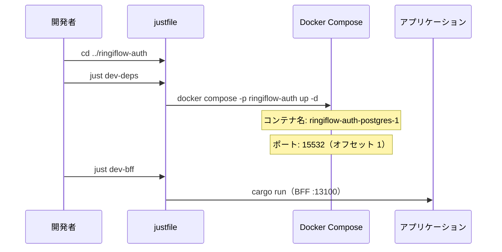

# 並行開発環境 - 機能解説

対応 PR: #96

## 概要

git worktree と Docker Compose プロジェクト名を組み合わせた並行開発環境を構築した。1 つのリポジトリから複数の独立した作業ディレクトリを作成し、各ディレクトリで独自の Docker コンテナ・ボリューム・ポートを持たせることで、複数タスクの完全並行開発を実現する。ポートオフセットは自動で空き番号が割り当てられる。

## 背景

### 並行作業の必要性

複数の Claude Code セッションを同時に動かしたり、機能開発中にホットフィックスが必要になる場面が増えていた。通常のブランチ切り替えでは作業が中断され、Docker コンテナやデータベースが共有されているためポートやデータが競合する問題があった。

### 分離すべき 3 つのレイヤー

コードだけを分けても意味がない。ローカル実行環境（DB、Redis）とアプリケーションサーバーも含めた完全分離が必要。

| レイヤー | 方式 | 分離されるもの |
|---------|------|---------------|
| コード | git worktree | 作業ディレクトリ、ブランチ |
| 環境変数 | `.env` 自動生成 | ポート番号 |
| コンテナ | Docker Compose `-p` | コンテナ名、ボリューム、ネットワーク |

## 用語・概念

| 用語 | 説明 | 関連コード |
|------|------|-----------:|
| git worktree | Git 公式機能。1 つのリポジトリから複数の作業ディレクトリを作成する。`.git` は共有 | `git worktree add` |
| Docker Compose プロジェクト名 | `-p` オプションで指定。コンテナ名・ボリューム名・ネットワーク名のプレフィックスになる | `docker compose -p NAME` |
| ポートオフセット | 各 worktree に割り当てられるポート加算値（100 単位）。0 がメイン、1〜9 が追加 worktree | `scripts/generate-env.sh` |

## アーキテクチャ

### ポートオフセット表

| オフセット | PostgreSQL | Redis | BFF | Core API | Vite |
|-----------|------------|-------|-----|----------|------|
| 0（main） | 15432 | 16379 | 13000 | 13001 | 15173 |
| 1 | 15532 | 16479 | 13100 | 13101 | 15273 |
| 2 | 15632 | 16579 | 13200 | 13201 | 15373 |
| ... | +100 | +100 | +100 | +100 | +100 |

## データフロー

### フロー 1: worktree 追加（`just worktree-add auth feature/auth`）

### フロー 2: worktree での開発

#### 処理ステップ

| # | レイヤー | ファイル:関数 | 処理内容 |
|---|---------|-------------|---------:|
| 1 | justfile | `worktree-add` | 使用中オフセット収集 → 空き番号自動割り当て → git worktree add |
| 2 | スクリプト | `generate-env.sh` | オフセット付きの `.env` と `backend/.env` を生成 |
| 3 | justfile | `dev-deps` | `basename $(pwd)` でプロジェクト名を取得 → `docker compose -p` で起動 |
| 4 | justfile | `worktree-remove` | Docker コンテナ停止・削除 → git worktree remove |

## 設計判断

機能・仕組みレベルの判断を記載する。コード実装レベルの判断は[コード解説](./02_並行開発環境_コード解説.md#設計解説)を参照。

### 1. 環境分離方式: git worktree + Docker Compose vs 他の方式

複数タスクを並行開発するための環境分離をどう実現するか。

| 案 | ディスク効率 | セットアップ | 隔離度 |
|----|------------|------------|--------|
| **git worktree + Docker Compose（採用）** | 高い（`.git` 共有） | 簡単（justfile で自動化） | 高い |
| 複数クローン | 低い（`.git` 重複） | 簡単 | 高い |
| Dev Container | 中 | 複雑（IDE 連携） | 最高 |

**採用理由**: git worktree は Git 公式機能で安定しており、`.git` を共有するためディスク効率が良い。Docker Compose のプロジェクト名機能と組み合わせることで、justfile だけでコンテナ・ボリューム・ネットワークを自動分離できる。

### 2. ポート管理方式: 自動割り当て vs 手動指定

各 worktree のポートをどう管理するか。

| 案 | 衝突リスク | 予測可能性 |
|----|----------|----------|
| **自動割り当て（採用）** | なし | 高い（オフセット × 100） |
| 手動指定 | あり（ミス） | 高い |
| ランダム | なし | 低い |
| ファイルで状態管理 | なし | 高い |

**採用理由**: 既存 worktree の `.env` からポートを逆算し、使用中のオフセットを避けて空き番号を自動選択する。手動指定の衝突リスクを排除しつつ、100 単位のオフセットで予測可能性を維持する。

### 3. container_name の削除

Docker Compose で `container_name` を固定すると、プロジェクト名を変えても同じコンテナ名が使われ、分離が効かない。

| 案 | プロジェクト名分離 | 明示性 |
|----|------------------|--------|
| **container_name 削除（採用）** | 有効 | 低い（自動命名） |
| container_name を維持 | 無効（固定名のため） | 高い |
| テンプレート化 | 有効 | 高い（設定が複雑） |

**採用理由**: `container_name` と `volumes.name` を削除することで、Docker Compose の `-p` オプションが自動的にプレフィックスとして機能する（例: `ringiflow-auth-postgres-1`）。

## 関連ドキュメント

- [コード解説](./02_並行開発環境_コード解説.md)
- ADR: [021_並行開発環境の構成](../../05_ADR/021_並行開発環境の構成.md)
- ナレッジベース: [git_worktree](../../06_ナレッジベース/devtools/git_worktree.md)
- 手順書: [並行開発（Worktree）](../../04_手順書/04_開発フロー/04_並行開発（Worktree）.md)
