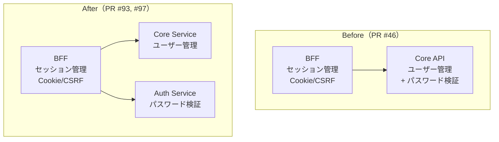
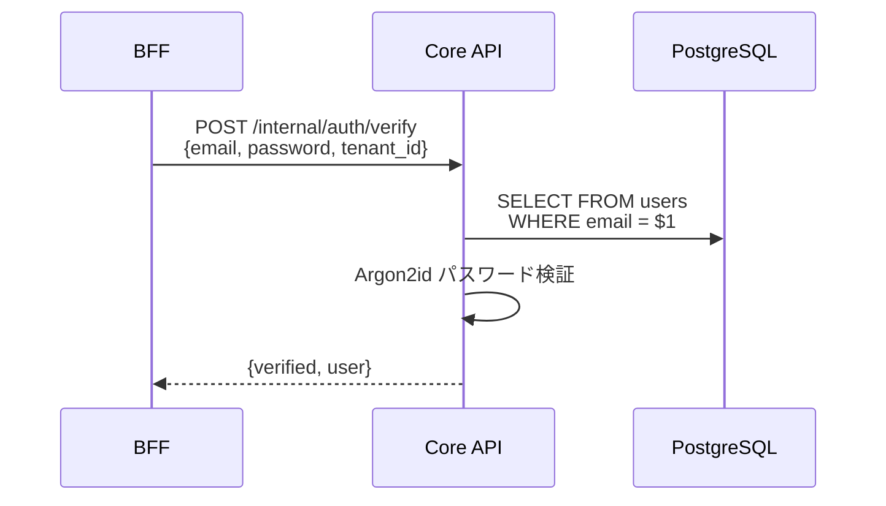
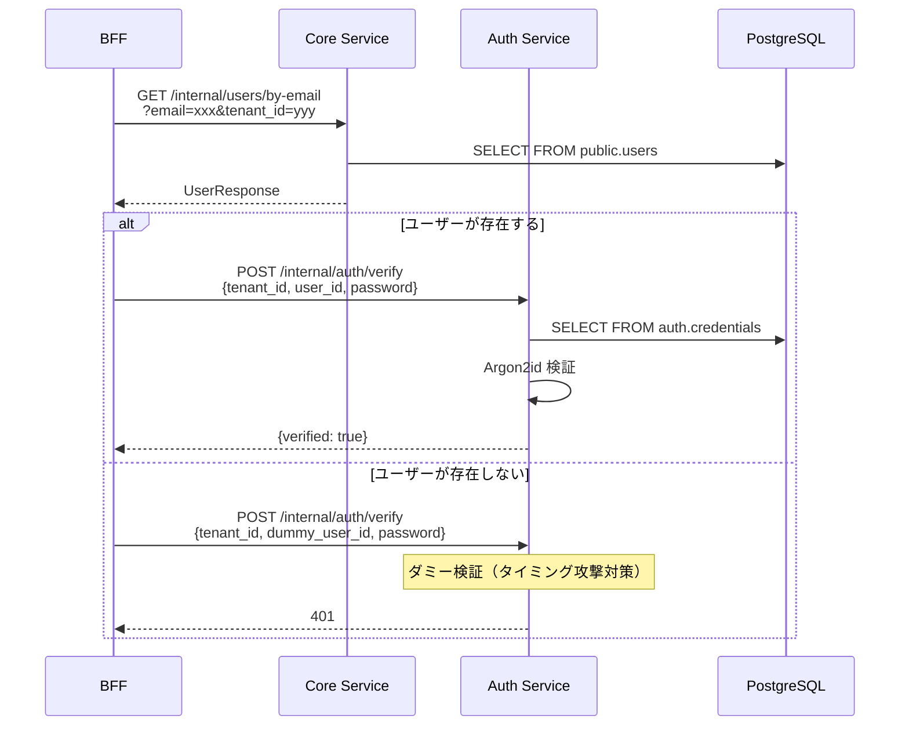
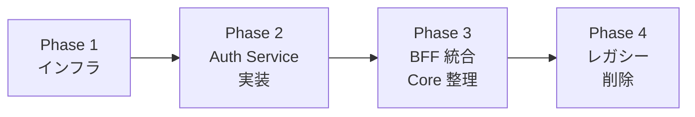
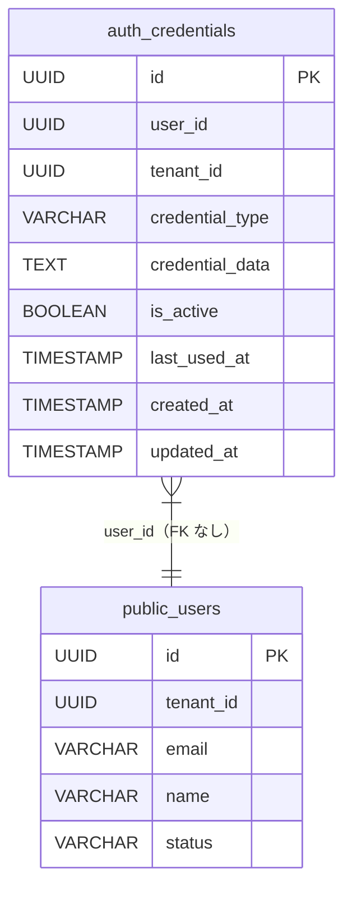

# Auth Service 分離 - 機能解説

対応 PR: #93, #97
対応 Issue: #80

## 概要

認証機能を Core Service（旧 Core API）から独立したマイクロサービス（Auth Service）として分離するリファクタリング。4フェーズの段階的移行戦略により、サービス稼働中のリスクを最小化しながら認証ドメインの独立を実現した。

将来の SSO / MFA / SCIM 対応を見据え、認証の関心事を単一サービスに集約する。

## 背景

### 分離前の課題

PR #46 で実装した認証機能では、パスワード検証が Core API（現 Core Service）内の `AuthUseCase` に含まれていた。

| 問題 | 影響 |
|------|------|
| 認証ロジックとビジネスロジックの混在 | Core API の責務が曖昧 |
| パスワードが Core API を経由する | セキュリティリスク（攻撃面の拡大） |
| 将来の SSO/MFA 追加時の影響範囲が広い | Core API 全体に波及 |
| `users.password_hash` カラムが Core API 管理下 | データ所有権が不明確 |

### 分離後の責務分担

| コンポーネント | 責務 | 所有データ |
|--------------|------|----------|
| BFF | セッション管理、Cookie/CSRF、API 中継 | セッション（Redis） |
| Auth Service | パスワード認証、将来の SSO/MFA | `auth.credentials` テーブル |
| Core Service | ユーザー情報管理、ビジネスロジック | `public.users`, `public.roles` テーブル |

### 設計書との対応

| 項目 | 内容 |
|------|------|
| 詳細設計書 | [`docs/03_詳細設計書/08_AuthService設計.md`](../../03_詳細設計書/08_AuthService設計.md) |
| ADR | [`docs/05_ADR/017_AuthService分離の方針.md`](../../05_ADR/017_AuthService分離の方針.md) |

## 用語・概念

| 用語 | 説明 | 関連コード |
|------|------|-----------|
| Credential（認証情報） | ユーザーの認証手段を表すエンティティ。種別（password, totp, oidc, saml）と認証データを持つ | `Credential` |
| CredentialType | 認証手段の種別。MVP では Password のみ実装、他は将来用 | `CredentialType` |
| auth スキーマ | PostgreSQL のスキーマ分離。Auth Service 所有テーブルを `auth` スキーマに配置 | `auth.credentials` |
| デュアルライト | 移行期間中に新旧両方のテーブルにデータを保持する戦略 | Phase 1-3 |
| 段階的移行 | 4フェーズに分けてリスクを最小化しながら移行する戦略 | Phase 1-4 |

## フロー

### Before（変更前）

PR #46 の認証フロー。BFF が Core API に認証を丸投げし、Core API がユーザー検索とパスワード検証の両方を担当。

#### 課題

- パスワードが Core API を経由する
- Core API が認証とビジネスロジックの両方を担当
- `users.password_hash` が Core API 管理下にある

### After（変更後）

BFF がユーザー検索と認証を別々のサービスに委任する。パスワードは Auth Service のみに送信される。

#### 改善点

- パスワードが Core Service を経由しなくなった（セキュリティ向上）
- 責務が明確に分離された（SRP）
- 将来の SSO/MFA 対応が Auth Service 内で完結する
- `auth.credentials` テーブルで認証情報を Auth Service が所有

## アーキテクチャ

### 段階的移行戦略

4フェーズで安全に移行する:

| Phase | PR | 内容 | リスク |
|-------|-----|------|--------|
| 1 | #93 | `auth` スキーマ作成、`credentials` テーブル作成、データ移行 | 低（テーブル追加のみ） |
| 2 | #93 | Auth Service 実装（ハンドラ、ユースケース、リポジトリ） | 低（新サービス追加のみ） |
| 3 | #97 | BFF を Auth Service 経由に変更、Core API から認証ロジック削除 | 中（認証フロー切替） |
| 4 | #97 | `users.password_hash` カラム削除 | 低（Phase 3 完了後は安全） |

### データ層の分離

## エラーハンドリング

| エラー | 発生箇所 | HTTP Status | 外部レスポンス |
|--------|---------|-------------|--------------|
| パスワード不一致 | Auth Service: verify | 401 | `authentication-failed` |
| 認証情報なし（ダミー検証） | Auth Service: verify | 401 | `authentication-failed` |
| 認証情報無効（Inactive） | Auth Service: verify | 401 | `credential-inactive` |
| ユーザー不存在 | Core Service | 404 → BFF でダミー検証 | 401 |

## 設計判断

機能・仕組みレベルの判断を記載する。コード実装レベルの判断は[コード解説](./02_コード解説.md#設計解説)を参照。

### 1. スキーマ分離をどう行うか

Auth Service 所有データの物理的な分離方式。

| 案 | 運用コスト | 分離度 | 将来の物理 DB 分離 |
|----|----------|--------|------------------|
| **論理分離: auth スキーマ（採用）** | 低（単一 DB） | 中（スキーマ境界） | 接続文字列変更のみ |
| 物理分離: 別 DB | 高（DB 運用 x 2） | 高 | 不要 |
| 分離なし: public スキーマ | 最低 | なし | 大規模リファクタ必要 |

採用理由: 初期段階では運用コストを抑えつつ、将来的に DB 物理分離が必要になった場合は接続文字列の変更のみで対応可能。各サービスが所有するテーブルが `auth` / `public` スキーマで明確に区分される。

### 2. 外部キー制約を設けるか

`auth.credentials.user_id` から `public.users.id` への FK 制約の設計。

| 案 | データ整合性 | サービス独立性 | 将来の DB 分離 |
|----|-----------|-------------|--------------|
| **FK なし（採用）** | サービス間呼び出しで担保 | 高（独立して運用可能） | 容易 |
| FK あり | DB レベルで保証 | 低（操作順序が強制） | 困難（別 DB 間で FK 不可） |

採用理由: サービス境界を越える FK はサービス間の結合度を高め、(a) 操作順序の強制、(b) 将来の DB 分離時の障壁、(c) 障害時の影響拡大を招く。整合性はサービス間の呼び出し（テナント退会フック等）で担保する。

### 3. 移行期間中のデータ管理をどうするか

旧テーブル（`users.password_hash`）と新テーブル（`auth.credentials`）の共存戦略。

| 案 | ロールバック容易性 | 整合性リスク | 移行期間 |
|----|-----------------|-----------|---------|
| **デュアルライト（採用）** | 高（旧データ残存） | 低（新テーブルのみ書込） | 段階的 |
| ビッグバン移行 | 低（一発切替） | 高（切替失敗時の影響大） | なし |
| 読み替え（ビュー等） | 中 | 中 | 長期化しやすい |

採用理由: Phase 1 で `users.password_hash` のデータを `auth.credentials` にコピーし、Phase 3 完了までは両方のデータを保持する。Phase 4 で旧カラムを削除し、完全移行を完了する。

### 4. BFF レベルのタイミング攻撃対策をどうするか

Auth Service 側のダミー検証に加え、BFF レベルでも対策するかの判断。

| 案 | 保護レベル | 追加コスト |
|----|----------|----------|
| **BFF でもダミー検証（採用）** | 二重保護 | Auth Service への追加 API 呼び出し |
| Auth Service のみに委任 | 単層保護 | なし |
| BFF で固定 sleep | 単層保護（統計的検出可能） | CPU 時間 |

採用理由: ユーザーが存在しない場合（Core Service が 404 を返した場合）にもダミーの user_id（`Uuid::nil()`）で Auth Service に検証リクエストを送信する。Auth Service 側のダミー Argon2id 検証と合わせて二重の保護を実現。固定 sleep は CPU/メモリ状況による自然な変動がなく、統計的に検出されやすいため不採用。

### 5. Core Service の認証エンドポイントをどう再設計するか

Core Service から認証ロジックを除去した後の API 設計。

| 変更前 | 変更後 | 理由 |
|--------|--------|------|
| `POST /internal/auth/verify` | 削除 | Auth Service に移行 |
| （なし） | `GET /internal/users/by-email` | 純粋なリソース取得に |

採用理由: `POST /internal/auth/verify`（パスワードを含む）から `GET /internal/users/by-email`（パスワード不要）に変更することで、Core Service はパスワードを一切扱わなくなる。RESTful な設計に近づき、セキュリティが向上する。

## 関連ドキュメント

- [コード解説](./02_コード解説.md)
- [ADR: AuthService 分離の方針](../../05_ADR/017_AuthService分離の方針.md)
- [詳細設計書: AuthService 設計](../../03_詳細設計書/08_AuthService設計.md)
- [認証機能 - 機能解説](../01_認証機能/01_機能解説.md)
