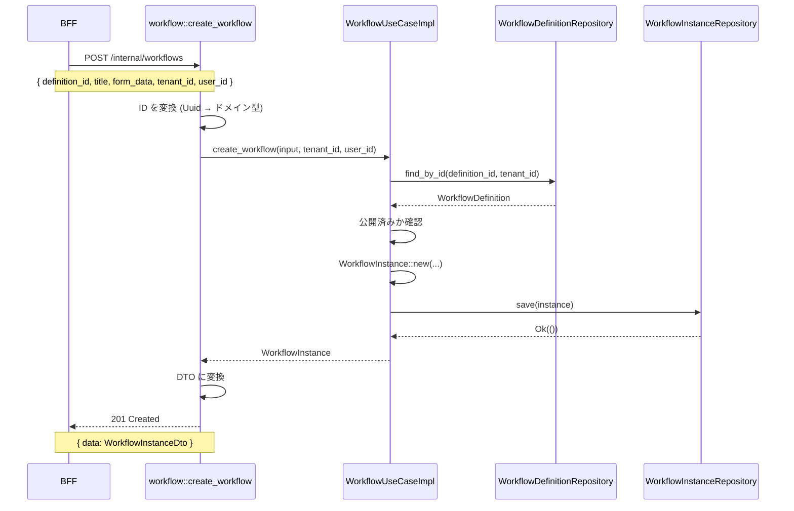

# Phase 5: Core Service API 実装

## 概要

Phase 5 では、Phase 4 で実装したワークフローユースケースを HTTP エンドポイントとして公開する。Core Service の内部 API として、BFF がプロキシする前提で実装する。

## 実装内容

### エンドポイント

| メソッド | パス | 説明 | ステータスコード |
|---------|------|------|------------------|
| POST | `/internal/workflows` | ワークフロー作成（下書き） | 201 Created |
| POST | `/internal/workflows/{id}/submit` | ワークフロー申請 | 200 OK |

### ファイル構成

```
backend/apps/core-service/src/
├── handler/
│   ├── workflow.rs          # 新規作成: ワークフロー API ハンドラ
│   ├── auth.rs              # 既存: ユーザー API
│   └── health.rs            # 既存: ヘルスチェック
├── handler.rs               # 更新: workflow モジュールを re-export
└── main.rs                  # 更新: ルーティングを追加
```

## 設計判断

### 1. 内部 API として実装

**判断**: Core Service の API は `/internal/*` パスで公開し、BFF からのみアクセス可能とする。

**理由**:
- セキュリティ: 認証・認可は BFF で一元管理
- 責務の分離: Core Service はビジネスロジックに専念
- 柔軟性: BFF が複数の Core Service を組み合わせて API を構築可能

**トレードオフ**:
- 利点: セキュリティ境界が明確、Core Service の独立性が高い
- 欠点: BFF を経由するため、1ホップ増える（パフォーマンス影響は軽微）

**代替案**:
- Core Service を直接公開し、認証・認可も Core Service で実装
  - 却下理由: 各サービスで認証・認可を重複実装することになる

### 2. テナント ID・ユーザー ID をリクエストボディで受け取る

**判断**: 内部 API では `tenant_id`, `user_id` をリクエストボディに含める。

**理由**:
- BFF がセッションから取得した情報を渡す前提
- Core Service はセッション管理を持たない（ステートレス）
- テナント境界の明示的な管理

**実装例**:
```json
{
  "definition_id": "550e8400-...",
  "title": "経費申請",
  "form_data": {...},
  "tenant_id": "550e8400-...",
  "user_id": "550e8400-..."
}
```

**トレードオフ**:
- 利点: Core Service がステートレス、テスト容易
- 欠点: BFF が常に `tenant_id`, `user_id` を付与する責務を持つ

**代替案**:
- JWT トークンをヘッダーで渡し、Core Service で検証
  - 却下理由: Core Service がトークン検証の責務を持つことになり、複雑化

### 3. 型安全な ID 変換

**判断**: リクエストで `Uuid` として受け取り、`from_uuid()` でドメイン型に変換。

**理由**:
- 型安全性: `TenantId`, `UserId` など、異なる ID の取り違えをコンパイル時に検出
- エラーハンドリングの簡潔化: `TryFrom` ではなく `From` を使用し、変換失敗を考慮不要
- 既存コード（auth.rs）との一貫性

**実装例**:
```rust
#[derive(Debug, Deserialize)]
pub struct CreateWorkflowRequest {
   pub definition_id: Uuid,  // String ではなく Uuid
   pub tenant_id:     Uuid,
   pub user_id:       Uuid,
}

// ハンドラー内で変換
let tenant_id = TenantId::from_uuid(req.tenant_id);
let user_id = UserId::from_uuid(req.user_id);
```

**トレードオフ**:
- 利点: 型安全、コンパイル時エラー検出、コードが簡潔
- 欠点: クライアントが有効な UUID 形式を送る責務を持つ（ただし BFF が生成するため問題なし）

**代替案**:
- リクエストで `String` として受け取り、パースする
  - 却下理由: エラーハンドリングが冗長、型安全性が低い

### 4. RFC 7807 Problem Details 形式のエラーレスポンス

**判断**: エラーは RFC 7807 形式で返す。

**理由**:
- 標準化: 業界標準のエラー形式
- 一貫性: BFF、Core Service、Auth Service で同じ形式
- 拡張性: `type` URI で詳細なエラー種別を表現可能

**実装例**:
```json
{
  "type": "https://ringiflow.example.com/errors/not-found",
  "title": "Not Found",
  "status": 404,
  "detail": "ワークフロー定義が見つかりません"
}
```

**トレードオフ**:
- 利点: 標準化、一貫性、拡張性
- 欠点: JSON サイズが若干大きい（影響は軽微）

**代替案**:
- シンプルな `{ "error": "message" }` 形式
  - 却下理由: 標準化されておらず、拡張性が低い

## コード構造

### ハンドラー層（handler/workflow.rs）

```rust
// リクエスト型
pub struct CreateWorkflowRequest {
   pub definition_id: Uuid,
   pub title:         String,
   pub form_data:     serde_json::Value,
   pub tenant_id:     Uuid,
   pub user_id:       Uuid,
}

// レスポンス型
pub struct WorkflowResponse {
   pub data: WorkflowInstanceDto,
}

// State
pub struct WorkflowState<D, I, S> {
   pub usecase: WorkflowUseCaseImpl<D, I, S>,
}

// ハンドラー関数
pub async fn create_workflow<D, I, S>(...) -> Result<Response, CoreError> {
   // 1. ID を変換
   let tenant_id = TenantId::from_uuid(req.tenant_id);
   // ...

   // 2. ユースケースを呼び出し
   let instance = state.usecase.create_workflow(input, tenant_id, user_id).await?;

   // 3. レスポンスを返す
   Ok((StatusCode::CREATED, Json(response)).into_response())
}
```

### ルーティング（main.rs）

```rust
// 依存コンポーネントの初期化
let definition_repo = PostgresWorkflowDefinitionRepository::new(pool.clone());
let instance_repo = PostgresWorkflowInstanceRepository::new(pool.clone());
let step_repo = PostgresWorkflowStepRepository::new(pool.clone());
let workflow_usecase = WorkflowUseCaseImpl::new(definition_repo, instance_repo, step_repo);
let workflow_state = Arc::new(WorkflowState { usecase: workflow_usecase });

// ルーティング
let app = Router::new()
   .route("/internal/workflows", post(create_workflow::<...>))
   .route("/internal/workflows/:id/submit", post(submit_workflow::<...>))
   .with_state(workflow_state);
```

## データフロー



## テスト戦略

### 単体テスト

- ユースケース層: Phase 4 で実装済み（Mock リポジトリを使用）
- ハンドラー層: 現時点では未実装（統合テストで代替）

### 統合テスト

最終 Phase (BFF API 実装) 完了後に実施:
- BFF → Core Service の E2E テスト
- データベースを含む統合テスト

## 次の Phase への準備

### Phase 7: BFF API 実装

Core Service の内部 API ができたので、次は BFF でこれをプロキシする公開 API を実装する。

**実装予定**:
- POST /api/v1/workflows - BFF エンドポイント
  - セッションから `tenant_id`, `user_id` を取得
  - Core Service の `/internal/workflows` を呼び出し
- POST /api/v1/workflows/{id}/submit - BFF エンドポイント
  - セッションから `tenant_id` を取得
  - Core Service の `/internal/workflows/{id}/submit` を呼び出し

**BFF の責務**:
- セッション管理（Cookie ベース）
- CSRF 防御（トークン検証）
- Core Service へのプロキシ（内部 API 呼び出し）
- レスポンスの集約（必要に応じて複数の Core Service を組み合わせ）

## 参照

- [ワークフローユースケース実装（Phase 4）](./04_Phase4_WorkflowUseCase.md)
- [API 設計](../../03_詳細設計書/03_API設計.md)
- [BFF パターン](../../06_技術ノート/BFFパターン.md)

## 変更履歴

| 日付 | 変更内容 | 担当 |
|------|---------|------|
| 2026-01-26 | 初版作成 | - |
