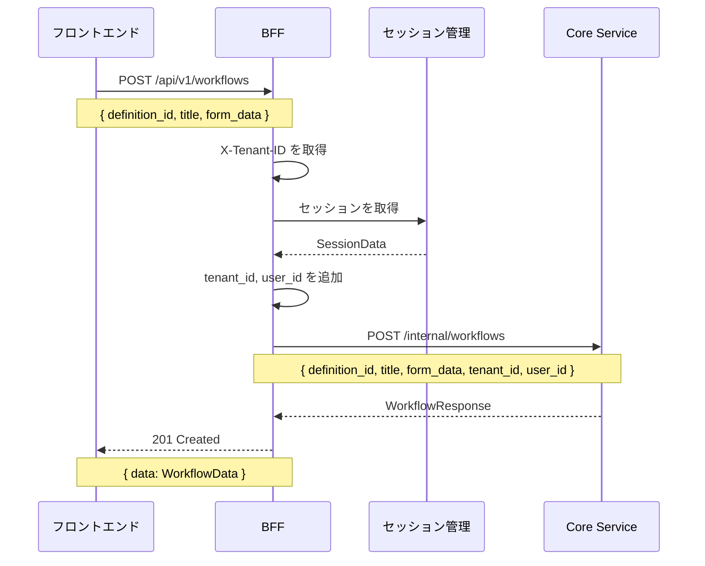

# Phase 7: BFF API 実装

## 概要

Phase 7 では、Core Service の内部 API を BFF でプロキシし、フロントエンド向けの公開 API として提供する。

## 実装内容

### エンドポイント

| メソッド | パス | 説明 | ステータスコード |
|---------|------|------|------------------|
| POST | `/api/v1/workflows` | ワークフロー作成（下書き） | 201 Created |
| POST | `/api/v1/workflows/{id}/submit` | ワークフロー申請 | 200 OK |

### ファイル構成

```
backend/apps/bff/src/
├── client/
│   ├── core_service.rs      # 更新: ワークフロー関連の型とメソッドを追加
│   └── ...
├── handler/
│   ├── workflow.rs           # 新規作成: ワークフロー API ハンドラ
│   └── ...
├── handler.rs                # 更新: workflow モジュールを re-export
└── main.rs                   # 更新: ルーティングを追加
```

## 設計判断

### 1. CoreServiceClient にメソッドを追加

**判断**: 既存の `CoreServiceClient` トレイトにワークフロー関連のメソッドを追加する。

**理由**:
- 一貫性: 既存の `get_user_by_email()` などと同じパターン
- 拡張性: 新しいエンドポイントを追加しやすい
- テスト容易性: スタブで容易にモック可能

**実装例**:
```rust
#[async_trait]
pub trait CoreServiceClient: Send + Sync {
   // 既存のメソッド
   async fn get_user(...) -> Result<...>;

   // 新規追加
   async fn create_workflow(...) -> Result<WorkflowResponse, CoreServiceError>;
   async fn submit_workflow(...) -> Result<WorkflowResponse, CoreServiceError>;
}
```

### 2. セッションから tenant_id と user_id を取得

**判断**: BFF ハンドラーでセッションから `tenant_id` と `user_id` を取得し、Core Service のリクエストに含める。

**理由**:
- BFF の責務: セッション管理は BFF が担当
- Core Service のステートレス性: Core Service はセッション情報を持たない
- セキュリティ: 認証済みユーザーの情報を確実に渡す

**実装例**:
```rust
// セッションを取得
let session_data = get_session(&state.session_manager, &jar, tenant_id).await?;

// Core Service リクエストを構築
let core_req = CreateWorkflowRequest {
   definition_id: req.definition_id,
   title:         req.title,
   form_data:     req.form_data,
   tenant_id:     *session_data.tenant_id().as_uuid(),
   user_id:       *session_data.user_id().as_uuid(),
};
```

### 3. カスタムエラー型による警告対処

**判断**: `Result<Uuid, Response>` のような大きなエラー型を避け、軽量な `TenantIdError` enum を定義。

**理由**:
- パフォーマンス: `Result` のサイズを小さく保つ
- 可読性: エラーの種類が明確
- 一貫性: 既存の `auth.rs` と同じパターン

**実装例**:
```rust
pub enum TenantIdError {
   Missing,
   InvalidFormat,
}

impl IntoResponse for TenantIdError {
   fn into_response(self) -> Response {
      // エラーレスポンスに変換
   }
}

fn extract_tenant_id(headers: &HeaderMap) -> Result<Uuid, TenantIdError> {
   // ヘッダーからテナント ID を抽出
}
```

**トレードオフ**:
- 利点: パフォーマンス向上、コードの明確性
- 欠点: 新しいエラー型を定義する必要がある（ただし、既存パターンの踏襲なのでコスト低）

**代替案**:
- `#[allow(clippy::result_large_err)]` で警告を無効化
  - 却下理由: 問題を隠蔽するだけで、根本的な解決にならない

### 4. 型のクローン可能性

**判断**: `CoreServiceClientImpl` に `#[derive(Clone)]` を追加。

**理由**:
- BFF の main.rs で複数の State に同じクライアントを共有
- `reqwest::Client` は内部で Arc を使っており、Clone コストが低い

**実装例**:
```rust
#[derive(Clone)]
pub struct CoreServiceClientImpl {
   base_url: String,
   client:   reqwest::Client,  // 内部で Arc<ClientInner> を使用
}
```

## コード構造

### CoreServiceClient の拡張

```rust
// リクエスト型
pub struct CreateWorkflowRequest {
   pub definition_id: Uuid,
   pub title:         String,
   pub form_data:     serde_json::Value,
   pub tenant_id:     Uuid,
   pub user_id:       Uuid,
}

// レスポンス型
pub struct WorkflowResponse {
   pub data: WorkflowInstanceDto,
}

// トレイト
#[async_trait]
pub trait CoreServiceClient: Send + Sync {
   async fn create_workflow(...) -> Result<WorkflowResponse, CoreServiceError>;
   async fn submit_workflow(...) -> Result<WorkflowResponse, CoreServiceError>;
}
```

### BFF ハンドラー

```rust
pub async fn create_workflow<C, S>(
   State(state): State<Arc<WorkflowState<C, S>>>,
   headers: HeaderMap,
   jar: CookieJar,
   Json(req): Json<CreateWorkflowRequest>,
) -> impl IntoResponse
where
   C: CoreServiceClient,
   S: SessionManager,
{
   // 1. テナント ID を取得
   let tenant_id = extract_tenant_id(&headers)?;

   // 2. セッションを取得
   let session_data = get_session(&state.session_manager, &jar, tenant_id).await?;

   // 3. Core Service を呼び出し
   let core_req = crate::client::CreateWorkflowRequest {
      definition_id: req.definition_id,
      title:         req.title,
      form_data:     req.form_data,
      tenant_id:     *session_data.tenant_id().as_uuid(),
      user_id:       *session_data.user_id().as_uuid(),
   };

   let core_response = state.core_service_client.create_workflow(core_req).await?;

   // 4. レスポンスを返す
   Ok((StatusCode::CREATED, Json(response)).into_response())
}
```

## データフロー



## テスト戦略

### 単体テスト

- ハンドラー層: 現時点では未実装（統合テストで代替）
- CoreServiceClient: スタブによるモックテスト

### 統合テスト

最終 Phase 完了後（フロントエンド実装後）に実施:
- BFF → Core Service の E2E テスト
- セッション管理を含む統合テスト

## 次のステップ

### Phase 8: フロントエンド実装（予定）

BFF API ができたので、次は Elm でフロントエンドを実装する。

**実装予定**:
- ワークフロー申請フォーム
- API クライアント（`POST /api/v1/workflows` を呼び出し）
- フォーム入力の検証
- エラーハンドリング

## 参照

- [Core Service API 実装（Phase 6）](./05_Phase5_CoreServiceAPI.md)
- [BFF パターン](../../06_ナレッジベース/architecture/BFFパターン.md)
- [API 設計](../../03_詳細設計書/03_API設計.md)

## 変更履歴

| 日付 | 変更内容 | 担当 |
|------|---------|------|
| 2026-01-26 | 初版作成 | - |
