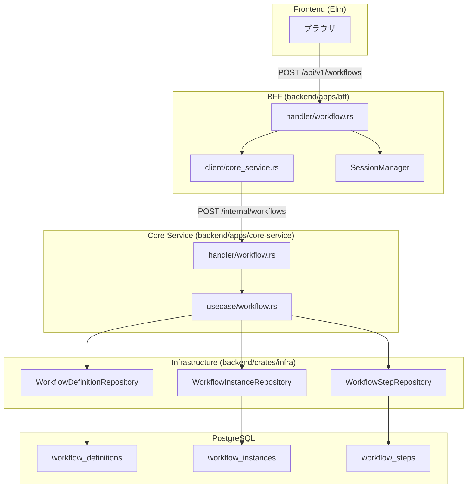
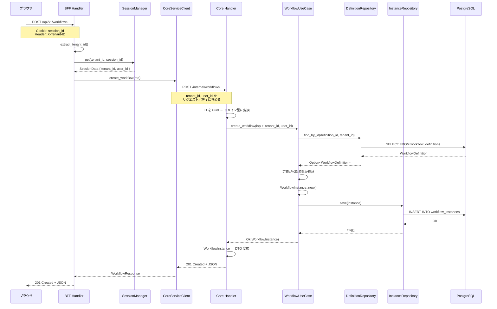
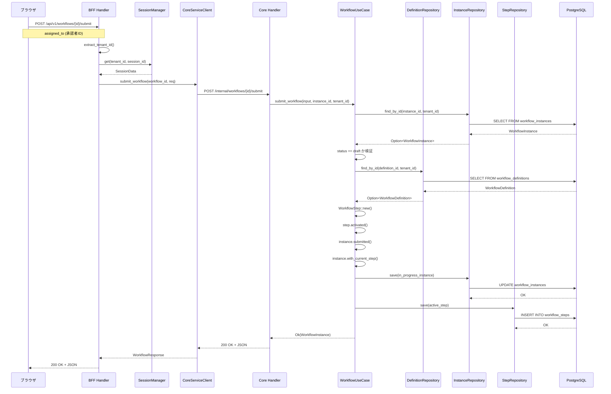
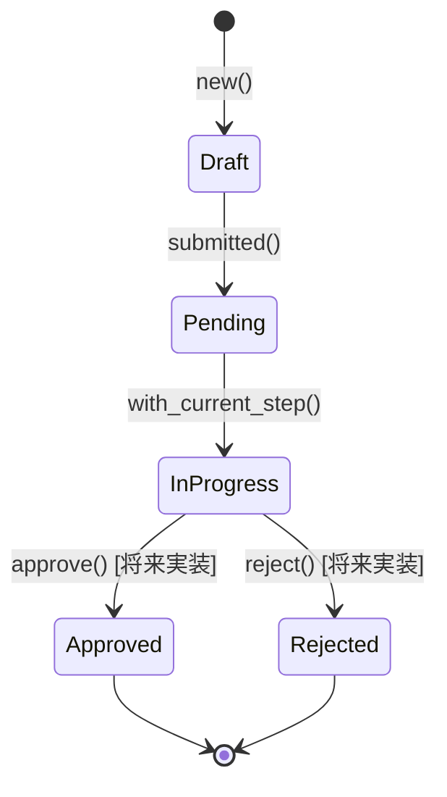
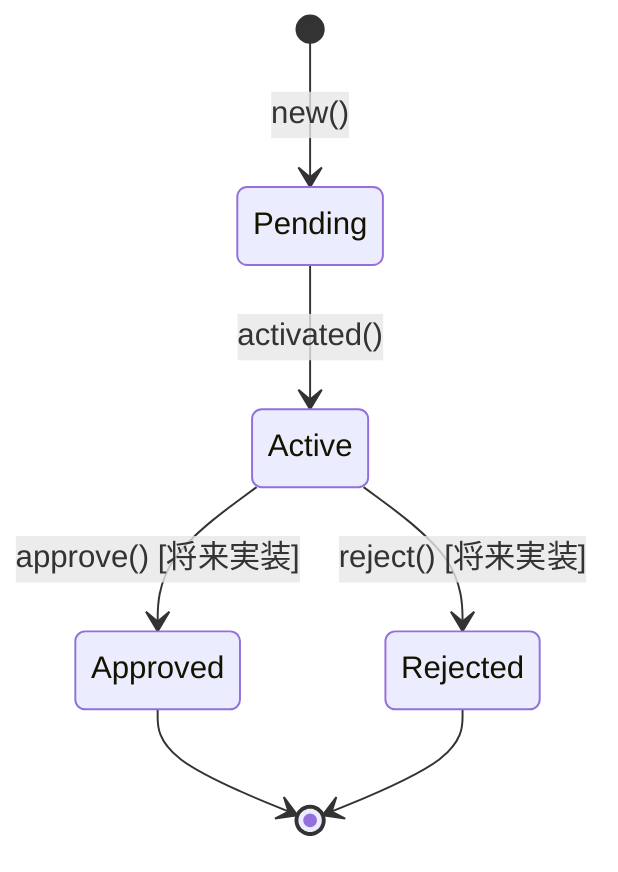
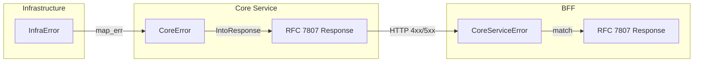

# ワークフロー申請機能 - 全体フロー

## 概要

このドキュメントでは、ワークフロー申請機能の全体的なデータフローと、各レイヤーのファイル・関数の連携を解説する。

---

## アーキテクチャ概観



---

## 主要コンポーネント一覧

### BFF 層

| ファイル | 責務 |
|---------|------|
| [`backend/apps/bff/src/handler/workflow.rs`](../../../backend/apps/bff/src/handler/workflow.rs) | 公開 API ハンドラ。セッション検証、Core Service 呼び出し |
| [`backend/apps/bff/src/client/core_service.rs`](../../../backend/apps/bff/src/client/core_service.rs) | Core Service への HTTP クライアント |
| [`backend/apps/bff/src/main.rs`](../../../backend/apps/bff/src/main.rs) | ルーティング定義 |

### Core Service 層

| ファイル | 責務 |
|---------|------|
| [`backend/apps/core-service/src/handler/workflow.rs`](../../../backend/apps/core-service/src/handler/workflow.rs) | 内部 API ハンドラ。リクエスト変換、UseCase 呼び出し |
| [`backend/apps/core-service/src/usecase/workflow.rs`](../../../backend/apps/core-service/src/usecase/workflow.rs) | ビジネスロジック。ワークフロー作成・申請処理 |
| [`backend/apps/core-service/src/error.rs`](../../../backend/apps/core-service/src/error.rs) | エラー型定義。RFC 7807 変換 |
| [`backend/apps/core-service/src/main.rs`](../../../backend/apps/core-service/src/main.rs) | ルーティング定義、DI 設定 |

### Infrastructure 層

| ファイル | 責務 |
|---------|------|
| [`backend/crates/infra/src/repository/workflow_definition_repository.rs`](../../../backend/crates/infra/src/repository/workflow_definition_repository.rs) | ワークフロー定義の永続化 |
| [`backend/crates/infra/src/repository/workflow_instance_repository.rs`](../../../backend/crates/infra/src/repository/workflow_instance_repository.rs) | ワークフローインスタンスの永続化 |
| [`backend/crates/infra/src/repository/workflow_step_repository.rs`](../../../backend/crates/infra/src/repository/workflow_step_repository.rs) | 承認ステップの永続化 |

---

## フロー 1: ワークフロー作成（POST /api/v1/workflows）

### シーケンス図



### 処理ステップ詳細

| ステップ | レイヤー | ファイル:関数 | 処理内容 |
|---------|---------|---------------|----------|
| 1 | BFF | `handler/workflow.rs:create_workflow()` | X-Tenant-ID ヘッダーを抽出 |
| 2 | BFF | `handler/workflow.rs:get_session()` | Cookie からセッションを取得、認証検証 |
| 3 | BFF | `client/core_service.rs:create_workflow()` | Core Service へ HTTP POST |
| 4 | Core | `handler/workflow.rs:create_workflow()` | Uuid をドメイン型に変換 |
| 5 | Core | `usecase/workflow.rs:create_workflow()` | ビジネスロジック実行 |
| 6 | Infra | `workflow_definition_repository.rs:find_by_id()` | 定義を DB から取得 |
| 7 | Core | `usecase/workflow.rs` | 定義が `published` か検証 |
| 8 | Domain | `WorkflowInstance::new()` | インスタンスを `draft` 状態で生成 |
| 9 | Infra | `workflow_instance_repository.rs:save()` | DB に INSERT (UPSERT) |
| 10 | Core | `handler/workflow.rs` | `WorkflowInstance` → `WorkflowInstanceDto` 変換 |

---

## フロー 2: ワークフロー申請（POST /api/v1/workflows/{id}/submit）

### シーケンス図



### 処理ステップ詳細

| ステップ | レイヤー | ファイル:関数 | 処理内容 |
|---------|---------|---------------|----------|
| 1 | BFF | `handler/workflow.rs:submit_workflow()` | パスパラメータから workflow_id を抽出 |
| 2 | BFF | `handler/workflow.rs:get_session()` | 認証検証 |
| 3 | BFF | `client/core_service.rs:submit_workflow()` | Core Service へ HTTP POST |
| 4 | Core | `handler/workflow.rs:submit_workflow()` | ID 変換 |
| 5 | Core | `usecase/workflow.rs:submit_workflow()` | ビジネスロジック開始 |
| 6 | Infra | `workflow_instance_repository.rs:find_by_id()` | インスタンスを取得 |
| 7 | Core | `usecase/workflow.rs` | `status == draft` か検証 |
| 8 | Infra | `workflow_definition_repository.rs:find_by_id()` | 定義を取得（将来の拡張用） |
| 9 | Domain | `WorkflowStep::new()` | 承認ステップを生成 |
| 10 | Domain | `step.activated()` | ステップを active 状態に |
| 11 | Domain | `instance.submitted()` | `draft` → `pending` 遷移 |
| 12 | Domain | `instance.with_current_step()` | `pending` → `in_progress` 遷移 |
| 13 | Infra | `workflow_instance_repository.rs:save()` | インスタンスを更新 |
| 14 | Infra | `workflow_step_repository.rs:save()` | ステップを保存 |

---

## 状態遷移

### WorkflowInstance の状態



### WorkflowStep の状態



---

## データ変換の流れ

### リクエストの変換

```
[Frontend]
    CreateWorkflowRequest (BFF公開API用)
        ├── definition_id: Uuid
        ├── title: String
        └── form_data: serde_json::Value

    ↓ BFF: セッションから tenant_id, user_id を追加

[BFF → Core Service]
    CreateWorkflowRequest (内部API用)
        ├── definition_id: Uuid
        ├── title: String
        ├── form_data: serde_json::Value
        ├── tenant_id: Uuid      ← 追加
        └── user_id: Uuid        ← 追加

    ↓ Core Handler: Uuid → ドメイン型

[UseCase]
    CreateWorkflowInput
        ├── definition_id: WorkflowDefinitionId
        ├── title: String
        └── form_data: JsonValue
    +
    tenant_id: TenantId
    user_id: UserId
```

### レスポンスの変換

```
[UseCase → Core Handler]
    WorkflowInstance (ドメインモデル)

    ↓ Core Handler: From<WorkflowInstance> for WorkflowInstanceDto

[Core Service → BFF]
    WorkflowInstanceDto
        ├── id: String
        ├── title: String
        ├── status: String (Debug形式)
        ├── ...
        └── updated_at: String (RFC3339)

    ↓ BFF: From<WorkflowInstanceDto> for WorkflowData

[BFF → Frontend]
    WorkflowResponse
        └── data: WorkflowData
```

---

## エラーハンドリングの流れ

### エラー伝播



### エラー種別とステータスコード

| エラー | Core Service | BFF | HTTP Status |
|-------|-------------|-----|-------------|
| 定義が見つからない | `CoreError::NotFound` | `CoreServiceError::WorkflowDefinitionNotFound` | 404 |
| インスタンスが見つからない | `CoreError::NotFound` | `CoreServiceError::WorkflowInstanceNotFound` | 404 |
| draft 以外の申請 | `CoreError::BadRequest` | `CoreServiceError::ValidationError` | 400 |
| 未公開定義での作成 | `CoreError::BadRequest` | `CoreServiceError::ValidationError` | 400 |
| DB エラー | `CoreError::Internal` | `CoreServiceError::Unexpected` | 500 |

---

## テナント分離

すべてのデータアクセスでテナント ID を検証し、クロステナントアクセスを防止する。

### 検証ポイント

| レイヤー | 検証方法 |
|---------|---------|
| BFF | セッションの tenant_id と X-Tenant-ID ヘッダーを照合 |
| Repository | すべての SELECT/UPDATE に `WHERE tenant_id = $N` を含める |
| workflow_steps | 親テーブル (workflow_instances) と JOIN してテナントを検証 |

### SQL での分離例

```sql
-- workflow_instances の取得
SELECT * FROM workflow_instances
WHERE id = $1 AND tenant_id = $2;

-- workflow_steps の取得（JOIN による分離）
SELECT ws.* FROM workflow_steps ws
INNER JOIN workflow_instances wi ON ws.instance_id = wi.id
WHERE ws.id = $1 AND wi.tenant_id = $2;
```

---

## 関連ドキュメント

- [Phase 1: WorkflowDefinitionRepository](./01_Phase1_WorkflowDefinitionRepository.md)
- [Phase 2: WorkflowInstanceRepository](./02_Phase2_WorkflowInstanceRepository.md)
- [Phase 3: WorkflowStepRepository](./03_Phase3_WorkflowStepRepository.md)
- [Phase 4: WorkflowUseCase](./04_Phase4_WorkflowUseCase.md)
- [Phase 5: Core Service API](./05_Phase5_CoreServiceAPI.md)
- [Phase 7: BFF API](./06_Phase7_BFFAPI.md)
- [API 設計書](../../03_詳細設計書/03_API設計.md)
- [データベース設計書](../../03_詳細設計書/02_データベース設計.md)

---

## 変更履歴

| 日付 | 変更内容 | 担当 |
|------|---------|------|
| 2026-01-26 | 全体フロードキュメントを追加 | - |
