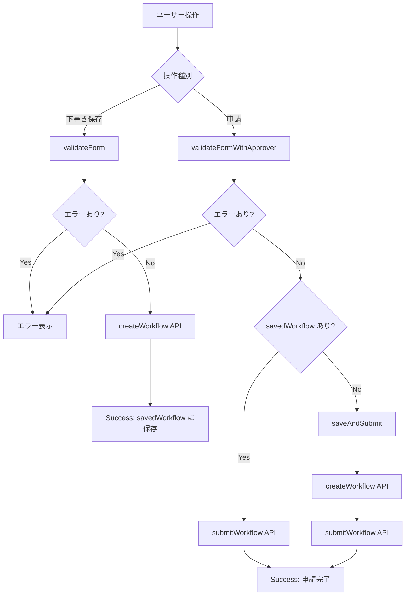

# Phase 9: 申請フォーム UI

## 概要

Elm で新規申請フォームページ（`Page/Workflow/New.elm`）を実装する。

### 対応 Issue

[#115 フロントエンド ワークフロー申請フォーム](https://github.com/ka2kama/ringiflow/issues/115)

## 実装内容

### 1. ページ構造

申請フォームは 3 つのステップで構成される。

| ステップ | 内容 | 必須タイミング |
|---------|------|---------------|
| Step 1 | ワークフロー定義の選択 | 下書き保存時 |
| Step 2 | フォーム入力（タイトル + 動的フィールド） | 下書き保存時 |
| Step 3 | 承認者選択 | 申請時のみ |

### 2. 状態管理

```elm
type alias Model =
    { session : Session
    , definitions : RemoteData (List WorkflowDefinition)
    , selectedDefinitionId : Maybe String
    , title : String
    , formValues : Dict String String
    , validationErrors : Dict String String
    , approverInput : String
    , savedWorkflow : Maybe WorkflowInstance
    , saveMessage : Maybe SaveMessage
    , submitting : Bool
    }
```

主要な設計ポイント:

- `RemoteData`: API レスポンスのライフサイクルを型で表現（NotAsked → Loading → Success/Failure）
- `formValues`: 動的フォームの値を `Dict String String` で管理
- `validationErrors`: フィールド ID をキーとしたエラーメッセージ
- `savedWorkflow`: 下書き保存後のインスタンスを保持（再編集・申請に使用）

### 3. 動的フォーム生成

ワークフロー定義の JSON からフォームフィールドを抽出し、動的に UI を生成する。

```
定義 JSON → extractFormFields → List FormField → viewFields → HTML
```

フィールドタイプ:

| タイプ | UI 要素 |
|-------|--------|
| text | `<input type="text">` |
| textarea | `<textarea>` |
| select | `<select>` |

### 4. バリデーション

バリデーションは 2 段階に分離されている。

| 操作 | 検証項目 |
|-----|---------|
| 下書き保存 | タイトル（必須、長さ）+ 定義選択 |
| 申請 | 上記 + 必須フィールド + 承認者 |

```elm
validateForm : Model -> Dict String String        -- 下書き用
validateFormWithApprover : Model -> Dict String String  -- 申請用
```

理由: 下書き段階では全項目必須にしない（途中保存を許可）

### 5. 保存フロー



## 設計判断

### RemoteData パターンの採用

API レスポンスの状態を型で明示する。

```elm
type RemoteData a
    = NotAsked
    | Loading
    | Failure ApiError
    | Success a
```

採用理由:

- コンパイラが全状態のハンドリングを強制する
- 「読み込み中」「エラー」「成功」の表示を漏れなく実装できる
- `Maybe` + `isLoading` フラグのような ad-hoc な状態管理を避けられる

代替案:

- `krisajenkins/remotedata` パッケージ: 外部依存を避けるため独自実装を選択

### 動的フォームの値を Dict で管理

```elm
formValues : Dict String String
```

採用理由:

- フィールド数・構成が定義によって変わるため、固定の型では対応できない
- JSON エンコード時に `Dict.toList` で簡単に変換可能
- フィールド ID をキーにすることで、バリデーションエラーとの対応も明確

制約:

- 現在は全て文字列として扱う（数値・日付の型付けは将来課題）

### 保存→申請の 2 段階処理

申請時に未保存の場合、「保存→申請」を連続実行する。

```elm
saveAndSubmit : Session -> String -> String -> Dict String String -> String -> Cmd Msg
```

実装方針:

- 保存成功のレスポンスで `workflow.id` を取得
- その ID で申請 API を呼び出し

将来の改善:

- `Task.andThen` パターンで Cmd をチェーンする方がエレガント
- 現在は簡略化のため、保存成功時にメッセージで申請をトリガー

## ファイル構成

```
frontend/src/
├── Page/
│   └── Workflow/
│       └── New.elm           # 新規申請フォームページ
├── Form/
│   ├── DynamicForm.elm       # 動的フォーム生成
│   └── Validation.elm        # バリデーションロジック
└── Data/
    └── FormField.elm         # フォームフィールド型
```

## 学習ポイント

1. **TEA による状態管理**: Model-Msg-Update-View の循環で副作用を分離
2. **RemoteData パターン**: 非同期データの状態を型で表現
3. **動的 UI 生成**: JSON から UI を生成する Elm らしいアプローチ
4. **段階的バリデーション**: 操作に応じた検証項目の切り替え

## 次のステップ

- Phase 10: 申請一覧・詳細ページ
