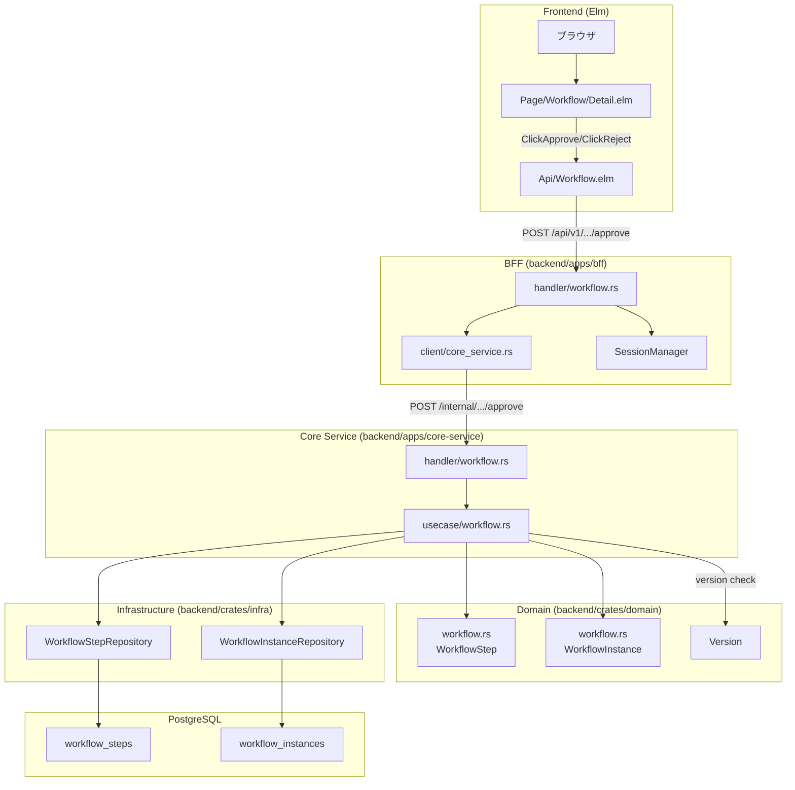
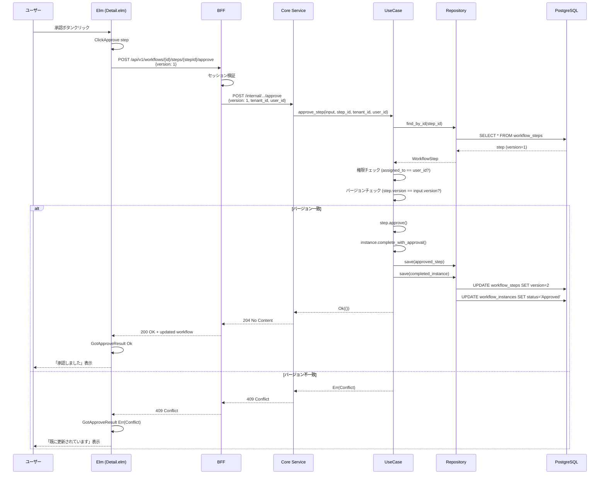

# ワークフロー承認/却下機能 - 全体フロー

## 概要

このドキュメントでは、ワークフロー承認/却下機能の全体的なデータフローと、各レイヤーのファイル・関数の連携を解説する。

特に、**楽観的ロック**による競合検出の流れを重点的に説明する。

---

## アーキテクチャ概観



---

## 承認フローのシーケンス



---

## 主要コンポーネント一覧

### Frontend 層

| ファイル | 責務 |
|---------|------|
| [`frontend/src/Page/Workflow/Detail.elm`](../../../frontend/src/Page/Workflow/Detail.elm) | 詳細ページ。承認/却下ボタン、エラー表示 |
| [`frontend/src/Api/Workflow.elm`](../../../frontend/src/Api/Workflow.elm) | API クライアント。`approveStep`, `rejectStep` |
| [`frontend/src/Api.elm`](../../../frontend/src/Api.elm) | HTTP ヘルパー。`Conflict` エラー型 |
| [`frontend/src/Data/WorkflowInstance.elm`](../../../frontend/src/Data/WorkflowInstance.elm) | データ型。`version`, `steps`, `StepStatus` |

### BFF 層

| ファイル | 責務 |
|---------|------|
| [`backend/apps/bff/src/handler/workflow.rs`](../../../backend/apps/bff/src/handler/workflow.rs) | 公開 API。`approve_step`, `reject_step` |
| [`backend/apps/bff/src/client/core_service.rs`](../../../backend/apps/bff/src/client/core_service.rs) | Core Service クライアント |

### Core Service 層

| ファイル | 責務 |
|---------|------|
| [`backend/apps/core-service/src/handler/workflow.rs`](../../../backend/apps/core-service/src/handler/workflow.rs) | 内部 API。リクエスト変換 |
| [`backend/apps/core-service/src/usecase/workflow.rs`](../../../backend/apps/core-service/src/usecase/workflow.rs) | ビジネスロジック。楽観的ロック検証 |
| [`backend/apps/core-service/src/error.rs`](../../../backend/apps/core-service/src/error.rs) | `Forbidden`, `Conflict` エラー |

### Domain 層

| ファイル | 責務 |
|---------|------|
| [`backend/crates/domain/src/workflow.rs`](../../../backend/crates/domain/src/workflow.rs) | `WorkflowStep.approve()`, `reject()`, `Version` |

### Infrastructure 層

| ファイル | 責務 |
|---------|------|
| [`backend/crates/infra/src/repository/workflow_step_repository.rs`](../../../backend/crates/infra/src/repository/workflow_step_repository.rs) | ステップの永続化（version 含む） |
| [`backend/crates/infra/src/repository/workflow_instance_repository.rs`](../../../backend/crates/infra/src/repository/workflow_instance_repository.rs) | インスタンスの永続化（version 含む） |

---

## 楽観的ロックの実装ポイント

### 1. version フィールドの流れ

```
DB (version=1) → Repository → Domain → UseCase (検証) → Domain (increment) → Repository → DB (version=2)
```

### 2. 検証場所

```rust
// usecase/workflow.rs
if step.version() != input.version {
    return Err(CoreError::Conflict(...));
}
```

**ユースケース層で検証する理由:**
- 楽観的ロックは「同時更新を防ぐ」というビジネスルール
- リポジトリ層は CRUD に徹する

### 3. フロントエンドのエラーハンドリング

```elm
-- Page/Workflow/Detail.elm
apiErrorToMessage error =
    case error of
        Conflict problem ->
            "このワークフローは既に更新されています..."
```

---

## エラーフローの対応表

| エラー | 発生箇所 | HTTP | Elm エラー型 | ユーザー向けメッセージ |
|--------|---------|------|-------------|---------------------|
| 権限なし | UseCase | 403 | `Forbidden` | 「この操作を実行する権限がありません」 |
| バージョン不一致 | UseCase | 409 | `Conflict` | 「既に更新されています。再読み込みしてください」 |
| ステップ未発見 | UseCase | 404 | `NotFound` | 「ワークフローが見つかりません」 |
| 状態不正 | Domain | 400 | `BadRequest` | 「このステップは承認/却下できません」 |

---

## 関連ドキュメント

- [設計書: 11_ワークフロー承認却下機能設計.md](../../03_詳細設計書/11_ワークフロー承認却下機能設計.md)
- [Phase 1: ドメインモデル拡張](./01_Phase1_ドメインモデル拡張.md)
- [Phase 4: ユースケース層](./03_Phase4_ユースケース層.md)
- [Phase 5: API 層](./04_Phase5_API層.md)
- [Phase 6: フロントエンド](./05_Phase6_フロントエンド.md)
