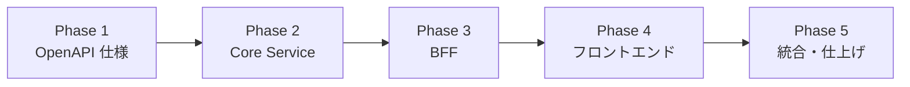
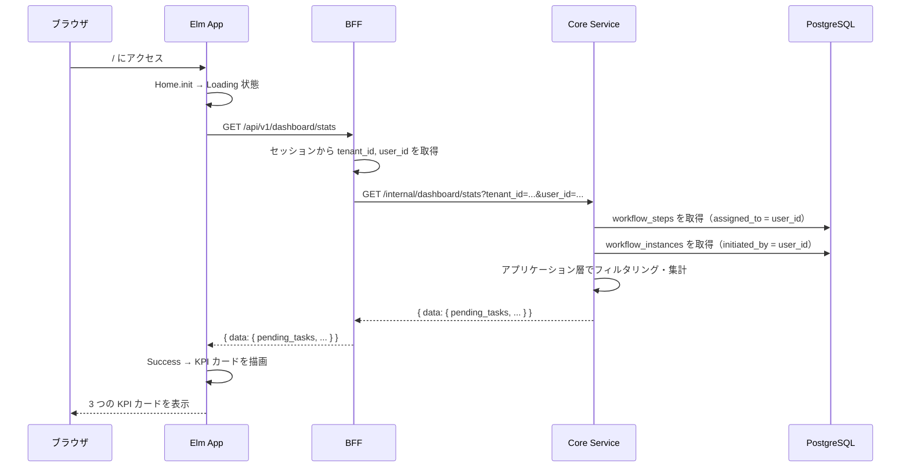
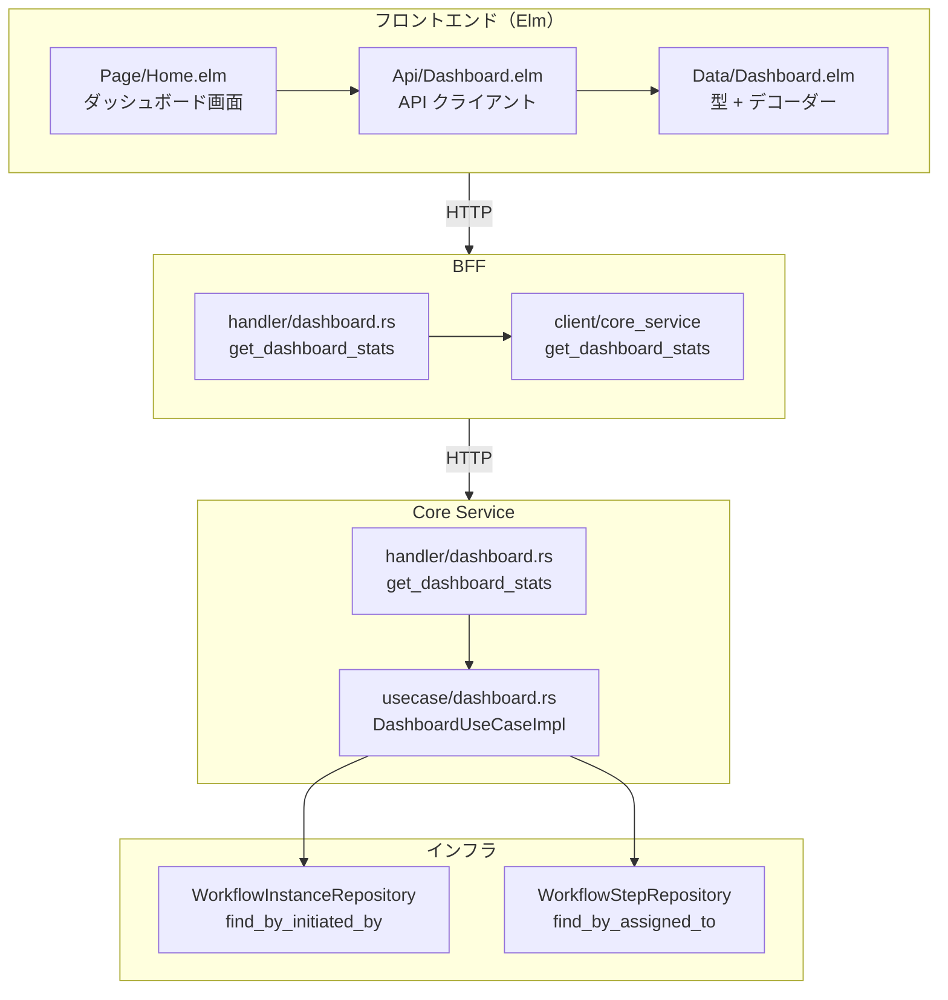
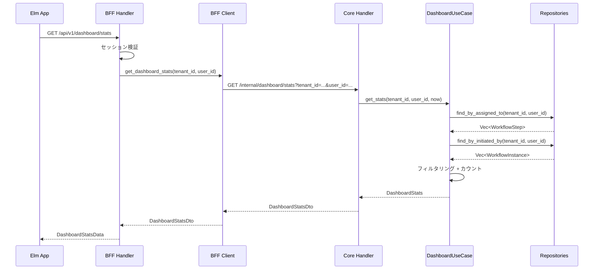

# ダッシュボード - 機能解説

対応 PR: #166
対応 Issue: #38

## 概要

ホームページ（`/`）をダッシュボード化し、ログインユーザーの KPI 統計情報を表示する。承認待ちタスク数・申請中ワークフロー数・本日完了タスク数の 3 つの指標をカード形式で表示し、各カードから対応するフィルタ付き一覧ページへ遷移できる。

## 背景

### ホームページの課題

実装前のホームページ（`/`）は静的なウェルカムメッセージのみを表示する Stateless ページだった。ユーザーは自身のタスク状況を把握するために都度一覧ページへ遷移する必要があった。

### ダッシュボードの位置づけ

ワークフロー管理システムでは、ログイン直後に「自分が今何をすべきか」を一目で把握できることが重要。KPI 統計情報をホームページに集約することで、ユーザーの意思決定を支援する。

### Issue 全体の構成

Issue #38 は 1 つの PR（#166）で完結する単一スコープの実装。OpenAPI 仕様定義からフロントエンドまでのフルスタック実装を 5 Phase で段階的に進めた。

## 用語・概念

| 用語 | 説明 | 関連コード |
|------|------|-----------|
| KPI | ダッシュボードに表示する 3 つの統計指標 | `DashboardStats` |
| Nested TEA | Elm で各ページが独自の Model / Msg / update を持つパターン | `Page.Home` |
| RemoteData | API 呼び出しの状態（NotAsked / Loading / Failure / Success）を型で管理するパターン | `krisajenkins/remotedata` |
| BFF プロキシ | BFF がセッションからユーザー情報を取得し、Core Service に転送するパターン | `WorkflowState` |

## フロー

### 統計情報取得フロー

ユーザーがホームページにアクセスしてから KPI カードが表示されるまでの流れ。

## アーキテクチャ

## データフロー

### フロー 1: 統計情報取得

#### 処理ステップ

| # | レイヤー | ファイル:関数 | 処理内容 |
|---|---------|-------------|---------|
| 1 | フロントエンド | `Api/Dashboard.elm:getStats` | `GET /api/v1/dashboard/stats` を送信 |
| 2 | BFF | `handler/dashboard.rs:get_dashboard_stats` | セッション検証、Core Service 呼び出し |
| 3 | BFF Client | `client/core_service/task_client.rs:get_dashboard_stats` | Core Service の内部 API を呼び出し |
| 4 | Core Service | `handler/dashboard.rs:get_dashboard_stats` | クエリパラメータ抽出、ユースケース呼び出し |
| 5 | ユースケース | `usecase/dashboard.rs:get_stats` | リポジトリ呼び出し + フィルタリング + 集計 |
| 6 | フロントエンド | `Page/Home.elm:update` | `GotDashboardStats` で Model を更新、KPI カード描画 |

## KPI 定義

3 つの統計指標の定義とフィルタ条件。

| KPI | 説明 | データソース | フィルタ条件 |
|-----|------|------------|-------------|
| 承認待ちタスク数 | 自分にアサインされた処理待ちステップ | `workflow_steps` | `status = Active`, `assigned_to = user_id` |
| 申請中ワークフロー数 | 自分が申請した承認中インスタンス | `workflow_instances` | `status = InProgress`, `initiated_by = user_id` |
| 本日完了タスク数 | 自分にアサインされた本日完了ステップ | `workflow_steps` | `status = Completed`, `completed_at >= today 00:00 UTC`, `assigned_to = user_id` |

## 設計判断

機能・仕組みレベルの判断を記載する。コード実装レベルの判断は[コード解説](./02_コード解説.md#設計解説)を参照。

### 1. アプリケーション層でのフィルタリング vs SQL カウントクエリ

統計情報を取得する方法として、SQL で直接カウントする方法と、既存リポジトリメソッドの結果をアプリケーション層でフィルタリングする方法がある。

| 案 | パフォーマンス | 実装コスト | 既存コードへの影響 |
|----|-------------|-----------|-----------------|
| **アプリケーション層フィルタリング（採用）** | データ量依存 | 低（既存メソッド再利用） | なし |
| SQL COUNT + WHERE | 高い | 中（新規クエリメソッド追加） | リポジトリトレイト拡張 |

**採用理由**: MVP フェーズではデータ量が少なく、既存の `find_by_assigned_to` / `find_by_initiated_by` を再利用することで実装コストを最小化できる。データ量が増加した時点で SQL カウントクエリへの移行を検討する。

### 2. BFF の State 再利用 vs ダッシュボード専用 State

BFF でダッシュボードハンドラが使う State を、既存の `WorkflowState` に相乗りさせるか、専用の State を作るかの判断。

| 案 | DI の複雑さ | State 型の増加 | 依存の明確さ |
|----|-----------|--------------|------------|
| **WorkflowState を再利用（採用）** | 低い | なし | やや不明確 |
| DashboardState を新設 | やや高い | +1 | 明確 |

**採用理由**: ダッシュボードが必要とする依存（`CoreServiceClient`、`SessionManager`）は `WorkflowState` が既に保持している。MVP では State 型を増やすオーバーヘッドよりも再利用の簡潔さを優先する。

### 3. Home ページの Stateful 化パターン

ダッシュボードは API からデータを取得するため、Stateless ページから Stateful ページへの変換が必要。

| 案 | ページの独立性 | Main.elm の複雑さ | 既存パターンとの一貫性 |
|----|-------------|----------------|--------------------|
| **Nested TEA（採用）** | 高い（独自 Model/Msg/update） | 定型的な統合コード | 他ページと同じ |
| Main.elm で直接管理 | 低い | 複雑化 | パターン不一致 |

**採用理由**: 他のページ（WorkflowList、TaskList 等）と同じ Nested TEA パターンを踏襲し、一貫性を保つ。

### 4. KPI カードのナビゲーション

KPI カードをクリック可能にし、対応するフィルタ付き一覧ページへ遷移させる。

| KPI カード | リンク先 | フィルタ |
|-----------|---------|---------|
| 承認待ちタスク | タスク一覧 | なし（デフォルトで自分のタスク） |
| 申請中 | ワークフロー一覧 | `status=InProgress` |
| 本日完了 | ワークフロー一覧 | `completedToday=true` |

## 関連ドキュメント

- [コード解説](./02_コード解説.md)
- [OpenAPI 仕様書](../../../openapi/openapi.yaml)（`GET /api/v1/dashboard/stats`）
