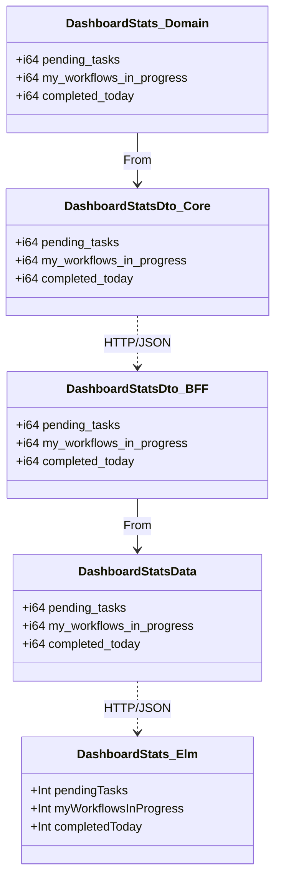
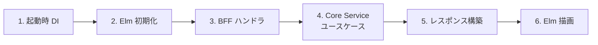
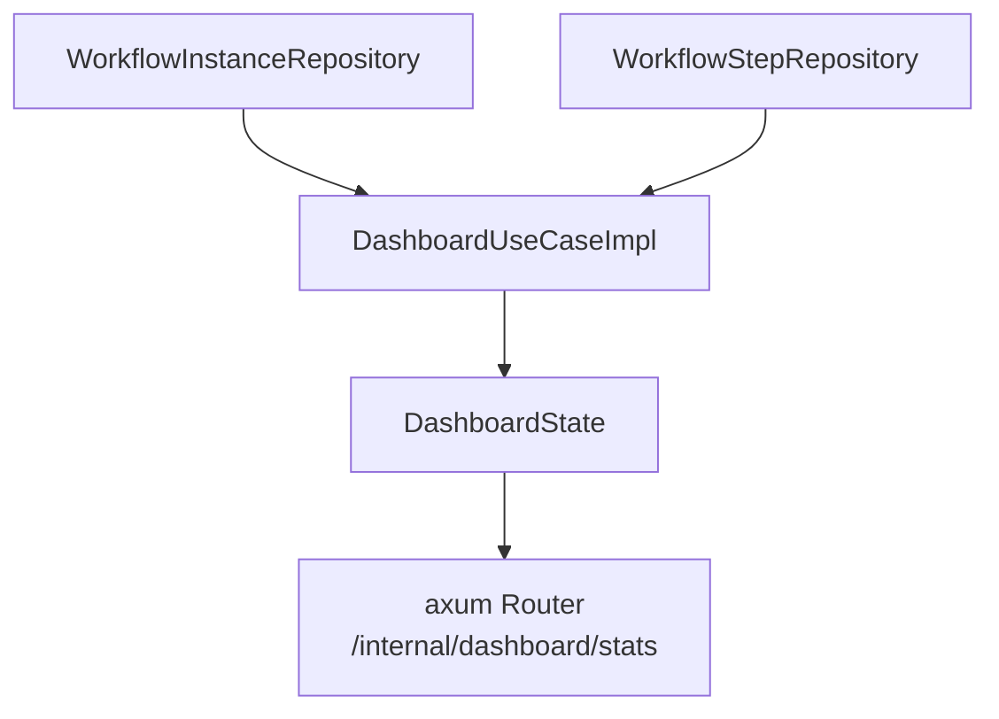
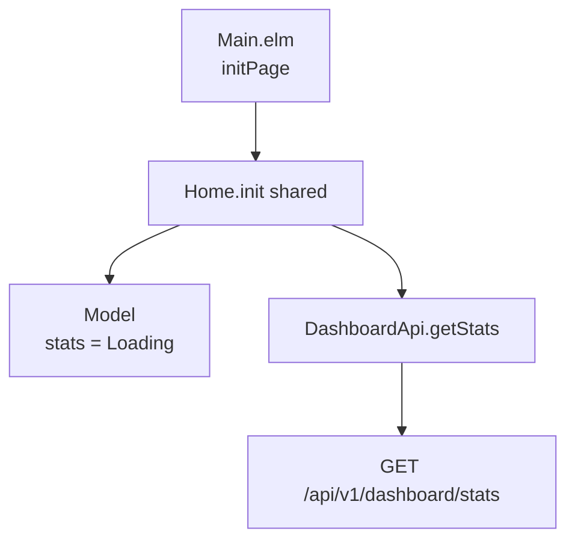
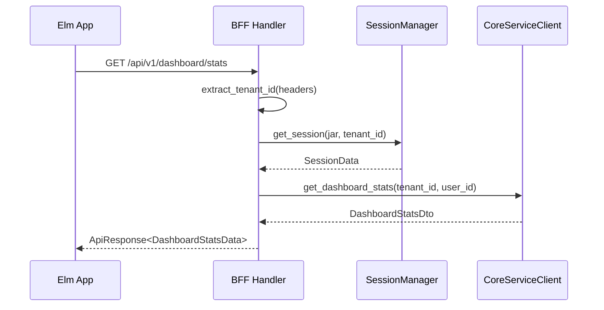
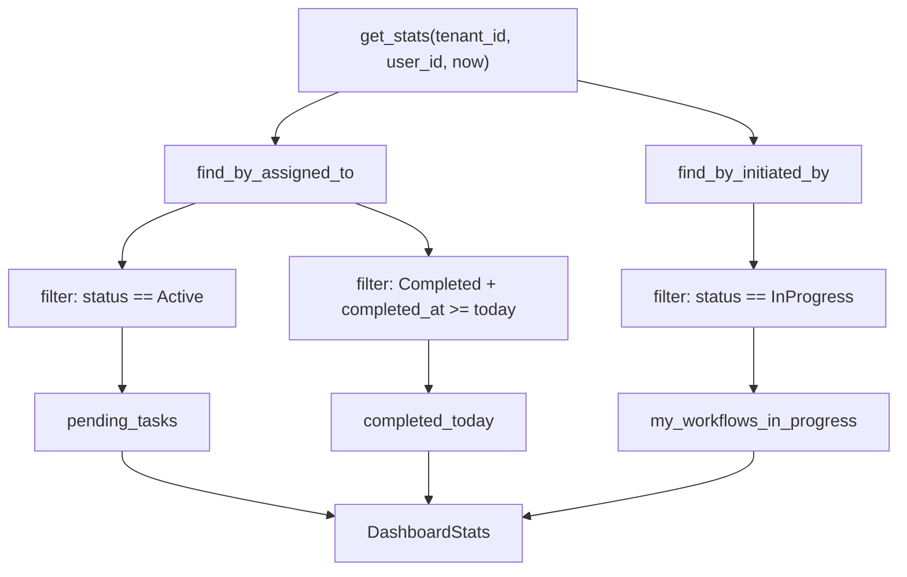
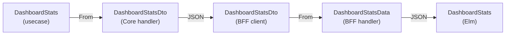
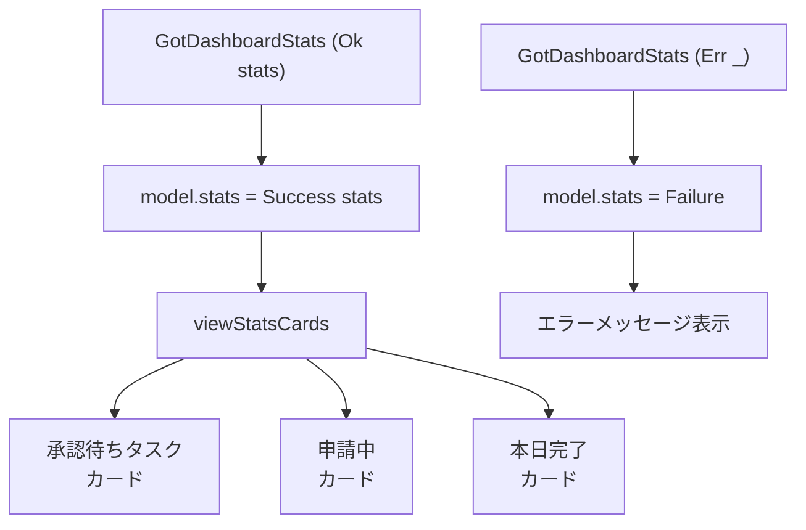
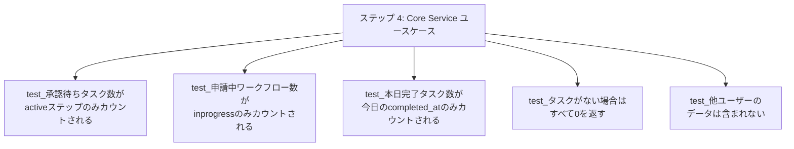

# ダッシュボード - コード解説

対応 PR: #166
対応 Issue: #38

## 主要な型・関数

| 型/関数 | ファイル | 責務 |
|--------|---------|------|
| `DashboardStats` | [`usecase/dashboard.rs:26`](../../../backend/apps/core-service/src/usecase/dashboard.rs) | ユースケース層の統計情報構造体 |
| `DashboardUseCaseImpl` | [`usecase/dashboard.rs:33`](../../../backend/apps/core-service/src/usecase/dashboard.rs) | 統計集計ロジック |
| `DashboardState` | [`handler/dashboard.rs:21`](../../../backend/apps/core-service/src/handler/dashboard.rs) | Core Service のハンドラ State |
| `DashboardStatsDto`（Core） | [`handler/dashboard.rs:27`](../../../backend/apps/core-service/src/handler/dashboard.rs) | Core Service レスポンス DTO |
| `DashboardStatsDto`（BFF） | [`client/core_service/types.rs:170`](../../../backend/apps/bff/src/client/core_service/types.rs) | BFF が受け取る Core のレスポンス型 |
| `DashboardStatsData` | [`handler/dashboard.rs:31`](../../../backend/apps/bff/src/handler/dashboard.rs) | BFF の公開レスポンス型 |
| `DashboardStats`（Elm） | [`Data/Dashboard.elm:29`](../../../frontend/src/Data/Dashboard.elm) | フロントエンドの統計情報型 |
| `getStats` | [`Api/Dashboard.elm:32`](../../../frontend/src/Api/Dashboard.elm) | API クライアント関数 |
| `Model` | [`Page/Home.elm:32`](../../../frontend/src/Page/Home.elm) | ダッシュボード画面の状態 |

### 型の関係



各レイヤーで同じフィールド構成の型を持つが、責務が異なる。Core Service 内は `From` トレイトで変換し、サービス間は JSON を介する。

## コードフロー

コードをライフサイクル順に追う。各ステップの構造を図で示した後、対応するコードを解説する。



### 1. 起動時の DI 構成（アプリケーション起動時）

Core Service の `main.rs` で `DashboardUseCaseImpl` を構築し、`DashboardState` に注入する。



```rust
// core-service/src/main.rs:190-192
let dashboard_usecase = DashboardUseCaseImpl::new(instance_repo, step_repo); // ①
let dashboard_state = Arc::new(DashboardState {
   usecase: dashboard_usecase, // ②
});
```

注目ポイント:

- ① 既存の `WorkflowInstanceRepository` と `WorkflowStepRepository` を再利用。ダッシュボード専用のリポジトリは不要
- ② `DashboardState` はユースケースのみを保持するシンプルな構造

```rust
// core-service/src/main.rs:250-251
.route("/internal/dashboard/stats", get(get_dashboard_stats))
.with_state(dashboard_state)
```

BFF 側では `WorkflowState` を再利用し、ルートのみ追加:

```rust
// bff/src/main.rs:224
.route("/api/v1/dashboard/stats", get(get_dashboard_stats))
```

### 2. Elm 初期化（ページ遷移時）

ユーザーがホームページに遷移すると `Home.init` が呼ばれ、即座に API リクエストを発行する。



```elm
-- Page/Home.elm:40-49
init : Shared -> ( Model, Cmd Msg )
init shared =
    ( { shared = shared
      , stats = Loading  -- ①
      }
    , DashboardApi.getStats  -- ②
        { config = Shared.toRequestConfig shared
        , toMsg = GotDashboardStats
        }
    )
```

注目ポイント:

- ① 初期状態は `Loading`。`NotAsked` を経由しない（init 時に即座にリクエストするため）
- ② `DashboardApi.getStats` が `GotDashboardStats` メッセージを返す Cmd を生成

Main.elm での Nested TEA 統合:

```elm
-- Main.elm:77（Page 型）
HomePage Home.Model

-- Main.elm:269（Msg 型）
HomeMsg Home.Msg

-- Main.elm:179（initPage）
( HomePage model, Cmd.map HomeMsg cmd )
```

### 3. BFF ハンドラ（HTTP リクエスト受信時）

BFF はセッションからユーザー情報を抽出し、Core Service に内部リクエストを転送する。



```rust
// bff/src/handler/dashboard.rs:52-84
pub async fn get_dashboard_stats(
   State(state): State<Arc<WorkflowState>>,  // ①
   headers: HeaderMap,
   jar: CookieJar,
) -> impl IntoResponse {
   let tenant_id = match extract_tenant_id(&headers) {
      Ok(id) => id,
      Err(e) => return e.into_response(),
   };

   let session_data = match get_session(state.session_manager.as_ref(), &jar, tenant_id).await {  // ②
      Ok(data) => data,
      Err(response) => return response,
   };

   match state
      .core_service_client
      .get_dashboard_stats(  // ③
         *session_data.tenant_id().as_uuid(),
         *session_data.user_id().as_uuid(),
      )
      .await
   {
      Ok(core_response) => {
         let response = ApiResponse::new(DashboardStatsData::from(core_response.data));  // ④
         (StatusCode::OK, Json(response)).into_response()
      }
      Err(e) => {
         tracing::error!("ダッシュボード統計取得で内部エラー: {}", e);
         internal_error_response()
      }
   }
}
```

注目ポイント:

- ① `WorkflowState` を再利用。ダッシュボード専用の State は作らない
- ② セッション Cookie から `tenant_id` と `user_id` を安全に取得
- ③ Core Service の内部 API にクエリパラメータとして転送
- ④ `DashboardStatsDto` → `DashboardStatsData` への変換（`From` トレイト）

### 4. Core Service ユースケース（ビジネスロジック）

統計情報の集計ロジック。既存リポジトリメソッドの結果をアプリケーション層でフィルタリングする。



```rust
// usecase/dashboard.rs:52-101
pub async fn get_stats(
    &self,
    tenant_id: TenantId,
    user_id: UserId,
    now: DateTime<Utc>,  // ①
) -> Result<DashboardStats, CoreError> {
    // 1. 承認待ちタスク数
    let my_steps = self.step_repo
        .find_by_assigned_to(&tenant_id, &user_id).await
        .map_err(|e| CoreError::Internal(format!("ステップ取得エラー: {}", e)))?;

    let pending_tasks = my_steps.iter()
        .filter(|s| s.status() == WorkflowStepStatus::Active)  // ②
        .count() as i64;

    // 2. 申請中ワークフロー数
    let my_instances = self.instance_repo
        .find_by_initiated_by(&tenant_id, &user_id).await
        .map_err(|e| CoreError::Internal(format!("インスタンス取得エラー: {}", e)))?;

    let my_workflows_in_progress = my_instances.iter()
        .filter(|i| i.status() == WorkflowInstanceStatus::InProgress)  // ③
        .count() as i64;

    // 3. 本日完了タスク数
    let today_start = now.date_naive().and_hms_opt(0, 0, 0).unwrap();
    let today_start_utc = today_start.and_utc();  // ④

    let completed_today = my_steps.iter()
        .filter(|s| {
            s.status() == WorkflowStepStatus::Completed
                && s.completed_at()
                    .is_some_and(|completed| completed >= today_start_utc)  // ⑤
        })
        .count() as i64;

    Ok(DashboardStats { pending_tasks, my_workflows_in_progress, completed_today })
}
```

注目ポイント:

- ① `now` を引数で受け取ることでテスタビリティを確保（ステップ 5 でテスト時に固定値を渡す）
- ② `my_steps` から Active なステップのみをフィルタ（承認待ち）
- ③ `my_instances` から InProgress なインスタンスのみをフィルタ（申請中）
- ④ UTC 基準で「今日の 00:00」を計算
- ⑤ `is_some_and` で `Option<DateTime<Utc>>` を安全にチェック（Completed かつ今日の完了）

### 5. レスポンス構築（Core Service → BFF → Elm）

Core Service のユースケース結果がレスポンスとして各レイヤーを通過する。



Core Service ハンドラでの変換:

```rust
// handler/dashboard.rs:59
let response = ApiResponse::new(DashboardStatsDto::from(stats));
```

BFF での変換:

```rust
// bff/handler/dashboard.rs:76
let response = ApiResponse::new(DashboardStatsData::from(core_response.data));
```

全レイヤーで `ApiResponse<T>` エンベロープ（`{ "data": ... }`）を使用し、JSON 構造を統一する。

### 6. Elm での描画（レスポンス受信時）

API レスポンスを受け取り、RemoteData パターンで状態を更新して KPI カードを描画する。



```elm
-- Page/Home.elm:67-76
update : Msg -> Model -> ( Model, Cmd Msg )
update msg model =
    case msg of
        GotDashboardStats result ->
            case result of
                Ok stats ->
                    ( { model | stats = Success stats }, Cmd.none )  -- ①

                Err err ->
                    ( { model | stats = Failure err }, Cmd.none )  -- ②
```

注目ポイント:

- ① 成功時は `Success stats` に更新。追加のコマンドは不要
- ② エラー時は `Failure err` に更新。エラー詳細をモデルに保持

KPI カードの描画:

```elm
-- Page/Home.elm:124-148
viewStatsCards : DashboardStats -> Html Msg
viewStatsCards stats =
    div [ class "mt-4 grid gap-4 sm:grid-cols-3" ]
        [ viewStatCardLink
            { label = "承認待ちタスク"
            , value = stats.pendingTasks
            , route = Route.Tasks  -- ①
            }
        , viewStatCardLink
            { label = "申請中"
            , value = stats.myWorkflowsInProgress
            , route = Route.Workflows { status = Just InProgress, completedToday = False }  -- ②
            }
        , viewStatCardLink
            { label = "本日完了"
            , value = stats.completedToday
            , route = Route.Workflows { status = Nothing, completedToday = True }  -- ③
            }
        ]
```

注目ポイント:

- ① 承認待ちタスクカードはタスク一覧にリンク
- ② 申請中カードは `status=InProgress` フィルタ付きワークフロー一覧にリンク
- ③ 本日完了カードは `completedToday=true` フィルタ付きワークフロー一覧にリンク

## テスト

各テストがライフサイクルのどのステップを検証しているかを示す。



| テスト | 検証対象 | 検証内容 |
|-------|---------|---------|
| `test_承認待ちタスク数がactiveステップのみカウントされる` | ステップ 4 | Active のみカウント、Pending は除外 |
| `test_申請中ワークフロー数がinprogressのみカウントされる` | ステップ 4 | InProgress のみカウント、Draft・Approved は除外 |
| `test_本日完了タスク数が今日のcompleted_atのみカウントされる` | ステップ 4 | 今日の completed_at のみカウント |
| `test_タスクがない場合はすべて0を返す` | ステップ 4 | 空データでゼロ値 |
| `test_他ユーザーのデータは含まれない` | ステップ 4 | ユーザーごとのデータ分離 |

テストは全てユースケース層の単体テスト。Mock リポジトリを使用してリポジトリ操作をスタブ化し、フィルタリングロジックを検証する。

### 実行方法

```bash
cd backend && cargo test --package ringiflow-core-service dashboard
```

## 設計解説

コード実装レベルの判断を記載する。機能・仕組みレベルの判断は[機能解説](./01_ダッシュボード_機能解説.md#設計判断)を参照。

### 1. テスタビリティのための `now` パラメータ

場所: `usecase/dashboard.rs:56`

```rust
pub async fn get_stats(
    &self,
    tenant_id: TenantId,
    user_id: UserId,
    now: DateTime<Utc>,  // テスト時に固定値を渡せる
) -> Result<DashboardStats, CoreError>
```

なぜこの実装か:
「本日完了」の判定に現在時刻が必要だが、テスト内で `Utc::now()` を直接使うと実行タイミングに依存して不安定になる。時刻を引数で受け取ることで、テストから任意の日時を注入できる。

代替案:

| 案 | メリット | デメリット | 判断 |
|----|---------|-----------|------|
| **引数渡し（採用）** | シンプル、明示的 | 呼び出し側が毎回 now を渡す | 採用 |
| `Clock` トレイト | DI として柔軟 | 抽象化のオーバーヘッド | 見送り（このユースケースでは過剰） |
| テストで日付境界を避ける | 実装変更なし | flaky test のリスク | 見送り |

### 2. DashboardState の設計

場所: `core-service/src/handler/dashboard.rs:21`

```rust
pub struct DashboardState {
   pub usecase: crate::usecase::DashboardUseCaseImpl,
}
```

なぜこの実装か:
axum のハンドラは `State` エクストラクタで型安全に状態を取得する。各ドメイン（ワークフロー、ダッシュボード）が専用の State 型を持つことで、ハンドラが必要な依存のみを受け取る。

代替案:

| 案 | メリット | デメリット | 判断 |
|----|---------|-----------|------|
| **ドメイン別 State（採用）** | 依存が明確、型安全 | State 型が増える | 採用 |
| 全ユースケース統合 AppState | 型が 1 つで済む | ハンドラが不要な依存を持つ | 見送り |

### 3. `From` トレイトによるレイヤー間型変換

場所: `handler/dashboard.rs:33-41`, `bff/handler/dashboard.rs:37-45`

```rust
impl From<DashboardStats> for DashboardStatsDto {
   fn from(stats: DashboardStats) -> Self {
      Self {
         pending_tasks: stats.pending_tasks,
         my_workflows_in_progress: stats.my_workflows_in_progress,
         completed_today: stats.completed_today,
      }
   }
}
```

なぜこの実装か:
ユースケース層の `DashboardStats` とハンドラ層の `DashboardStatsDto` はフィールドが同一だが、`Serialize` の責務をハンドラ層に限定するため型を分離している。`From` トレイトでゼロコスト変換を実現する。

### 4. Elm の RemoteData パターン

場所: `Page/Home.elm:34`

```elm
type alias Model =
    { shared : Shared
    , stats : RemoteData ApiError DashboardStats
    }
```

なぜこの実装か:
`krisajenkins/remotedata` パッケージの `RemoteData e a` 型で API 呼び出しの 4 状態（NotAsked / Loading / Failure / Success）を型レベルで管理する。View 関数で pattern match することで、状態の漏れなく UI を描画できる。

### 5. エンベロープデコーダーのネスト

場所: `Data/Dashboard.elm:46-55`

```elm
decoder : Decoder DashboardStats
decoder =
    Decode.field "data" statsDecoder

statsDecoder : Decoder DashboardStats
statsDecoder =
    Decode.succeed DashboardStats
        |> required "pending_tasks" Decode.int
        |> required "my_workflows_in_progress" Decode.int
        |> required "completed_today" Decode.int
```

なぜこの実装か:
API レスポンスの `{ "data": { ... } }` エンベロープを `decoder` で剥がし、内側の `statsDecoder` でフィールドをデコードする 2 段構成。`json-decode-pipeline` の `required` で snake_case のフィールド名を指定し、Elm の camelCase レコードフィールドにマッピングする。

## 関連ドキュメント

- [機能解説](./01_ダッシュボード_機能解説.md)
- [OpenAPI 仕様書](../../../openapi/openapi.yaml)（`GET /api/v1/dashboard/stats`）
