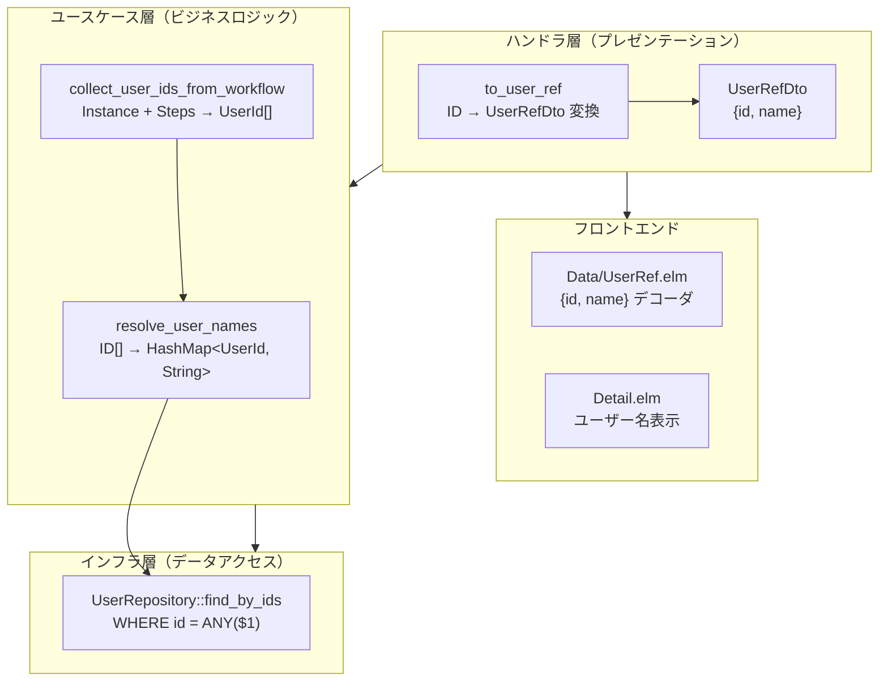

# ユーザー名解決 - 機能解説

対応 PR: #197
対応 Issue: #196

## 概要

API レスポンスの `initiated_by`（申請者）/ `assigned_to`（承認者）を UUID 文字列から `UserRef { id, name }` オブジェクトに変更し、フロントエンドでユーザー名を直接表示できるようにする。ユーザー名はユースケース層で一括解決し、N+1 問題を回避する。

## 背景

### 変更前の課題

申請詳細画面・タスク詳細画面で、申請者や承認者が UUID 文字列（例: `018dfa3b-...`）のまま表示されていた。ユーザーにとって意味のない情報であり、UX を損なっていた。

```json
// Before: UUID 文字列
{
  "initiated_by": "018dfa3b-1234-...",
  "steps": [{ "assigned_to": "018dfa3b-5678-..." }]
}
```

### 変更後

```json
// After: UserRef オブジェクト
{
  "initiated_by": { "id": "018dfa3b-1234-...", "name": "田中太郎" },
  "steps": [{ "assigned_to": { "id": "018dfa3b-5678-...", "name": "鈴木花子" } }]
}
```

## 用語・概念

| 用語 | 説明 | 関連コード |
|------|------|-----------:|
| UserRef | ユーザー ID と名前のペア。API レスポンスでユーザーを参照する際の標準形式 | `UserRefDto`, `Data/UserRef.elm` |
| ユーザー名解決 | ユーザー ID から名前を取得する処理。一括クエリで N+1 を回避 | `resolve_user_names` |
| ID 収集 | ワークフロー内の全ユーザー ID（initiated_by + assigned_to）を重複なく収集 | `collect_user_ids_from_workflow` |

## アーキテクチャ



## データフロー

### フロー 1: ワークフロー詳細取得時のユーザー名解決

```mermaid
sequenceDiagram
    participant FE as フロントエンド
    participant BFF as BFF
    participant Core as Core Service
    participant UC as WorkflowUseCase
    participant UserRepo as UserRepository
    participant DB as PostgreSQL

    FE->>BFF: GET /workflows/:id
    BFF->>Core: GET /workflows/:id
    Core->>UC: get_workflow(id)
    UC->>UC: collect_user_ids_from_workflow<br/>(initiated_by + assigned_to)
    UC->>UserRepo: find_by_ids(user_ids)
    UserRepo->>DB: SELECT WHERE id = ANY($1)
    DB-->>UserRepo: Vec&lt;User&gt;
    UserRepo-->>UC: HashMap&lt;UserId, String&gt;
    UC-->>Core: (instance, steps, user_names)
    Core->>Core: to_user_ref で DTO 変換
    Core-->>BFF: JSON (UserRef オブジェクト)
    BFF-->>FE: JSON (UserRef オブジェクト)
    FE->>FE: UserRef.decoder でデコード
    FE->>FE: ユーザー名表示
```

#### 処理ステップ

| # | レイヤー | ファイル:関数 | 処理内容 |
|---|---------|-------------|---------:|
| 1 | ユースケース | `workflow.rs:collect_user_ids_from_workflow` | `initiated_by` + 各ステップの `assigned_to` を収集、重複排除 |
| 2 | ユースケース | `usecase.rs:resolve_user_names` | 空チェック → `find_by_ids` → `HashMap<UserId, String>` に変換 |
| 3 | インフラ | `user_repository.rs:find_by_ids` | `WHERE id = ANY($1)` で一括取得 |
| 4 | ハンドラ | `handler/workflow.rs:to_user_ref` | `UserId` + `HashMap` → `UserRefDto { id, name }` に変換 |
| 5 | フロントエンド | `Data/UserRef.elm:decoder` | JSON → `UserRef { id, name }` にデコード |

## 設計判断

機能・仕組みレベルの判断を記載する。コード実装レベルの判断は[コード解説](./02_ユーザー名解決_コード解説.md#設計解説)を参照。

### 1. ユーザー名解決の実行場所: ユースケース層 vs ハンドラ層

ユーザー名解決をどのレイヤーで行うか。

| 案 | レイヤー違反 | コード量 | 一貫性 |
|----|-----------|---------|--------|
| **ユースケース層（採用）** | なし（handler → usecase → repo） | やや多い（メソッド委譲） | 高い |
| ハンドラ層 | あり（handler → repo 直接呼び出し） | 少ない | 低い（割れ窓） |
| ドメインサービス | なし | 多い | ドメイン層がインフラ依存 |
| BFF で解決 | なし | N+1 問題（追加 API コール） | 低い |

**採用理由**: ハンドラから直接リポジトリを呼ぶのはレイヤードアーキテクチャの違反であり、割れ窓になる。ユースケース層に `resolve_user_names` メソッドを配置し、`handler → usecase → repository` の依存方向を維持する。

### 2. 一括取得 vs 個別取得

複数のユーザー ID をどう解決するか。

| 案 | クエリ回数 | 実装 |
|----|----------|------|
| **一括取得（採用）** | 1 回（`WHERE id = ANY($1)`） | `find_by_ids` |
| 個別取得 | N 回 | `find_by_id` × N |

**採用理由**: ワークフロー 1 件に複数のステップがあり、各ステップに `assigned_to` がある。個別取得は N+1 問題を引き起こす。`WHERE id = ANY($1)` で 1 回のクエリにまとめる。

### 3. 不明ユーザーのフォールバック

ユーザーが削除されている場合にどう表示するか。

| 案 | UX | データ整合性 |
|----|-----|------------|
| **フォールバック文字列（採用）** | 良い（表示が途切れない） | 低い（実際の名前ではない） |
| エラーを返す | 悪い（画面が壊れる） | 高い |
| 空文字を返す | 中（表示は途切れないが不自然） | 低い |

**採用理由**: 「（不明なユーザー）」にフォールバックし、`warn!` ログを出力する。ユーザー削除は異常系であり、表示を壊すよりもフォールバックが適切。

## 関連ドキュメント

- [コード解説](./02_ユーザー名解決_コード解説.md)
