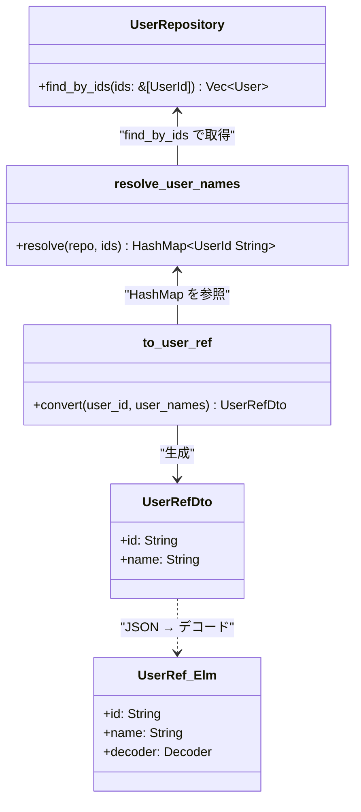
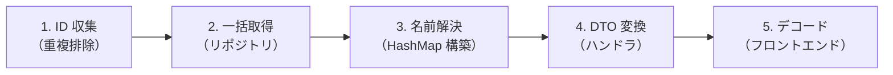
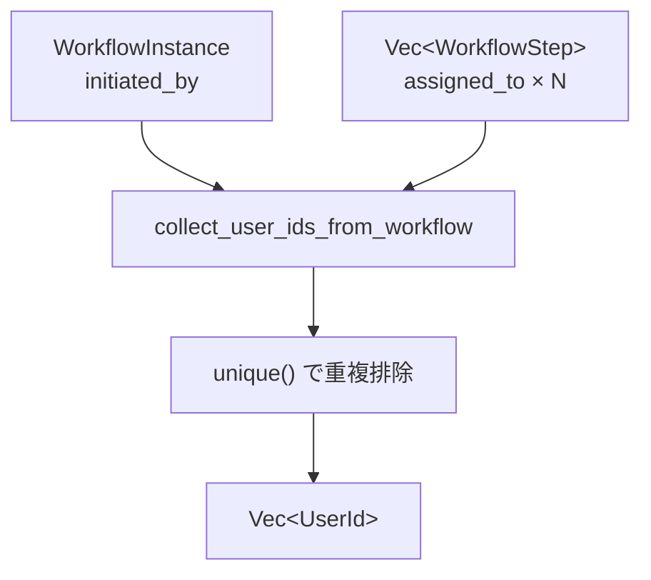
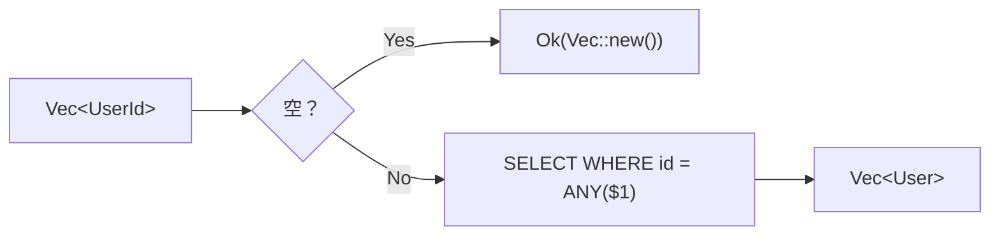
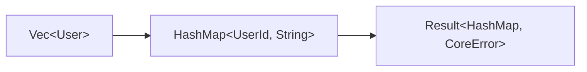
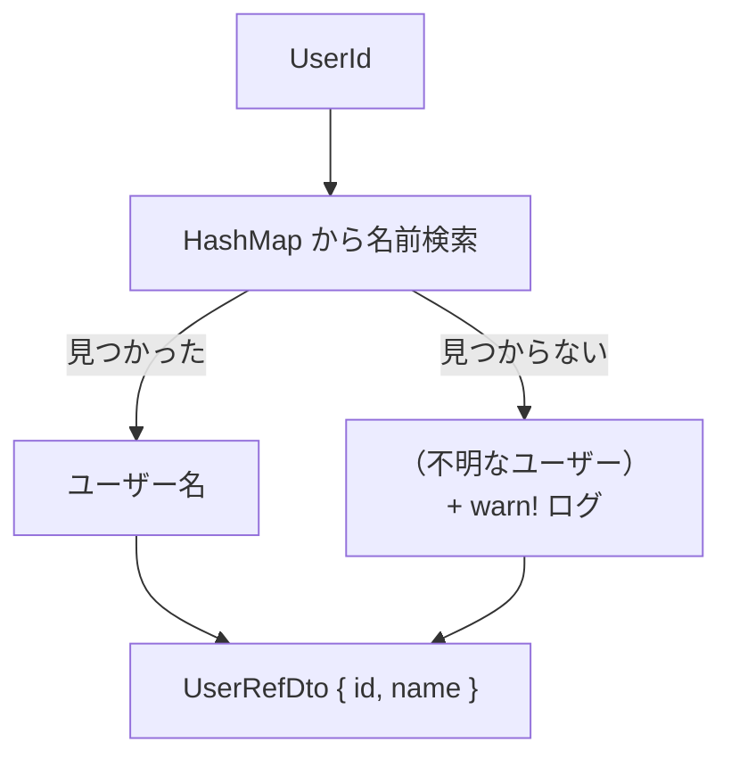
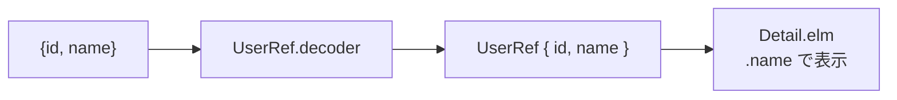

# ユーザー名解決 - コード解説

対応 PR: #197
対応 Issue: #196

## 主要な型・関数

| 型/関数 | ファイル | 責務 |
|--------|---------|------|
| `find_by_ids` | [`user_repository.rs:237`](../../../backend/crates/infra/src/repository/user_repository.rs) | `&[UserId]` → `Vec<User>` 一括取得 |
| `resolve_user_names` | [`usecase.rs:38`](../../../backend/apps/core-service/src/usecase.rs) | 共有関数。ID 配列 → `HashMap<UserId, String>` |
| `collect_user_ids_from_workflow` | [`usecase/workflow.rs:70`](../../../backend/apps/core-service/src/usecase/workflow.rs) | Instance + Steps → 重複なし `Vec<UserId>` |
| `UserRefDto` | [`handler/workflow.rs:100`](../../../backend/apps/core-service/src/handler/workflow.rs) | `{ id: String, name: String }` DTO |
| `to_user_ref` | [`handler/workflow.rs:113`](../../../backend/apps/core-service/src/handler/workflow.rs) | `UserId` + HashMap → `UserRefDto` 変換 |
| `UserRef` | [`Data/UserRef.elm:32`](../../../frontend/src/Data/UserRef.elm) | フロントエンドの UserRef 型 + デコーダ |

### 型の関係



## コードフロー

コードをライフサイクル順に追う。各ステップの構造を図で示した後、対応するコードを解説する。



### 1. ID 収集（重複排除）

ワークフロー内の全ユーザー ID を収集し、重複を排除する。



```rust
// backend/apps/core-service/src/usecase/workflow.rs:70
pub(crate) fn collect_user_ids_from_workflow(
    instance: &WorkflowInstance,
    steps: &[WorkflowStep],
) -> Vec<UserId> {
    let mut ids = vec![instance.initiated_by().clone()];  // ① 申請者
    for step in steps {
        ids.push(step.assigned_to().clone());              // ② 各ステップの承認者
    }
    ids.into_iter().unique().collect()                      // ③ 重複排除
}
```

注目ポイント:

- ① `initiated_by` は必ず 1 つ存在
- ② 各ステップの `assigned_to` を追加。同一ユーザーが複数ステップに割り当てられる場合がある
- ③ `itertools::unique()` で重複排除。`UserId` は `Hash + Eq` を実装しているが `Ord` は未実装のため、`sort() + dedup()` は使用不可

### 2. 一括取得（リポジトリ）

`WHERE id = ANY($1)` で 1 回のクエリにまとめる。



```rust
// backend/crates/infra/src/repository/user_repository.rs:237
async fn find_by_ids(&self, ids: &[UserId]) -> Result<Vec<User>, InfraError> {
    if ids.is_empty() {
        return Ok(Vec::new());           // ① 空配列の早期リターン
    }
    // ...
    // WHERE id = ANY($1) で一括取得     // ② N+1 回避
}
```

注目ポイント:

- ① 空配列チェックで不要な DB アクセスを回避
- ② `ANY($1)` パターンで ID の数に関係なく 1 回のクエリ

### 3. 名前解決（HashMap 構築）

取得したユーザー一覧から `HashMap<UserId, String>` を構築する。



```rust
// backend/apps/core-service/src/usecase.rs:38
pub(crate) async fn resolve_user_names(
    user_repo: &dyn UserRepository,
    user_ids: &[UserId],
) -> Result<HashMap<UserId, String>, CoreError> {
    if user_ids.is_empty() {
        return Ok(HashMap::new());                   // ① 早期リターン
    }
    let users = user_repo.find_by_ids(user_ids).await
        .map_err(CoreError::Internal)?;              // ② エラーマッピング
    let map = users.into_iter()
        .map(|u| (u.id().clone(), u.name().to_string()))
        .collect();                                   // ③ HashMap 構築
    Ok(map)
}
```

注目ポイント:

- ① リポジトリと同様に空配列の早期リターン
- ② `InfraError` → `CoreError::Internal` へのエラーマッピング
- ③ `into_iter()` で所有権を移動し、`(UserId, String)` のタプルから `HashMap` を構築

### 4. DTO 変換（ハンドラ）

`UserId` と `HashMap` から `UserRefDto` を生成する。



```rust
// backend/apps/core-service/src/handler/workflow.rs:100-120
#[derive(Debug, Clone, Serialize)]
pub(crate) struct UserRefDto {
    pub id: String,
    pub name: String,
}

fn to_user_ref(
    user_id: &UserId,
    user_names: &HashMap<UserId, String>,
) -> UserRefDto {
    let name = user_names
        .get(user_id)
        .cloned()
        .unwrap_or_else(|| {
            warn!("User not found: {}", user_id);     // ① 警告ログ
            "（不明なユーザー）".to_string()              // ② フォールバック
        });
    UserRefDto {
        id: user_id.to_string(),
        name,
    }
}
```

注目ポイント:

- ① ユーザーが見つからない場合は `warn!` ログを出力。異常系のモニタリングに活用
- ② フォールバック文字列でフロントエンドの表示を壊さない

### 5. デコード（フロントエンド）

Elm で `UserRef` 型にデコードし、ビューで名前を表示する。



```elm
-- frontend/src/Data/UserRef.elm:32-48
type alias UserRef =
    { id : String
    , name : String
    }

decoder : Decoder UserRef
decoder =
    Decode.succeed UserRef
        |> Pipeline.required "id" Decode.string
        |> Pipeline.required "name" Decode.string
```

注目ポイント:

- `Json.Decode.Pipeline` パターンを使用。フィールド順序が明示的で可読性が高い
- `WorkflowInstance.elm` と `Task.elm` のデコーダが、UUID 文字列の `Decode.string` から `UserRef.decoder` に変更

## テスト

| テスト | 検証対象のステップ | 検証内容 |
|-------|------------------|---------:|
| `test_複数idでユーザーを一括取得できる` | 2 | 複数 ID で正しく取得 |
| `test_存在しないidが含まれても取得できるものだけ返す` | 2 | 存在しない ID を無視 |
| `test_空のid配列を渡すと空vecを返す` | 2 | 空配列で空 Vec を返す |

### 実行方法

```bash
just test-rust-integration  # DB 接続が必要
```

## 設計解説

コード実装レベルの判断を記載する。機能・仕組みレベルの判断は[機能解説](./01_ユーザー名解決_機能解説.md#設計判断)を参照。

### 1. `resolve_user_names` の配置: usecase.rs（親モジュール）

場所: `backend/apps/core-service/src/usecase.rs:38`

```rust
pub(crate) async fn resolve_user_names(
    user_repo: &dyn UserRepository,
    user_ids: &[UserId],
) -> Result<HashMap<UserId, String>, CoreError> { ... }
```

なぜこの実装か:

`resolve_user_names` は Workflow と Task の両方のユースケースから使われる。各ユースケースの `impl` ブロックにメソッドとして持たせると重複するため、`usecase.rs`（親モジュール）に `pub(crate)` の共有関数として配置し、各ユースケースのメソッドから委譲する。

代替案:

| 案 | メリット | デメリット | 判断 |
|----|---------|-----------|------|
| 親モジュールの共有関数（採用） | 重複なし、`pub(crate)` で内部公開 | 親モジュールの肥大化リスク | 採用 |
| トレイトのデフォルト実装 | 型制約で安全 | 過度な抽象化 | 見送り |
| 各ユースケースに複製 | 独立性 | コード重複 | 見送り |

### 2. `itertools::unique()` による重複排除

場所: `backend/apps/core-service/src/usecase/workflow.rs:70`

```rust
ids.into_iter().unique().collect()
```

なぜこの実装か:

`UserId` は `Hash + Eq` を実装しているが `Ord` は未実装。`sort() + dedup()` パターンは `Ord` が必要なため使用不可。`itertools::unique()` は `Hash + Eq` のみで重複排除を実現する。

代替案:

| 案 | メリット | デメリット | 判断 |
|----|---------|-----------|------|
| `itertools::unique()`（採用） | `Ord` 不要、簡潔 | itertools 依存（既に使用中） | 採用 |
| `HashSet` 経由 | 標準ライブラリのみ | コードが冗長 | 見送り |
| `Ord` を `UserId` に追加 | `sort + dedup` 使用可能 | UUID に順序は不自然 | 見送り |

### 3. From トレイトから明示的変換関数への移行

場所: `backend/apps/core-service/src/handler/workflow.rs:113`

```rust
fn to_user_ref(user_id: &UserId, user_names: &HashMap<UserId, String>) -> UserRefDto
```

なぜこの実装か:

`From` トレイトは `fn from(value: T) -> Self` というシグネチャが固定されており、追加の引数（ユーザー名マップ）を渡せない。DTO 変換に外部コンテキストが必要になったため、明示的な関数に移行した。

代替案:

| 案 | メリット | デメリット | 判断 |
|----|---------|-----------|------|
| 明示的関数（採用） | 柔軟にコンテキスト渡し | `From` の自動変換が使えない | 採用 |
| `impl From<(UserId, &HashMap)>` | `From` トレイト準拠 | タプルの `From` は可読性低 | 見送り |
| コンテキスト構造体を作成 | `From` 使用可能 | 変換のたびに構造体作成で冗長 | 見送り |

## 関連ドキュメント

- [機能解説](./01_ユーザー名解決_機能解説.md)
