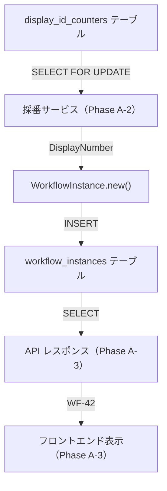

# 表示用 ID - 実装解説

## 概要

ワークフローインスタンスに人間が読みやすい連番 ID（`WF-42` 形式）を付与する機能。
UUID v7（内部 ID）と連番（表示用 ID）の二重 ID 体制を導入する。

### 対応 Issue

[#204 表示用 ID](https://github.com/ka2kama/ringiflow/issues/204)（Epic）

## Phase 構成

| Phase | 内容 | 状態 | 解説 |
|-------|------|------|------|
| Phase A-1 | DB スキーマ変更 | ✅ 完了 | [解説](./01_PhaseA1_DBスキーマ変更.md) |
| Phase A-2 | 採番サービス | ✅ 完了 | [解説](./02_PhaseA2_採番サービス.md) |
| Phase A-3 | API + フロントエンド | ✅ 完了 | [解説](./03_PhaseA3_APIとフロントエンド.md) |
| Phase B | workflow_steps への展開 | ✅ 完了 | — |
| Phase C | Workflow API の URL パスパラメータに display_number を使用 | ✅ 完了 | [解説](./04_PhaseC_URLパスパラメータ.md) |
| Phase D | Task API の URL パスパラメータに display_number を使用 | ✅ 完了 | [解説](./05_PhaseD_TaskAPI_URLパスパラメータ.md) |

## 設計書

- [表示用 ID 設計](../../03_詳細設計書/12_表示用ID設計.md)
- [データベース設計](../../03_詳細設計書/02_データベース設計.md)

## アーキテクチャ

Phase A-1 は A, C, D の基盤を整備した。
Phase A-2 は B の採番サービスを実装した。
Phase A-3 は E, F の API レスポンスとフロントエンド表示を実装した。
