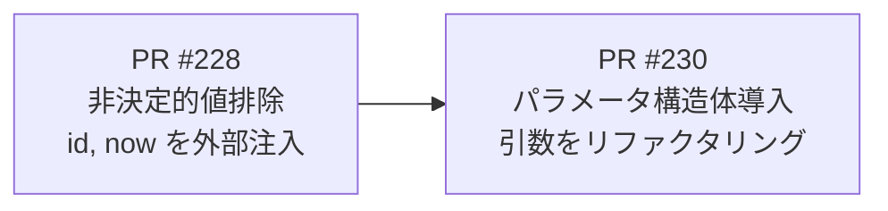
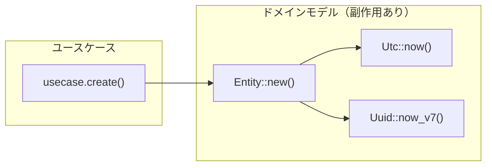
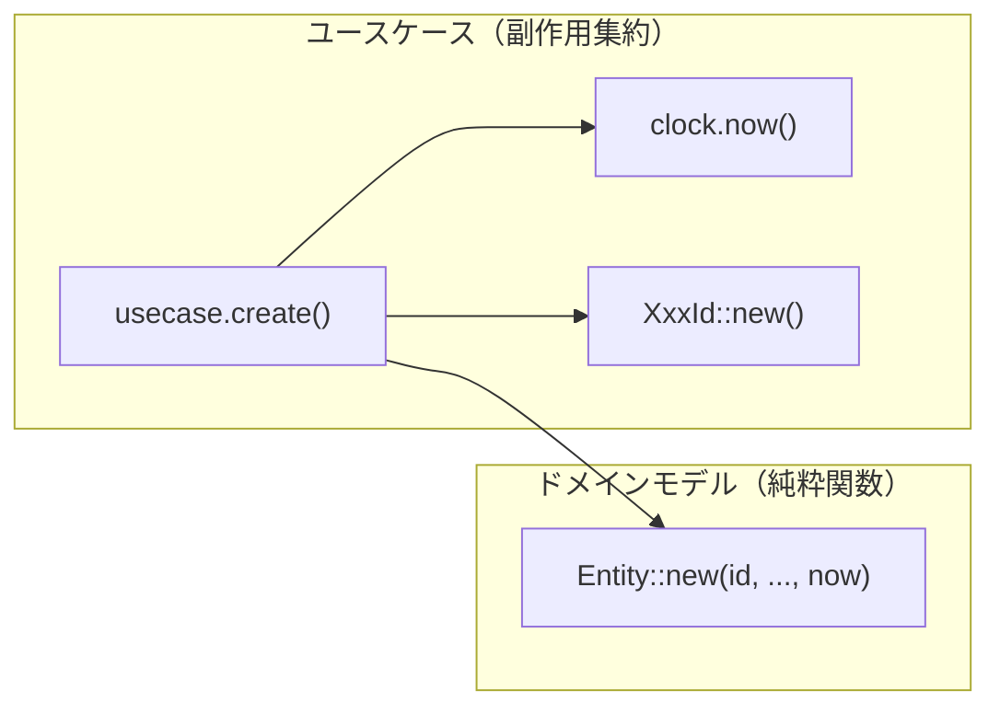
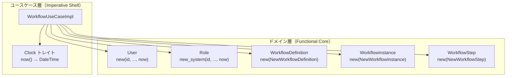
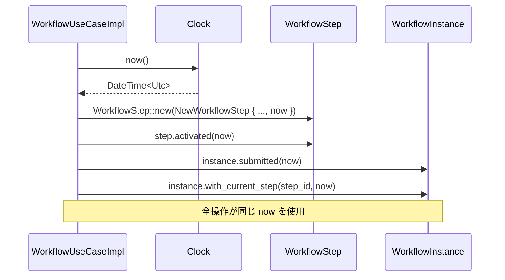

# ドメインモデル非決定的値排除 - 機能解説

対応 PR: #228, #230
対応 Issue: #222

## 概要

ドメインモデル（User, Role, Workflow 系エンティティ）のコンストラクタ・状態遷移メソッドから `Utc::now()` / `Uuid::now_v7()` の直接呼び出しを排除し、呼び出し元から値を注入する形に変更するリファクタリング。これにより Functional Core, Imperative Shell パターンを確立し、ドメインモデルの全メソッドを決定的（同じ入力 → 同じ出力）にした。

PR #228 で非決定的値の排除を実施し、PR #230 で増加した引数をパラメータ構造体で整理した。

## 背景

### 変更前の課題

ドメインモデルのコンストラクタと状態遷移メソッドが内部で `Utc::now()` や `Uuid::now_v7()` を呼び出していた。

```rust
// 変更前: User::new() 内で副作用が発生
pub fn new(tenant_id: TenantId, email: String, ...) -> Self {
    let now = Utc::now();       // 副作用: 呼び出すたびに異なる値
    Self {
        id: UserId::new(),      // 副作用: Uuid::now_v7()
        created_at: now,
        updated_at: now,
        ..
    }
}
```

この設計には以下の問題がある:

- テストで `created_at` / `updated_at` の値を正確に検証できない（実行タイミングに依存）
- 1つのユースケース操作内で複数のエンティティが生成される場合、タイムスタンプにミリ秒単位のずれが生じる
- ドメインモデルが副作用を持つことで、純粋関数としての推論が困難

### 変更の動機

- ドメインモデルを Functional Core（副作用なし、決定的）にすることで、テスタビリティと推論容易性を向上させる
- タイムスタンプの一貫性を保証する（1ユースケース = 1タイムスタンプ）
- Rust + DDD のベストプラクティスに沿った設計にする

### Issue 全体の構成

Issue #222 は 2 つの PR で段階的に実施された。



| PR | 内容 | 状態 |
|----|------|------|
| #228 | 全エンティティの `id`, `now` を外部注入に変更 | マージ済み |
| #230 | 増加した引数をパラメータ構造体で整理 | マージ済み |

## 用語・概念

| 用語 | 説明 | 関連コード |
|------|------|-----------:|
| Functional Core | 副作用を持たず、入力に対して決定的な出力を返すドメインモデル層 | `domain/src/user.rs`, `domain/src/workflow/` |
| Imperative Shell | 副作用（時刻取得、ID 生成、DB 操作）を担当するユースケース層 | `usecase/workflow/command.rs` |
| パラメータ構造体 | コンストラクタの多数の引数を名前付きフィールドにまとめた構造体 | `NewWorkflowInstance`, `WorkflowInstanceRecord` |
| 固定タイムスタンプ | テストで使用する決定的な時刻値。rstest の `#[fixture]` で注入 | `DateTime::from_timestamp(1_700_000_000, 0)` |

## ビフォー・アフター

### Before（変更前）



- エンティティのコンストラクタ内で `Utc::now()` / `Uuid::now_v7()` を呼び出し
- テストで `created_at`, `updated_at` の正確な値を検証不可能
- 複数エンティティ間でタイムスタンプがずれる可能性

### After（変更後）



#### 改善点

- ドメインモデルが完全に決定的（同じ入力 → 同じ出力）
- テストで固定タイムスタンプを注入し、正確に検証可能
- 1ユースケース = 1タイムスタンプで一貫性を保証
- パラメータ構造体により引数が名前付きで可読性向上

## アーキテクチャ



## データフロー

### フロー 1: ワークフロー申請（タイムスタンプの伝播）

1つのユースケース操作内で同じ `now` が全エンティティに伝播する例。



#### 処理ステップ

| # | レイヤー | ファイル:関数 | 処理内容 |
|---|---------|-------------|---------:|
| 1 | ユースケース | `usecase/workflow/command.rs:submit_workflow` | `self.clock.now()` で時刻を1回取得 |
| 2 | ドメイン | `workflow/step.rs:WorkflowStep::new` | パラメータ構造体から `now` を受け取り `created_at`, `updated_at` に設定 |
| 3 | ドメイン | `workflow/step.rs:activated` | 同じ `now` を受け取り `started_at`, `updated_at` に設定 |
| 4 | ドメイン | `workflow/instance.rs:submitted` | 同じ `now` を受け取り `submitted_at`, `updated_at` に設定 |
| 5 | ドメイン | `workflow/instance.rs:with_current_step` | 同じ `now` を受け取り `updated_at` に設定 |

## 設計判断

機能・仕組みレベルの判断を記載する。コード実装レベルの判断は[コード解説](./02_コード解説.md#設計解説)を参照。

### 1. 非決定的値の排除方式: 引数注入 vs Clock トレイト注入 vs テスト用 mock

ドメインモデルから非決定的値（`Utc::now()`, `Uuid::now_v7()`）をどう排除するか。

| 案 | テスタビリティ | 侵入度 | 並列テスト安全性 |
|----|-------------|--------|----------------|
| **引数注入（採用）** | 高い（固定値を直接渡せる） | 低い（シグネチャ変更のみ） | 安全（状態共有なし） |
| Clock トレイト注入 | 高い | 高い（エンティティに依存注入） | 安全 |
| `#[cfg(test)]` mock | 中程度 | 低い | 危険（グローバル状態操作） |

**採用理由**: 引数として `id` と `now` を渡す方式が最もシンプルで、Rust のドメインモデルに自然に馴染む。エンティティにトレイトオブジェクトを持たせる Clock 注入は過度な抽象化であり、グローバル mock は並列テストで問題が起きる。

### 2. タイムスタンプの取得単位: ユースケースメソッド冒頭で1回 vs 操作ごとに取得

1つのユースケース操作内で `now` を何回取得するか。

| 案 | 一貫性 | 精度 | 実装コスト |
|----|--------|------|-----------|
| **ユースケース冒頭で1回（採用）** | 高い（全操作が同一タイムスタンプ） | 操作開始時点 | 低い |
| 操作ごとに取得 | 低い（ミリ秒ずれ） | 各操作時点 | 低い |
| DB トランザクション時刻 | 高い | DB 時刻 | 高い（DB 依存） |

**採用理由**: `let now = self.clock.now();` をユースケースメソッドの冒頭で1回取得し、全ドメイン操作に渡すことで、`created_at` と `updated_at` の一貫性を保証する。DB タイムスタンプはドメインモデルの DB 非依存性を損なうため不採用。

### 3. `is_overdue()` の `now` 引数化: 引数で渡す vs 内部で取得

読み取り専用の判定メソッドにも `now` を引数で渡すべきか。

| 案 | 一貫性 | テスタビリティ | API の簡潔さ |
|----|--------|-------------|------------|
| **引数で渡す（採用）** | 高い（全メソッド統一） | 高い（固定値で検証可能） | やや冗長 |
| 内部で `Utc::now()` | 低い（例外が存在） | 低い（テスト困難） | 簡潔 |

**採用理由**: 「読み取り専用だから許容」という判断もあり得るが、全メソッドを決定的にするという一貫性と、「期限切れ/期限内」の両方を確実にテストできるテスタビリティを優先した。

## 関連ドキュメント

- [コード解説](./02_コード解説.md)
- [ナレッジベース: Functional Core, Imperative Shell](https://blog.ploeh.dk/2020/03/02/impureim-sandwich/)
