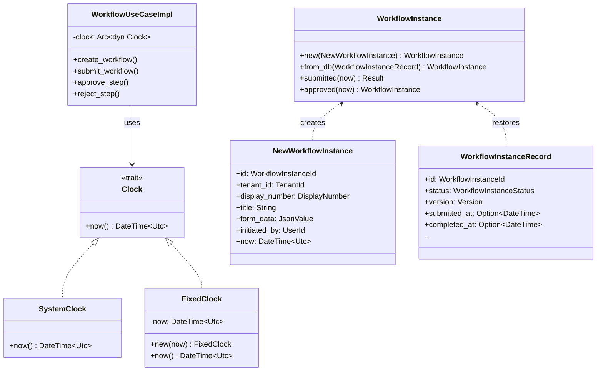
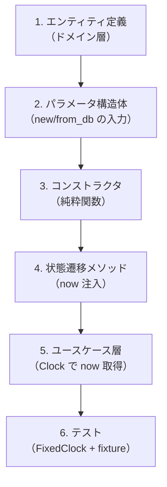
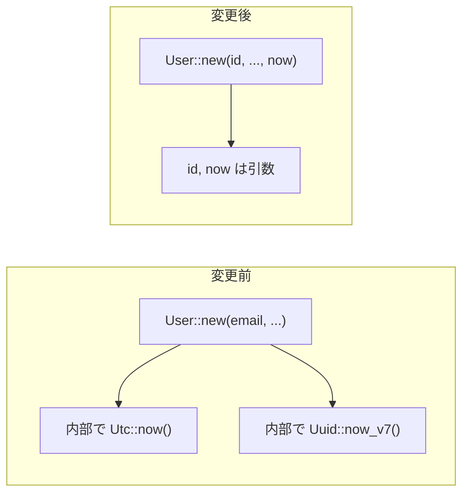
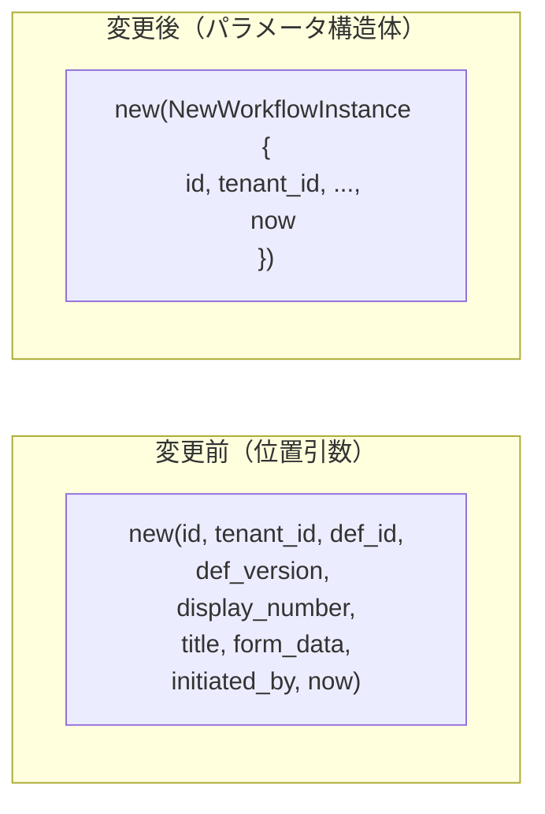
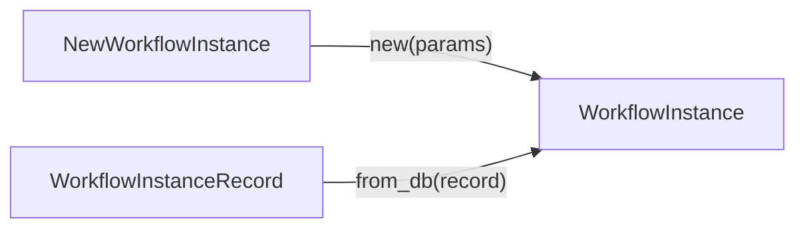
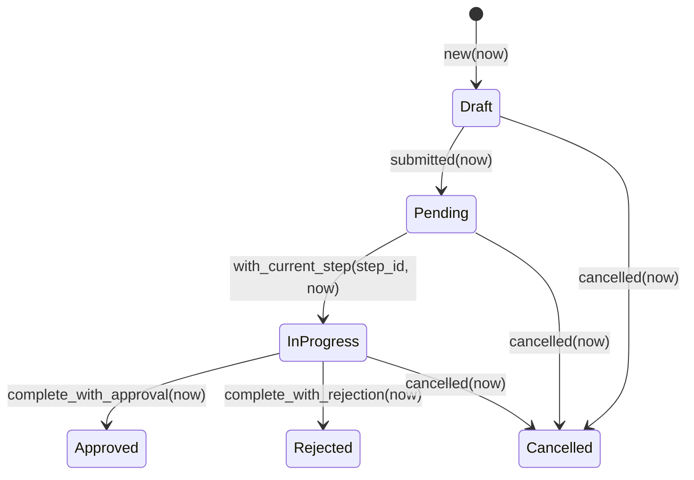
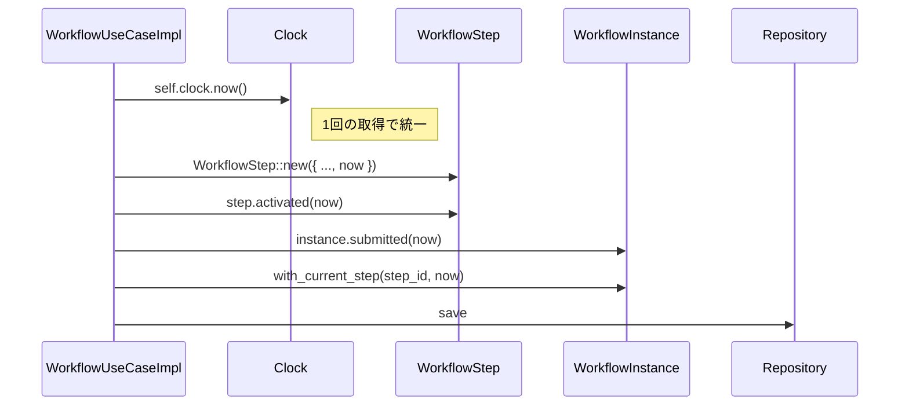
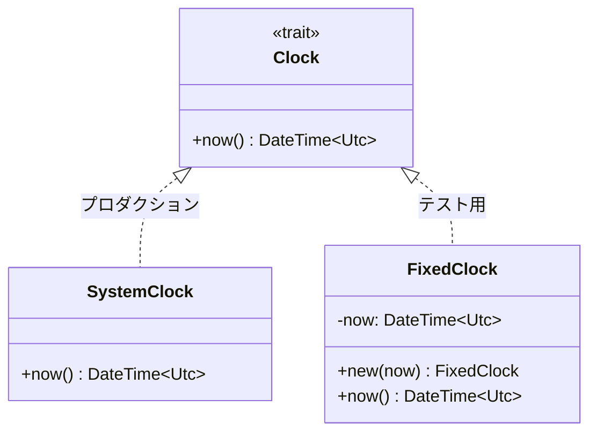
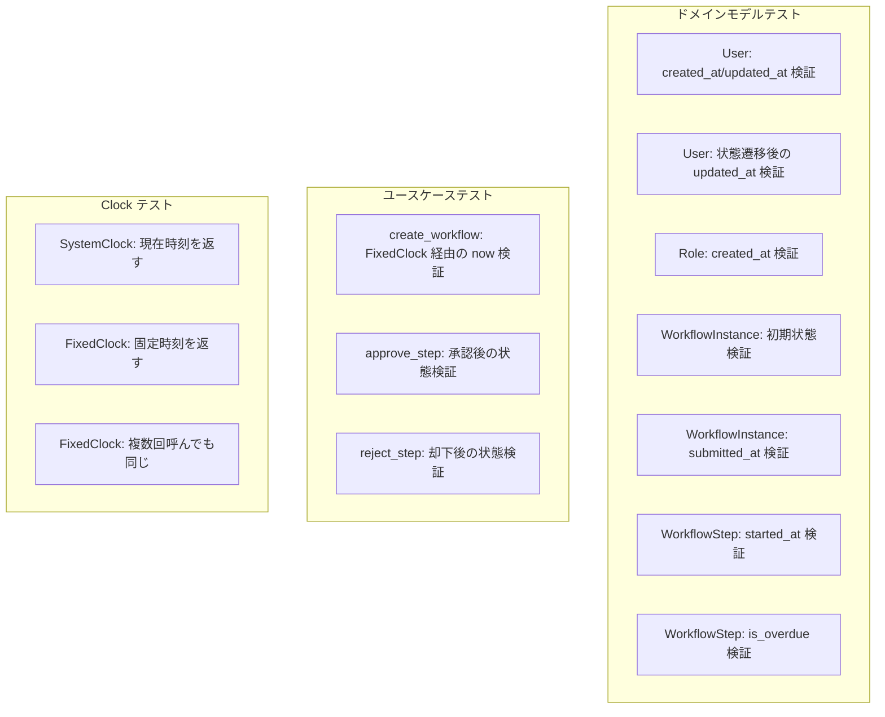

# ドメインモデル非決定的値排除 - コード解説

対応 PR: #228, #230
対応 Issue: #222

## 主要な型・関数

| 型/関数 | ファイル | 責務 |
|--------|---------|------:|
| `User::new` | [`user.rs:227`](../../../backend/crates/domain/src/user.rs) | ユーザー作成（`id`, `now` 外部注入） |
| `Role::new_system` | [`role.rs:139`](../../../backend/crates/domain/src/role.rs) | システムロール作成（`id`, `now` 外部注入） |
| `NewWorkflowDefinition` | [`definition.rs:93`](../../../backend/crates/domain/src/workflow/definition.rs) | 定義の新規作成パラメータ構造体 |
| `NewWorkflowInstance` | [`instance.rs:116`](../../../backend/crates/domain/src/workflow/instance.rs) | インスタンスの新規作成パラメータ構造体 |
| `NewWorkflowStep` | [`step.rs:132`](../../../backend/crates/domain/src/workflow/step.rs) | ステップの新規作成パラメータ構造体 |
| `Clock` | [`clock.rs:9`](../../../backend/crates/domain/src/clock.rs) | 時刻プロバイダトレイト |
| `FixedClock` | [`clock.rs:24`](../../../backend/crates/domain/src/clock.rs) | テスト用固定時刻実装 |
| `WorkflowUseCaseImpl` | [`usecase/workflow.rs:83`](../../../backend/apps/core-service/src/usecase/workflow.rs) | ユースケース（Imperative Shell） |

### 型の関係



## コードフロー

コードをライフサイクル順に追う。各ステップの構造を図で示した後、対応するコードを解説する。



### 1. エンティティの副作用排除（PR #228 の核心）

全エンティティのコンストラクタ・状態遷移メソッドから `Utc::now()` / `Uuid::now_v7()` を排除した。



```rust
// user.rs:227-246
pub fn new(
    id: UserId,                    // ① 呼び出し元で生成
    tenant_id: TenantId,
    display_number: DisplayNumber,
    email: Email,
    name: UserName,
    now: DateTime<Utc>,            // ② 呼び出し元で取得
) -> Self {
    Self {
        id,
        // ...
        status: UserStatus::Active,
        last_login_at: None,
        created_at: now,            // ③ 注入された値をそのまま使用
        updated_at: now,
    }
}
```

注目ポイント:

- ① `id` はユースケース層で `UserId::new()`（内部で `Uuid::now_v7()`）を呼び出して生成
- ② `now` はユースケース層で `clock.now()` を呼び出して取得
- ③ ドメインモデル内では副作用が一切なく、渡された値をそのまま設定

### 2. パラメータ構造体の導入（PR #230）

PR #228 で `id`, `now` が追加されたことで引数が増加し、`WorkflowInstance::new()` は 9 引数に達した。PR #230 でパラメータ構造体を導入し、位置引数を名前付きフィールドに置換した。



パラメータ構造体は `new` 用と `from_db` 用の 2 種類を各エンティティに定義した。

```rust
// instance.rs:116-126 — 新規作成パラメータ
pub struct NewWorkflowInstance {
    pub id: WorkflowInstanceId,
    pub tenant_id: TenantId,
    pub definition_id: WorkflowDefinitionId,
    pub definition_version: Version,
    pub display_number: DisplayNumber,
    pub title: String,
    pub form_data: JsonValue,
    pub initiated_by: UserId,
    pub now: DateTime<Utc>,          // ① now もフィールドとして含む
}

// instance.rs:129-145 — DB 復元パラメータ
pub struct WorkflowInstanceRecord {
    pub id: WorkflowInstanceId,
    // ... 全フィールドを含む（status, version, submitted_at 等）
    pub created_at: DateTime<Utc>,
    pub updated_at: DateTime<Utc>,
}
```

注目ポイント:

- ① `NewXxx` 構造体は `now` を含み、`created_at` / `updated_at` は含まない（コンストラクタが `now` から設定）
- `XxxRecord` 構造体はエンティティの全フィールドを含む（DB からの復元用）

### 3. コンストラクタの実装（パラメータ構造体受け取り）



```rust
// instance.rs:149-167 — new: 初期値を設定
impl WorkflowInstance {
    pub fn new(params: NewWorkflowInstance) -> Self {
        Self {
            id: params.id,
            tenant_id: params.tenant_id,
            // ...
            status: WorkflowInstanceStatus::Draft,  // ① 初期値はドメインが決定
            version: Version::initial(),              // ② 初期バージョン
            current_step_id: None,
            submitted_at: None,
            completed_at: None,
            created_at: params.now,                   // ③ 注入された now
            updated_at: params.now,
        }
    }
}
```

注目ポイント:

- ① `status`, `version`, `submitted_at` 等の初期値はドメインモデルが決定する（ビジネスルール）
- ② `Version::initial()` は常に `1` を返す決定的関数
- ③ `now` は外部から注入された値をそのまま使用

### 4. 状態遷移メソッド（now 注入）

全状態遷移メソッドが `now: DateTime<Utc>` を引数として受け取る。



```rust
// instance.rs:265-278 — submitted: 状態遷移 + now 注入
pub fn submitted(self, now: DateTime<Utc>) -> Result<Self, DomainError> {
    if self.status != WorkflowInstanceStatus::Draft {
        return Err(DomainError::Validation(
            "下書き状態でのみ申請可能です".to_string(),
        ));
    }
    Ok(Self {
        status: WorkflowInstanceStatus::Pending,
        submitted_at: Some(now),    // ① submitted_at にも now を使用
        updated_at: now,
        ..self                       // ② 他のフィールドは不変
    })
}
```

注目ポイント:

- ① `submitted_at` と `updated_at` が同じ `now` で設定され、一貫性を保証
- ② `..self` で所有権を移動し、変更対象以外のフィールドをそのまま引き継ぐ（Rust の Functional Update Syntax）

### 5. ユースケース層（Imperative Shell）

ユースケース層が `Clock` トレイト経由で `now` を取得し、全ドメイン操作に渡す。



```rust
// usecase/workflow/command.rs:145-172 — submit_workflow
pub async fn submit_workflow(&self, ...) -> Result<WorkflowInstance, CoreError> {
    // ...
    let now = self.clock.now();                       // ① Clock 経由で1回取得
    let step = WorkflowStep::new(NewWorkflowStep {
        id: WorkflowStepId::new(),                    // ② ID 生成はユースケース層
        // ...
        now,                                           // ③ 同じ now を渡す
    });
    let active_step = step.activated(now);             // ④ 同じ now
    let submitted_instance = instance.submitted(now)?; // ⑤ 同じ now
    let in_progress_instance =
        submitted_instance.with_current_step("approval".to_string(), now); // ⑥ 同じ now
    // ...
}
```

注目ポイント:

- ① `self.clock.now()` でユースケースメソッド冒頭に1回だけ時刻を取得
- ② `WorkflowStepId::new()` など ID 生成もユースケース層の責務
- ③〜⑥ すべてのドメイン操作に同一の `now` を渡すことで、タイムスタンプの一貫性を保証

### 6. Clock トレイトとテスト用実装



```rust
// clock.rs:9-11 — トレイト定義
pub trait Clock: Send + Sync {
    fn now(&self) -> DateTime<Utc>;
}

// clock.rs:14-20 — プロダクション実装
pub struct SystemClock;
impl Clock for SystemClock {
    fn now(&self) -> DateTime<Utc> {
        Utc::now()                   // ① 実際のシステム時刻
    }
}

// clock.rs:24-40 — テスト用実装
#[cfg(any(test, feature = "test-support"))]
pub struct FixedClock {
    now: DateTime<Utc>,
}
impl Clock for FixedClock {
    fn now(&self) -> DateTime<Utc> {
        self.now                     // ② 固定時刻を返す
    }
}
```

注目ポイント:

- ① `SystemClock` はプロダクションで使用し、`Utc::now()` を呼び出す
- ② `FixedClock` はテストで使用し、コンストラクタで渡された固定時刻を常に返す
- `#[cfg(any(test, feature = "test-support"))]` でテスト時のみコンパイルされる

## テスト

各テストがライフサイクルのどのステップを検証しているかを示す。



| テスト | 検証対象のステップ | 検証内容 |
|-------|------------------|---------:|
| `test_新規ユーザーのcreated_atとupdated_atは注入された値と一致する` | 1, 3 | `now` フィクスチャの値が `created_at`, `updated_at` に設定される |
| `test_ステータス変更後の状態` | 4 | 状態遷移で `updated_at` が新しい `now` に更新される |
| `test_ロールの初期状態` | 1, 3 | Role の `created_at`, `updated_at` が注入値と一致 |
| `test_新規作成の初期状態`（Instance） | 2, 3 | パラメータ構造体経由の初期値が正しく設定される |
| `test_申請後の状態` | 4 | `submitted_at` が `now` に設定される |
| `test_アクティブ化後の状態` | 4 | `started_at` が `now` に設定される |
| `test_is_overdue_期限切れの場合trueを返す` | 4 | `now` が `due_date` を超過すると true |
| `test_is_overdue_期限内の場合falseを返す` | 4 | `now` が `due_date` 以内だと false |
| `test_create_workflow_正常系` | 5 | `FixedClock` で固定時刻を注入し、結果を正確に検証 |
| `test_system_clock_は現在時刻を返す` | 6 | `before <= result <= after` の範囲チェック |
| `test_fixed_clock_はコンストラクタで渡した時刻を返す` | 6 | 固定時刻が正確に返される |
| `test_fixed_clock_は複数回呼んでも同じ時刻を返す` | 6 | 繰り返し呼び出しで同一値 |

### テストの固定タイムスタンプパターン

rstest の `#[fixture]` を使い、テスト用の固定タイムスタンプを定義する。

```rust
// user.rs:366-368
#[fixture]
fn now() -> DateTime<Utc> {
    DateTime::from_timestamp(1_700_000_000, 0).unwrap()
}

// フィクスチャの連鎖: now → active_user
#[fixture]
fn active_user(now: DateTime<Utc>) -> User {
    User::new(
        UserId::new(),
        TenantId::new(),
        DisplayNumber::new(42).unwrap(),
        Email::new("user@example.com").unwrap(),
        UserName::new("Test User").unwrap(),
        now,  // フィクスチャから注入
    )
}
```

### 実行方法

```bash
# ドメインモデルテスト
cd backend && cargo test --package ringiflow-domain

# ユースケーステスト
cd backend && cargo test --package ringiflow-core-service

# 統合テスト（DB 接続必要）
just test-rust-integration
```

## 設計解説

コード実装レベルの判断を記載する。機能・仕組みレベルの判断は[機能解説](./01_機能解説.md#設計判断)を参照。

### 1. パラメータ構造体の命名規則: `NewXxx` / `XxxRecord`

場所: `workflow/instance.rs:116`, `workflow/instance.rs:129`

```rust
pub struct NewWorkflowInstance { ... }    // 新規作成パラメータ
pub struct WorkflowInstanceRecord { ... } // DB 復元パラメータ
```

なぜこの実装か:

- `New` プレフィックスはエンティティ作成を、`Record` サフィックスは DB レコードからの復元を明示する
- Rust のエコシステムで一般的な命名パターン（`NewPost`, `PostRow` 等）に沿っている
- `new()` と `from_db()` で異なるフィールドセットが必要（`new` は `status` を受け取らず初期値を使う）

代替案:

| 案 | メリット | デメリット | 判断 |
|----|---------|-----------|------|
| `NewXxx` / `XxxRecord` | 役割が明確 | 構造体が2つ必要 | 採用 |
| `XxxParams` 1つで共用 | 構造体が1つ | Optional フィールドが増えて曖昧 | 見送り |
| `sqlx::FromRow` | ボイラープレート削減 | domain が sqlx に依存しレイヤー分離が崩れる | 見送り |

### 2. User / Role は位置引数のまま、Workflow 系のみパラメータ構造体

場所: `user.rs:227`, `role.rs:139` vs `workflow/instance.rs:149`

```rust
// User: 位置引数（6引数）
pub fn new(id: UserId, tenant_id: TenantId, ..., now: DateTime<Utc>) -> Self

// WorkflowInstance: パラメータ構造体（9フィールド）
pub fn new(params: NewWorkflowInstance) -> Self
```

なぜこの実装か:

- `User::new()` は 6 引数で clippy の閾値（7）を超えない
- `WorkflowInstance::new()` は PR #228 で 9 引数に増加し、clippy の `too_many_arguments` 警告が発生
- パラメータ構造体は「引数が多すぎる問題」の解決策であり、少ない引数に無理に適用する必要はない

代替案:

| 案 | メリット | デメリット | 判断 |
|----|---------|-----------|------|
| Workflow 系のみ構造体 | 必要なところだけ改善 | 一貫性がやや低い | 採用 |
| 全エンティティに構造体 | 一貫性が高い | User/Role には過剰 | 見送り |
| Builder パターン | フレキシブル | 必須フィールドの欠落がコンパイル時に検出不可 | 見送り |

### 3. Functional Update Syntax による不変更新

場所: `user.rs:327-332`, `workflow/instance.rs:272-277`

```rust
pub fn with_last_login_updated(self, now: DateTime<Utc>) -> Self {
    Self {
        last_login_at: Some(now),
        updated_at: now,
        ..self  // 他のフィールドは所有権移動で引き継ぎ
    }
}
```

なぜこの実装か:

- `self` を `move` で受け取り、新しい `Self` を返す不変更新パターン
- `..self` で変更しないフィールドを自動的に引き継ぐ
- 呼び出し元は `let updated = original.with_last_login_updated(now);` と書け、元の `original` は使用不可になる（Rust の所有権システムによる安全保証）

代替案:

| 案 | メリット | デメリット | 判断 |
|----|---------|-----------|------|
| `self` を move + `..self` | 所有権で安全保証、簡潔 | 元の値が使えなくなる | 採用 |
| `&mut self` で直接変更 | 簡潔 | 不変性が失われ、状態追跡が困難 | 見送り |
| Clone + 変更 | 元の値を保持可能 | 不要なアロケーション | 見送り |

### 4. rstest `#[fixture]` によるテスト値の自動注入

場所: `user.rs:366-368`

```rust
#[fixture]
fn now() -> DateTime<Utc> {
    DateTime::from_timestamp(1_700_000_000, 0).unwrap()
}

#[rstest]
fn test_新規ユーザーのcreated_atとupdated_atは注入された値と一致する(
    now: DateTime<Utc>,         // フィクスチャから自動注入
    active_user: User,          // now を使って自動構築
) {
    assert_eq!(active_user.created_at(), now);
    assert_eq!(active_user.updated_at(), now);
}
```

なぜこの実装か:

- `now` フィクスチャを定義すると、引数に `now: DateTime<Utc>` と書くだけで自動注入される
- `active_user` フィクスチャは `now` を引数に取るため、rstest が依存関係を自動解決する
- テスト関数から `now` の具体値が分離され、テストの意図が明確になる

代替案:

| 案 | メリット | デメリット | 判断 |
|----|---------|-----------|------|
| rstest `#[fixture]` | 依存関係自動解決、DRY | rstest への依存 | 採用 |
| テスト内で直接定義 | 依存なし | 重複、テストの意図が埋もれる | 見送り |
| `const` 定数 | シンプル | `DateTime` の const 構築が困難 | 見送り |

### 5. `#[allow(clippy::too_many_arguments)]` の除去

場所: PR #230 で `WorkflowInstance::from_db` 等から除去

PR #228 の時点では `WorkflowInstance::new()` に `#[allow(clippy::too_many_arguments)]` を付与して 9 引数を許容していた。PR #230 でパラメータ構造体を導入し、すべての `#[allow]` を除去した。

なぜこの実装か:

- `#[allow]` は警告を抑制するだけで根本的な解決ではない
- パラメータ構造体により引数は構造体 1 つに集約され、clippy 警告の対象外になる
- 引数の順序ミスを防ぐ（名前付きフィールドは順序に依存しない）

## 関連ドキュメント

- [機能解説](./01_機能解説.md)
- [ナレッジベース: Functional Core, Imperative Shell](https://blog.ploeh.dk/2020/03/02/impureim-sandwich/)
