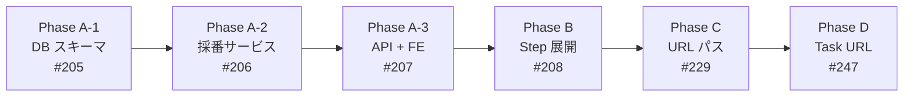
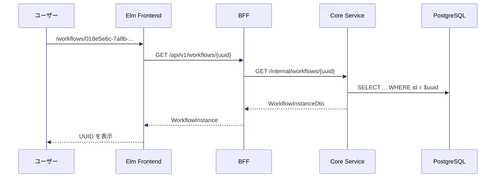
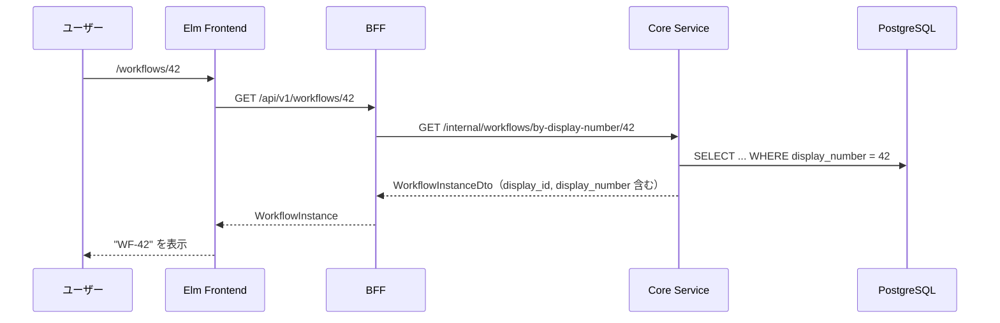
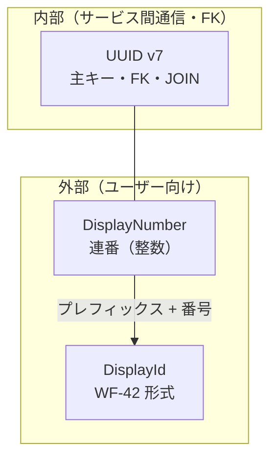
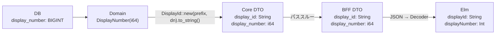
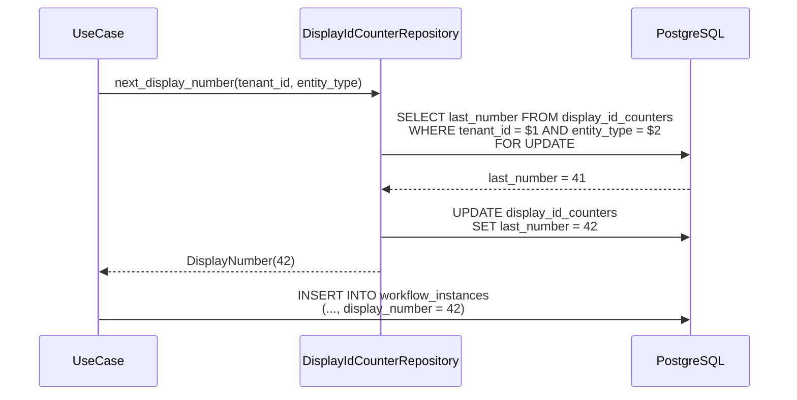
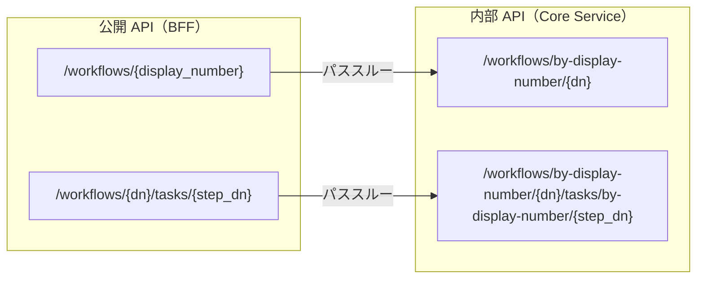

# 表示用 ID - 機能解説

対応 PR: #215, #218, #220, #240, #244, #248
対応 Issue: #204（Epic）, #205, #206, #207, #208, #229, #247

## 概要

ワークフローインスタンスとステップに人間が読みやすい連番 ID（`WF-42`, `STEP-1` 形式）を付与する機能。内部的には UUID v7 を主キーとして維持しつつ、補助フィールドとしてテナント単位の連番を追加する「二重 ID パターン」を導入した。

口頭・チャットでの言及（「WF-42 を確認してください」）、URL の短縮（`/workflows/42`）、一覧画面での識別を実現する。

## 背景

### UUID のみの運用課題

[ADR-001](../../05_ADR/001_ID形式の選定.md) の決定に基づき、全エンティティの主キーに UUID を使用していた。UUID はシステム的には優れているが、運用上の課題があった。

| 課題 | 影響 |
|------|------|
| 口頭伝達が事実上不可能 | 「018e5e6c-7f5a...の申請を確認して」 |
| メール・チャットでの言及がコピペ前提 | ワークフローの効率低下 |
| ユーザーが申請を ID で特定できない | UX の低下 |
| URL が冗長 | `/workflows/018e5e6c-7a8b-7000-8000-000000000001` |

### 業界の二重 ID パターン

Jira（`PROJ-123`）や GitHub（`#196`）のように、**システム用 ID + 人間用連番**の二重 ID パターンはエンタープライズ向けワークフローシステムでは事実上の標準。

### 設計書との対応

| 項目 | 内容 |
|------|------|
| ADR | [ADR-029: 人間向け表示用 ID の導入](../../05_ADR/029_人間向け表示用IDの導入.md) |
| 詳細設計書 | [12_表示用 ID 設計](../../03_詳細設計書/12_表示用ID設計.md) |
| ID 設計規約 | [04_ID 設計規約](../../03_詳細設計書/04_ID設計規約.md) |

### Epic 全体の構成

6つの Sub-issue で段階的に実装した。



| Phase | PR | Issue | 内容 |
|-------|-----|-------|------|
| A-1 | #215 | #205 | `display_id_counters` テーブル、`display_number` カラム、`DisplayNumber` 値オブジェクト |
| A-2 | #218 | #206 | `DisplayId` 型、`DisplayIdCounterRepository`、採番ロジック |
| A-3 | #220 | #207 | API レスポンスに `display_id` 追加、Elm UI に表示 |
| B | #240 | #208 | `WorkflowStep` に同パターンを適用 |
| C | #244 | #229 | BFF 公開 API の URL を `display_number` ベースに変更 |
| D | #248 | #247 | タスク API を階層的 URL 設計に変更 |

## 用語・概念

| 用語 | 説明 | 関連コード |
|------|------|-----------|
| DisplayNumber | 1 以上の正整数。テナント×エンティティ型でユニーク | `DisplayNumber` |
| DisplayId | プレフィックス + 番号（`WF-42`）。表示用の文字列表現 | `DisplayId` |
| DisplayIdEntityType | 採番対象のエンティティ種別（WorkflowInstance, WorkflowStep） | `DisplayIdEntityType` |
| display_prefix | エンティティ種別ごとの固定プレフィックス（`WF`, `STEP`） | `display_prefix` モジュール |
| 二重 ID パターン | システム用 UUID + 人間用連番を併用する設計パターン | — |
| カウンターテーブル | テナント×エンティティ型ごとの連番管理テーブル | `display_id_counters` |

## フロー

### Before（変更前）

UUID のみで識別。URL、API レスポンス、UI すべてが UUID ベース。



#### 課題

- URL が冗長で人間に不親切
- 口頭・チャットでの言及が困難
- 一覧画面での識別が難しい

### After（変更後）

連番の表示用 ID を併用。URL は `display_number`、表示は `display_id`（`WF-42`）を使用。



#### 改善点

- URL が短く直感的（`/workflows/42`）
- 口頭での言及が容易（「WF-42 を確認してください」）
- 一覧画面に ID 列として表示

## アーキテクチャ

### 二重 ID の役割分担



| ID | 用途 | スコープ | 例 |
|----|------|---------|-----|
| UUID v7 | 主キー、FK、サービス間通信 | グローバル一意 | `018e5e6c-7a8b-7000-8000-000000000001` |
| DisplayNumber | URL パスパラメータ、DB カラム | テナント×エンティティ型で一意 | `42` |
| DisplayId | UI 表示、口頭伝達 | 表示用（DB に保存しない） | `WF-42` |

### レイヤー間のデータ変換



### 採番フロー



### URL パスパラメータの変換

BFF が `display_number`（公開 API）と UUID（内部 API）の変換を担う。



## データ変換

### WorkflowInstance の変換

```
DB row (display_number: i64)
  → Domain (WorkflowInstance { display_number: DisplayNumber })
  → Core DTO (display_id: "WF-42", display_number: 42)
  → BFF DTO (display_id: "WF-42", display_number: 42)  [パススルー]
  → Elm (displayId: "WF-42", displayNumber: 42)
```

### Route の変換

```
URL "/workflows/42/tasks/1"
  → Elm Route.TaskDetail 42 1
  → API GET /api/v1/workflows/42/tasks/1
  → BFF → Core: GET /internal/workflows/by-display-number/42/tasks/by-display-number/1
  → DB: SELECT ... WHERE display_number = 42 AND step.display_number = 1
```

## エラーハンドリング

| エラー | 発生箇所 | HTTP Status | ユーザーへの表示 |
|--------|---------|-------------|----------------|
| ワークフロー不存在（display_number） | Core Service | 404 | Not Found |
| ステップ不存在（display_number） | Core Service | 404 | Not Found |
| 採番失敗（カウンター行なし） | Core Service | 500 | Internal Server Error |
| DisplayNumber 不正値（0 以下） | Domain | — | バリデーションエラー |

## 設計判断

機能・仕組みレベルの判断を記載する。コード実装レベルの判断は[コード解説](./02_表示用ID_コード解説.md#設計解説)を参照。

### 1. 二重 ID パターンを採用するか

UUID 主キーのまま、人間向けの補助 ID を追加するかの判断。

| 案 | UUID 維持 | 人間への分かりやすさ | 追加コスト |
|----|----------|---------------------|-----------|
| **二重 ID（採用）** | ○（主キー不変） | ◎（連番） | 中（カウンター管理） |
| UUID のみ継続 | ◎ | ×（口頭伝達不可） | なし |
| UUID v7 短縮表示 | ◎ | △（`WF-26B01-A3F`） | 低 |
| 主キーを BIGSERIAL に変更 | ×（大規模リファクタ） | ◎ | 極大 |

採用理由: UUID v7 主キーの利点（分散生成、推測困難、FK 構造）を維持しつつ、エンタープライズワークフローに不可欠な人間可読性を実現。ADR-001 の決定と矛盾しない。

### 2. 連番のスコープをどうするか

マルチテナント SaaS における連番のスコープ。

| 案 | 番号の見え方 | 情報漏洩リスク | テナントの自然さ |
|----|-----------|----------------|----------------|
| **テナント単位（採用）** | `WF-3` | なし | 各テナントが `WF-1` から |
| グローバル | `WF-15482` | 利用状況が推測可能 | 番号が大きく不自然 |

採用理由: マルチテナント SaaS として自然な設計。各テナントが独立した番号体系を持ち、テナント間の利用状況が推測されない。

### 3. 採番方式をどうするか

テナント×エンティティ型ごとの連番を安全に生成する方式。

| 案 | シンプルさ | テナント追加 | 同時実行性能 | トランザクション整合性 |
|----|----------|------------|------------|---------------------|
| **カウンターテーブル + SELECT FOR UPDATE（採用）** | ◎ | ◎（INSERT） | ○ | ◎（ロールバック可） |
| テナント別 SEQUENCE | △ | △（DDL） | ◎ | △（ギャップ） |
| Advisory Lock | ○ | ◎（INSERT） | ◎ | ◎ |
| UUID v7 短縮表示 | ◎ | ◎（不要） | ◎ | — |

採用理由: 標準的な SQL のみで実装可能（KISS）。テナント追加は INSERT 1 行。`SELECT FOR UPDATE` はトランザクション内で動作し、ロールバック時にカウンターも巻き戻る。想定規模（500 テナント、10万ユーザー）では行ロックがボトルネックになる可能性は極めて低い。

### 4. プレフィックス方式をどうするか

表示用 ID のプレフィックス設計。

| 案 | 例 | シンプルさ | 柔軟性 |
|----|-----|----------|--------|
| **固定プレフィックス（採用）** | `WF-123` | ◎ | △（変更はコード変更） |
| テナントカスタマイズ | `稟議-123` | △（DB カラム追加） | ◎ |
| プレフィックスなし | `#123` | ◎ | — |

採用理由: MVP に最適なシンプルさ。DB には数値のみ保存し、プレフィックスはアプリ層で結合する設計により、プレフィックス変更が容易。将来のカスタマイズ対応への拡張余地もある。

### 5. URL パスパラメータに display_number を使用するか

BFF 公開 API の URL パスパラメータを UUID から display_number に変更するかの判断。

| 案 | URL 例 | 人間への分かりやすさ | 後方互換 |
|----|--------|---------------------|---------|
| **display_number に変更（採用）** | `/workflows/42` | ◎ | △（URL 変更） |
| UUID のまま | `/workflows/018e5e6c-...` | × | ◎ |
| 両方サポート | `/workflows/42` or `/workflows/{uuid}` | ◎ | ◎（型安全性↓） |

採用理由: ユーザーが日常的に使う URL を短く直感的にする。内部 API は UUID を維持し、BFF が display_number → UUID の変換を担う。MVP フェーズのため後方互換よりも UX を優先。

### 6. ID 解決アプローチをどうするか

display_number から実データを取得する方式（Core Service の API 設計）。

| 案 | HTTP 呼び出し回数 | 型安全性 | 既存 API への影響 |
|----|-----------------|---------|-----------------|
| 2段階呼び出し（BFF が解決→既存 API） | 2 | ○ | なし |
| 既存 API を両対応（UUID or display_number） | 1 | △（実行時判定） | 大 |
| **新規エンドポイント（採用）** | 1 | ◎（パスパラメータは整数） | なし |
| クエリパラメータ拡張 | 1 | ○ | 小 |

採用理由: 1 回の HTTP 呼び出しで完結し、パスパラメータが整数型として静的に検証可能。既存の UUID ベース API は変更せず後方互換を維持。

### 7. タスク API を階層的 URL にするか

WorkflowStep の display_number がワークフロー内でのみ一意であることへの対応。

| 案 | URL | 一意性 |
|----|-----|--------|
| **階層的 URL（採用）** | `/workflows/42/tasks/1` | ◎（親子関係で一意） |
| フラットな URL | `/tasks/1` | ×（どのワークフローか不明） |
| グローバル一意な step_id | `/tasks/{global_step_id}` | ◎（採番テーブル変更必要） |

採用理由: WorkflowStep の display_number はワークフロー内スコープ。GitHub API（`/repos/{owner}/{repo}/issues/{number}`）と同様のパターンで、リソースの親子関係が URL に自然に表現される。

## 関連ドキュメント

- [コード解説](./02_表示用ID_コード解説.md)
- [ADR-029: 人間向け表示用 ID の導入](../../05_ADR/029_人間向け表示用IDの導入.md)
- [ADR-001: ID 形式の選定](../../05_ADR/001_ID形式の選定.md)
- [詳細設計書: 表示用 ID 設計](../../03_詳細設計書/12_表示用ID設計.md)
- [詳細設計書: ID 設計規約](../../03_詳細設計書/04_ID設計規約.md)
