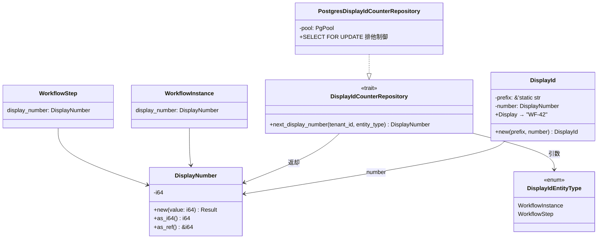
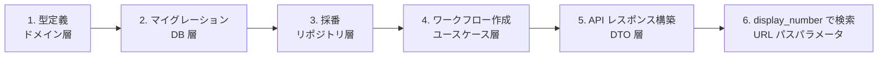
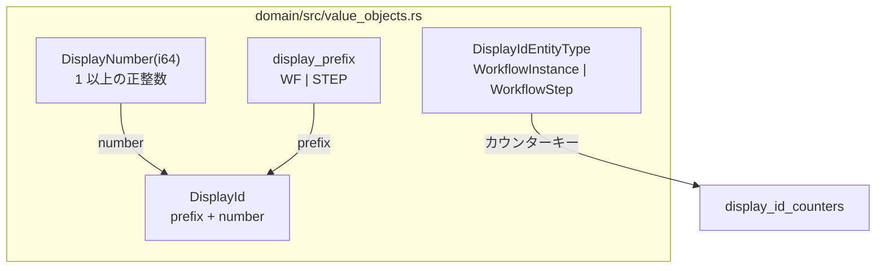
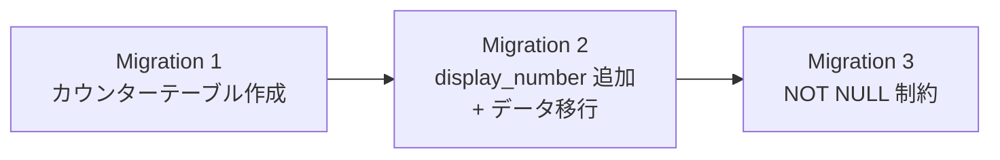
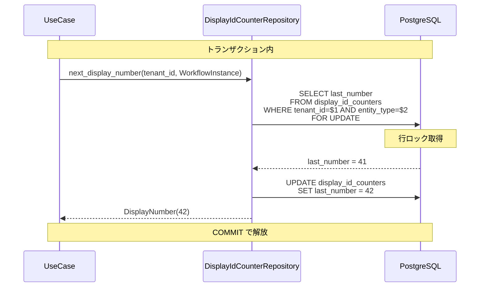
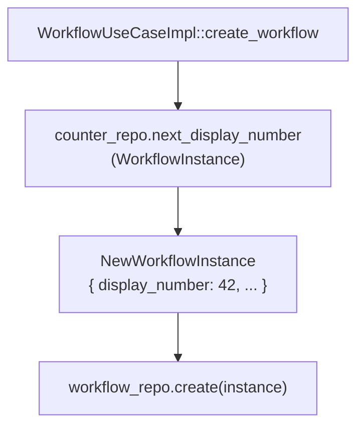
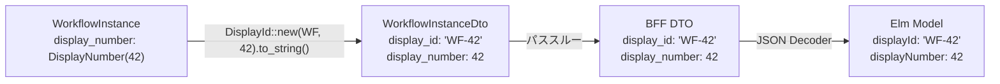
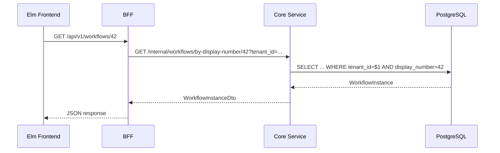
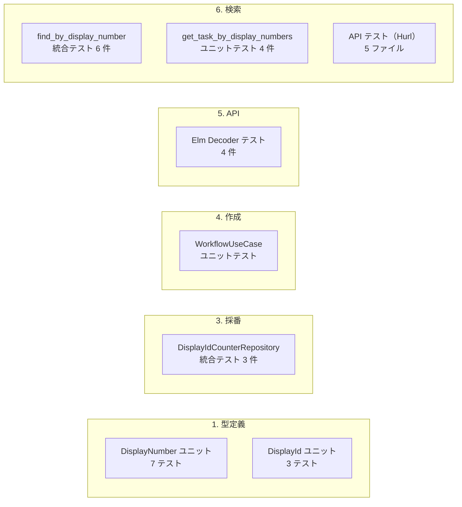
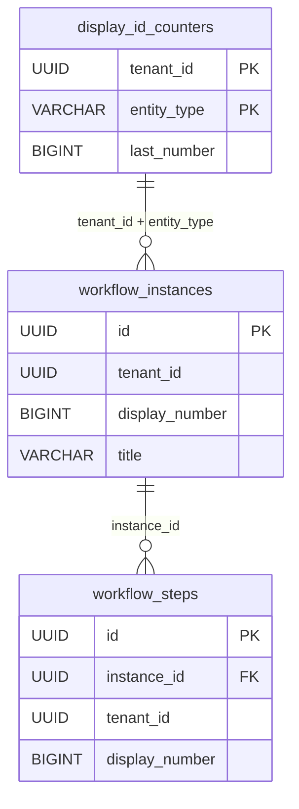

# 表示用 ID - コード解説

対応 PR: #215, #218, #220, #240, #244, #248
対応 Issue: #204（Epic）, #205, #206, #207, #208, #229, #247

## 主要な型・関数

| 型/関数 | ファイル | 責務 |
|--------|---------|------|
| `DisplayNumber` | [`domain/src/value_objects.rs:165`](../../../backend/crates/domain/src/value_objects.rs) | 1 以上の正整数。表示用連番の値オブジェクト |
| `display_prefix` | [`domain/src/value_objects.rs:219`](../../../backend/crates/domain/src/value_objects.rs) | エンティティ種別ごとの固定プレフィックス定数 |
| `DisplayIdEntityType` | [`domain/src/value_objects.rs:249`](../../../backend/crates/domain/src/value_objects.rs) | 採番対象のエンティティ種別 |
| `DisplayId` | [`domain/src/value_objects.rs:295`](../../../backend/crates/domain/src/value_objects.rs) | プレフィックス + 番号の表示用 ID（`WF-42`） |
| `WorkflowInstance` | [`domain/src/workflow/instance.rs:102`](../../../backend/crates/domain/src/workflow/instance.rs) | `display_number: DisplayNumber` フィールド |
| `WorkflowStep` | [`domain/src/workflow/step.rs:115`](../../../backend/crates/domain/src/workflow/step.rs) | `display_number: DisplayNumber` フィールド |
| `DisplayIdCounterRepository` | [`infra/src/repository/display_id_counter_repository.rs:26`](../../../backend/crates/infra/src/repository/display_id_counter_repository.rs) | 採番トレイト |
| `PostgresDisplayIdCounterRepository` | [`infra/src/repository/display_id_counter_repository.rs:52`](../../../backend/crates/infra/src/repository/display_id_counter_repository.rs) | `SELECT FOR UPDATE` による排他的採番 |
| `get_workflow_by_display_number` | [`core-service/handler/workflow/query.rs:160`](../../../backend/apps/core-service/src/handler/workflow/query.rs) | display_number でワークフロー取得 |
| `submit_workflow_by_display_number` | [`core-service/handler/workflow/command.rs:216`](../../../backend/apps/core-service/src/handler/workflow/command.rs) | display_number で申請 |
| `approve_step_by_display_number` | [`core-service/handler/workflow/command.rs:252`](../../../backend/apps/core-service/src/handler/workflow/command.rs) | display_number で承認 |
| `reject_step_by_display_number` | [`core-service/handler/workflow/command.rs:307`](../../../backend/apps/core-service/src/handler/workflow/command.rs) | display_number で却下 |
| `get_task_by_display_numbers` | [`core-service/usecase/task.rs:183`](../../../backend/apps/core-service/src/usecase/task.rs) | 2つの display_number でタスク取得 |
| `Route.WorkflowDetail` | [`frontend/src/Route.elm:85`](../../../frontend/src/Route.elm) | `WorkflowDetail Int` |
| `Route.TaskDetail` | [`frontend/src/Route.elm:87`](../../../frontend/src/Route.elm) | `TaskDetail Int Int` |

### 型の関係



## コードフロー

コードをライフサイクル順に追う。各ステップの構造を図で示した後、対応するコードを解説する。



### 1. 型定義（ドメイン層）

Domain クレートで値オブジェクトを定義。DB やアプリ層に依存しない純粋なドメインモデル。



```rust
// domain/src/value_objects.rs:165-178
pub struct DisplayNumber(i64);

impl DisplayNumber {
    pub fn new(value: i64) -> Result<Self, DomainError> {
        if value < 1 {                                    // ① 1 以上を保証
            return Err(DomainError::Validation(/*...*/));
        }
        Ok(Self(value))
    }
}
```

```rust
// domain/src/value_objects.rs:219-228
pub mod display_prefix {
    pub const WORKFLOW_INSTANCE: &str = "WF";
    pub const WORKFLOW_STEP: &str = "STEP";
}
```

```rust
// domain/src/value_objects.rs:295-313
pub struct DisplayId {
    prefix: &'static str,
    number: DisplayNumber,
}

impl fmt::Display for DisplayId {
    fn fmt(&self, f: &mut fmt::Formatter<'_>) -> fmt::Result {
        write!(f, "{}-{}", self.prefix, self.number.0)     // ② "WF-42" 形式
    }
}
```

注目ポイント:

- ① `DisplayNumber` は 1 以上を型レベルで保証。0 以下は構築不可
- ② `DisplayId` は `Display` トレイト実装で文字列化。DB には `DisplayNumber`（整数）のみ保存し、プレフィックス結合はアプリ層で行う

### 2. マイグレーション（DB 層）

3 段階マイグレーションで安全にスキーマを変更。既存データへのマイグレーションを含む。



**Migration 1**: `display_id_counters` テーブル

```sql
-- 20260202000001_create_display_id_counters.sql
CREATE TABLE display_id_counters (
    tenant_id   UUID        NOT NULL REFERENCES tenants(id) ON DELETE CASCADE,
    entity_type VARCHAR(50) NOT NULL,
    last_number BIGINT      NOT NULL DEFAULT 0,
    PRIMARY KEY (tenant_id, entity_type)                    -- ① 複合主キー
);

-- 既存テナントの初期化（シードデータ分をカウント）
INSERT INTO display_id_counters (tenant_id, entity_type, last_number)
SELECT t.id, 'workflow_instance',
       COALESCE((SELECT COUNT(*) FROM workflow_instances wi
                 WHERE wi.tenant_id = t.id), 0)
FROM tenants t;
```

**Migration 2**: `workflow_instances` に `display_number` 追加

```sql
-- 20260202000002_add_display_number_to_workflow_instances.sql
ALTER TABLE workflow_instances
ADD COLUMN display_number BIGINT;                           -- ② NULL 許容で追加

-- テナント別に連番を割り当て
WITH numbered AS (
    SELECT id, tenant_id,
           ROW_NUMBER() OVER (                              -- ③ テナント内で決定的な順序
               PARTITION BY tenant_id ORDER BY created_at
           ) AS rn
    FROM workflow_instances
)
UPDATE workflow_instances wi
SET display_number = n.rn
FROM numbered n
WHERE wi.id = n.id;

-- 部分ユニークインデックス
CREATE UNIQUE INDEX idx_workflow_instances_tenant_display_number
ON workflow_instances (tenant_id, display_number)
WHERE display_number IS NOT NULL;                           -- ④ NULL 行を除外
```

**Migration 3**: NOT NULL 制約

```sql
-- 20260202000003_set_display_number_not_null.sql
ALTER TABLE workflow_instances
ALTER COLUMN display_number SET NOT NULL;
```

注目ポイント:

- ① 複合主キー `(tenant_id, entity_type)` でテナント×エンティティ型の一意性を保証
- ② NULL 許容で追加 → データ移行 → NOT NULL 制約の 3 段階で安全に移行
- ③ `ROW_NUMBER() OVER (PARTITION BY tenant_id ORDER BY created_at)` でテナント別・作成順の連番
- ④ `WHERE display_number IS NOT NULL` の部分インデックスで、NULL 行がある状態でもインデックス作成可能

### 3. 採番（リポジトリ層）

`SELECT FOR UPDATE` による排他的採番。トランザクション内で呼び出すことで重複を防止。



```rust
// infra/src/repository/display_id_counter_repository.rs:26-48
pub trait DisplayIdCounterRepository: Send + Sync {
    async fn next_display_number(
        &self,
        tenant_id: &TenantId,
        entity_type: DisplayIdEntityType,
    ) -> Result<DisplayNumber, InfraError>;
}
```

```rust
// infra/src/repository/display_id_counter_repository.rs:65-95
async fn next_display_number(
    &self,
    tenant_id: &TenantId,
    entity_type: DisplayIdEntityType,
) -> Result<DisplayNumber, InfraError> {
    let entity_type_str: &str = entity_type.into();

    let row = sqlx::query!(
        r#"
        SELECT last_number FROM display_id_counters
        WHERE tenant_id = $1 AND entity_type = $2
        FOR UPDATE                                          -- ① 行ロック
        "#,
        tenant_id.as_uuid(),
        entity_type_str,
    )
    .fetch_one(&*self.pool)
    .await?;

    let next_number = row.last_number + 1;

    sqlx::query!(
        r#"
        UPDATE display_id_counters
        SET last_number = $3                                -- ② カウンター更新
        WHERE tenant_id = $1 AND entity_type = $2
        "#,
        tenant_id.as_uuid(),
        entity_type_str,
        next_number,
    )
    .execute(&*self.pool)
    .await?;

    Ok(DisplayNumber::new(next_number)?)                    // ③ 値オブジェクトに変換
}
```

注目ポイント:

- ① `FOR UPDATE` で行ロック。同一テナント・同一エンティティ型の同時採番を直列化
- ② `last_number + 1` で更新。ロールバック時はカウンターも巻き戻る
- ③ `DisplayNumber::new()` で 1 以上の値であることを保証

### 4. ワークフロー作成時の採番（ユースケース層）

ユースケースが採番リポジトリを呼び出し、取得した `DisplayNumber` をエンティティに設定。



```rust
// core-service/src/usecase/workflow/command.rs:61-70（概要）
pub async fn create_workflow(&self, input: CreateWorkflowInput) -> Result<...> {
    let display_number = self.counter_repo                  // ①
        .next_display_number(&tenant_id, DisplayIdEntityType::WorkflowInstance)
        .await?;

    let new_instance = NewWorkflowInstance {
        display_number,                                     // ② エンティティに設定
        title: input.title,
        // ...
    };

    let instance = self.workflow_repo.create(new_instance).await?;
    Ok(instance)
}
```

ステップ作成時も同様のパターンで `DisplayIdEntityType::WorkflowStep` を指定。

注目ポイント:

- ① `counter_repo` はジェネリック型パラメータ `C: DisplayIdCounterRepository` で注入。テスト時はモック差し替え可能
- ② 採番した `DisplayNumber` を `NewWorkflowInstance` に渡し、DB に永続化

### 5. API レスポンス構築（Core Service DTO 層）

Core Service の DTO 変換で `DisplayId`（文字列表現）と `DisplayNumber`（整数）の両方を構築。



```rust
// core-service/src/handler/workflow.rs:220-252（概要）
pub struct WorkflowInstanceDto {
    pub display_id: String,                                 // ① 文字列表現
    pub display_number: i64,                                // ② 整数値
    // ...
}

impl WorkflowInstanceDto {
    pub fn from_instance(instance: &WorkflowInstance) -> Self {
        Self {
            display_id: DisplayId::new(                     // ③ DTO 層で構築
                display_prefix::WORKFLOW_INSTANCE,
                instance.display_number(),
            ).to_string(),
            display_number: instance.display_number().as_i64(),
            // ...
        }
    }
}
```

```elm
-- frontend/src/Data/WorkflowInstance.elm:346-347
decoder =
    Decode.succeed WorkflowInstance
        |> required "id" Decode.string
        |> required "display_id" Decode.string              -- ④ JSON デコーダー
        |> required "display_number" Decode.int
        |> required "title" Decode.string
        -- ...
```

注目ポイント:

- ① `display_id` は UI 表示用（`"WF-42"` 形式）
- ② `display_number` は URL 構築用（整数値 `42`）
- ③ `DisplayId` の構築は Core Service DTO 層で行う。ドメイン層はプレフィックスを知らない
- ④ Elm の Pipeline Decoder はフィールド順が型エイリアスの定義順と一致する必要がある

### 6. display_number による検索（URL パスパラメータ）

BFF の公開 API は `display_number` を受け取り、Core Service の内部 API に中継。



```rust
// core-service/src/handler/workflow/query.rs:153-175（概要）
/// GET /internal/workflows/by-display-number/{display_number}
pub async fn get_workflow_by_display_number(
    State(state): State<WorkflowState>,
    Path(display_number): Path<i64>,                        // ① 整数型パスパラメータ
    Query(params): Query<TenantQuery>,
) -> Result<Json<WorkflowInstanceDto>, WorkflowError> {
    let display_number = DisplayNumber::new(display_number)?;
    let tenant_id = TenantId::try_from(params.tenant_id)?;
    state.workflow_query
        .get_workflow_by_display_number(display_number, tenant_id)
        .await
        .map(Json)
}
```

タスク API は階層的 URL で 2 つの display_number を受け取る。

```rust
// core-service/src/handler/task.rs:181-200（概要）
/// GET /internal/workflows/by-display-number/{dn}/tasks/by-display-number/{step_dn}
pub async fn get_task_by_display_numbers(
    State(state): State<TaskState>,
    Path((workflow_dn, step_dn)): Path<(i64, i64)>,         // ② 2 つの display_number
    Query(params): Query<TenantUserQuery>,
) -> Result<Json<TaskDetailDto>, TaskError> {
    // ...
}
```

```elm
-- frontend/src/Route.elm:85-87
type Route
    = WorkflowDetail Int                                    -- ③ display_number
    | TaskDetail Int Int                                    -- ④ 2 つの Int
    -- ...
```

注目ポイント:

- ① パスパラメータは `i64` 型。文字列ではなく整数として静的に検証
- ② タスク API は `(workflow_dn, step_dn)` のタプルで 2 つの display_number を受け取る
- ③ Elm の `Route` 型で `String` → `Int` に変更。コンパイラが全関連箇所を検出
- ④ `TaskDetail Int Int` で 2 つの display_number を型安全に表現

## テスト

各テストがライフサイクルのどのステップを検証しているかを示す。



| テスト | ステップ | 検証内容 |
|-------|---------|---------|
| `DisplayNumber::new` ユニットテスト | 1 | 1 以上の値のみ許可、0 以下は拒否 |
| `DisplayId::fmt` ユニットテスト | 1 | `"WF-42"` 形式の文字列化 |
| `test_初回採番で1を返す` | 3 | カウンター 0 → 1 の採番 |
| `test_連続採番で連番を返す` | 3 | 1 → 2 → 3 の連番 |
| `test_異なるエンティティ型は独立して採番される` | 3 | エンティティ型間の独立性 |
| `find_by_display_number_returns_instance` | 6 | 存在する display_number で検索成功 |
| `find_by_display_number_returns_none_for_nonexistent` | 6 | 存在しない display_number で None |
| `find_by_display_number_respects_tenant_isolation` | 6 | テナント分離 |
| `test_get_task_by_display_numbers_正常系` | 6 | 2 つの display_number でタスク取得 |
| `test_get_task_by_display_numbers_ワークフローが見つからない` | 6 | ワークフロー不存在 → NotFound |
| `test_get_task_by_display_numbers_ステップが見つからない` | 6 | ステップ不存在 → NotFound |
| `test_get_task_by_display_numbers_権限がない` | 6 | 担当者以外 → Forbidden |
| Elm `WorkflowInstance` デコーダーテスト | 5 | `display_id`, `display_number` のデコード |
| `create_workflow.hurl` | 5+6 | 作成時に display_id が返る |
| `submit_workflow.hurl` | 6 | display_number ベースの URL で申請 |
| `get_task_by_display_numbers.hurl` | 6 | 階層的 URL でタスク取得 |
| `list_my_tasks.hurl` | 5 | 一覧に display_number が含まれる |

### 実行方法

```bash
# 全テスト
just check-all

# ドメイン層ユニットテスト
cd backend && cargo test --package ringiflow-domain display_number
cd backend && cargo test --package ringiflow-domain display_id

# 統合テスト（DB 接続必要）
cd backend && cargo test -p ringiflow-infra --test display_id_counter_repository_test
cd backend && cargo test -p ringiflow-infra --test workflow_instance_repository_test find_by_display_number
cd backend && cargo test -p ringiflow-infra --test workflow_step_repository_test find_by_display_number

# ユースケーステスト
cd backend && cargo test -p ringiflow-core-service get_task_by_display_numbers
```

## マイグレーション

### WorkflowInstance 関連（Phase A-1）

| ファイル | 内容 |
|---------|------|
| `20260202000001_create_display_id_counters.sql` | カウンターテーブル作成 + 既存テナント初期化 |
| `20260202000002_add_display_number_to_workflow_instances.sql` | カラム追加 + データ移行 + 部分インデックス |
| `20260202000003_set_display_number_not_null.sql` | NOT NULL 制約 |

### WorkflowStep 関連（Phase B）

| ファイル | 内容 |
|---------|------|
| `20260205000001_add_display_number_to_workflow_steps.sql` | カラム追加 + データ移行（インスタンス内連番） |
| `20260205000002_set_workflow_steps_display_number_not_null.sql` | NOT NULL 制約 |



## 設計解説

コード実装レベルの判断を記載する。機能・仕組みレベルの判断は[機能解説](./01_表示用ID_機能解説.md#設計判断)を参照。

### 1. DisplayNumber の型設計

場所: `domain/src/value_objects.rs:165`

```rust
pub struct DisplayNumber(i64);

impl DisplayNumber {
    pub fn new(value: i64) -> Result<Self, DomainError> {
        if value < 1 {
            return Err(DomainError::Validation(/*...*/));
        }
        Ok(Self(value))
    }
}
```

なぜこの実装か:

`i64` のタプル構造体で NewType パターンを適用。`new()` ファクトリで 1 以上のバリデーションを行い、不正な状態を構築不可能にする（Make Illegal States Unrepresentable）。

代替案:

| 案 | メリット | デメリット | 判断 |
|----|---------|-----------|------|
| **NewType + バリデーション（採用）** | 型安全、不正値排除 | ファクトリ経由が必要 | 採用 |
| 生の `i64` | シンプル | 0 以下の値を許容 | 見送り |
| `NonZeroI64` | 標準ライブラリ | 負の値を許容、API が限定的 | 見送り |

### 2. DisplayId の構造体設計

場所: `domain/src/value_objects.rs:295`

```rust
pub struct DisplayId {
    prefix: &'static str,
    number: DisplayNumber,
}
```

なぜこの実装か:

プレフィックスと番号を分離して保持し、`Display` トレイトで結合する。DB には `DisplayNumber`（整数）のみ保存し、プレフィックスはアプリ層で付与。これにより:

1. プレフィックス変更時に DB マイグレーション不要
2. 番号の大小比較やソートが整数演算で可能
3. 将来のテナントカスタムプレフィックスに拡張可能

代替案:

| 案 | メリット | デメリット | 判断 |
|----|---------|-----------|------|
| **構造体（prefix + number）（採用）** | 分離保持、変更容易 | 構造体のコスト | 採用 |
| `String`（`"WF-42"` を DB に保存） | シンプル | プレフィックス変更時にデータ移行、ソート困難 | 見送り |

### 3. SELECT FOR UPDATE の採番パターン

場所: `infra/src/repository/display_id_counter_repository.rs:65`

```rust
let row = sqlx::query!(
    "SELECT last_number FROM display_id_counters
     WHERE tenant_id = $1 AND entity_type = $2
     FOR UPDATE",
    // ...
).fetch_one(&*self.pool).await?;

let next_number = row.last_number + 1;

sqlx::query!(
    "UPDATE display_id_counters SET last_number = $3
     WHERE tenant_id = $1 AND entity_type = $2",
    // ...
).execute(&*self.pool).await?;
```

なぜこの実装か:

`SELECT FOR UPDATE` → `UPDATE` の 2 ステップで排他的に採番。トランザクション内で呼び出すことで、エンティティ INSERT と採番の原子性を保証。ロールバック時にカウンターも巻き戻るため、欠番が発生しない。

SEQUENCE は `nextval()` がトランザクション外で発番されるため、ロールバック時に欠番が生じる。ワークフロー ID の連続性が期待される業務システムでは、カウンターテーブル方式が適切。

### 4. display_id の構築場所

場所: `core-service/src/handler/workflow.rs:222`

```rust
display_id: DisplayId::new(
    display_prefix::WORKFLOW_INSTANCE,
    instance.display_number(),
).to_string(),
```

なぜこの実装か:

`display_id`（`"WF-42"` 形式の文字列）の構築を Core Service の DTO 変換層で行う。ドメインモデル（`WorkflowInstance`）は `display_number: DisplayNumber` のみ保持し、プレフィックスや文字列フォーマットを知らない。

プレゼンテーション形式（表示用文字列）をドメイン層から分離する設計:

| 層 | 保持するもの | 理由 |
|---|------------|------|
| Domain | `DisplayNumber`（整数） | ビジネスロジックはプレフィックスに無関心 |
| Core DTO | `display_id`（文字列）+ `display_number`（整数） | API レスポンスとして両方提供 |
| BFF DTO | パススルー | 変換なし |
| Elm | `displayId`（String）+ `displayNumber`（Int） | UI 表示と URL 構築で使い分け |

### 5. Elm Route の Int パターンによる変更追跡

場所: `frontend/src/Route.elm:85-87`

```elm
type Route
    = WorkflowDetail Int          -- String から Int に変更
    | TaskDetail Int Int           -- String から Int Int に変更
```

なぜこの実装か:

`String` → `Int` の型変更により、Elm コンパイラが全関連箇所を自動検出する。URL パーサー（`int` vs `string`）、API 呼び出し（`String.fromInt` の追加）、リンク生成（`workflow.displayNumber` の使用）など、変更漏れが構造的に防止される。

`TaskDetail Int Int` のダブル Int パターンでは、パターンマッチで 2 つの値を同時に扱う必要があり、1 つだけ書くとコンパイルエラーになる。型で表現できるものは型で表現するプロジェクト原則の実践。

### 6. 3 段階マイグレーション分割

場所: `backend/migrations/20260202000001-000003`

なぜこの実装か:

既存テーブルへのカラム追加を 3 段階に分割:

1. カウンターテーブル作成 + テナント初期化
2. カラム追加（NULL 許容）+ 既存データ移行 + インデックス作成
3. NOT NULL 制約適用

各ステップの意図が明確で、障害時のロールバック粒度が細かい。NULL 許容で追加してからデータ移行し、全行に値が設定されてから NOT NULL にすることで、マイグレーション中のサービス停止を最小化。

代替案:

| 案 | メリット | デメリット | 判断 |
|----|---------|-----------|------|
| **3 段階分割（採用）** | 各ステップが明確、ロールバック容易 | ファイル数増加 | 採用 |
| 1 ファイルで一括 | シンプル | 障害時の影響範囲が広い | 見送り |

## 関連ドキュメント

- [機能解説](./01_表示用ID_機能解説.md)
- [ADR-029: 人間向け表示用 ID の導入](../../05_ADR/029_人間向け表示用IDの導入.md)
- [詳細設計書: 表示用 ID 設計](../../03_詳細設計書/12_表示用ID設計.md)
- [詳細設計書: ID 設計規約](../../03_詳細設計書/04_ID設計規約.md)
