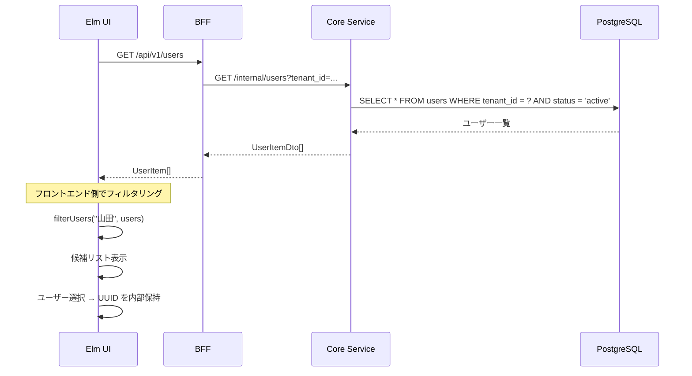

# ユーザー検索 UI 実装解説

対応 Issue: [#203 承認者選択のユーザー検索 UI を実装する](https://github.com/ka2kama/ringiflow/issues/203)

## 概要

新規申請フォームの承認者選択を UUID 直接入力からオートコンプリート検索 UI に改善した。

## アーキテクチャ

## Phase 一覧

| Phase | コンポーネント | 内容 |
|-------|--------------|------|
| 1 | User ドメイン + DB | display\_number カラム追加、ドメインモデル拡張 |
| 2 | バックエンド API | UserRepository → Core Service → BFF のフルスタック API |
| 3 | フロントエンド | Elm でオートコンプリート検索 UI |

## 関連ドキュメント

- 設計書: [表示用 ID 設計](../../03_詳細設計書/12_表示用ID設計.md)
- 実装解説: [表示用 ID](../08_表示用ID/00_概要.md)
- OpenAPI: [openapi.yaml](../../openapi/openapi.yaml) の `/api/v1/users`
