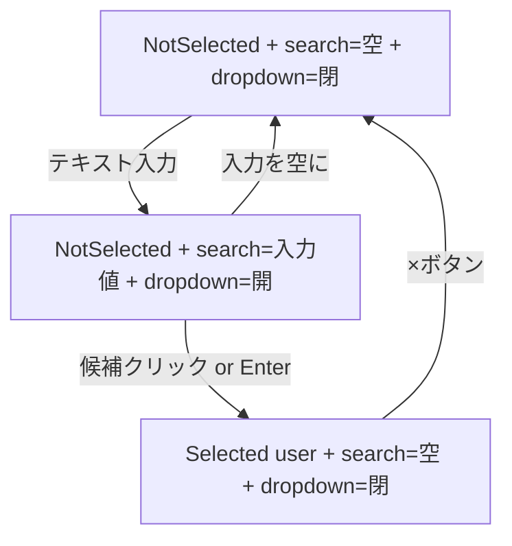

# Phase 3: フロントエンド オートコンプリート UI

対応 Issue: [#203](https://github.com/ka2kama/ringiflow/issues/203)

## 概要

Elm でオートコンプリート型の承認者検索 UI を実装した。テキスト入力で名前・表示用 ID・メールアドレスのいずれかにマッチするユーザーが候補として表示され、選択すると UUID が内部的に保持される。

## 実装したコンポーネント

| ファイル | 責務 |
|---------|------|
| [`frontend/src/Data/UserItem.elm`](../../../frontend/src/Data/UserItem.elm) | UserItem 型定義、JSON デコーダー、フィルタリング関数 |
| [`frontend/src/Api/User.elm`](../../../frontend/src/Api/User.elm) | `GET /api/v1/users` API クライアント |
| [`frontend/src/Page/Workflow/New.elm`](../../../frontend/src/Page/Workflow/New.elm) | 承認者選択 UI（オートコンプリート） |

## 実装内容

### UserItem 型

```elm
type alias UserItem =
    { id : String          -- UUID（内部用、UI には非表示）
    , displayId : String   -- "USER-N" 形式
    , displayNumber : Int
    , name : String
    , email : String
    }
```

### ApproverSelection 型

```elm
type ApproverSelection
    = NotSelected
    | Selected UserItem
```

UUID 文字列の空チェックに代わり、型で選択状態を表現する。

### フィルタリング

```elm
filterUsers : String -> List UserItem -> List UserItem
```

名前・displayId・email の3フィールドで部分一致検索。大文字小文字を無視し、空クエリは空リストを返す。

### 状態遷移



## テスト

| # | テストケース | 検証内容 |
|---|------------|---------|
| 1 | 全フィールドをデコード | JSON → UserItem の変換 |
| 2 | 必須フィールドがない場合はエラー | 不完全な JSON の拒否 |
| 3 | data フィールドから一覧をデコード | `{ data: [...] }` 形式の変換 |
| 4 | 空の一覧をデコード | 空配列の処理 |
| 5 | data フィールドがない場合はエラー | 不正な形式の拒否 |
| 6 | 名前で部分一致フィルタリング | "山田" → "山田太郎", "山田花子" |
| 7 | display\_id でフィルタリング | "USER-1" → 該当ユーザー |
| 8 | email でフィルタリング | "tanaka" → 田中一郎 |
| 9 | 大文字小文字を無視 | "user-2" → USER-2 の該当ユーザー |
| 10 | 空クエリは空リストを返す | "" → [] |
| 11 | 一致なしは空リストを返す | 存在しないクエリ → [] |
| 12 | 前後の空白をトリム | " 山田 " → "山田太郎", "山田花子" |

実行方法:

```bash
cd frontend && pnpm run test -- --watch tests/Data/UserItemTest.elm
```

## 設計解説

### 1. onMouseDown による blur/click 競合の解決

場所: [`frontend/src/Page/Workflow/New.elm`](../../../frontend/src/Page/Workflow/New.elm) の `viewApproverCandidate`

```elm
viewApproverCandidate highlightIndex index user =
    li
        [ Html.Events.onMouseDown (SelectApprover user)  -- onClick ではなく onMouseDown
        , ...
        ]
```

なぜこの設計か: テキスト入力の `onBlur` は `onClick` より先に発火するため、候補をクリックした瞬間にドロップダウンが消えてしまう。`onMouseDown` は `blur` より先に発火するため、選択が先に確定する。

代替案: `Process.sleep 200` で blur を遅延させるパターンも一般的だが、タイミング依存で不安定になりうる。`onMouseDown` パターンの方がシンプルで確実。

### 2. filterUsers の Data 層配置

場所: [`frontend/src/Data/UserItem.elm`](../../../frontend/src/Data/UserItem.elm)

なぜこの設計か: Page モジュールの内部にフィルタリングロジックを閉じ込めると、テストが困難になる（Page の Model/Msg に依存するため）。純粋関数として Data 層に配置することで、入力と出力だけでテスト可能になる。

代替案: Page.Workflow.New 内に配置する方法もあるが、テスタビリティを品質要件として扱い、Data 層に配置した。

### 3. ApproverSelection Union Type

場所: [`frontend/src/Page/Workflow/New.elm`](../../../frontend/src/Page/Workflow/New.elm)

```elm
type ApproverSelection
    = NotSelected
    | Selected UserItem
```

なぜこの設計か: `String` で UUID を持つと「空文字 = 未選択」という暗黙の規約に依存する。Union Type で表現することで、`case` 式の網羅性チェックにより全パターンの処理が強制される。Elm の「不正な状態を表現不可能にする」原則の実践。

## 関連ドキュメント

- [概要](00_概要.md)
- [Elm アーキテクチャ](../../06_ナレッジベース/elm/Elmアーキテクチャ.md)
