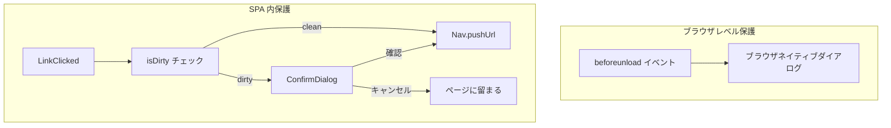
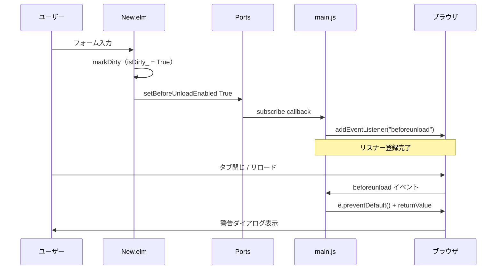
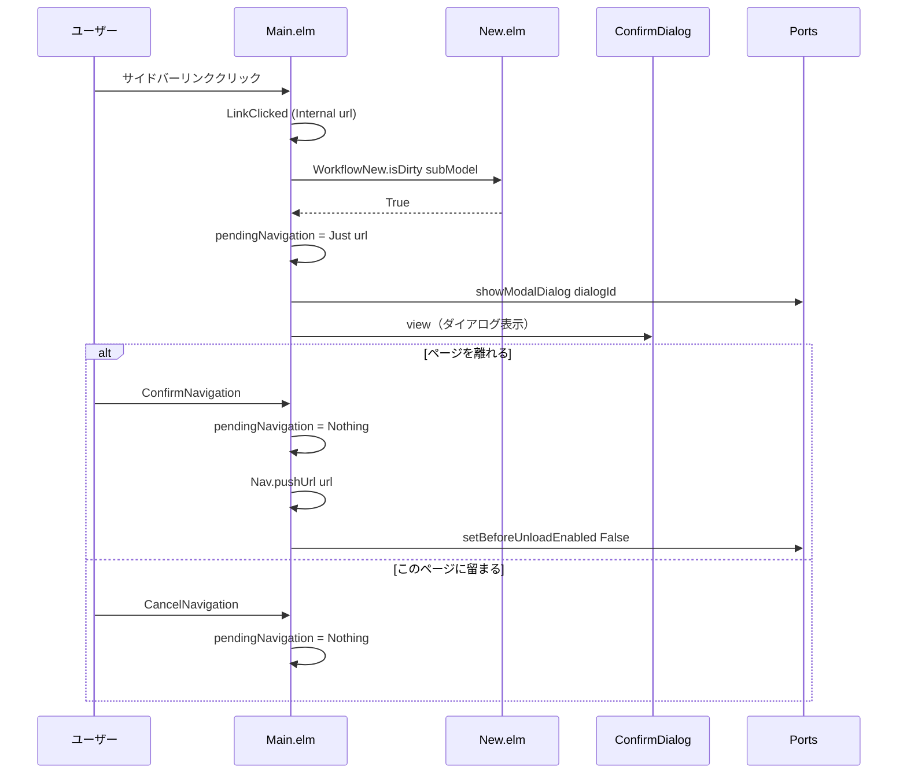
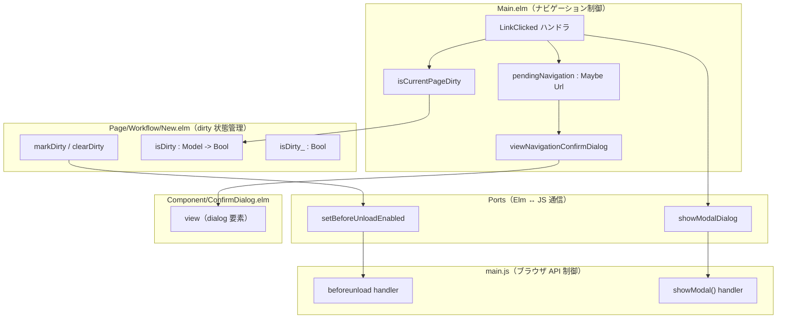
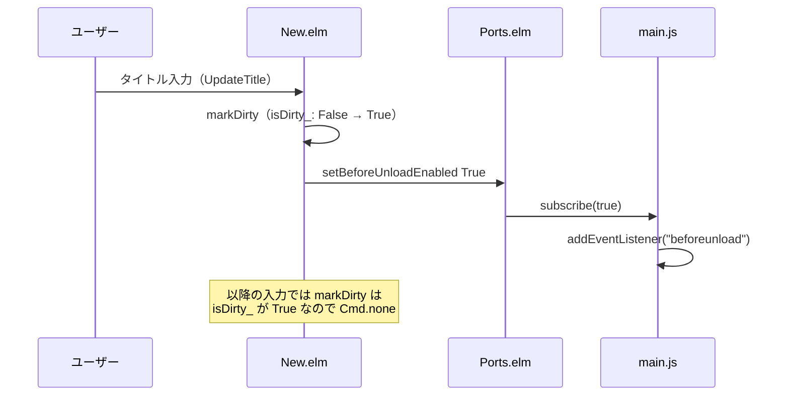
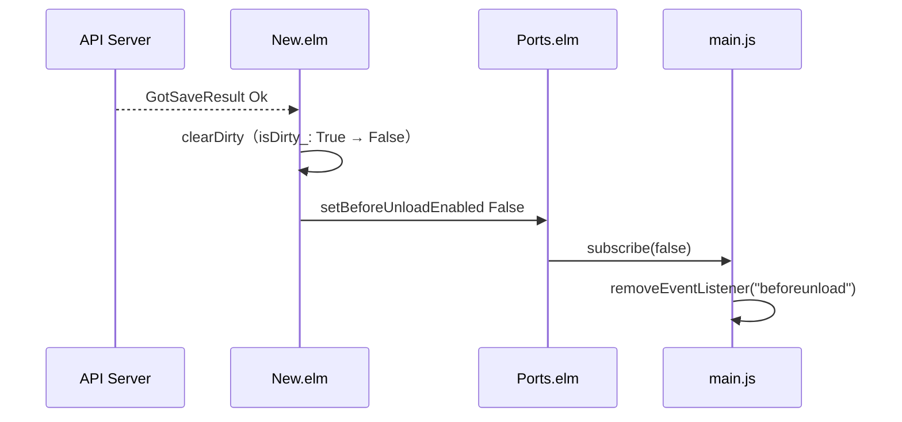

# フォーム dirty-state 検出 - 機能解説

対応 PR: #264
対応 Issue: #177

## 概要

新規申請フォーム（`Page/Workflow/New.elm`）でユーザーが入力中にページを離れた場合のデータ損失を防止する機能。ブラウザレベル（`beforeunload`）と SPA 内レベル（ConfirmDialog）の 2 層で保護する。

- ブラウザのタブ閉じ・リロード → ブラウザネイティブの警告ダイアログ
- SPA 内のリンクナビゲーション → アプリケーション内の ConfirmDialog

## 背景

### 変更前の課題

新規申請フォームで入力中のデータが、以下の操作で警告なく失われていた:

- ブラウザのタブ閉じ・リロード
- SPA 内のサイドバーリンククリック

フォームの入力作業は時間がかかることがあり、誤操作によるデータ損失はユーザー体験を大きく損なう。

### 2 層防御の必要性

SPA では「ページ離脱」が 2 種類存在する:

| 離脱の種類 | トリガー | 制御方法 |
|-----------|---------|---------|
| ブラウザレベル | タブ閉じ、リロード、URL 直接入力 | `beforeunload` イベント |
| SPA 内レベル | `<a>` タグのクリック（サイドバーなど） | Elm の `LinkClicked` ハンドラ |

ブラウザの戻る/進むボタンは Elm の `Browser.application` では `UrlChanged` のみを発火し、`LinkClicked` を経由しない。このため SPA 内の遷移阻止は `<a>` タグのクリックに限定され、戻る/進むは `beforeunload` がカバーする。

## 用語・概念

| 用語 | 説明 | 関連コード |
|------|------|-----------:|
| dirty 状態 | フォームに未保存の変更があることを示す Bool フラグ | `New.elm:isDirty_` |
| `beforeunload` | ブラウザネイティブのページ離脱警告イベント | `main.js` |
| Port | Elm と JavaScript 間の型安全な通信チャネル | `Ports.elm:setBeforeUnloadEnabled` |
| PendingAction パターン | 確認待ちの操作を `Maybe` で保持し、ConfirmDialog で確認後に実行するパターン | `Main.elm:pendingNavigation` |
| ConfirmDialog | アプリケーション内の確認ダイアログコンポーネント。`<dialog>` 要素ベース | `Component/ConfirmDialog.elm` |

## フロー

### 全体構成

### ブラウザレベル: beforeunload フロー

### SPA 内: ナビゲーションインターセプトフロー

## アーキテクチャ

## データフロー

### フロー 1: フォーム入力 → dirty 化

### フロー 2: 保存成功 → dirty クリア

#### 処理ステップ

| # | レイヤー | ファイル:関数 | 処理内容 |
|---|---------|-------------|---------:|
| 1 | ページ | `New.elm:markDirty` | `isDirty_` を False → True に変更し、Port Cmd を発行 |
| 2 | ポート | `Ports.elm:setBeforeUnloadEnabled` | Bool を JS 側に送信 |
| 3 | JS | `main.js:subscribe` | `beforeunload` リスナーを登録/解除 |
| 4 | ページ | `New.elm:clearDirty` | `isDirty_` を True → False に変更し、Port Cmd を発行 |
| 5 | メイン | `Main.elm:isCurrentPageDirty` | ページの dirty 状態を判定 |
| 6 | メイン | `Main.elm:ConfirmNavigation` | ナビゲーション実行 + beforeunload 解除 |

## 設計判断

機能・仕組みレベルの判断を記載する。コード実装レベルの判断は[コード解説](./02_コード解説.md#設計解説)を参照。

### 1. dirty 検出方法: Bool フラグ vs 初期値との値比較

フォームに未保存の変更があることをどう検出するか。

| 案 | シンプルさ | 精度 | 実装コスト |
|----|----------|------|-----------|
| **Bool フラグ（採用）** | 高い（入力 → True、保存 → False） | 十分（false positive は許容範囲） | 低い |
| 初期値との値比較 | 低い（全フィールドの初期値を保持） | 高い（入力後に戻しても clean） | 高い |

**採用理由**: シンプルな Bool フラグで十分。ユーザーが値を入力して元に戻した場合に false positive になるが、「変更した」という事実自体を保護する方が安全。値比較は YAGNI。

### 2. ブラウザ API 連携方式: 専用 Port vs 汎用メッセージ Port

beforeunload の制御を Elm からどう行うか。

| 案 | 型安全性 | 責務分離 | 拡張性 |
|----|---------|---------|--------|
| **専用 Port（採用）** | 高い（`Bool -> Cmd msg`） | 高い（専用チャネル） | 新 Port 追加 |
| 汎用 `sendMessage` | 低い（JSON エンコード） | 低い（dispatch ロジック必要） | switch 分岐追加 |

**採用理由**: `setBeforeUnloadEnabled : Bool -> Cmd msg` という専用ポートにより、呼び出し側で JSON エンコードミスが起きない。beforeunload 制御はメッセージ通信とは本質的に異なる責務であり、プロジェクトの Elm ポート方針（論理的に独立した通信は専用ポート）にも合致する。

### 3. ナビゲーション確認 UI の配置: Main.elm vs ページ側

dirty 状態での SPA 内ナビゲーションをどこで阻止するか。

| 案 | 責務の一貫性 | ページの独立性 | 実装の自然さ |
|----|------------|-------------|------------|
| **Main.elm（採用）** | 高い（Nav.Key 保持者が制御） | 高い（isDirty 公開のみ） | TEA パターンに沿う |
| ページ側 | 低い（Nav.Key の受け渡し必要） | 低い（ナビゲーション制御を知る） | Nested TEA で不自然 |
| JavaScript 側 | 低い（Elm 外で制御） | — | `window.confirm()` は UX が劣る |

**採用理由**: Elm の `Browser.application` では `Nav.Key` は `Main.elm` のみが保持する。ナビゲーションの実行（`Nav.pushUrl`）には `Nav.Key` が必要なため、ナビゲーション制御は Main の責務。各ページは `isDirty` 関数を公開するだけでよく、ナビゲーション制御の知識を持たない。

### 4. ConfirmNavigation 時の beforeunload 解除タイミング

ナビゲーション確認後に beforeunload リスナーをいつ解除するか。

| 案 | 安全性 | 実装 |
|----|--------|------|
| **ConfirmNavigation 時に明示解除（採用）** | 高い（リスナー残留なし） | `Cmd.batch [Nav.pushUrl, setBeforeUnloadEnabled False]` |
| 遷移先の init で自然解消 | 低い（遷移先が New 以外ならリスナー残留） | 暗黙的 |

**採用理由**: ナビゲーションを確定した時点で明示的に解除する。`Nav.pushUrl` による遷移先が New.elm 以外の場合、JS 側の `beforeunload` リスナーが残留するリスクがあるため、明示解除が安全。

## 関連ドキュメント

- [コード解説](./02_コード解説.md)
- [ナレッジベース: Elm ポート](../../06_ナレッジベース/elm/Elmポート.md)
- [ナレッジベース: Elm アーキテクチャ](../../06_ナレッジベース/elm/Elmアーキテクチャ.md)
