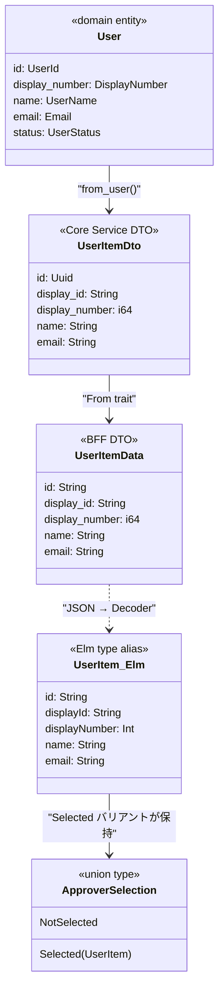
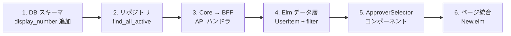
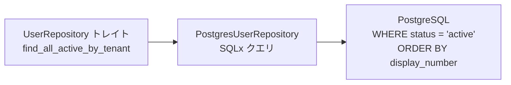
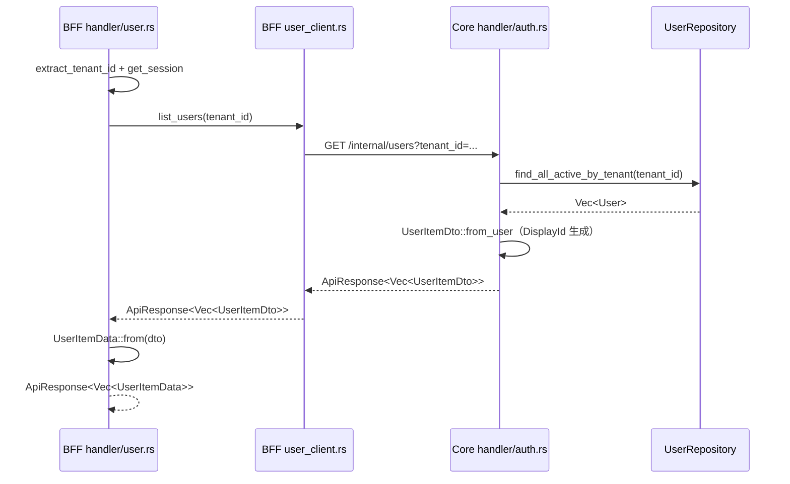
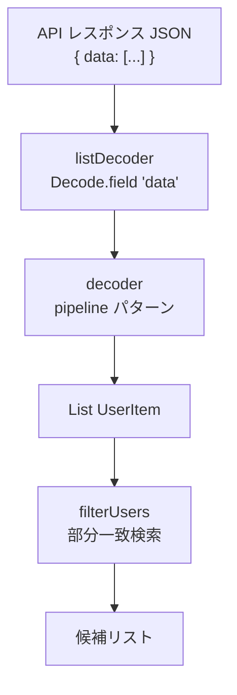
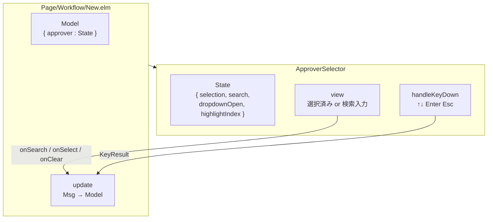
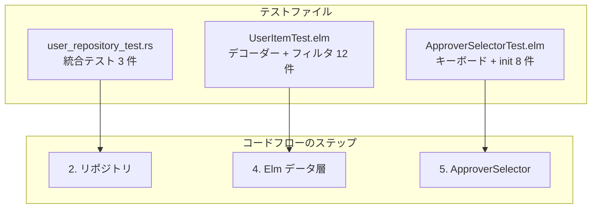

# ユーザー検索 UI - コード解説

対応 PR: #254
対応 Issue: #203

## 主要な型・関数

| 型/関数 | ファイル | 責務 |
|--------|---------|------|
| `UserItem` | [`Data/UserItem.elm:29`](../../../frontend/src/Data/UserItem.elm) | ユーザー一覧表示用の型（id, displayId, name, email） |
| `filterUsers` | [`Data/UserItem.elm:74`](../../../frontend/src/Data/UserItem.elm) | 名前・displayId・email の部分一致フィルタリング |
| `listUsers` | [`Api/User.elm:30`](../../../frontend/src/Api/User.elm) | `GET /api/v1/users` API クライアント |
| `ApproverSelection` | [`Component/ApproverSelector.elm:58`](../../../frontend/src/Component/ApproverSelector.elm) | 承認者の選択状態（NotSelected / Selected） |
| `State` | [`Component/ApproverSelector.elm:68`](../../../frontend/src/Component/ApproverSelector.elm) | コンポーネント状態（selection, search, dropdownOpen, highlightIndex） |
| `handleKeyDown` | [`Component/ApproverSelector.elm:110`](../../../frontend/src/Component/ApproverSelector.elm) | キーボードイベント処理（純粋関数） |
| `UserItemDto` | [`handler/auth.rs:79`](../../../backend/apps/core-service/src/handler/auth.rs) | Core Service のユーザー一覧 DTO |
| `UserItemData` | [`handler/user.rs:28`](../../../backend/apps/bff/src/handler/user.rs) | BFF のフロントエンド向けユーザーデータ |
| `find_all_active_by_tenant` | [`user_repository.rs:68`](../../../backend/crates/infra/src/repository/user_repository.rs) | テナント内アクティブユーザー一覧の SQL |

### 型の関係



データは 4 段階の型変換を経てフロントエンドに届く: `User`（ドメイン） → `UserItemDto`（Core） → `UserItemData`（BFF） → `UserItem`（Elm）。各レイヤーで責務に応じたフィールド変換（例: `DisplayNumber` → `display_id` 文字列）が行われる。

## コードフロー

コードをライフサイクル順に追う。各ステップの構造を図で示した後、対応するコードを解説する。



### 1. DB スキーマ拡張（マイグレーション）

User テーブルに `display_number` カラムを追加し、テナント内でユニークな番号を付与する。

```sql
-- migrations/20260206000001_add_display_number_to_users.sql
ALTER TABLE users ADD COLUMN display_number BIGINT;

-- 既存ユーザーに連番を付与
WITH numbered AS (
    SELECT id, ROW_NUMBER() OVER (PARTITION BY tenant_id ORDER BY created_at) AS rn
    FROM users
)
UPDATE users SET display_number = numbered.rn FROM numbered WHERE users.id = numbered.id;

-- テナント内ユニーク制約
ALTER TABLE users ADD CONSTRAINT uq_users_display_number UNIQUE (tenant_id, display_number);

-- 次の番号用シーケンス（テナントごと）
CREATE SEQUENCE users_display_number_seq;
```

注目ポイント:

- `PARTITION BY tenant_id` でテナント内での連番を保証。マルチテナント環境では表示用 ID がテナント間で重複可能
- 既存データへの連番付与と NOT NULL 制約の追加を 2 つのマイグレーションに分離（安全な段階適用）

### 2. リポジトリ（find_all_active_by_tenant）

テナント内のアクティブユーザーを `display_number` 順で取得する。



```rust
// user_repository.rs:285-329
async fn find_all_active_by_tenant(
    &self,
    tenant_id: &TenantId,
) -> Result<Vec<User>, InfraError> {
    let rows = sqlx::query!(
        r#"
        SELECT id, tenant_id, display_number, email, name, status,
               last_login_at, created_at, updated_at
        FROM users
        WHERE tenant_id = $1 AND status = 'active'  -- ① アクティブのみ
        ORDER BY display_number                       -- ② 表示番号順
        "#,
        tenant_id.as_uuid()
    )
    .fetch_all(&self.pool)
    .await?;

    rows.into_iter()
        .map(|row| {
            Ok(User::from_db(  // ③ DB 行 → ドメインエンティティ
                UserId::from_uuid(row.id),
                TenantId::from_uuid(row.tenant_id),
                DisplayNumber::new(row.display_number)
                    .map_err(|e| InfraError::Unexpected(e.to_string()))?,
                // ...省略
            ))
        })
        .collect()
}
```

注目ポイント:

- ① `status = 'active'` で無効化されたユーザーを除外。承認者候補として無効ユーザーが表示されるのを防ぐ
- ② `ORDER BY display_number` で一貫した表示順を保証
- ③ `User::from_db` で各フィールドを値オブジェクトに変換。`DisplayNumber::new` や `Email::new` の変換エラーは `InfraError::Unexpected` にマッピング

### 3. Core Service → BFF（API ハンドラ）

Core Service がドメインエンティティを DTO に変換し、BFF がフロントエンド向けデータに再変換する。



```rust
// handler/auth.rs:87-96 — Core Service: User → UserItemDto
impl UserItemDto {
    fn from_user(user: &User) -> Self {
        Self {
            id: *user.id().as_uuid(),
            display_id: DisplayId::new(display_prefix::USER, user.display_number()).to_string(),  // ①
            display_number: user.display_number().as_i64(),
            name: user.name().to_string(),
            email: user.email().as_str().to_string(),
        }
    }
}
```

```rust
// handler/user.rs:36-46 — BFF: UserItemDto → UserItemData
impl From<crate::client::UserItemDto> for UserItemData {
    fn from(dto: crate::client::UserItemDto) -> Self {
        Self {
            id: dto.id.to_string(),  // ② UUID → String
            display_id: dto.display_id,
            display_number: dto.display_number,
            name: dto.name,
            email: dto.email,
        }
    }
}
```

注目ポイント:

- ① `DisplayId::new(display_prefix::USER, display_number)` で `USER-N` 形式の表示用 ID を生成。表示用 ID の生成は DTO 変換時に行い、ドメインモデルには含めない
- ② BFF は `Uuid` → `String` への変換を行う。フロントエンドで UUID 型は不要なため文字列として渡す

### 4. Elm データ層（UserItem + filterUsers）

JSON デコーダーとフロントエンドフィルタリングを提供する。



```elm
-- Data/UserItem.elm:29-35
type alias UserItem =
    { id : String
    , displayId : String
    , displayNumber : Int
    , name : String
    , email : String
    }

-- Data/UserItem.elm:74-90
filterUsers : String -> List UserItem -> List UserItem
filterUsers query users =
    let
        normalizedQuery = String.toLower (String.trim query)  -- ① 正規化
    in
    if String.isEmpty normalizedQuery then
        []  -- ② 空クエリは空リスト（候補を表示しない）
    else
        List.filter
            (\user ->
                String.contains normalizedQuery (String.toLower user.name)  -- ③ 3 フィールドで検索
                    || String.contains normalizedQuery (String.toLower user.displayId)
                    || String.contains normalizedQuery (String.toLower user.email)
            )
            users
```

注目ポイント:

- ① `String.trim` + `String.toLower` で入力を正規化。大文字小文字や前後の空白を無視
- ② 空クエリ時に空リストを返すのは意図的。全ユーザーを表示するのではなく、入力開始後に候補を表示する UX
- ③ 名前・表示用 ID・メールアドレスの 3 フィールドで OR 検索。`String.contains` による部分一致

### 5. ApproverSelector コンポーネント

承認者選択のロジックと UI を再利用可能なコンポーネントとして分離。



```elm
-- Component/ApproverSelector.elm:58-73
type ApproverSelection
    = NotSelected
    | Selected UserItem

type alias State =
    { selection : ApproverSelection
    , search : String
    , dropdownOpen : Bool
    , highlightIndex : Int  -- ① キーボードハイライト位置
    }
```

```elm
-- Component/ApproverSelector.elm:110-148
handleKeyDown :
    { key : String, candidates : List UserItem, highlightIndex : Int }
    -> KeyResult
handleKeyDown { key, candidates, highlightIndex } =
    let
        candidateCount = List.length candidates
    in
    case key of
        "ArrowDown" ->
            if candidateCount == 0 then NoChange
            else Navigate (modBy candidateCount (highlightIndex + 1))  -- ② 循環ナビゲーション
        "ArrowUp" ->
            if candidateCount == 0 then NoChange
            else Navigate (modBy candidateCount (highlightIndex - 1 + candidateCount))
        "Enter" ->
            case List.Extra.getAt highlightIndex candidates of  -- ③ ハイライト位置の候補を選択
                Just user -> Select user
                Nothing -> NoChange
        "Escape" -> Close
        _ -> NoChange
```

注目ポイント:

- ① `highlightIndex` でキーボードのハイライト位置を管理。候補リストの視覚的フィードバックに使用
- ② `modBy candidateCount` で循環ナビゲーション。末尾の次は先頭、先頭の前は末尾に戻る
- ③ `List.Extra.getAt` でインデックスベースのアクセス。候補がない状態で Enter しても `NoChange`（安全なフォールバック）

### 6. ページ統合（Page/Workflow/New.elm）

申請フォームが `ApproverSelector` コンポーネントを統合し、ユーザー一覧 API の取得とメッセージハンドリングを担う。

```elm
-- Page/Workflow/New.elm（概要）
type Msg
    = ...
    | GotUsers (Result ApiError (List UserItem))
    | UpdateApproverSearch String
    | SelectApprover UserItem
    | ClearApprover
    | ApproverKeyDown String
    | CloseApproverDropdown

-- init: ユーザー一覧を取得
init shared key =
    ( { ..., approver = ApproverSelector.init, users = Loading }
    , Cmd.batch
        [ WorkflowApi.listDefinitions ...
        , UserApi.listUsers ...  -- ① ページ初期化時に全ユーザー取得
        ]
    )

-- view: コンポーネントを描画
ApproverSelector.view
    { state = model.approver
    , users = model.users
    , onSearch = UpdateApproverSearch  -- ② 親の Msg にマッピング
    , onSelect = SelectApprover
    , onClear = ClearApprover
    , onKeyDown = ApproverKeyDown
    , onCloseDropdown = CloseApproverDropdown
    }
```

注目ポイント:

- ① ページ `init` で `UserApi.listUsers` を呼び出し、全ユーザーを事前取得。以降の検索はフロントエンドフィルタリングのみ
- ② コンポーネントは型変数 `msg` を使い、親ページの `Msg` 型に依存しない。`onSearch`, `onSelect` 等のコールバックで親にイベントを通知

## テスト

各テストがライフサイクルのどのステップを検証しているかを示す。



| テスト | ファイル | 検証対象のステップ | 検証内容 |
|-------|---------|------------------|---------
| `find_all_active_by_tenant` 正常系 | [`user_repository_test.rs`](../../../backend/crates/infra/tests/user_repository_test.rs) | 2 | アクティブユーザーのみ取得 |
| `find_all_active_by_tenant` テナント分離 | 同上 | 2 | 他テナントのユーザーが混入しない |
| `find_all_active_by_tenant` ステータスフィルタ | 同上 | 2 | Inactive/Deleted が除外される |
| `decoder` - 全フィールド | [`UserItemTest.elm:28-51`](../../../frontend/tests/Data/UserItemTest.elm) | 4 | JSON → UserItem の正しい変換 |
| `decoder` - 必須フィールド欠如 | [`UserItemTest.elm:52-64`](../../../frontend/tests/Data/UserItemTest.elm) | 4 | 不正 JSON の拒否 |
| `listDecoder` - 3 件 | [`UserItemTest.elm:74-124`](../../../frontend/tests/Data/UserItemTest.elm) | 4 | data 配列のデコード、空配列、data なし |
| `filterUsers` - 7 件 | [`UserItemTest.elm:141-177`](../../../frontend/tests/Data/UserItemTest.elm) | 4 | 名前/displayId/email 検索、大文字小文字無視、空クエリ、トリム |
| `handleKeyDown` - 7 件 | [`ApproverSelectorTest.elm:60-119`](../../../frontend/tests/Component/ApproverSelectorTest.elm) | 5 | ArrowDown/Up/Enter/Escape、候補なし、不明キー |
| `init` | [`ApproverSelectorTest.elm:129-144`](../../../frontend/tests/Component/ApproverSelectorTest.elm) | 5 | 初期状態の正しさ |

### 実行方法

```bash
# Elm テスト
cd frontend && pnpm run test -- --watch tests/Data/UserItemTest.elm
cd frontend && pnpm run test -- --watch tests/Component/ApproverSelectorTest.elm

# Rust 統合テスト（DB 接続必要）
cd backend && cargo test --package ringiflow-infra --test user_repository_test
```

## マイグレーション

### add_display_number_to_users

ファイル: `backend/migrations/20260206000001_add_display_number_to_users.sql`

User テーブルに `display_number` カラムを追加し、テナント内でユニークな表示番号を割り当てる。

### set_users_display_number_not_null

ファイル: `backend/migrations/20260206000002_set_users_display_number_not_null.sql`

既存データへの連番付与が完了した後、NOT NULL 制約とデフォルト値（シーケンス）を設定する。

## 設計解説

コード実装レベルの判断を記載する。機能・仕組みレベルの判断は[機能解説](./01_機能解説.md#設計判断)を参照。

### 1. onMouseDown による blur/click 競合の解決

場所: `Component/ApproverSelector.elm:281`

```elm
viewCandidate highlightIndex onSelect index user =
    li
        [ Html.Events.onMouseDown (onSelect user)  -- onClick ではなく onMouseDown
        , ...
        ]
```

なぜこの実装か:

テキスト入力の `onBlur` はドロップダウンの `onClick` より先に発火する。候補をクリックした瞬間にドロップダウンが消えてしまい、選択が効かない。`onMouseDown` は `blur` より先に発火するため、選択を先に確定できる。

| 案 | タイミング | 安定性 | 判断 |
|----|----------|--------|------|
| **onMouseDown（採用）** | blur より先に発火 | 確実 | 採用 |
| Process.sleep 200ms | blur を遅延 | タイミング依存で不安定 | 見送り |

### 2. filterUsers の Data 層配置

場所: `Data/UserItem.elm:74`

```elm
filterUsers : String -> List UserItem -> List UserItem
```

なぜこの実装か:

フィルタリングロジックを Page モジュール内に配置すると、テストが Page の Model/Msg に依存する。純粋関数として Data 層に配置することで、入力と出力だけでテスト可能になる。

| 案 | テスタビリティ | 関心の分離 | 判断 |
|----|-------------|-----------|------|
| **Data 層（採用）** | 高い（純粋関数テスト） | 明確（データ操作のみ） | 採用 |
| Page 内配置 | 低い（Model 依存） | 混在（UI + ロジック） | 見送り |

### 3. handleKeyDown の KeyResult パターン

場所: `Component/ApproverSelector.elm:93-97`

```elm
type KeyResult
    = NoChange
    | Navigate Int
    | Select UserItem
    | Close
```

なぜこの実装か:

キーボードイベント処理を純粋関数として実装し、結果を Union Type で返す。親ページは `KeyResult` をパターンマッチして副作用（dirty 状態更新、バリデーションエラー解除等）を処理する。コンポーネントが副作用の詳細を知る必要がなく、テストも容易。

### 4. ApproverSelector のコンポーネント分離

場所: `Component/ApproverSelector.elm`

なぜこの実装か:

承認者選択 UI はドロップダウン表示、キーボードナビゲーション、選択状態管理など独自のロジックを持ち、Page/Workflow/New.elm に直接書くとファイルが肥大化する。再利用可能なコンポーネントとして分離し、型変数 `msg` で親ページの Msg 型に依存しない設計にする。

| 案 | 再利用性 | ファイルサイズ | テスト容易性 | 判断 |
|----|---------|------------|-----------|------|
| **コンポーネント分離（採用）** | 高い | 分散 | 高い | 採用 |
| Page 内直接実装 | なし | 肥大化 | 低い | 見送り |

### 5. BFF の WorkflowState 再利用

場所: `handler/user.rs:54`

```rust
pub async fn list_users(
    State(state): State<Arc<WorkflowState>>,  // ユーザー専用 State なし
    headers: HeaderMap,
    jar: CookieJar,
) -> impl IntoResponse { ... }
```

なぜこの実装か:

BFF のユーザーハンドラは `WorkflowState` を再利用する。ダッシュボードと同じ理由で、必要な依存（`CoreServiceClient`、`SessionManager`）は `WorkflowState` が既に保持しているため、専用 State を追加するオーバーヘッドよりも再利用の簡潔さを優先する。

## 関連ドキュメント

- [機能解説](./01_機能解説.md)
- [表示用 ID 設計](../../03_詳細設計書/12_表示用ID設計.md)
- [表示用 ID 実装解説](../09_表示用ID/01_機能解説.md)
