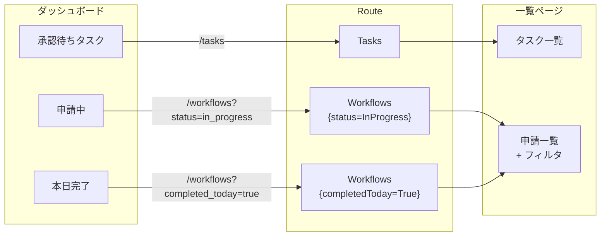

# ダッシュボードカードナビゲーション

## 対応 Issue

[#267 ダッシュボードのサマリーカードをクリックで一覧ページに遷移可能にする](https://github.com/ka2kama/ringiflow/issues/267)

## 概要

ダッシュボードの KPI カード（承認待ちタスク、申請中、本日完了）をクリックして対応するフィルタ付き一覧ページに遷移できるようにする。フロントエンド（Elm）のみの変更。

## アーキテクチャ

## Phase 構成

| Phase | 内容 | 主要ファイル |
|-------|------|-------------|
| 0 | 設計ブラッシュアップループの形式知化 | `.claude/rules/zoom-rhythm.md` |
| 1 | [Route 層のクエリパラメータ対応](01_Phase1_Route層クエリパラメータ.md) | `Route.elm`, `RouteTest.elm` |
| 2 | [申請一覧のフィルタ連動](02_Phase2_申請一覧フィルタ連動.md) | `Page/Workflow/List.elm`, `Main.elm` |
| 3 | [ダッシュボードカードのリンク化](03_Phase3_ダッシュボードカードリンク化.md) | `Page/Home.elm` |

## 関連ドキュメント

- [申請フォーム UI 設計](../../03_詳細設計書/10_ワークフロー申請フォームUI設計.md)
- [06_ダッシュボード（API 実装）](../06_ダッシュボード/)
