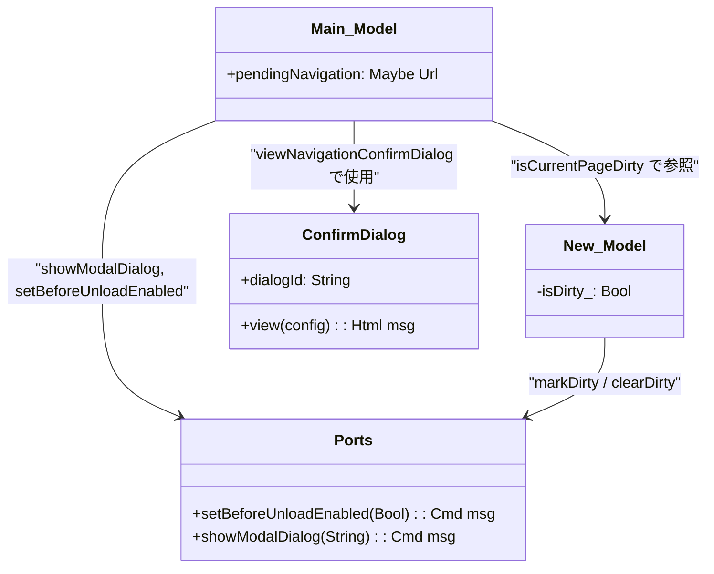
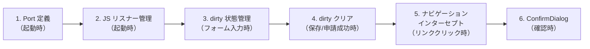
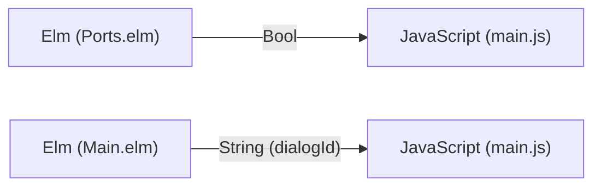
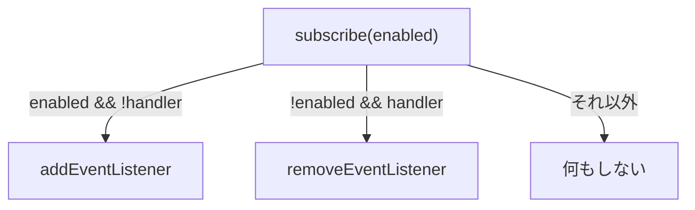
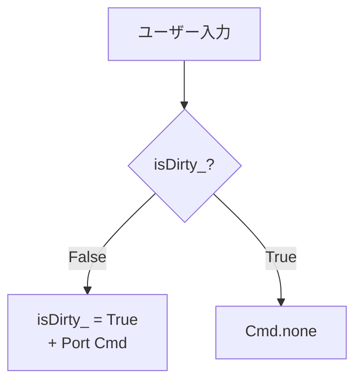
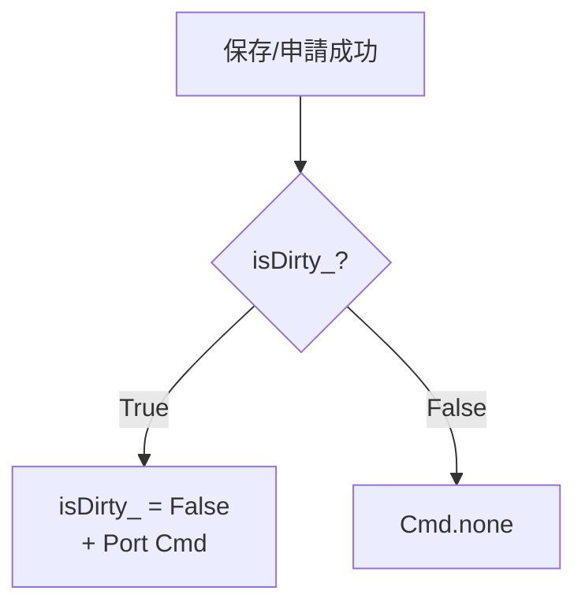
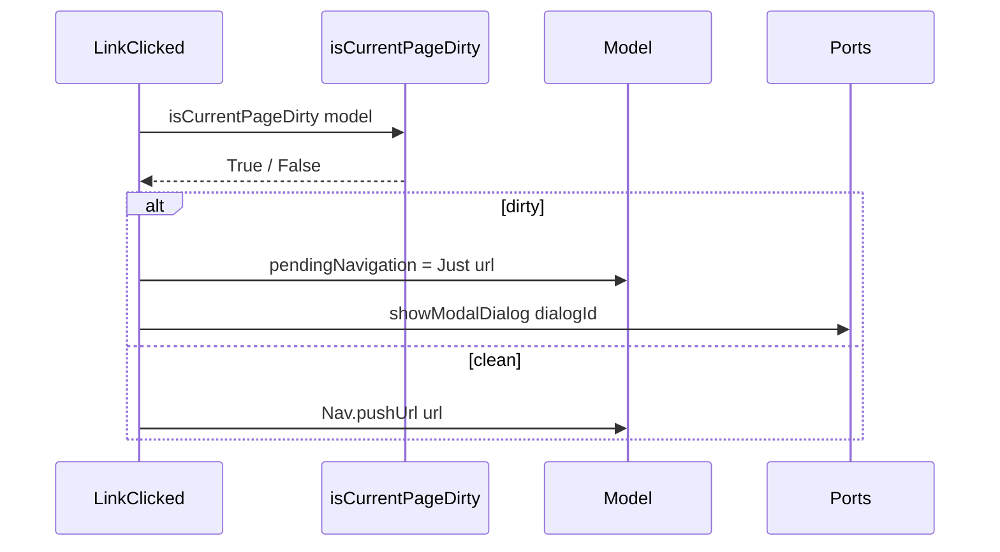
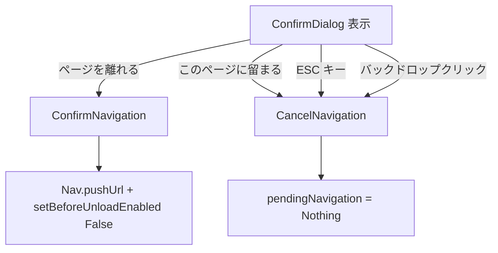

# フォーム dirty-state 検出 - コード解説

対応 PR: #264
対応 Issue: #177

## 主要な型・関数

| 型/関数 | ファイル | 責務 |
|--------|---------|------|
| `isDirty_` | [`New.elm:86`](../../../frontend/src/Page/Workflow/New.elm) | Model フィールド。未保存変更の有無を示す Bool |
| `isDirty` | [`New.elm:156`](../../../frontend/src/Page/Workflow/New.elm) | 公開関数。`isDirty_` のアクセサ |
| `markDirty` | [`New.elm:167`](../../../frontend/src/Page/Workflow/New.elm) | dirty 化。False → True のときのみ Port Cmd 発行 |
| `clearDirty` | [`New.elm:183`](../../../frontend/src/Page/Workflow/New.elm) | dirty クリア。True → False のときのみ Port Cmd 発行 |
| `setBeforeUnloadEnabled` | [`Ports.elm:53`](../../../frontend/src/Ports.elm) | `Bool -> Cmd msg`。JS への beforeunload 制御 |
| `pendingNavigation` | [`Main.elm:98`](../../../frontend/src/Main.elm) | `Maybe Url`。確認待ちの遷移先 URL |
| `isCurrentPageDirty` | [`Main.elm:483`](../../../frontend/src/Main.elm) | 現在のページの dirty 状態を判定 |
| `viewNavigationConfirmDialog` | [`Main.elm:744`](../../../frontend/src/Main.elm) | ナビゲーション確認ダイアログの描画 |

### 型の関係



## コードフロー

コードをライフサイクル順に追う。各ステップの構造を図で示した後、対応するコードを解説する。



### 1. Port 定義（起動時）

Elm と JavaScript の通信チャネルを定義する。



```elm
-- frontend/src/Ports.elm:53
port setBeforeUnloadEnabled : Bool -> Cmd msg  -- ① beforeunload 制御
```

注目ポイント:

- ① `Bool -> Cmd msg` という型シグネチャにより、呼び出し側のミスがコンパイル時に検出される。汎用 Port の `Encode.Value -> Cmd msg` と比較して型安全

### 2. JS リスナー管理（起動時）

JavaScript 側で Port をサブスクライブし、`beforeunload` リスナーを管理する。



```javascript
// frontend/src/main.js:234-250
if (app.ports.setBeforeUnloadEnabled) {
  let beforeUnloadHandler = null;                     // ① ハンドラの参照を保持

  app.ports.setBeforeUnloadEnabled.subscribe((enabled) => {
    if (enabled && !beforeUnloadHandler) {             // ② 未登録のときのみ登録
      beforeUnloadHandler = (e) => {
        e.preventDefault();
        e.returnValue = "";                            // ③ モダンブラウザで必須
      };
      window.addEventListener("beforeunload", beforeUnloadHandler);
    } else if (!enabled && beforeUnloadHandler) {      // ④ 登録済みのときのみ解除
      window.removeEventListener("beforeunload", beforeUnloadHandler);
      beforeUnloadHandler = null;
    }
  });
}
```

注目ポイント:

- ① `beforeUnloadHandler` 変数でリスナーの登録状態を追跡。`removeEventListener` には登録時と同じ関数参照が必要
- ② ③ ④ Elm 側の `markDirty`/`clearDirty` と同様の冪等性ガード。二重登録・二重解除を防止
- ③ `e.returnValue = ""` はモダンブラウザ（Chrome 等）で `preventDefault()` だけでは不十分なため必要

### 3. dirty 状態管理（フォーム入力時）

ユーザーの入力操作に応じて dirty フラグを管理する。



```elm
-- frontend/src/Page/Workflow/New.elm:167-175
markDirty : Model -> ( Model, Cmd Msg )
markDirty model =
    if model.isDirty_ then
        ( model, Cmd.none )          -- ① 既に dirty なら何もしない

    else
        ( { model | isDirty_ = True }
        , Ports.setBeforeUnloadEnabled True  -- ② 初回のみ Port 発行
        )
```

```elm
-- frontend/src/Page/Workflow/New.elm:254-265（SelectDefinition の例）
SelectDefinition definitionId ->
    let
        ( dirtyModel, dirtyCmd ) =   -- ③ markDirty の戻り値を分割代入
            markDirty model
    in
    ( { dirtyModel
        | selectedDefinitionId = Just definitionId
        , formValues = Dict.empty
        , validationErrors = Dict.empty
      }
    , dirtyCmd
    )
```

注目ポイント:

- ① 状態遷移ガード: `isDirty_` が既に `True` なら Port 通信をスキップ。フォームへのキー入力のたびに JS 通信が走ることを構造的に防止
- ② 状態が実際に変わるときのみ副作用を発生させる。Elm の「副作用は Cmd で表現」の原則に忠実
- ③ `( Model, Cmd Msg )` のタプルを let で分解し、`dirtyModel` に対してさらにフィールド更新を行うパターン

### 4. dirty クリア（保存/申請成功時）

保存や申請が成功したとき、dirty 状態をリセットする。



```elm
-- frontend/src/Page/Workflow/New.elm:183-191
clearDirty : Model -> ( Model, Cmd Msg )
clearDirty model =
    if model.isDirty_ then
        ( { model | isDirty_ = False }
        , Ports.setBeforeUnloadEnabled False  -- ① True → False のときのみ解除
        )

    else
        ( model, Cmd.none )
```

```elm
-- frontend/src/Page/Workflow/New.elm:370-383（GotSaveResult の例）
GotSaveResult result ->
    case result of
        Ok workflow ->
            let
                ( cleanModel, cleanCmd ) =
                    clearDirty model    -- ② 保存成功で dirty クリア
            in
            ( { cleanModel
                | submitting = False
                , savedWorkflow = Just workflow
                , saveMessage = Just (SaveSuccess "下書きを保存しました")
              }
            , cleanCmd                  -- ③ Port Cmd を返す
            )
```

注目ポイント:

- ① `markDirty` と対称的な構造。`clearDirty` も冪等
- ② ③ `GotSaveResult`、`GotSaveAndSubmitResult`、`GotSubmitResult` の 3 つの成功パスすべてで `clearDirty` を呼ぶ

dirty 管理の全 Msg マッピング:

| Msg | 操作 | 理由 |
|-----|------|------|
| `SelectDefinition` | markDirty | 定義選択は入力行為 |
| `UpdateTitle` | markDirty | タイトル入力 |
| `UpdateField` | markDirty | フィールド入力 |
| `SelectApprover` | markDirty | 承認者選択 |
| `ClearApprover` | markDirty | 承認者クリア |
| `ApproverKeyDown` → `Select` | markDirty | キーボード操作での承認者選択 |
| `GotSaveResult Ok` | clearDirty | 下書き保存成功 |
| `GotSaveAndSubmitResult Ok` | clearDirty | 保存+申請成功 |
| `GotSubmitResult Ok` | clearDirty | 申請成功 |
| `UpdateApproverSearch` | 変更なし | 検索テキストはフォーム値ではない |

### 5. ナビゲーションインターセプト（リンククリック時）

SPA 内のリンククリック時に dirty チェックを行う。



```elm
-- frontend/src/Main.elm:282-291
LinkClicked urlRequest ->
    case urlRequest of
        Browser.Internal url ->
            if isCurrentPageDirty model then       -- ① dirty チェック
                ( { model | pendingNavigation = Just url }  -- ② URL を保持
                , Ports.showModalDialog ConfirmDialog.dialogId  -- ③ ダイアログ表示
                )

            else
                ( model, Nav.pushUrl model.key (Url.toString url) )
```

```elm
-- frontend/src/Main.elm:483-490
isCurrentPageDirty : Model -> Bool
isCurrentPageDirty model =
    case model.page of
        WorkflowNewPage subModel ->
            WorkflowNew.isDirty subModel    -- ④ ページの isDirty を呼ぶ

        _ ->
            False                           -- ⑤ 他のページは常に clean
```

注目ポイント:

- ① `LinkClicked` の中で dirty チェックを行い、dirty なら遷移を保留
- ② 遷移先 URL を `pendingNavigation` に保存。`Maybe Url` 型で「確認待ち」状態を表現
- ③ `Ports.showModalDialog` でネイティブ `<dialog>` の `showModal()` を呼ぶ。フォーカストラップと ESC ハンドリングをブラウザが提供
- ④ ⑤ `case` による網羅的パターンマッチ。将来他のページにも `isDirty` を追加する場合はここを拡張

### 6. ConfirmDialog（確認時）

ユーザーの選択に応じてナビゲーションを実行またはキャンセルする。



```elm
-- frontend/src/Main.elm:378-394
ConfirmNavigation ->
    case model.pendingNavigation of
        Just url ->
            ( { model | pendingNavigation = Nothing }  -- ① 保留状態をクリア
            , Cmd.batch
                [ Nav.pushUrl model.key (Url.toString url)  -- ② ナビゲーション実行
                , Ports.setBeforeUnloadEnabled False         -- ③ beforeunload 解除
                ]
            )

        Nothing ->
            ( model, Cmd.none )

CancelNavigation ->
    ( { model | pendingNavigation = Nothing }  -- ④ 保留状態のみクリア
    , Cmd.none
    )
```

```elm
-- frontend/src/Main.elm:744-759
viewNavigationConfirmDialog : Maybe Url -> Html Msg
viewNavigationConfirmDialog maybePendingUrl =
    case maybePendingUrl of
        Just _ ->
            ConfirmDialog.view
                { title = "ページを離れますか？"
                , message = "入力中のデータは保存されません。このページを離れてもよろしいですか？"
                , confirmLabel = "ページを離れる"
                , cancelLabel = "このページに留まる"
                , onConfirm = ConfirmNavigation
                , onCancel = CancelNavigation
                , actionStyle = ConfirmDialog.Destructive  -- ⑤ 破壊的操作スタイル
                }

        Nothing ->
            text ""
```

注目ポイント:

- ① ② ③ `ConfirmNavigation` では 3 つの操作をアトミックに実行: 保留クリア、ナビゲーション、beforeunload 解除
- ④ `CancelNavigation` では保留状態のみクリアし、ページに留まる
- ⑤ `Destructive` スタイル（赤系ボタン）を使用。データ損失を伴う操作であることを視覚的に示す

## テスト

dirty 状態管理はフロントエンドのみの変更であり、Elm テスト全件通過で確認。

| テスト種別 | 対象 | 検証内容 |
|-----------|------|---------|
| 既存 Elm テスト | 全ページ | 既存機能のリグレッションなし |
| 手動テスト | New.elm + Main.elm | dirty 管理フロー全体 |

手動テストシナリオ:

| # | シナリオ | 期待結果 |
|---|---------|---------|
| 1 | フォーム入力 → タブ閉じ | ブラウザ警告ダイアログ |
| 2 | フォーム入力 → リロード | ブラウザ警告ダイアログ |
| 3 | フォーム入力 → サイドバーリンク | ConfirmDialog 表示 |
| 4 | ConfirmDialog → 「ページを離れる」 | ナビゲーション実行 |
| 5 | ConfirmDialog → 「このページに留まる」 | ページに留まる |
| 6 | ConfirmDialog → ESC キー | ダイアログ閉じ、ページに留まる |
| 7 | ConfirmDialog → バックドロップクリック | ダイアログ閉じ、ページに留まる |
| 8 | 未入力 → サイドバーリンク | 確認なしにナビゲーション |
| 9 | 下書き保存成功 → サイドバーリンク | 確認なしにナビゲーション |
| 10 | 申請成功 → サイドバーリンク | 確認なしにナビゲーション |

### 実行方法

```bash
cd frontend && pnpm run test
```

## 設計解説

コード実装レベルの判断を記載する。機能・仕組みレベルの判断は[機能解説](./01_フォームdirty-state_機能解説.md#設計判断)を参照。

### 1. markDirty/clearDirty の状態遷移ガード

場所: `frontend/src/Page/Workflow/New.elm:167-191`

```elm
markDirty : Model -> ( Model, Cmd Msg )
markDirty model =
    if model.isDirty_ then
        ( model, Cmd.none )
    else
        ( { model | isDirty_ = True }
        , Ports.setBeforeUnloadEnabled True
        )
```

なぜこの実装か:

`markDirty` は `( Model, Cmd Msg )` を返す関数として設計し、Port Cmd の発行を状態変化時のみに限定している。これにより:

- 各 Msg ハンドラは `markDirty model` を呼ぶだけでよく、dirty 判定ロジックを知らない
- 戻り値の `Cmd` を `Cmd.batch` で他の Cmd と合成できる
- テスト時も `markDirty` の冪等性が保証される

代替案:

| 案 | メリット | デメリット | 判断 |
|----|---------|-----------|------|
| 状態遷移ガード（採用） | 冗長通信を構造的に排除 | `let ( model, cmd )` のボイラープレート | 採用 |
| 毎回 Port 発行 | シンプル | JS 側にも冪等性ガードが必要 | 見送り |
| update 末尾で一括判定 | 集中管理 | 各ハンドラの dirty 意図が不明確 | 見送り |

### 2. フィールド名 `isDirty_`（アンダースコアサフィックス）

場所: `frontend/src/Page/Workflow/New.elm:86`

```elm
type alias Model =
    { ...
    , isDirty_ : Bool
    }

isDirty : Model -> Bool
isDirty model =
    model.isDirty_
```

なぜこの実装か:

Elm ではレコードフィールド名がアクセサ関数（`.isDirty`）として自動生成される。公開関数 `isDirty : Model -> Bool` と名前が衝突するため、フィールド名にアンダースコアサフィックスを付けた。

- 公開 API（モジュール外から使う `isDirty` 関数）をクリーンな名前に保つ
- アンダースコアは「内部用」の慣習的シグナル。`model.isDirty_` という直接フィールドアクセスを抑制する意図

代替案:

| 案 | メリット | デメリット | 判断 |
|----|---------|-----------|------|
| `isDirty_` + `isDirty` 関数（採用） | 公開 API がクリーン | フィールド名が若干不自然 | 採用 |
| フィールド名 `dirty` | 衝突なし | `model.dirty` は意味が曖昧 | 見送り |
| 関数名 `getIsDirty` | 衝突なし | Java 的命名で Elm イディオムに合わない | 見送り |

### 3. PendingAction パターンの再利用

場所: `frontend/src/Main.elm:98, 378-394`

```elm
type alias Model =
    { ...
    , pendingNavigation : Maybe Url
    }
```

なぜこの実装か:

`Page/Workflow/Detail.elm` で既に確立されている PendingAction パターン（`Maybe` で保留状態を表現 + ConfirmDialog + キャンセルで `Nothing` に戻す）を Main.elm のナビゲーション制御にも適用した。

- `Maybe Url` が「確認待ち」状態を型レベルで表現（Make Illegal States Unrepresentable）
- ConfirmDialog の表示は `pendingNavigation` が `Just` のときのみ
- キャンセルで `Nothing` に戻すだけでダイアログが消える（Elm の Virtual DOM が差分を検出）

代替案:

| 案 | メリット | デメリット | 判断 |
|----|---------|-----------|------|
| `Maybe Url`（採用） | 型安全、既存パターン踏襲 | — | 採用 |
| `Bool` + 別フィールドで URL 保持 | — | 状態の組み合わせが増える | 見送り |
| ConfirmDialog にコールバックを渡す | 柔軟 | Elm の TEA パターンから外れる | 見送り |

### 4. handleApproverKeyDown の markDirty

場所: `frontend/src/Page/Workflow/New.elm:594-613`

```elm
ApproverSelector.Select user ->
    let
        ( dirtyModel, dirtyCmd ) =
            markDirty model
    in
    ( { dirtyModel
        | approver = { dirtyApprover | selection = Selected user, ... }
        , validationErrors = Dict.remove "approver" dirtyModel.validationErrors
      }
    , dirtyCmd
    )
```

なぜこの実装か:

`handleApproverKeyDown` の Enter キーで承認者を選択するパスは、`SelectApprover` Msg を経由せずに直接モデルを変更する。このため、`SelectApprover` に付与した `markDirty` とは別に、このパスにも `markDirty` が必要。

代替案:

| 案 | メリット | デメリット | 判断 |
|----|---------|-----------|------|
| 直接 markDirty（採用） | 明示的、漏れなし | markDirty が複数箇所に分散 | 採用 |
| SelectApprover Msg を再発火 | 一箇所に集約 | 二重の update サイクル | 見送り |

## 関連ドキュメント

- [機能解説](./01_フォームdirty-state_機能解説.md)
- [ナレッジベース: Elm ポート](../../06_ナレッジベース/elm/Elmポート.md)
- [ナレッジベース: Elm アーキテクチャ](../../06_ナレッジベース/elm/Elmアーキテクチャ.md)
