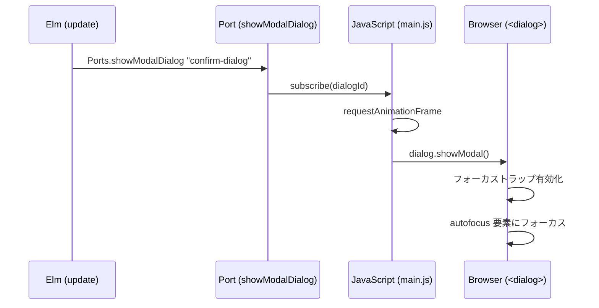

# ConfirmDialog の `<dialog>` 要素への移行

## 概要

ConfirmDialog コンポーネントを `div` ベースから HTML `<dialog>` 要素 + `showModal()` に移行し、WAI-ARIA Dialog パターンに準拠するアクセシビリティを実現した。

### 対応 Issue

[#265 ConfirmDialog のアクセシビリティ改善](https://github.com/ka2kama/ringiflow/issues/265)

### 設計書との対応

- ADR-031: [ConfirmDialog の dialog 要素への移行](../../05_ADR/031_ConfirmDialogのdialog要素への移行.md)

## 実装したコンポーネント

| ファイル | 責務 |
|---------|------|
| [`Component/ConfirmDialog.elm`](../../../frontend/src/Component/ConfirmDialog.elm) | `<dialog>` 要素による確認ダイアログ。ARIA ラベリング、ESC 処理、backdrop click を内包 |
| [`Ports.elm`](../../../frontend/src/Ports.elm) | `showModalDialog` Port（`showModal()` の命令的呼び出し） |
| [`main.js`](../../../frontend/src/main.js) | Port ハンドラ（`requestAnimationFrame` + `showModal()`） |
| [`styles.css`](../../../frontend/src/styles.css) | `::backdrop` 疑似要素のスタイル |

### 利用箇所（変更）

| ファイル | 変更内容 |
|---------|---------|
| [`Page/Task/Detail.elm`](../../../frontend/src/Page/Task/Detail.elm) | `focusDialogCancel` → `Ports.showModalDialog`、ESC 購読削除 |
| [`Page/Workflow/Detail.elm`](../../../frontend/src/Page/Workflow/Detail.elm) | 同上 |
| [`Main.elm`](../../../frontend/src/Main.elm) | 同上 + `subscriptions` 簡素化 |

### 削除

| ファイル | 理由 |
|---------|------|
| `Util/KeyEvent.elm` | 全利用箇所が `<dialog>` の `cancel` イベントに置換 |
| `tests/Util/KeyEventTest.elm` | 上記に伴い不要 |

## 実装内容

### ConfirmDialog の構造

```elm
Html.node "dialog"
    [ id dialogId
    , attribute "aria-labelledby" titleId
    , attribute "aria-describedby" messageId
    , preventDefaultOn "cancel" (Decode.succeed ( config.onCancel, True ))
    , Html.Events.on "click" (backdropClickDecoder config.onCancel)
    ]
    [ div [ class "... pointer-events-none" ]        -- 全画面 flex コンテナ
        [ div [ class "... pointer-events-auto" ]    -- ダイアログボックス
            [ h2 [ id titleId ] [ text config.title ]
            , p [ id messageId ] [ text config.message ]
            , div []  -- ボタンエリア
                [ cancelButton   -- autofocus True
                , confirmButton
                ]
            ]
        ]
    ]
```

### Port の流れ



## テスト

テストファイル: [`tests/Component/ConfirmDialogTest.elm`](../../../frontend/tests/Component/ConfirmDialogTest.elm)

| テスト | 検証内容 |
|-------|---------|
| dialog 要素で描画される | `Html.node "dialog"` が正しく生成される |
| aria-labelledby | タイトル要素の ID を参照する |
| aria-describedby | メッセージ要素の ID を参照する |
| タイトル要素の ID | 正しい ID が付与されテキストが表示される |
| メッセージ要素の ID | 正しい ID が付与されテキストが表示される |
| backdrop click（成功） | `target.nodeName === "DIALOG"` で成功 |
| backdrop click（失敗） | `target.nodeName === "DIV"` で失敗 |

実行:
```bash
cd frontend && pnpm run test -- --watch tests/Component/ConfirmDialogTest.elm
```

## 関連ドキュメント

- ADR-031: [ConfirmDialog の dialog 要素への移行](../../05_ADR/031_ConfirmDialogのdialog要素への移行.md)
- [WAI-ARIA Dialog (Modal) Pattern](https://www.w3.org/WAI/ARIA/apg/patterns/dialog-modal/)
- [Elm ポート](../../06_ナレッジベース/elm/Elmポート.md)

---

## 設計解説

### 1. `<dialog>` + `showModal()` による宣言的/命令的の分離

場所: [`ConfirmDialog.elm`](../../../frontend/src/Component/ConfirmDialog.elm), [`main.js`](../../../frontend/src/main.js)

Elm は純粋関数型で宣言的な Virtual DOM を生成するが、`showModal()` は命令的 API。この分離を Port で橋渡しする。

```elm
-- Elm 側: 宣言的に <dialog> を DOM に置く
Html.node "dialog" [ id dialogId, ... ] [ ... ]

-- Elm 側: 命令的な showModal() は Port で委譲
Ports.showModalDialog ConfirmDialog.dialogId
```

```javascript
// JS 側: 命令的な API を実行
app.ports.showModalDialog.subscribe((dialogId) => {
  requestAnimationFrame(() => {
    const dialog = document.getElementById(dialogId);
    if (dialog && !dialog.open) {
      dialog.showModal();
    }
  });
});
```

`requestAnimationFrame` を使う理由: Port コマンドは Elm の Virtual DOM パッチ後に実行されるが、安全マージンとして次フレームまで遅延させ、DOM 更新の完了を保証する。

`!dialog.open` チェック: 二重 `showModal()` 呼び出しによる `InvalidStateError` を防止。

### 2. ESC キー処理の `cancel` イベントへの統合

場所: [`ConfirmDialog.elm` L94-95](../../../frontend/src/Component/ConfirmDialog.elm)

```elm
preventDefaultOn "cancel"
    (Decode.succeed ( config.onCancel, True ))
```

`<dialog>` は ESC キーで `cancel` イベントを発火し、デフォルト動作としてダイアログを閉じる。しかし Elm では `pendingAction` 等の状態管理がコンポーネント外にあるため、ネイティブの閉じ動作を許すと状態が不整合になる。

`preventDefaultOn` で:
1. ネイティブの閉じ動作を防止（`True` = `preventDefault`）
2. `config.onCancel` メッセージを Elm に送り、Elm 側で `pendingAction = Nothing` に更新

代替案: `Html.Events.on "cancel"` を使うと `preventDefault` できず、ダイアログがネイティブに閉じた後に Elm の状態更新が走る。この場合、一瞬ダイアログが閉じてから Elm の View が更新されるちらつきが発生しうる。`preventDefaultOn` なら Elm の状態更新と DOM 更新が一体で行われる。

この変更により、3箇所にあった `Browser.Events.onKeyDown (KeyEvent.escKeyDecoder ...)` が不要になり、`subscriptions` が簡素化された。

### 3. Backdrop クリック検出の `pointer-events` トリック

場所: [`ConfirmDialog.elm` L89-98](../../../frontend/src/Component/ConfirmDialog.elm)

`::backdrop` 疑似要素は CSS スタイリング専用で、DOM イベントをバインドできない。そこで以下の構造で代替する:

```
<dialog>  ← 全画面透明、click イベントをリッスン
  └ div   ← pointer-events-none（クリックを透過）
      └ div  ← pointer-events-auto（ダイアログボックス、クリックを捕捉）
```

```elm
backdropClickDecoder msg =
    Decode.at [ "target", "nodeName" ] Decode.string
        |> Decode.andThen
            (\nodeName ->
                if nodeName == "DIALOG" then
                    Decode.succeed msg
                else
                    Decode.fail ("Click was not on the backdrop: " ++ nodeName)
            )
```

動作原理:
- ダイアログボックス内のクリック → `pointer-events-auto` により `div` が `target` → `nodeName` は `"DIV"` → デコーダ失敗 → イベント無視
- ダイアログボックス外のクリック → 中間コンテナは `pointer-events-none` で透過 → `<dialog>` が `target` → `nodeName` は `"DIALOG"` → デコーダ成功 → `onCancel` 発火

代替案として `stopPropagation` パターン（ダイアログボックスの click で伝播を止める）も検討したが、Elm の `stopPropagationOn` は no-op Msg が必要になり、コンポーネント API が複雑化するため不採用。

### 4. `subscriptions` の関数から値への変更

場所: [`Page/Task/Detail.elm`](../../../frontend/src/Page/Task/Detail.elm), [`Page/Workflow/Detail.elm`](../../../frontend/src/Page/Workflow/Detail.elm)

```elm
-- Before: Model を受け取る関数
subscriptions : Model -> Sub Msg
subscriptions model =
    case model.pendingAction of
        Just _ -> Browser.Events.onKeyDown (KeyEvent.escKeyDecoder CancelAction)
        Nothing -> Sub.none

-- After: 常に Sub.none を返す値
subscriptions : Sub Msg
subscriptions =
    Sub.none
```

ESC 処理が `<dialog>` の `cancel` イベントに統合されたため、`subscriptions` が Model に依存しなくなった。elm-review の `NoUnused.Parameters` ルールの指摘に従い、不要なパラメータを除去して型を `Model -> Sub Msg` から `Sub Msg` に変更。

Main.elm 側の呼び出しも対応:

```elm
-- Before
Sub.map TaskDetailMsg (TaskDetail.subscriptions subModel)

-- After
Sub.map TaskDetailMsg TaskDetail.subscriptions
```

将来 Model に依存するサブスクリプションが必要になれば、型を関数に戻せばよい（YAGNI）。
