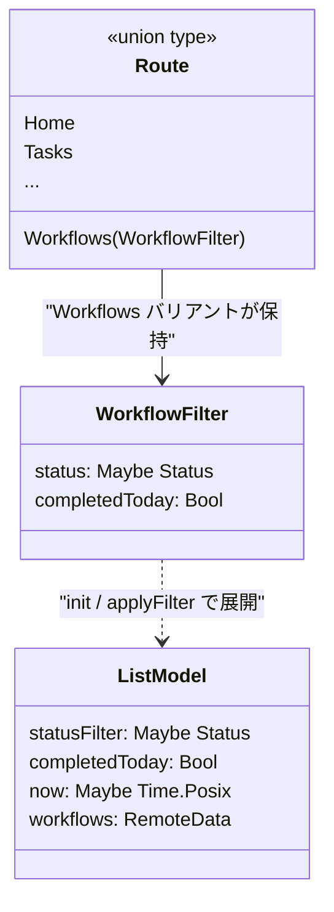
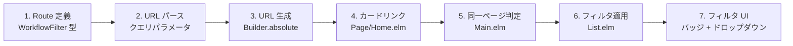
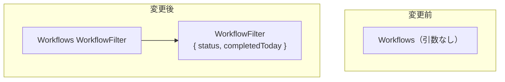
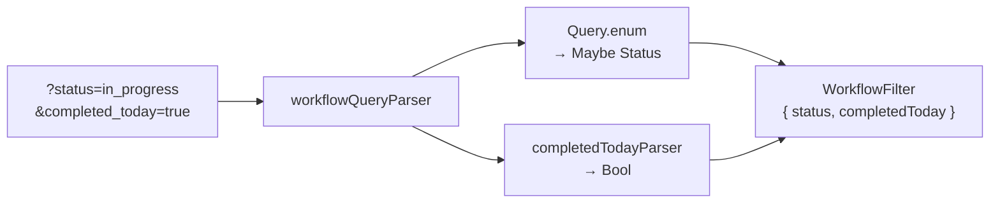
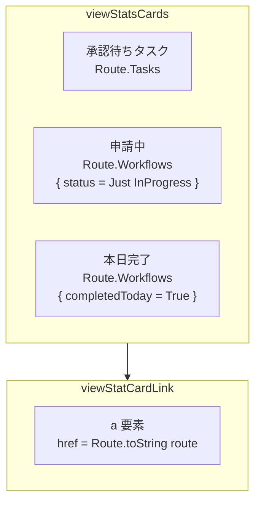
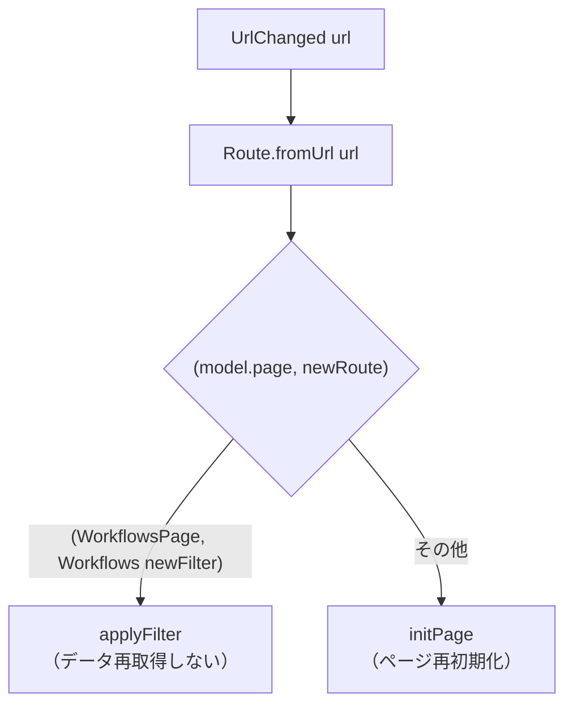
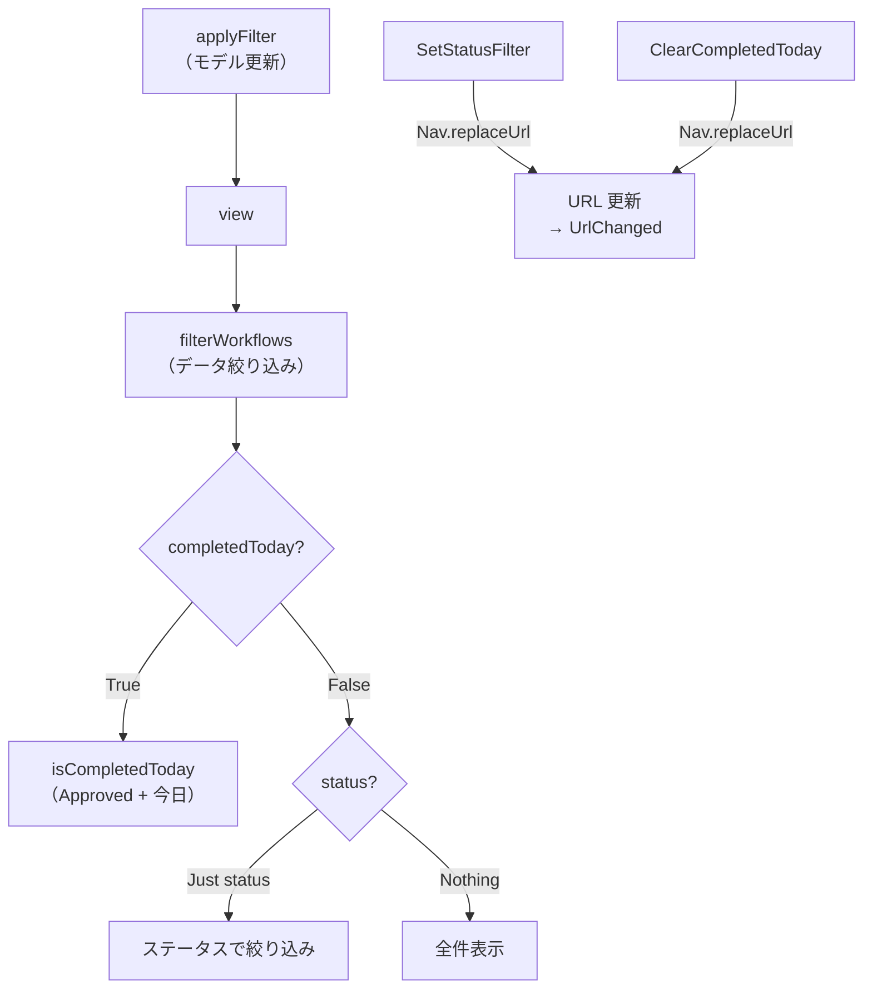
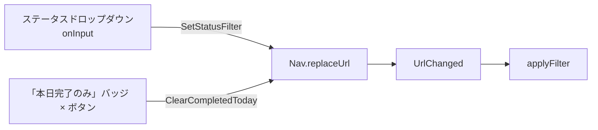
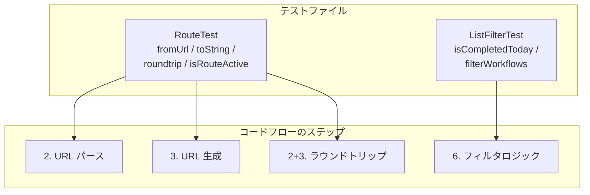

# ダッシュボードカードナビゲーション - コード解説

対応 PR: #268
対応 Issue: #267

## 主要な型・関数

| 型/関数 | ファイル | 責務 |
|--------|---------|------|
| `WorkflowFilter` | [`Route.elm:97`](../../../frontend/src/Route.elm) | 申請一覧のフィルタ条件（status + completedToday） |
| `emptyWorkflowFilter` | [`Route.elm:105`](../../../frontend/src/Route.elm) | フィルタなしのデフォルト状態 |
| `workflowQueryParser` | [`Route.elm:164`](../../../frontend/src/Route.elm) | URL クエリパラメータ → WorkflowFilter |
| `completedTodayParser` | [`Route.elm:191`](../../../frontend/src/Route.elm) | `completed_today` パラメータの Bool パーサー |
| `toString` | [`Route.elm:246`](../../../frontend/src/Route.elm) | Route → URL 文字列（クエリパラメータ含む） |
| `applyFilter` | [`Page/Workflow/List.elm:124`](../../../frontend/src/Page/Workflow/List.elm) | 同一ページでのフィルタ状態更新 |
| `filterWorkflows` | [`Page/Workflow/List.elm:426`](../../../frontend/src/Page/Workflow/List.elm) | フィルタ条件に基づくワークフロー絞り込み |
| `isCompletedToday` | [`Page/Workflow/List.elm:450`](../../../frontend/src/Page/Workflow/List.elm) | 「本日完了」判定（Approved + 今日の日付） |
| `viewStatCardLink` | [`Page/Home.elm:157`](../../../frontend/src/Page/Home.elm) | クリック可能な KPI カードの描画 |

### 型の関係



Route 型の `Workflows` バリアントが `WorkflowFilter` を保持し、URL = アプリケーション状態の Single Source of Truth を実現する。`WorkflowFilter` のフィールドはページモデルの `statusFilter` / `completedToday` に展開される。

## コードフロー

コードをライフサイクル順に追う。各ステップの構造を図で示した後、対応するコードを解説する。



### 1. Route 定義（型レベルのフィルタ埋め込み）

Route 型にフィルタを埋め込むことで、URL とアプリケーション状態の一致を型レベルで保証する。



```elm
-- Route.elm:82-100
type Route
    = Home
    | Workflows WorkflowFilter  -- ① フィルタを Route に埋め込み
    | WorkflowNew
    | WorkflowDetail Int
    | Tasks
    | TaskDetail Int Int
    | NotFound

type alias WorkflowFilter =  -- ② URL クエリパラメータと 1:1 対応
    { status : Maybe Status
    , completedToday : Bool
    }
```

注目ポイント:

- ① `Workflows` バリアントに `WorkflowFilter` を持たせることで、コンパイラが全参照箇所でフィルタの扱いを強制する。`Workflows` を使うすべてのパターンマッチでフィルタ対応が必要になる
- ② `status` は `Maybe` で「未指定」を表現、`completedToday` は `Bool` で「フラグ」を表現。クエリパラメータの性質に応じた型選択

### 2. URL パース（クエリパラメータ → WorkflowFilter）

`Url.Parser.Query` モジュールを使い、`?status=in_progress&completed_today=true` 形式のクエリパラメータをパースする。



```elm
-- Route.elm:164-201
workflowQueryParser : Query.Parser WorkflowFilter
workflowQueryParser =
    Query.map2 WorkflowFilter  -- ① 2つのパーサーを合成
        (Query.enum "status"   -- ② Dict ベースの列挙パーサー
            (Dict.fromList
                [ ( "draft", Draft )
                , ( "in_progress", InProgress )
                -- ...省略
                ]
            )
        )
        completedTodayParser

completedTodayParser : Query.Parser Bool
completedTodayParser =
    Query.custom "completed_today"  -- ③ 生値リストを受け取るカスタムパーサー
        (\values ->
            case values of
                [ "true" ] -> True
                _ -> False
        )
```

注目ポイント:

- ① `Query.map2` は 2 つの `Query.Parser` を合成して `WorkflowFilter` を構築する
- ② `Query.enum` は `Dict String a` を受け取り `Maybe a` を返す。未知の値は `Nothing` になるため、不正な URL を安全に処理できる
- ③ `completedToday` は `Bool` のため `Query.enum`（`Maybe a` を返す）は不適。`Query.custom` で生のクエリ値リストを受け取り、`["true"]` のみ `True` にマッピング

### 3. URL 生成（Route → URL 文字列）

`toString` は Route からクエリパラメータ付き URL 文字列を生成する。`fromUrl` と双方向の関係にあり、ラウンドトリップの一貫性が保証される。

```elm
-- Route.elm:246-263
toString : Route -> String
toString route =
    case route of
        Workflows filter ->
            Builder.absolute [ "workflows" ]  -- ① パスとクエリを分離して構築
                (List.filterMap identity
                    [ filter.status
                        |> Maybe.map (\st -> Builder.string "status" (statusToQueryValue st))
                    , if filter.completedToday then  -- ② Bool → 条件付き出力
                        Just (Builder.string "completed_today" "true")
                      else
                        Nothing
                    ]
                )
        -- ...
```

注目ポイント:

- ① `Url.Builder.absolute` はパスとクエリパラメータのリストを受け取り、エンコード済み URL を返す。手動の文字列連結よりも安全
- ② `List.filterMap identity` パターンで、`Nothing`（未設定のパラメータ）を除外。`status = Nothing` ならクエリに出力されず、`completedToday = False` なら `completed_today` キー自体が省略される

### 4. ダッシュボードカードのリンク化（Page/Home.elm）

KPI カードを `<div>` から `<a>` 要素に変更し、Route を指定してリンク先を構築する。



```elm
-- Page/Home.elm:124-174
viewStatsCards : DashboardStats -> Html Msg
viewStatsCards stats =
    div [ class "mt-4 grid gap-4 sm:grid-cols-3" ]
        [ viewStatCardLink
            { label = "承認待ちタスク"
            , value = stats.pendingTasks
            , route = Route.Tasks  -- ① Tasks はフィルタなし
            }
        , viewStatCardLink
            { label = "申請中"
            , route = Route.Workflows  -- ② InProgress フィルタ
                { status = Just InProgress, completedToday = False }
            }
        , viewStatCardLink
            { label = "本日完了"
            , route = Route.Workflows  -- ③ completedToday プリセット
                { status = Nothing, completedToday = True }
            }
        ]

viewStatCardLink : { ... , route : Route.Route } -> Html Msg
viewStatCardLink config =
    a  -- ④ div → a に変更
        [ href (Route.toString config.route)  -- ⑤ Route.toString で URL 生成
        , class "block rounded-xl p-6 text-center no-underline transition-shadow hover:shadow-md ..."
        ]
        [ ... ]
```

注目ポイント:

- ① Tasks ルートはフィルタなし（API が Active タスクのみ返すため）
- ②③ フィルタ条件は Route の型で表現。`Route.toString` で URL に変換される
- ④ `<a>` 要素にすることで、ブラウザ標準のリンク動作（右クリック → 新しいタブ、etc.）が使える
- ⑤ `href` に `Route.toString` を使うことで、URL 生成が Route モジュールに集約される

### 5. 同一ページ判定（Main.elm）

URL 変更時、すでに申請一覧ページを表示中であればページを再初期化せず、フィルタのみを更新する。



```elm
-- Main.elm:296-329
UrlChanged url ->
    let
        newRoute = Route.fromUrl url
    in
    case ( model.page, newRoute ) of
        ( WorkflowsPage subModel, Route.Workflows newFilter ) ->  -- ① タプルでパターンマッチ
            let
                ( newSubModel, subCmd ) =
                    WorkflowList.applyFilter newFilter subModel  -- ② フィルタのみ更新
            in
            ( { model
                | url = url
                , route = newRoute
                , page = WorkflowsPage newSubModel
                , sidebarOpen = False
              }
            , Cmd.map WorkflowsMsg subCmd
            )

        _ ->  -- ③ その他: 通常のページ遷移
            let
                ( page, pageCmd ) = initPage model.key newRoute model.shared
            in
            ( { model | url = url, route = newRoute, page = page, sidebarOpen = False }
            , pageCmd
            )
```

注目ポイント:

- ① `(model.page, newRoute)` のタプルパターンマッチで、現在のページと遷移先ルートを同時に検査する
- ② 同一ページ（申請一覧 → 申請一覧、フィルタ違い）の場合、`applyFilter` でモデルのフィルタフィールドのみ更新。API 再呼び出しを避け、既存データをフィルタリングする
- ③ 異なるページへの遷移は従来通り `initPage` で再初期化

### 6. フィルタ適用とフィルタロジック（Page/Workflow/List.elm）

`applyFilter` がモデルを更新し、`filterWorkflows` がデータを絞り込む。フィルタ変更時は `Nav.replaceUrl` でブラウザ履歴を置換する。



```elm
-- Page/Workflow/List.elm:124-137
applyFilter : WorkflowFilter -> Model -> ( Model, Cmd Msg )
applyFilter filter model =
    let
        newModel =
            { model | statusFilter = filter.status, completedToday = filter.completedToday }
        cmd =
            if filter.completedToday then
                Task.perform GotCurrentTime Time.now  -- ① 「本日」の判定に現在時刻が必要
            else
                Cmd.none
    in
    ( newModel, cmd )
```

```elm
-- Page/Workflow/List.elm:426-458
filterWorkflows : Time.Zone -> Maybe Time.Posix -> WorkflowFilter -> List WorkflowInstance -> List WorkflowInstance
filterWorkflows zone maybeNow filter workflows =
    if filter.completedToday then  -- ② completedToday が優先
        case maybeNow of
            Just now ->
                List.filter (isCompletedToday zone now) workflows
            Nothing ->
                workflows  -- ③ 時刻未取得時は全件（安全なフォールバック）
    else
        case filter.status of
            Nothing -> workflows
            Just status -> List.filter (\w -> w.status == status) workflows

isCompletedToday : Time.Zone -> Time.Posix -> WorkflowInstance -> Bool
isCompletedToday zone now workflow =
    (workflow.status == WorkflowInstance.Approved)  -- ④ Approved かつ
        && (case Iso8601.toTime workflow.updatedAt of
                Ok updatedPosix -> sameDate zone now updatedPosix  -- ⑤ 今日の日付
                Err _ -> False
           )
```

注目ポイント:

- ① `completedToday` が有効になった場合、`Time.now` を非同期取得する。Elm は純粋関数言語のため、現在時刻は Cmd（副作用）経由でのみ取得可能
- ② `completedToday` と `status` が同時に指定された場合、`completedToday` が優先される（プリセットフィルタの設計判断）
- ③ `Time.now` が未到着（`Nothing`）の間は全件を返す。一瞬の表示のちらつきと引き換えに、空リスト表示を回避
- ④⑤ 「本日完了」の定義: `status == Approved` かつ `updatedAt` が今日の日付。`Iso8601.toTime` でパースし、年月日の一致で判定

### 7. フィルタ UI（ドロップダウン + バッジ）

フィルタ変更は `Nav.replaceUrl` を通じて URL を更新し、`UrlChanged` → `applyFilter` の流れで状態が同期される。



```elm
-- Page/Workflow/List.elm:171-181
SetStatusFilter maybeStatus ->
    ( model
    , Nav.replaceUrl model.key  -- ① replaceUrl で履歴を汚さない
        (Route.toString (Route.Workflows { status = maybeStatus, completedToday = False }))
    )

ClearCompletedToday ->
    ( model
    , Nav.replaceUrl model.key
        (Route.toString (Route.Workflows { status = model.statusFilter, completedToday = False }))
    )
```

```elm
-- Page/Workflow/List.elm:292-354
viewFilterBar : WorkflowFilter -> Html Msg
viewFilterBar filter =
    div [ class "mb-4 flex flex-wrap items-center gap-2" ]
        [ viewStatusDropdown filter.status
        , if filter.completedToday then
            viewCompletedTodayBadge  -- ② completedToday 時のみバッジ表示
          else
            text ""
        ]

viewCompletedTodayBadge : Html Msg
viewCompletedTodayBadge =
    span [ class "inline-flex items-center gap-1 rounded-full bg-success-50 px-3 py-1 text-sm text-success-700" ]
        [ text "本日完了のみ"
        , button
            [ onClick ClearCompletedToday  -- ③ × ボタンでフィルタ解除
            , attribute "aria-label" "フィルタ解除"
            ]
            [ text "×" ]
        ]
```

注目ポイント:

- ① `Nav.replaceUrl` は現在の履歴エントリを置換する。フィルタ変更のたびに履歴が積まれないため、ブラウザの「戻る」ボタンで前のページ（ダッシュボード等）に戻れる
- ② `completedToday` フィルタはダッシュボードからの遷移専用のため、通常時はバッジを非表示にする
- ③ `ClearCompletedToday` は `completedToday = False` の URL に `replaceUrl` する。単方向データフロー（UI → URL → Model）が維持される

## テスト

各テストがライフサイクルのどのステップを検証しているかを示す。



| テスト | ファイル | 検証対象のステップ | 検証内容 |
|-------|---------|------------------|---------
| `fromUrl` - クエリパラメータ | [`RouteTest.elm:62-96`](../../../frontend/tests/RouteTest.elm) | 2 | 各クエリパラメータの正しいパース（正常値・無効値・デフォルト） |
| `toString` - クエリパラメータ | [`RouteTest.elm:126-140`](../../../frontend/tests/RouteTest.elm) | 3 | フィルタ付き Route が正しい URL 文字列になるか |
| ラウンドトリップ | [`RouteTest.elm:147-178`](../../../frontend/tests/RouteTest.elm) | 2+3 | `fromUrl ∘ toString = identity` の一貫性 |
| `isRouteActive` | [`RouteTest.elm:185-207`](../../../frontend/tests/RouteTest.elm) | - | サイドバーの Workflows リンクがフィルタを無視してアクティブ判定 |
| `isCompletedToday` | [`ListFilterTest.elm:33-68`](../../../frontend/tests/Page/Workflow/ListFilterTest.elm) | 6 | Approved + 今日 / 昨日 / 非 Approved の判定 |
| `filterWorkflows` | [`ListFilterTest.elm:76-153`](../../../frontend/tests/Page/Workflow/ListFilterTest.elm) | 6 | completedToday 優先、status フィルタ、全件表示、now=Nothing のフォールバック |

### 実行方法

```bash
cd frontend && pnpm run test -- --watch tests/RouteTest.elm
cd frontend && pnpm run test -- --watch tests/Page/Workflow/ListFilterTest.elm
```

## 設計解説

コード実装レベルの判断を記載する。機能・仕組みレベルの判断は[機能解説](./01_機能解説.md#設計判断)を参照。

### 1. `Query.enum` vs `Query.custom` の使い分け

場所: `Route.elm:167`, `Route.elm:191`

```elm
-- status: Query.enum を使用
(Query.enum "status" (Dict.fromList [ ( "draft", Draft ), ... ]))

-- completedToday: Query.custom を使用
Query.custom "completed_today" (\values -> case values of [ "true" ] -> True; _ -> False)
```

なぜこの実装か:

`Query.enum` は `Dict String a` → `Maybe a` を返す。`status` は `Maybe Status` なのでそのまま使える。一方、`completedToday` は `Bool` であり、`Maybe Bool` ではない（キー不在は `False`、`"true"` のみ `True`）。`Query.custom` は生のクエリ値リストを受け取るため、`Bool` への直接マッピングが可能。

| 案 | 型の一致 | 不在時の挙動 |
|----|---------|------------|
| **Query.enum（status に採用）** | `Dict → Maybe a` と一致 | `Nothing`（フィルタなし） |
| **Query.custom（completedToday に採用）** | 任意の型に変換可能 | `False`（デフォルト） |

### 2. フィルタ変更の単方向データフロー

場所: `Page/Workflow/List.elm:171-181`

```elm
SetStatusFilter maybeStatus ->
    ( model  -- ① モデルは変更しない
    , Nav.replaceUrl model.key
        (Route.toString (Route.Workflows { status = maybeStatus, completedToday = False }))
    )
```

なぜこの実装か:

フィルタ変更時に直接 Model を更新する代わりに、URL を変更し、`UrlChanged` → `applyFilter` のフローで間接的に Model を更新する。これにより URL と Model の状態が常に一致する（Single Source of Truth）。

| 案 | URL との同期 | 状態管理の複雑さ |
|----|-----------|----------------|
| **URL 経由で間接更新（採用）** | 常に一致 | 低い（一方向） |
| Model を直接更新 + URL も更新 | 手動で同期が必要 | 高い（二重管理） |

### 3. `Time.now` の遅延取得

場所: `Page/Workflow/List.elm:124-137`

```elm
applyFilter filter model =
    let
        cmd =
            if filter.completedToday then
                Task.perform GotCurrentTime Time.now
            else
                Cmd.none
    in
    ( newModel, cmd )
```

なぜこの実装か:

Elm は純粋関数型言語であり、`init` や `update` の中で直接現在時刻を取得できない。`Task.perform GotCurrentTime Time.now` で非同期に取得し、`GotCurrentTime` メッセージで Model に格納する。`completedToday = False` の場合は不要なため、条件付きでコマンドを発行する。

代替案:

| 案 | メリット | デメリット | 判断 |
|----|---------|-----------|------|
| **条件付き Time.now（採用）** | 必要な時のみ取得 | 一瞬の遅延あり | 採用 |
| init で常に取得 | 遅延なし | 不要なケースでも取得 | 見送り（YAGNI） |

### 4. `sameDate` による日付比較

場所: `Page/Workflow/List.elm:464-468`

```elm
sameDate : Time.Zone -> Time.Posix -> Time.Posix -> Bool
sameDate zone a b =
    (Time.toYear zone a == Time.toYear zone b)
        && (Time.toMonth zone a == Time.toMonth zone b)
        && (Time.toDay zone a == Time.toDay zone b)
```

なぜこの実装か:

`Time.Posix` はミリ秒精度のタイムスタンプであり、日付比較には年月日の抽出が必要。Elm の `Time` モジュールは `toYear` / `toMonth` / `toDay` を提供するが、「日付」型は提供しない。3 フィールドの比較で「同じ日か」を判定する。`Time.Zone` を引数に取ることで、タイムゾーンを考慮した比較が可能。

### 5. ラウンドトリップテストのヘルパー設計

場所: `RouteTest.elm:249-274`

```elm
roundtrip : Route -> Route
roundtrip route =
    let
        urlString = Route.toString route
        ( path, query ) =
            case String.split "?" urlString of
                [ p ] -> ( p, Nothing )
                [ p, q ] -> ( p, Just q )
                _ -> ( urlString, Nothing )
    in
    { protocol = Url.Http, host = "localhost", port_ = Just 3000
    , path = path, query = query, fragment = Nothing
    }
        |> Route.fromUrl
```

なぜこの実装か:

`Route.toString` はパスとクエリパラメータを結合した文字列を返すが、`Route.fromUrl` は `Url` レコードを受け取る。ラウンドトリップテストには `toString` の出力を `Url` レコードに逆変換する必要がある。`String.split "?"` でパスとクエリを分離し、テスト用の `Url` レコードを構築する。

## 関連ドキュメント

- [機能解説](./01_機能解説.md)
- [ダッシュボード（API 実装）](../07_ダッシュボード/01_機能解説.md)
