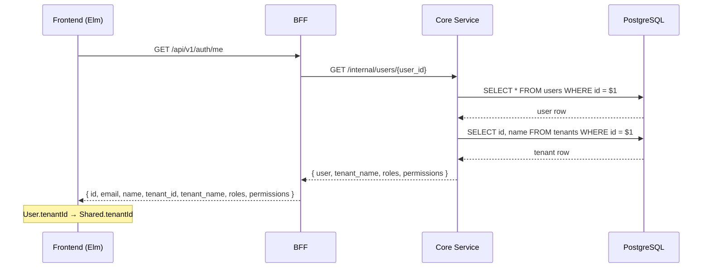

# テナント情報取得機能

## 対応 Issue

- [#306 テナント情報の取得機能を実装する](https://github.com/ka2kama/ringiflow/issues/306)

## 概要

BFF とフロントエンドでハードコードされていたテナント情報（テナント名、テナント ID）を、Core API から動的に取得する機能を実装した。

認証機能（#34）で残された技術的負債の解消。全レイヤー（ドメイン → インフラ → Core Service → BFF → フロントエンド）にわたる変更。

## アーキテクチャ

### データフロー



### 既存エンドポイントの拡張

新規エンドポイント `/internal/tenants/{id}` を追加する代わりに、既存の `/internal/users/{user_id}` レスポンスを拡張する方式を採用。

理由:
- 設計書（[07_認証機能設計.md](../../03_詳細設計書/07_認証機能設計.md)）がこの構造を規定している
- BFF から 1 API コールで完結する
- テナント情報が必要なのは認証フロー（`/auth/me`）のみ

## Phase 一覧

| Phase | コンポーネント | 変更内容 |
|-------|--------------|---------|
| 1 | ドメイン層 | `TenantName` 値オブジェクト、`Tenant` エンティティ |
| 2 | インフラ層 | `TenantRepository` トレイト + PostgreSQL 実装 |
| 3 | Core Service | `get_user` レスポンス拡張、`UserState` に `TenantRepository` 追加 |
| 4 | BFF | ハードコード除去 |
| 5 | フロントエンド | `User` 型に `tenantId` 追加、decoder 更新 |

## 設計解説

### 1. TenantRepository の責務分離

場所: [`backend/crates/infra/src/repository/tenant_repository.rs`](../../../backend/crates/infra/src/repository/tenant_repository.rs)

テナント名取得を `UserRepository` の SQL JOIN ではなく、独立した `TenantRepository` として実装した。

```rust
#[async_trait]
pub trait TenantRepository: Send + Sync {
    async fn find_by_id(&self, id: &TenantId) -> Result<Option<Tenant>, InfraError>;
}
```

なぜこの設計か:
- ユーザー一覧取得（`find_all_active_by_tenant`）にはテナント名が不要。JOIN で不要なデータを取得するのは避けたい
- `TenantRepository` は将来 `/api/v1/tenant` 公開 API で再利用できる
- リポジトリの単一責務を維持

代替案:
- `UserRepository` に `find_with_roles_and_tenant()` メソッドを追加 — SQL が複雑化し、テナント名が不要なケースでもオーバーヘッドが生じる
- ビューを作成して JOIN 済みデータを返す — DB スキーマの変更が必要で、このユースケースには過剰

### 2. UserState への型パラメータ追加

場所: [`backend/apps/core-service/src/handler/auth.rs`](../../../backend/apps/core-service/src/handler/auth.rs)

```rust
pub struct UserState<R, T>
where
    R: UserRepository,
    T: TenantRepository,
{
    pub user_repository:   R,
    pub tenant_repository: T,
}
```

axum の共有 State 設計上、`UserState` を使う全ハンドラ（`list_users`、`get_user_by_email`、`get_user`）に `T: TenantRepository` が波及する。`get_user` だけが `TenantRepository` を使用するが、State が共有されるため避けられない。

代替案:
- `get_user` だけ別の State にする — ルーター構築が複雑化し、他のハンドラパターン（`WorkflowState` 等）との一貫性が崩れる
- `TenantRepository` を `Option` で持つ — 型安全性が低下する

### 3. テナント未発見時のエラー処理

場所: [`backend/apps/core-service/src/handler/auth.rs`](../../../backend/apps/core-service/src/handler/auth.rs) の `get_user` ハンドラ

ユーザーは存在するがテナントが見つからないケースは、データの整合性が壊れている状態。ユーザー起因のエラーではないため、500 Internal Server Error を返す。

```rust
Ok(None) => {
    tracing::error!(
        "テナントが見つかりません: user_id={}, tenant_id={}",
        user.id(),
        user.tenant_id()
    );
    return (
        StatusCode::INTERNAL_SERVER_ERROR,
        Json(ErrorResponse::internal_error()),
    )
        .into_response();
}
```

### 4. Elm の User 型拡張と初期 tenantId の維持

場所: [`frontend/src/Shared.elm`](../../../frontend/src/Shared.elm)

`User` 型に `tenantId` を追加し、`withUser` でログイン後に `Shared.tenantId` を更新する。一方、`Shared.init` の初期値 `"00000000-..."` は維持している。

```elm
init { apiBaseUrl, timezoneOffsetMinutes } =
    { user = Nothing
    , tenantId = "00000000-0000-0000-0000-000000000001" -- 開発用テナント
    , ...
    }
```

理由: ログイン前の API コール（CSRF トークン取得等）で `X-Tenant-ID` ヘッダーが必要。ログイン前は User がないため、初期値が必要。

## 関連ドキュメント

- 計画: [`prompts/plans/306_tenant-info-retrieval.md`](../../../prompts/plans/306_tenant-info-retrieval.md)
- セッションログ: [`prompts/runs/2026-02/2026-02-08_2101_テナント情報取得機能.md`](../../../prompts/runs/2026-02/2026-02-08_2101_テナント情報取得機能.md)
- 設計書: [`docs/03_詳細設計書/07_認証機能設計.md`](../../03_詳細設計書/07_認証機能設計.md)
