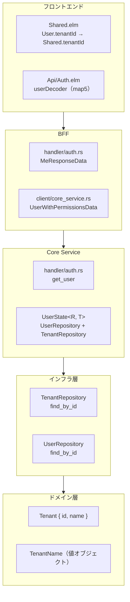
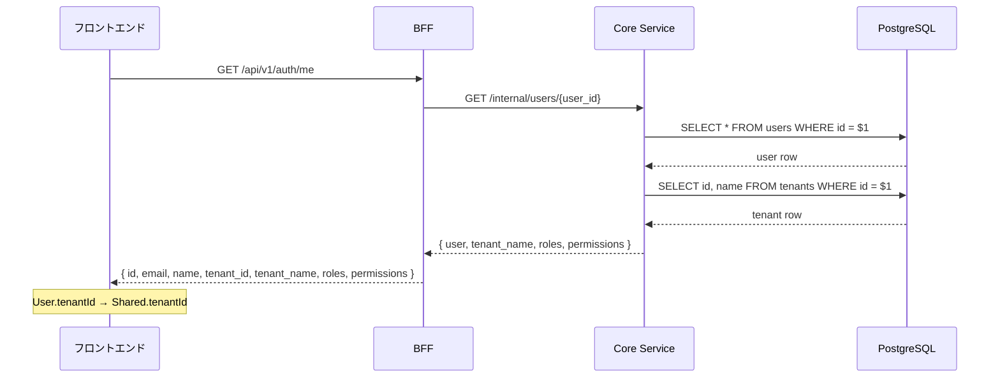

# テナント情報取得 - 機能解説

対応 PR: #310
対応 Issue: #306

## 概要

BFF とフロントエンドでハードコードされていたテナント情報（テナント名、テナント ID）を、Core Service から動的に取得する機能を実装した。認証機能（#34）で残された技術的負債の解消であり、ドメイン層 → インフラ層 → Core Service → BFF → フロントエンドの全レイヤーにわたる変更。

## 背景

### 変更前の課題

ユーザー認証（#34）の実装時に、テナント情報の取得が TODO として残されていた:

- BFF `handler/auth.rs`: `tenant_name: "Development Tenant".to_string()` とハードコード
- フロントエンド `Shared.elm`: `extractTenantId` が固定 UUID を返す関数

マルチテナント SaaS として、テナント情報は DB の実データから取得すべき。

### 変更後

既存の `/internal/users/{user_id}` レスポンスにテナント名を追加し、BFF → フロントエンドまで正しいデータを流す。

```json
// Before
{ "user": { "id": "...", "email": "..." }, "roles": [...] }

// After
{ "user": { "id": "...", "email": "..." }, "tenant_name": "Development Tenant", "roles": [...] }
```

### 設計書との対応

認証機能設計書（[07_認証機能設計.md](../../03_詳細設計書/07_認証機能設計.md)）が `/internal/users/{user_id}` レスポンスにテナント情報を含める構造を規定しており、これに従った。

## 用語・概念

| 用語 | 説明 | 関連コード |
|------|------|-----------:|
| TenantName | テナント名の値オブジェクト。空文字禁止、255 文字以内 | `tenant.rs` |
| Tenant | テナントエンティティ。ID と名前を持つ最小構成 | `tenant.rs` |
| TenantRepository | テナント情報の読み取りを担当するリポジトリトレイト | `tenant_repository.rs` |
| UserState | Core Service の axum 共有 State。UserRepository と TenantRepository を保持 | `handler/auth.rs` |

## アーキテクチャ



## データフロー

### フロー 1: `/auth/me` でのテナント情報取得



#### 処理ステップ

| # | レイヤー | ファイル:関数 | 処理内容 |
|---|---------|-------------|---------:|
| 1 | Core Service | `handler/auth.rs:get_user` | ユーザー取得後、`tenant_id` で `TenantRepository.find_by_id` |
| 2 | インフラ | `tenant_repository.rs:find_by_id` | `SELECT id, name FROM tenants WHERE id = $1` |
| 3 | Core Service | `handler/auth.rs` | `UserWithPermissionsData` に `tenant_name` を追加してレスポンス |
| 4 | BFF | `handler/auth.rs` | `MeResponseData::from()` でハードコードを動的値に置換 |
| 5 | フロントエンド | `Shared.elm:withUser` | `User.tenantId` → `Shared.tenantId` に設定 |

## 設計判断

機能・仕組みレベルの判断を記載する。コード実装レベルの判断は[コード解説](./02_コード解説.md#設計解説)を参照。

### 1. テナント情報の取得方式: 既存エンドポイント拡張 vs 新規エンドポイント

テナント情報をどのエンドポイントから取得するか。

| 案 | API コール数 | 設計書整合 | 再利用性 |
|----|------------|----------|---------|
| **既存 `/internal/users/{user_id}` 拡張（採用）** | 1 回 | 高い（設計書準拠） | 中 |
| 新規 `/internal/tenants/{id}` 追加 | 2 回 | 低い | 高い |

**採用理由**: 認証機能設計書が `/internal/users/{user_id}` レスポンスにテナント情報を含める構造を規定しており、これに従う。BFF から 1 API コールで完結し、テナント情報が必要なのは認証フロー（`/auth/me`）のみ。将来 `/api/v1/tenant` 公開 API が必要になれば、別途追加する。

### 2. テナント名の取得方法: 別クエリ vs SQL JOIN

`get_user` ハンドラでテナント名をどう取得するか。

| 案 | 責務分離 | クエリ回数 | 影響範囲 |
|----|---------|----------|---------|
| **TenantRepository で別クエリ（採用）** | 高い | 2 回 | `get_user` のみ |
| UserRepository の SQL JOIN | 低い | 1 回 | 全ユーザー取得クエリに波及 |

**採用理由**: ユーザー一覧取得（`find_all_active_by_tenant`）にはテナント名が不要。JOIN で不要なデータを取得するのは避けたい。`TenantRepository` として分離することで、将来の `/api/v1/tenant` 公開 API でも再利用可能。

### 3. フロントエンドのスコープ: tenantId のみ vs tenantName も含む

Elm の `User` 型にどのフィールドを追加するか。

| 案 | YAGNI | 表示機能 |
|----|-------|---------|
| **tenantId のみ（採用）** | 準拠 | なし（現時点で不要） |
| tenantId + tenantName | 違反 | テナント名表示が可能 |

**採用理由**: フロントエンドで `tenantName` を表示する UI は現時点で存在しない。`tenantId` のみ追加し、`withUser` で `Shared.tenantId` を更新する。必要になったときに追加すればよい（YAGNI）。

### 4. 初期 tenantId の維持

`Shared.init` の `tenantId = "00000000-..."` をログイン後に上書きするか、初期値を削除するか。

| 案 | ログイン前の API コール | 安全性 |
|----|---------------------|--------|
| **初期値を維持（採用）** | 動作する | 高い |
| 初期値を空文字にする | 失敗する | 低い |

**採用理由**: ログイン前の API コール（CSRF トークン取得等）で `X-Tenant-ID` ヘッダーが必要。ログイン前は `User` がないため、初期値が必要。ログイン後に `withUser` で正しい値に更新される。

## 関連ドキュメント

- [コード解説](./02_コード解説.md)
- 設計書: [07_認証機能設計.md](../../03_詳細設計書/07_認証機能設計.md)
- 計画: [306_tenant-info-retrieval.md](../../../prompts/plans/306_tenant-info-retrieval.md)
