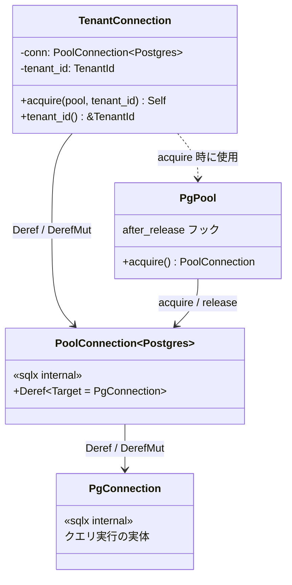
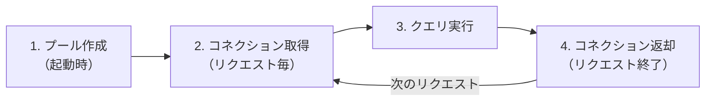
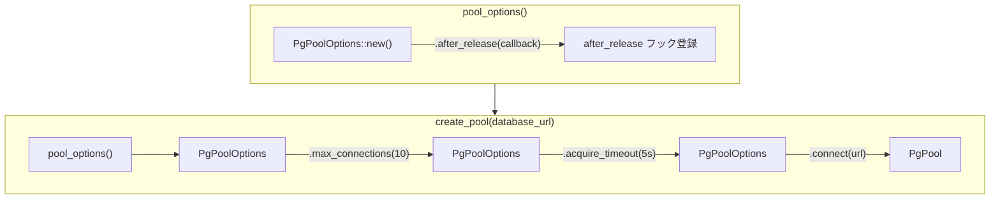
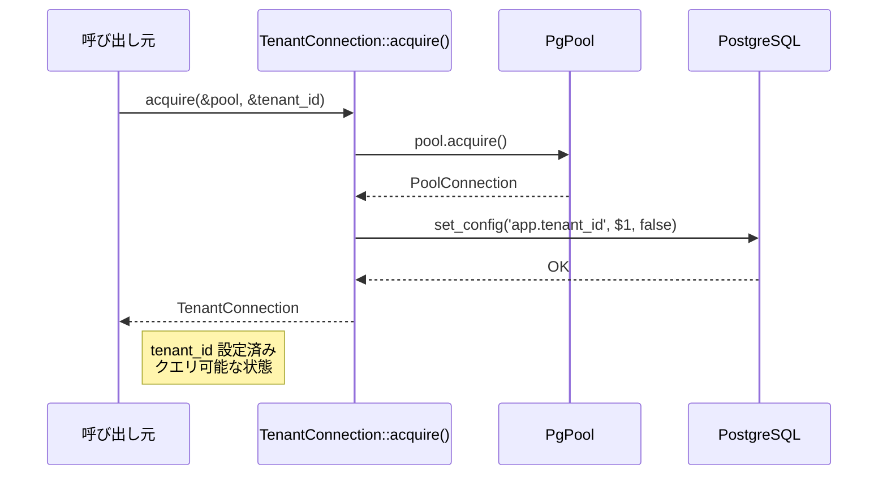
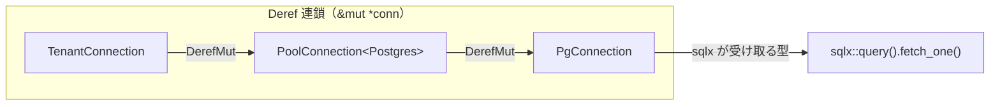
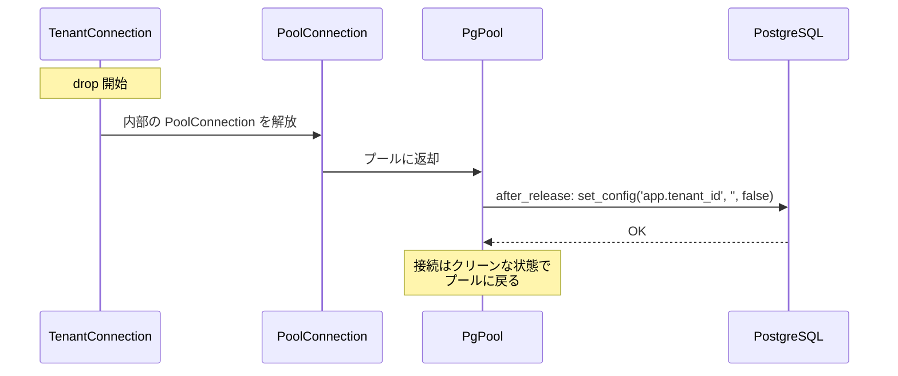
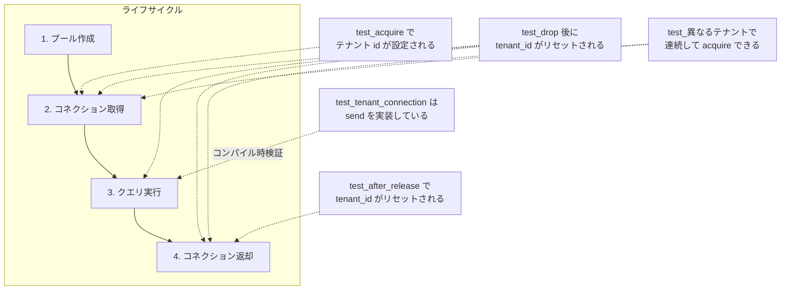

# RLS コネクション管理 - コード解説

対応 PR: [#412](https://github.com/ka2kama/ringiflow/pull/412)
対応 Issue: [#408](https://github.com/ka2kama/ringiflow/issues/408)

## 主要な型・関数

| 型/関数 | ファイル | 責務 |
|--------|---------|------|
| `pool_options()` | [`db.rs:64`](../../../backend/crates/infra/src/db.rs) | `after_release` フック付き `PgPoolOptions` を返す |
| `create_pool()` | [`db.rs:107`](../../../backend/crates/infra/src/db.rs) | 本番用の接続プールを作成 |
| `TenantConnection` | [`db.rs:126`](../../../backend/crates/infra/src/db.rs) | テナントスコープ付き DB コネクション |
| `TenantConnection::acquire()` | [`db.rs:136`](../../../backend/crates/infra/src/db.rs) | テナント ID 設定済みコネクションを返す |

### 型の関係

`TenantConnection` は `PoolConnection<Postgres>` をラップするスマートポインタ。`Deref` 連鎖により、sqlx が受け取る `PgConnection` まで透過的にアクセスできる。



## コードフロー

コードをライフサイクル順に追う。各ステップの構造を図で示した後、対応するコードを解説する。



### 1. プール作成（アプリケーション起動時）

アプリケーション起動時に `create_pool()` が一度だけ呼ばれ、`after_release` フック付きのプールが作られる。



```rust
// backend/crates/infra/src/db.rs:L64-L73
pub fn pool_options() -> PgPoolOptions {
   PgPoolOptions::new().after_release(|conn, _meta| {
      Box::pin(async move {
         sqlx::query("SELECT set_config('app.tenant_id', '', false)")
            .execute(&mut *conn)
            .await?;
         Ok(true)  // true = コネクションをプールに返す（false なら破棄）
      })
   })
}
```

```rust
// backend/crates/infra/src/db.rs:L107-L113
pub async fn create_pool(database_url: &str) -> Result<PgPool, sqlx::Error> {
   pool_options()
      .max_connections(10)
      .acquire_timeout(Duration::from_secs(5))
      .connect(database_url)
      .await
}
```

ここで登録された `after_release` クロージャは、コネクションがプールに返却されるたびに呼ばれる。この時点ではまだ発動しない（→ ステップ 4 で発動）。

### 2. コネクション取得（リクエスト毎）

リクエスト処理で `TenantConnection::acquire()` が呼ばれる。



```rust
// backend/crates/infra/src/db.rs:L136-L146
pub async fn acquire(pool: &PgPool, tenant_id: &TenantId) -> Result<Self, sqlx::Error> {
   let mut conn = pool.acquire().await?;           // ① プールから取得
   sqlx::query("SELECT set_config('app.tenant_id', $1, false)")
      .bind(tenant_id.to_string())                  // ② TenantId → String
      .execute(&mut *conn)                           // ③ セッション変数を設定
      .await?;
   Ok(Self {
      conn,
      tenant_id: tenant_id.clone(),                  // ④ 所有権を持つ
   })
}
```

注目ポイント:

- ② `$1` バインドパラメータで SQL インジェクションを防止。`TenantId` は Newtype(Uuid) なので `to_string()` で文字列化
- ③ `set_config` の第3引数 `false` は「セッション全体に適用」（`true` だとトランザクション内のみ）
- ④ `tenant_id.clone()` で所有権を持つ。`tenant_id()` アクセサで参照を返すため

### 3. クエリ実行

`TenantConnection` は `Deref<Target = PgConnection>` を実装しているため、`&mut *conn` で sqlx のクエリに直接渡せる。



```rust
// 呼び出し側のコード
let mut conn = TenantConnection::acquire(&pool, &tenant_id).await?;
sqlx::query("SELECT * FROM workflows WHERE id = $1")
   .bind(workflow_id)
   .fetch_one(&mut *conn)   // ← DerefMut 連鎖が発動
   .await?;
```

```rust
// backend/crates/infra/src/db.rs:L157-L169
impl Deref for TenantConnection {
   type Target = PgConnection;
   fn deref(&self) -> &Self::Target {
      &self.conn    // PoolConnection の Deref を経由して PgConnection へ
   }
}

impl DerefMut for TenantConnection {
   fn deref_mut(&mut self) -> &mut Self::Target {
      &mut self.conn
   }
}
```

この時点で PostgreSQL のセッション変数 `app.tenant_id` にテナント ID が設定されている。RLS ポリシーがこの変数を参照し、該当テナントの行のみを返す。

### 4. コネクション返却（リクエスト終了）

`TenantConnection` が drop されると、内部の `PoolConnection` がプールに返却される。このとき、ステップ 1 で登録した `after_release` フックが発動する。



次のリクエストで同じ物理接続が取得されても、テナント ID はクリーンな状態から始まる。

## テスト

各テストがライフサイクルのどのステップを検証しているかを示す。



| テスト | 検証対象のステップ | 検証内容 |
|-------|------------------|---------|
| `test_after_releaseでtenant_idがリセットされる` | 4 | コネクション返却後にセッション変数が空になる |
| `test_acquireでテナントidがセッション変数に設定される` | 2 | acquire でセッション変数が設定される |
| `test_drop後に接続がプールに返却されtenant_idがリセットされる` | 2→3→4 | TenantConnection のライフサイクル全体（E2E） |
| `test_異なるテナントで連続してacquireできる` | 4→2 | テナント切り替え（リセット後に別テナントで再取得） |
| `test_tenant_connectionはsendを実装している` | 3 | `Send` トレイトのコンパイル時検証 |

### テスト基盤

```rust
// db_test.rs:L17-L29
fn database_url() -> String {
   dotenvy::dotenv().ok();
   std::env::var("DATABASE_URL").expect("DATABASE_URL must be set")
}

async fn create_test_pool() -> sqlx::PgPool {
   db::pool_options()
      .max_connections(1) // 同一物理接続の再取得を保証
      .connect(&database_url())
      .await
      .unwrap()
}
```

- `max_connections(1)` でプール内の接続を 1 本に制限。返却後に再取得すると必ず同じ物理接続が返るため、`after_release` の動作を確実に検証できる
- `#[sqlx::test]` ではなく `#[tokio::test]` を使用。テーブル不要（`set_config` / `current_setting` はビルトイン関数）なのでマイグレーション不要

### Send のコンパイル時検証

```rust
// db_test.rs:L147-L152
#[allow(dead_code)]
fn assert_send<T: Send>() {}

#[test]
fn test_tenant_connectionはsendを実装している() {
   assert_send::<TenantConnection>();
}
```

`tokio::spawn` で非同期タスクに渡すには `Send` が必要。ジェネリクスの型制約でコンパイル時に検証するテクニック。テストが「コンパイルできること」自体が検証。

### 実行方法

```bash
just dev-deps
cd backend && cargo test -p ringiflow-infra --test db_test
```

## 設計解説

コード実装レベルの判断を記載する。機能・仕組みレベルの判断は[機能解説](./03_コネクション管理_機能解説.md#設計判断)を参照。

### 1. pool_options() の抽出 — テスト容易性のための設計

場所: `backend/crates/infra/src/db.rs:64`

`after_release` フックの定義を `pool_options()` に抽出し、`create_pool()` とテストの両方で再利用する。

```rust
// 本番: max_connections(10)
let pool = create_pool("postgres://...").await?;

// テスト: max_connections(1) で同一接続の再取得を保証
let pool = pool_options().max_connections(1).connect(&url).await?;
```

なぜこの実装か: テストで `after_release` フックの動作を検証するには、同じ物理接続が再取得される必要がある。`create_pool()` は `max_connections(10)` 固定なので、フック定義だけを取り出す関数が必要だった。

代替案:

| 案 | メリット | デメリット | 判断 |
|----|---------|-----------|------|
| `pool_options()` を抽出 | フック定義の重複なし、テストで柔軟に設定可能 | 関数が増える | 採用 |
| `create_pool()` のみ | 関数が少ない | テストで `max_connections(1)` を使えない、フック定義が重複する | 見送り |

### 2. Deref/DerefMut — スマートポインタとしての位置づけ

場所: `backend/crates/infra/src/db.rs:157-169`

`Deref`/`DerefMut` を「スマートポインタ以外」に実装するのはアンチパターンとされるが、`TenantConnection` はスマートポインタに該当する:

- `PoolConnection<Postgres>` 自体が `Deref<Target = PgConnection>` のスマートポインタ
- `TenantConnection` は `PoolConnection` をラップし、追加の振る舞い（テナントスコープ）を付与する

代替案:

| 案 | メリット | デメリット | 判断 |
|----|---------|-----------|------|
| Deref/DerefMut | sqlx と自然に統合 | Deref 乱用の懸念 | 採用 |
| `as_conn()` メソッド | 明示的 | 毎回 `.as_conn()` が必要 | 見送り |
| Executor トレイト実装 | 最も型安全 | sqlx 内部トレイトで実装が複雑 | 見送り |

### 3. テスト戦略 — sqlx::test を使わない理由

場所: `backend/crates/infra/tests/db_test.rs`

| 比較 | `#[sqlx::test]` | `#[tokio::test]` + dotenvy |
|------|-----------------|---------------------------|
| テスト用 DB | 自動作成・削除 | 既存 DB を使用 |
| マイグレーション | 自動実行 | なし |
| テーブル | 必要 | 不要（ビルトイン関数のみ） |
| プール設定 | フレームワーク管理 | 自由に設定可能 |

`set_config` / `current_setting` はビルトイン関数でテーブル不要。マイグレーションのオーバーヘッドを避け、`max_connections(1)` の自由な設定が可能な `#[tokio::test]` が適切。既存の `session_test.rs` と同じパターン。

## 関連ドキュメント

- [機能解説](./03_コネクション管理_機能解説.md)
- [実装計画](../../../prompts/plans/408_rls-connection-management.md)
