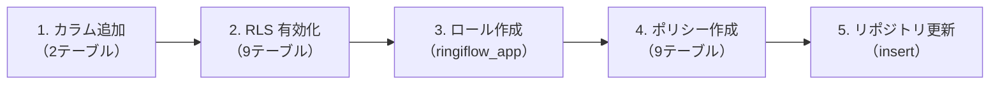
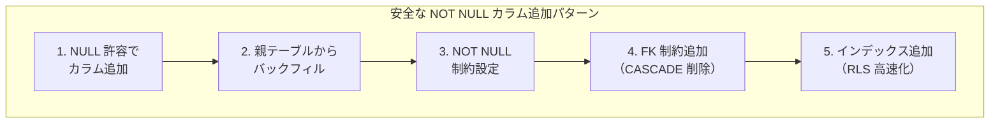
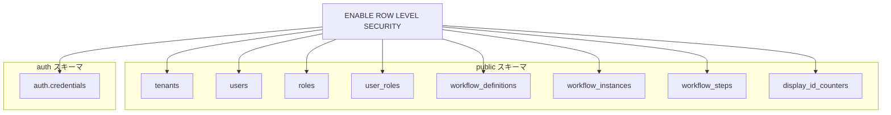
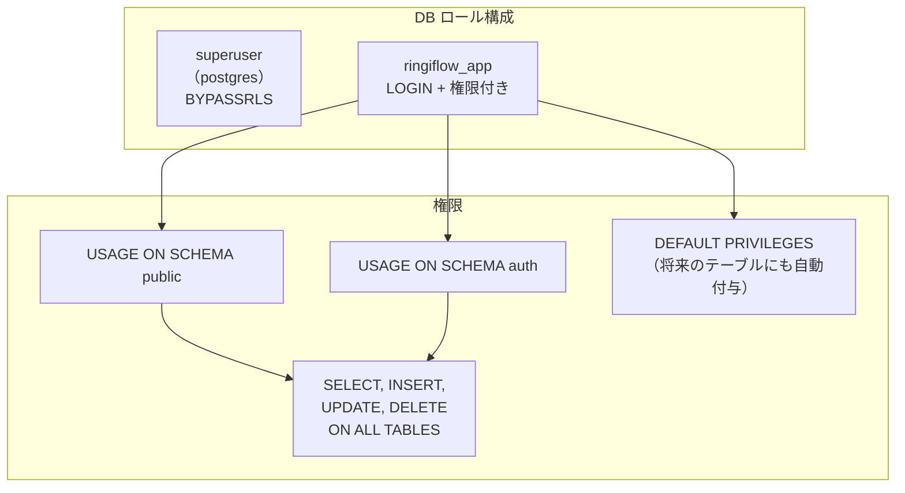
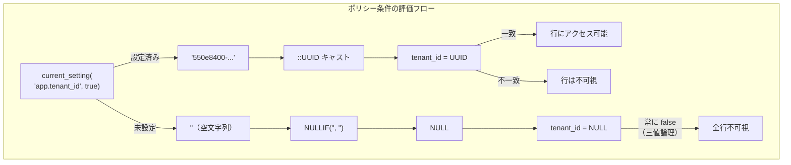
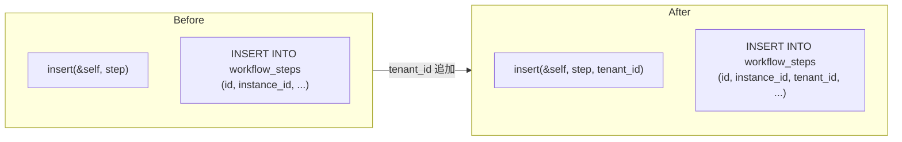
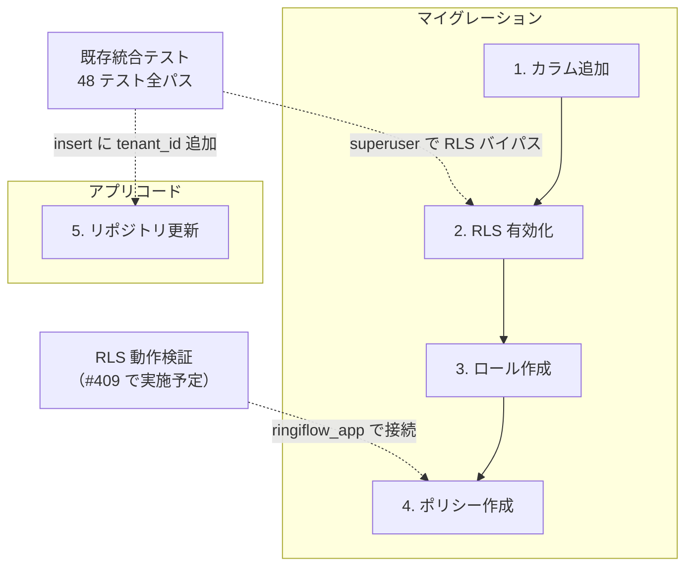
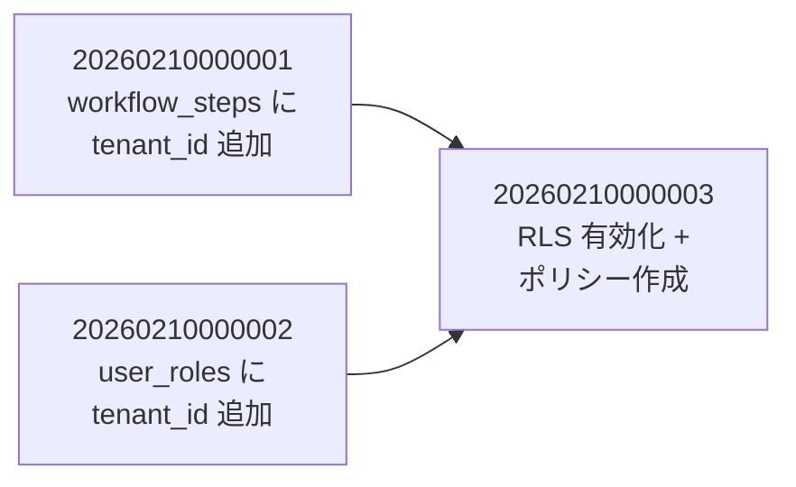

# RLS スキーマ準備 - コード解説

対応 PR: [#413](https://github.com/ka2kama/ringiflow/pull/413)
対応 Issue: [#407](https://github.com/ka2kama/ringiflow/issues/407)

## 主要な型・関数

| 型/関数 | ファイル | 責務 |
|--------|---------|------|
| `tenant_isolation` ポリシー | [`20260210000003_enable_rls_policies.sql`](../../../backend/migrations/20260210000003_enable_rls_policies.sql) | テナント分離の RLS ポリシー |
| `ringiflow_app` ロール | 同上 | RLS が適用されるアプリケーション用 DB ロール |
| `WorkflowStepRepository::insert` | [`workflow_step_repository.rs:88`](../../../backend/crates/infra/src/repository/workflow_step_repository.rs) | tenant_id パラメータ追加 |

## コードフロー

マイグレーションの実行順に追う。各ステップの構造を図で示した後、対応する SQL/コードを解説する。



### 1. tenant_id カラム追加（マイグレーション実行時）

既存テーブルに NOT NULL カラムを安全に追加する。既存データがあるため、いきなり NOT NULL では追加できない。



```sql
-- backend/migrations/20260210000001_add_tenant_id_to_workflow_steps.sql

-- 1. nullable で追加（既存行を壊さない）
ALTER TABLE workflow_steps
    ADD COLUMN tenant_id UUID;

-- 2. 既存データをバックフィル（親テーブルから tenant_id を取得）
UPDATE workflow_steps ws
SET tenant_id = wi.tenant_id           -- ① workflow_instances の tenant_id をコピー
FROM workflow_instances wi
WHERE ws.instance_id = wi.id;

-- 3. NOT NULL 制約を設定（バックフィル後なので安全）
ALTER TABLE workflow_steps
    ALTER COLUMN tenant_id SET NOT NULL;

-- 4. 外部キー制約を追加
ALTER TABLE workflow_steps
    ADD CONSTRAINT workflow_steps_tenant_id_fkey
    FOREIGN KEY (tenant_id) REFERENCES tenants(id) ON DELETE CASCADE;  -- ② テナント削除時に連鎖削除

-- 5. RLS 用インデックス
CREATE INDEX workflow_steps_tenant_id_idx ON workflow_steps(tenant_id);  -- ③ ポリシー評価を高速化
```

注目ポイント:

- ① `UPDATE ... FROM` は PostgreSQL の拡張構文で、他テーブルの値をソースに UPDATE できる
- ② `ON DELETE CASCADE` により、テナント退会時にこのテーブルのデータも自動削除される
- ③ RLS ポリシーが毎クエリで `tenant_id` を比較するため、インデックスが性能に直結する

`user_roles` も同じパターンで、`users` テーブルからバックフィルする。

### 2. RLS 有効化（マイグレーション実行時）

全テナントスコープテーブルで RLS を有効化する。



```sql
-- backend/migrations/20260210000003_enable_rls_policies.sql:L45-L56

-- public スキーマ
ALTER TABLE tenants ENABLE ROW LEVEL SECURITY;
ALTER TABLE users ENABLE ROW LEVEL SECURITY;
ALTER TABLE roles ENABLE ROW LEVEL SECURITY;
ALTER TABLE user_roles ENABLE ROW LEVEL SECURITY;
ALTER TABLE workflow_definitions ENABLE ROW LEVEL SECURITY;
ALTER TABLE workflow_instances ENABLE ROW LEVEL SECURITY;
ALTER TABLE workflow_steps ENABLE ROW LEVEL SECURITY;
ALTER TABLE display_id_counters ENABLE ROW LEVEL SECURITY;

-- auth スキーマ
ALTER TABLE auth.credentials ENABLE ROW LEVEL SECURITY;
```

`ENABLE ROW LEVEL SECURITY` だけではまだフィルタは発生しない。ポリシーが定義されるまで、RLS 対象ロールからの全アクセスが拒否される（デフォルト拒否）。

### 3. アプリケーションロール作成（マイグレーション実行時）

superuser は `BYPASSRLS` 権限により RLS をバイパスするため、RLS を実際に適用するロールが必要。



```sql
-- backend/migrations/20260210000003_enable_rls_policies.sql:L21-L39

DO $$
BEGIN
    IF NOT EXISTS (SELECT FROM pg_roles WHERE rolname = 'ringiflow_app') THEN
        CREATE ROLE ringiflow_app LOGIN PASSWORD 'ringiflow_app';  -- ① 冪等性
    END IF;
END
$$;

-- ringiflow_app に必要な権限を付与
GRANT USAGE ON SCHEMA public TO ringiflow_app;
GRANT USAGE ON SCHEMA auth TO ringiflow_app;
GRANT SELECT, INSERT, UPDATE, DELETE ON ALL TABLES IN SCHEMA public TO ringiflow_app;
GRANT SELECT, INSERT, UPDATE, DELETE ON ALL TABLES IN SCHEMA auth TO ringiflow_app;

-- 今後作成されるテーブルにも自動で権限付与
ALTER DEFAULT PRIVILEGES IN SCHEMA public            -- ② 将来のテーブルにも対応
    GRANT SELECT, INSERT, UPDATE, DELETE ON TABLES TO ringiflow_app;
ALTER DEFAULT PRIVILEGES IN SCHEMA auth
    GRANT SELECT, INSERT, UPDATE, DELETE ON TABLES TO ringiflow_app;
```

注目ポイント:

- ① `IF NOT EXISTS` でロールの存在確認。マイグレーションの冪等性を確保
- ② `ALTER DEFAULT PRIVILEGES` により、今後追加されるテーブルにも自動的に権限が付与される。テーブル追加時の権限付与漏れを防ぐ

### 4. ポリシー作成（マイグレーション実行時）

全テーブルに `tenant_isolation` ポリシーを作成する。ポリシーの条件式は NULLIF パターンで統一。



```sql
-- backend/migrations/20260210000003_enable_rls_policies.sql:L65-L70

-- 標準パターン（8 テーブル共通）
CREATE POLICY tenant_isolation ON users
    FOR ALL                                                          -- ① SELECT + INSERT + UPDATE + DELETE
    TO ringiflow_app                                                 -- ② このロールにのみ適用
    USING (tenant_id = NULLIF(current_setting('app.tenant_id', true), '')::UUID)
    WITH CHECK (tenant_id = NULLIF(current_setting('app.tenant_id', true), '')::UUID);
```

```sql
-- 特殊ケース 1: tenants テーブル（id で比較）
CREATE POLICY tenant_isolation ON tenants
    FOR ALL
    TO ringiflow_app
    USING (id = NULLIF(current_setting('app.tenant_id', true), '')::UUID)     -- ③ tenant_id ではなく id
    WITH CHECK (id = NULLIF(current_setting('app.tenant_id', true), '')::UUID);
```

```sql
-- 特殊ケース 2: roles テーブル（システムロール対応）
CREATE POLICY tenant_isolation ON roles
    FOR ALL
    TO ringiflow_app
    USING (
        tenant_id = NULLIF(current_setting('app.tenant_id', true), '')::UUID
        OR tenant_id IS NULL                                                   -- ④ システムロール
    )
    WITH CHECK (
        tenant_id = NULLIF(current_setting('app.tenant_id', true), '')::UUID
        OR tenant_id IS NULL
    );
```

注目ポイント:

- ① `FOR ALL` は SELECT, INSERT, UPDATE, DELETE の全操作に適用する省略形
- ② `TO ringiflow_app` で特定ロールにのみ適用。superuser は RLS をバイパスする
- ③ `tenants` テーブルは他テーブルと異なり、`tenant_id` カラムではなく主キーの `id` 自体がテナント ID
- ④ `roles` テーブルには `is_system = true` のシステムロール（例: 'user'）が存在し、これらは `tenant_id IS NULL`。全テナントから参照できる必要があるため `OR tenant_id IS NULL` を追加

### 5. リポジトリ更新（アプリケーションコード）

`WorkflowStepRepository::insert` のトレイト署名に `tenant_id` パラメータを追加。INSERT 文に `tenant_id` カラムを含めるようにする。



```rust
// backend/crates/infra/src/repository/workflow_step_repository.rs:L27-L31

#[async_trait]
pub trait WorkflowStepRepository: Send + Sync {
    /// 新規ステップを作成する
    ///
    /// `tenant_id` は RLS 二重防御用。ドメインモデルではなくインフラ層で管理する。 // ①
    async fn insert(&self, step: &WorkflowStep, tenant_id: &TenantId) -> Result<(), InfraError>;
```

```rust
// backend/crates/infra/src/repository/workflow_step_repository.rs:L88-L103

async fn insert(&self, step: &WorkflowStep, tenant_id: &TenantId) -> Result<(), InfraError> {
    // ...
    sqlx::query!(
        r#"
        INSERT INTO workflow_steps (
            id, instance_id, tenant_id, display_number, ...   // ② tenant_id 追加
        )
        VALUES ($1, $2, $3, $4, ...)                          // ③ $3 にバインド
        "#,
        step.id().as_uuid(),
        step.instance_id().as_uuid(),
        tenant_id.as_uuid(),                                   // ④ TenantId → UUID
        // ...
    )
```

注目ポイント:

- ① `tenant_id` はドメインモデル（`WorkflowStep`）には含まれない。テナント分離はインフラ層の関心事であり、ドメインロジックが意識する必要はない
- ②③④ INSERT 文に `tenant_id` カラムを追加し、バインドパラメータで安全に渡す

## テスト



| テスト | 検証対象のステップ | 検証内容 |
|-------|------------------|---------|
| 既存統合テスト（48 テスト） | 1, 5 | マイグレーション適用後も全テスト通過。superuser で接続するため RLS はバイパス |
| RLS 動作検証（#409 で実施） | 2, 3, 4 | `ringiflow_app` ロールでクロステナントアクセスが防止されることを検証 |

### 実行方法

```bash
just dev-deps
cd backend && cargo test -p ringiflow-infra --test workflow_step_repository_test
cd backend && cargo test -p ringiflow-infra --test user_repository_test
```

## マイグレーション

### 全体構成

3つのマイグレーションファイルが依存順に実行される。



| ファイル | 行数 | 内容 |
|---------|------|------|
| [`20260210000001_add_tenant_id_to_workflow_steps.sql`](../../../backend/migrations/20260210000001_add_tenant_id_to_workflow_steps.sql) | 31 | workflow_steps に tenant_id 追加 |
| [`20260210000002_add_tenant_id_to_user_roles.sql`](../../../backend/migrations/20260210000002_add_tenant_id_to_user_roles.sql) | 34 | user_roles に tenant_id 追加 |
| [`20260210000003_enable_rls_policies.sql`](../../../backend/migrations/20260210000003_enable_rls_policies.sql) | 132 | RLS 有効化 + ロール作成 + ポリシー作成 |

## 設計解説

コード実装レベルの判断を記載する。機能・仕組みレベルの判断は[機能解説](./01_機能解説.md#設計判断)を参照。

### 1. バックフィルの安全なパターン — NULL → データ埋め → NOT NULL

場所: `20260210000001`, `20260210000002`

既存テーブルに NOT NULL カラムを追加するとき、いきなり `ADD COLUMN tenant_id UUID NOT NULL` とするとエラーになる（既存行に値がないため）。

```sql
-- NG: 既存データがあるとエラー
ALTER TABLE workflow_steps ADD COLUMN tenant_id UUID NOT NULL;

-- OK: 3ステップの安全なパターン
ALTER TABLE workflow_steps ADD COLUMN tenant_id UUID;          -- NULL 許容
UPDATE workflow_steps ws SET tenant_id = wi.tenant_id FROM ...; -- データ埋め
ALTER TABLE workflow_steps ALTER COLUMN tenant_id SET NOT NULL;  -- NOT NULL 化
```

なぜこの実装か: 本番環境ではテーブルにデータが既に存在する。NULL 許容で追加 → バックフィル → NOT NULL 制約の順序により、ダウンタイムなしで安全にカラムを追加できる。

代替案:

| 案 | メリット | デメリット | 判断 |
|----|---------|-----------|------|
| NULL → バックフィル → NOT NULL | 安全、ダウンタイムなし | ステップが多い | 採用 |
| DEFAULT 値付きで NOT NULL 追加 | 1 ステップ | 正しい値ではなくデフォルト値が入る | 見送り |
| 新テーブル作成 + データ移行 | クリーンなスキーマ | 複雑、FK の張り替えが必要 | 見送り |

### 2. USING と WITH CHECK を両方明示する理由

場所: `20260210000003` の全ポリシー

```sql
CREATE POLICY tenant_isolation ON users
    USING (tenant_id = ...)
    WITH CHECK (tenant_id = ...);  -- USING と同じ条件を明示
```

なぜこの実装か: PostgreSQL では `WITH CHECK` を省略すると `USING` と同じ条件が自動適用される。しかし、読み取り条件と書き込み条件を明示的に分離して記述することで、将来的に条件を分離する場合（例: 読み取りは許可だが書き込みは制限）の変更が容易になる。また、ポリシーの意図を明確にドキュメントする効果がある。

代替案:

| 案 | メリット | デメリット | 判断 |
|----|---------|-----------|------|
| 両方明示 | 意図が明確、将来の拡張が容易 | 冗長に見える | 採用 |
| WITH CHECK 省略 | 簡潔 | 暗黙の挙動に依存 | 見送り |

### 3. roles テーブルの特殊ケース — システムロールの扱い

場所: `20260210000003` の `roles` テーブルポリシー

```sql
CREATE POLICY tenant_isolation ON roles
    USING (
        tenant_id = NULLIF(current_setting('app.tenant_id', true), '')::UUID
        OR tenant_id IS NULL  -- ← システムロール対応
    );
```

なぜこの実装か: `roles` テーブルには `is_system = true` のシステムロール（例: 'user', 'admin'）が存在する。これらは特定テナントに属さず `tenant_id IS NULL` であり、全テナントから参照できる必要がある。他のテーブルにはこのような「テナント横断データ」がないため、`roles` のみの特殊ケースとして対応。

## 関連ドキュメント

- [機能解説](./01_機能解説.md)
- [RLS コネクション管理 - コード解説](./04_コード解説.md)（配管部分）
- [ナレッジベース: PostgreSQL RLS](../../06_ナレッジベース/infra/PostgreSQL_RLS.md)
