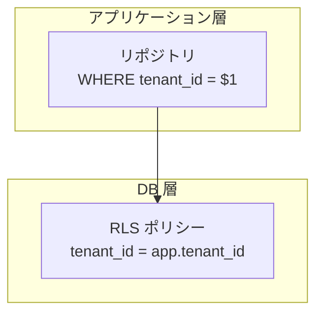
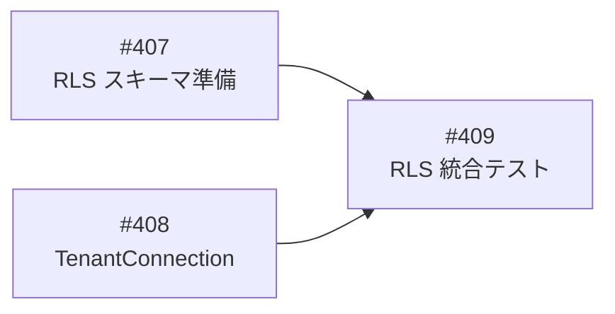
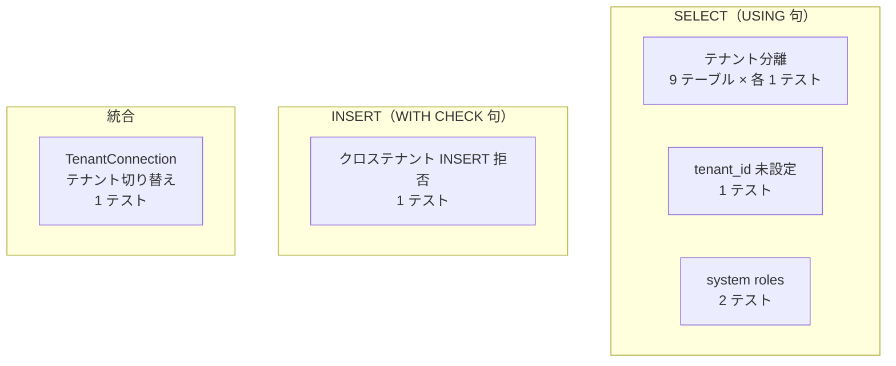

# RLS 統合テスト - 機能解説

対応 PR: #416
対応 Issue: #409

## 概要

PostgreSQL RLS（Row Level Security）ポリシーの動作を直接検証する統合テスト。アプリケーション層（リポジトリの WHERE 句）ではなく、DB 層の RLS ポリシーが実際にクロステナントアクセスを防止することを 13 のテストで検証する。

## 背景

### 二重防御アーキテクチャ

基本設計書 7.1.3 節に基づき、マルチテナントのデータ分離は二重防御で実現する。

| 防御層 | 仕組み | 検証手段 |
|--------|--------|---------|
| アプリケーション層 | リポジトリの WHERE 句 | 既存の `user_repository_test.rs` 等 |
| DB 層 | RLS ポリシー | **本 PR（`rls_test.rs`）** |

### Epic 全体の中での位置づけ

本 PR は Phase 2 マルチテナント強化の RLS 統合テスト部分を担う。

| Issue | 内容 | 状態 |
|-------|------|------|
| #407 | RLS スキーマ準備（マイグレーション、ポリシー定義） | 完了 |
| #408 | TenantConnection 実装（after_release フック） | 完了 |
| #409 | RLS 統合テスト（本 PR） | 本 PR |

## 用語・概念

| 用語 | 説明 | 関連コード |
|------|------|-----------|
| RLS（Row Level Security） | PostgreSQL のテーブルレベルのアクセス制御機構。ポリシーに基づいて行の可視性と書き込み可否を制御する | マイグレーション `20260210000003` |
| `app.tenant_id` | PostgreSQL セッション変数（GUC）。リクエスト処理中にテナント ID を設定し、RLS ポリシーが参照する | `db.rs:67`, `db.rs:138` |
| `ringiflow_app` | 非 superuser ロール。RLS ポリシーが `TO ringiflow_app` で適用される。superuser は BYPASSRLS で RLS を無視する | マイグレーション `20260210000003:21-27` |
| USING 句 | SELECT, UPDATE, DELETE に適用される行の可視性条件 | マイグレーション `20260210000003:69` |
| WITH CHECK 句 | INSERT, UPDATE に適用される行の書き込み可否条件 | マイグレーション `20260210000003:70` |
| system roles | `tenant_id IS NULL` のロール（system_admin, tenant_admin, user）。全テナントから参照可能 | マイグレーション `20260210000003:80-90` |

## テスト対象

### 対象テーブル（全 9 テーブル）

| テーブル | スキーマ | テナント識別子 | ポリシーの特記事項 |
|---------|---------|--------------|------------------|
| tenants | public | `id` | `id = app.tenant_id`（他テーブルと異なる） |
| users | public | `tenant_id` | — |
| roles | public | `tenant_id` | `OR tenant_id IS NULL`（system roles 参照可能） |
| user_roles | public | `tenant_id` | — |
| workflow_definitions | public | `tenant_id` | — |
| workflow_instances | public | `tenant_id` | — |
| workflow_steps | public | `tenant_id` | — |
| display_id_counters | public | `tenant_id` | — |
| auth.credentials | auth | `tenant_id` | — |

### テストカテゴリ

| カテゴリ | テスト数 | 検証内容 |
|---------|---------|---------|
| テナント分離（SELECT） | 9 | 各テーブルで自テナントのデータのみ取得できる |
| tenant_id 未設定 | 1 | `app.tenant_id` 未設定時に 0 行が返る |
| system roles | 2 | system roles が全テナントから参照可能 + テナント固有ロールはクロステナント不可 |
| WITH CHECK（INSERT） | 1 | 他テナントの tenant_id を持つ行の INSERT が拒否される |
| TenantConnection 統合 | 1 | SET ROLE + set_config でテナント切り替えが機能する |
| **合計** | **13** | |

## 設計判断

機能・仕組みレベルの判断を記載する。コード実装レベルの判断は[コード解説](./06_統合テスト_コード解説.md#設計解説)を参照。

### 1. RLS テストの実行環境をどうするか

`#[sqlx::test]` が作成するテスト DB は superuser で接続するため、そのままでは RLS がバイパスされる。テスト内で非 superuser の動作をシミュレーションする方法が必要。

| 案 | RLS の適用 | セットアップ | テストの独立性 |
|----|-----------|-------------|--------------|
| **`#[sqlx::test]` + SET ROLE（採用）** | SET ROLE で ringiflow_app に切り替えて適用 | `#[sqlx::test]` が DB 作成・マイグレーション・クリーンアップを自動管理 | テストごとに独立した DB |
| ringiflow_app ロールで接続するプール | プール自体が非 superuser で RLS 適用 | テスト DB 作成・マイグレーション・テストデータ投入を手動管理 | 手動でのクリーンアップが必要 |
| Docker で非 superuser 専用 DB | コンテナレベルで分離 | 追加のインフラ管理が必要 | 完全に独立だがセットアップが重い |

**採用理由**: `#[sqlx::test]` の自動 DB 管理を活かしつつ、`SET ROLE` で RLS の動作を検証できる。既存テストパターンとも整合する。

### 2. テストヘルパーの配置をどうするか

RLS テスト固有のセットアップ（2 テナント + 全 9 テーブルデータ）を `common/mod.rs` に追加するか、テストファイル内に閉じるかの判断。

| 案 | 再利用性 | 責務の明確さ | 変更影響 |
|----|---------|-------------|---------|
| **`rls_test.rs` 内（採用）** | RLS テスト専用 | RLS テスト固有の関心事が閉じている | RLS テストのみ |
| `common/mod.rs` に追加 | 他のテストでも利用可能 | リポジトリテスト用ヘルパーと RLS テスト用ヘルパーが混在 | common 変更が全テストに影響 |

**採用理由**: `common/mod.rs` はリポジトリテスト用のフィクスチャを提供しており、9 テーブル全てにデータを投入する RLS テスト固有のセットアップとは関心事が異なる。

### 3. TenantConnection のテスト方式をどうするか

`TenantConnection::acquire` は `set_config` のみを実行し、`SET ROLE` は行わない。テスト環境では superuser プールを使うため、`TenantConnection::acquire` を直接呼んでも RLS はバイパスされる。

| 案 | RLS の検証 | 本番との近さ | 実装コスト |
|----|-----------|------------|-----------|
| **SET ROLE + set_config シミュレーション（採用）** | RLS が適用される | SET ROLE は本番ではプール接続ユーザーが担当 | 低 |
| 非 superuser プールを別途作成 | 完全に本番相当 | 最も近い | 中（プール作成 + DB 権限管理） |

**採用理由**: テストの目的は「SET ROLE + set_config の組み合わせで RLS が機能すること」の検証。本番では `ringiflow_app` ロールでプール接続するため SET ROLE は不要だが、テスト環境では superuser からの切り替えとしてシミュレーションする。

## 関連ドキュメント

- [コード解説](./06_統合テスト_コード解説.md)
- [スキーマ準備 機能解説](./01_スキーマ準備_機能解説.md)
- [コネクション管理 機能解説](./03_コネクション管理_機能解説.md)
- [ナレッジベース: PostgreSQL RLS](../../../docs/06_ナレッジベース/infra/PostgreSQL_RLS.md)
