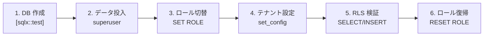
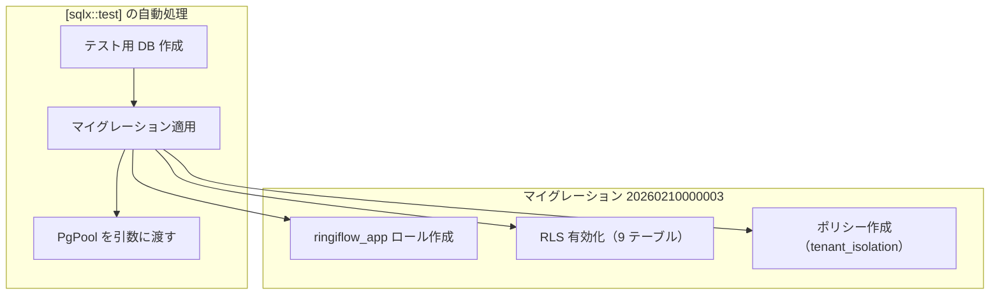
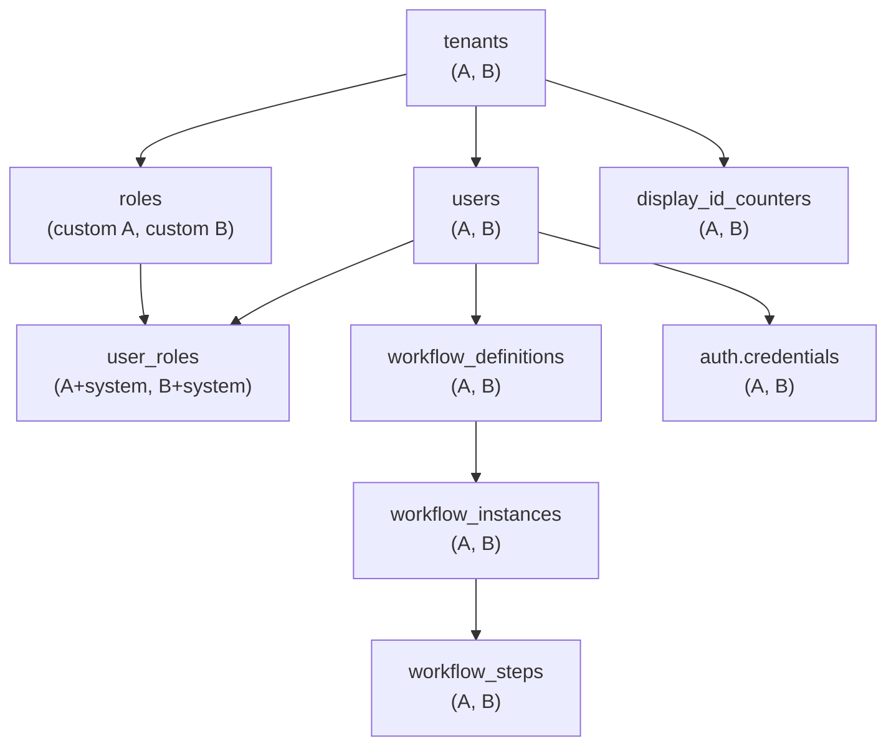
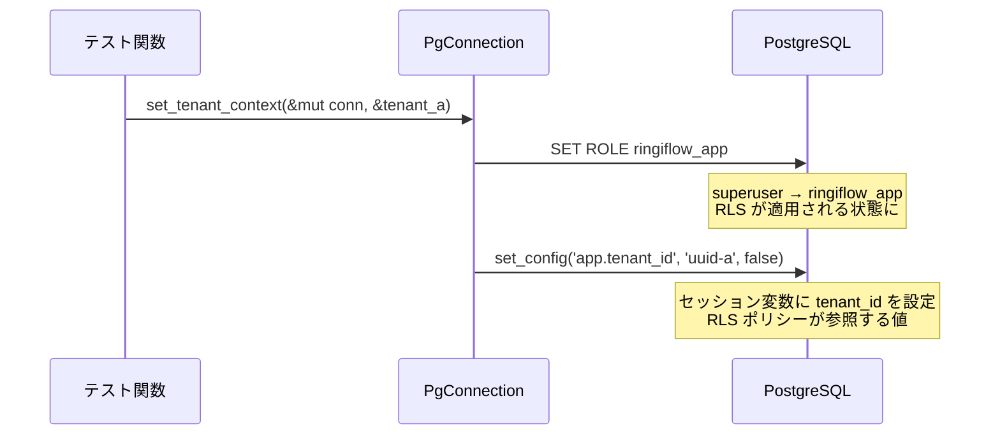
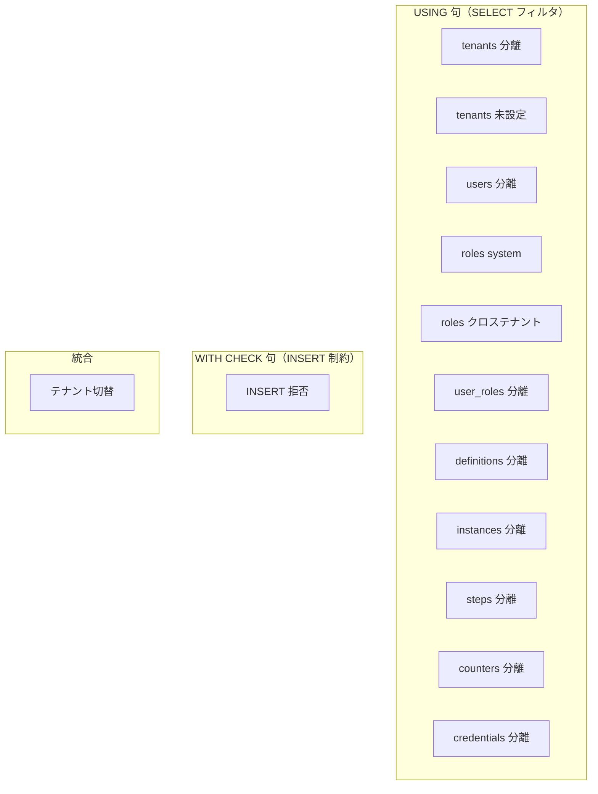

# RLS 統合テスト - コード解説

対応 PR: #416
対応 Issue: #409

## 主要な型・関数

| 型/関数 | ファイル | 責務 |
|--------|---------|------|
| `TwoTenantFixture` | [`rls_test.rs:28`](../../../backend/crates/infra/tests/rls_test.rs) | 2 テナント分のテストデータ ID を保持 |
| `setup_two_tenants()` | [`rls_test.rs:43`](../../../backend/crates/infra/tests/rls_test.rs) | 全 9 テーブルにテストデータを投入 |
| `set_tenant_context()` | [`rls_test.rs:230`](../../../backend/crates/infra/tests/rls_test.rs) | SET ROLE + set_config でテナントコンテキストを設定 |
| `set_app_role_without_tenant()` | [`rls_test.rs:243`](../../../backend/crates/infra/tests/rls_test.rs) | SET ROLE のみ（tenant_id 未設定テスト用） |
| `reset_role()` | [`rls_test.rs:251`](../../../backend/crates/infra/tests/rls_test.rs) | RESET ROLE で superuser に復帰 |

## コードフロー

各テストは同じライフサイクルで動作する。



### 1. テスト DB 作成（`#[sqlx::test]` が自動実行）

`#[sqlx::test(migrations = "../../migrations")]` により、sqlx がテストごとに独立した DB を作成しマイグレーションを適用する。マイグレーション `20260210000003` で `ringiflow_app` ロールと RLS ポリシーが作成される。



プールの接続ユーザーは superuser（BYPASSRLS 権限あり）。そのため、ステップ 2 のデータ投入は RLS を気にせず実行できる。

### 2. テストデータ投入（`setup_two_tenants`）

superuser として 2 テナント分のデータを全 9 テーブルに FK 依存順で INSERT する。



```rust
// rls_test.rs:43-222
async fn setup_two_tenants(pool: &PgPool) -> TwoTenantFixture {
    let tenant_a = Uuid::now_v7();  // ① 各テストで一意な ID を生成
    // ...
    sqlx::query("INSERT INTO tenants ...") // ② sqlx::query（ランタイム）を使用
        .bind(tenant_a)                    // ③ .bind() でパラメータをバインド
        .execute(pool)                     // ④ pool に直接実行（superuser）
        .await
        .unwrap();
    // ... 残り 8 テーブル ...
}
```

注目ポイント:

- ① `Uuid::now_v7()` で各テスト実行ごとに一意な ID を生成。テスト間の干渉を防ぐ
- ② `sqlx::query!`（コンパイル時マクロ）ではなく `sqlx::query`（ランタイム）を使用。理由は[設計解説](#1-sqlxquery-vs-sqlxquery-マクロ)を参照
- ③ `.bind()` チェーンでパラメータをバインド。`$1`, `$2` の順序に対応
- ④ `pool` に直接実行 → superuser として RLS バイパスで INSERT

### 3-4. ロール切り替え + テナントコンテキスト設定（`set_tenant_context`）

このステップが RLS テストの核心。superuser から `ringiflow_app` に切り替え、RLS ポリシーを有効化する。



```rust
// rls_test.rs:230-239
async fn set_tenant_context(conn: &mut PgConnection, tenant_id: &Uuid) {
    sqlx::query("SET ROLE ringiflow_app")    // ① 非 superuser に切り替え
        .execute(&mut *conn)
        .await
        .unwrap();
    sqlx::query("SELECT set_config('app.tenant_id', $1, false)") // ② テナント ID を設定
        .bind(tenant_id.to_string())         // ③ UUID を文字列に変換
        .execute(&mut *conn)
        .await
        .unwrap();
}
```

注目ポイント:

- ① `SET ROLE` で PostgreSQL セッションのロールを切り替え。以降のクエリは `ringiflow_app` として実行され、RLS ポリシーが適用される
- ② `set_config` の第 3 引数 `false` はセッション全体に有効（`true` ならトランザクション内のみ）
- ③ `Uuid` を `.to_string()` で文字列に変換。RLS ポリシー内で `NULLIF(..., '')::UUID` により UUID に戻る

### 5. RLS 検証（各テスト関数）

#### パターン A: テナント分離（SELECT）

```rust
// rls_test.rs:259-276 （tenants テーブルの例）
let rows: Vec<(Uuid,)> = sqlx::query_as("SELECT id FROM tenants") // ① フィルタなしの SELECT
    .fetch_all(&mut *conn)
    .await
    .unwrap();

assert_eq!(rows.len(), 1);          // ② RLS により 1 行のみ返る
assert_eq!(rows[0].0, fixture.tenant_a); // ③ 自テナントのデータのみ
```

注目ポイント:

- ① SQL に WHERE 句がない。RLS ポリシーが暗黙的にフィルタリングする
- ② 2 テナント分のデータが存在するが、RLS により 1 行のみ可視
- ③ 可視な行が自テナント（tenant_a）のものであることを確認

#### パターン B: WITH CHECK（INSERT 拒否）

```rust
// rls_test.rs:532-558
let result = sqlx::query("INSERT INTO users ...")
    .bind(Uuid::now_v7())
    .bind(fixture.tenant_b) // ① テナント A のコンテキストでテナント B の ID を指定
    .execute(&mut *conn)
    .await;

assert!(result.is_err()); // ② RLS WITH CHECK 違反でエラー
let err_msg = result.unwrap_err().to_string();
assert!(err_msg.contains("row-level security")); // ③ エラーメッセージを検証
```

注目ポイント:

- ① テナント A のコンテキスト（`app.tenant_id` = tenant_a）で、`tenant_id` = tenant_b の行を INSERT しようとする
- ② WITH CHECK 句が `tenant_id = app.tenant_id` を要求するため、条件不一致でエラー
- ③ PostgreSQL が返すエラーメッセージに "row-level security" が含まれることを確認

#### パターン C: TenantConnection 統合（テナント切り替え）

```rust
// rls_test.rs:570-614
// テナント A を設定 → テナント A のデータのみ取得
sqlx::query("SELECT set_config('app.tenant_id', $1, false)")
    .bind(fixture.tenant_a.to_string())
    .execute(&mut *conn).await.unwrap();
let rows = sqlx::query_as("SELECT id FROM users")
    .fetch_all(&mut *conn).await.unwrap();
assert_eq!(rows[0].0, fixture.user_a); // ① テナント A

// テナント B に切り替え → テナント B のデータのみ取得
sqlx::query("SELECT set_config('app.tenant_id', $1, false)")
    .bind(fixture.tenant_b.to_string())  // ② set_config の再呼び出しで切り替え
    .execute(&mut *conn).await.unwrap();
let rows = sqlx::query_as("SELECT id FROM users")
    .fetch_all(&mut *conn).await.unwrap();
assert_eq!(rows[0].0, fixture.user_b); // ③ テナント B
```

注目ポイント:

- ① 同一コネクション上でテナント A のデータのみ取得できることを確認
- ② `set_config` を再度呼び出すことでセッション変数を上書き。本番では `after_release` フックでリセット後に再設定する
- ③ 切り替え後はテナント B のデータのみ取得。セッション変数の変更が即座に RLS に反映される

### 6. ロール復帰（`reset_role`）

```rust
// rls_test.rs:251-252
async fn reset_role(conn: &mut PgConnection) {
    sqlx::query("RESET ROLE").execute(&mut *conn).await.unwrap();
}
```

`RESET ROLE` で superuser に復帰。`#[sqlx::test]` がテスト後にコネクションを使用する際に権限が不足しないようにする。

## テスト

各テストがライフサイクルのどのステップを検証しているかを示す。



| テスト | 検証対象 | 検証内容 |
|-------|---------|---------|
| `test_tenants_テナントaのコンテキストで自テナントのみ取得できる` | USING | tenants テーブルで `id = app.tenant_id` が機能 |
| `test_tenants_tenant_id未設定時にデータが返らない` | USING | `app.tenant_id` 未設定時に `NULLIF` → NULL → 0 行 |
| `test_users_テナントaのコンテキストで自テナントのユーザーのみ取得できる` | USING | users テーブルのテナント分離 |
| `test_roles_テナントaのコンテキストで自テナントロールとsystem_rolesが取得できる` | USING | `OR tenant_id IS NULL` で system roles 参照可能 |
| `test_roles_テナント固有ロールはクロステナントアクセスできない` | USING | テナント固有ロールのクロステナント防止 |
| `test_user_roles_テナントaのコンテキストで自テナントのuser_rolesのみ取得できる` | USING | user_roles テーブルのテナント分離 |
| `test_workflow_definitions_テナントaのコンテキストで自テナントの定義のみ取得できる` | USING | workflow_definitions テーブルのテナント分離 |
| `test_workflow_instances_テナントaのコンテキストで自テナントのインスタンスのみ取得できる` | USING | workflow_instances テーブルのテナント分離 |
| `test_workflow_steps_テナントaのコンテキストで自テナントのステップのみ取得できる` | USING | workflow_steps テーブルのテナント分離 |
| `test_display_id_counters_テナントaのコンテキストで自テナントのカウンターのみ取得できる` | USING | display_id_counters テーブルのテナント分離 |
| `test_auth_credentials_テナントaのコンテキストで自テナントのcredentialsのみ取得できる` | USING | auth.credentials テーブルのテナント分離 |
| `test_with_check_テナントaのコンテキストでテナントbのデータをinsertできない` | WITH CHECK | クロステナント INSERT の拒否 |
| `test_tenant_connection_set_roleとset_configでテナント分離が機能する` | 統合 | SET ROLE + set_config でテナント切り替えが機能 |

### 実行方法

```bash
just dev-deps
cd backend && cargo test -p ringiflow-infra --test rls_test
```

## 設計解説

コード実装レベルの判断を記載する。機能・仕組みレベルの判断は[機能解説](./05_機能解説.md#設計判断)を参照。

### 1. `sqlx::query` vs `sqlx::query!` マクロ

場所: `rls_test.rs:54`（`setup_two_tenants` 全体）

```rust
// 採用: sqlx::query（ランタイム）
sqlx::query("INSERT INTO tenants ...")
    .bind(tenant_a)
    .execute(pool)
    .await
    .unwrap();

// 見送り: sqlx::query!（コンパイル時マクロ）
// sqlx::query!("INSERT INTO tenants ...", tenant_a, ...)
//     .execute(pool)
//     .await
//     .unwrap();
```

なぜこの実装か:
`sqlx::query!` マクロはコンパイル時に DATABASE_URL に接続して SQL を検証し型を推論するが、テストセットアップの INSERT 文で型推論エラー（`error[E0282]`）が 32 件発生した。テストセットアップのクエリは SELECT と異なり戻り値の型安全性の恩恵が薄いため、ランタイムクエリで十分と判断。

代替案:

| 案 | メリット | デメリット | 判断 |
|----|---------|-----------|------|
| **`sqlx::query` + `.bind()`** | コンパイルエラーなし、可読性十分 | SQL の静的検証なし | 採用 |
| `sqlx::query!` + 型アノテーション | コンパイル時 SQL 検証 | 32 箇所に型アノテーションが必要、可読性低下 | 見送り |

### 2. `pool` vs `&mut *conn` の使い分け

場所: `rls_test.rs:54-58`（setup）と `rls_test.rs:268-270`（テスト）

```rust
// setup: pool に直接実行（superuser、RLS バイパス）
sqlx::query("INSERT INTO tenants ...")
    .execute(pool)          // ← PgPool に実行
    .await.unwrap();

// テスト: conn 経由で実行（ringiflow_app、RLS 適用）
let rows = sqlx::query_as("SELECT id FROM tenants")
    .fetch_all(&mut *conn)  // ← PoolConnection 経由
    .await.unwrap();
```

なぜこの実装か:
`pool` に直接実行すると、プールが空きコネクションを選ぶため SET ROLE の影響を受けない（superuser のまま）。一方、`&mut *conn` は SET ROLE 済みの特定コネクションを使い続けるため、RLS が適用される。この使い分けにより、同一テスト内で「superuser でデータ投入 → ringiflow_app で RLS 検証」のパターンを実現している。

## 関連ドキュメント

- [機能解説](./05_機能解説.md)
- [スキーマ準備 コード解説](./02_コード解説.md)
- [コネクション管理 コード解説](./04_コード解説.md)
