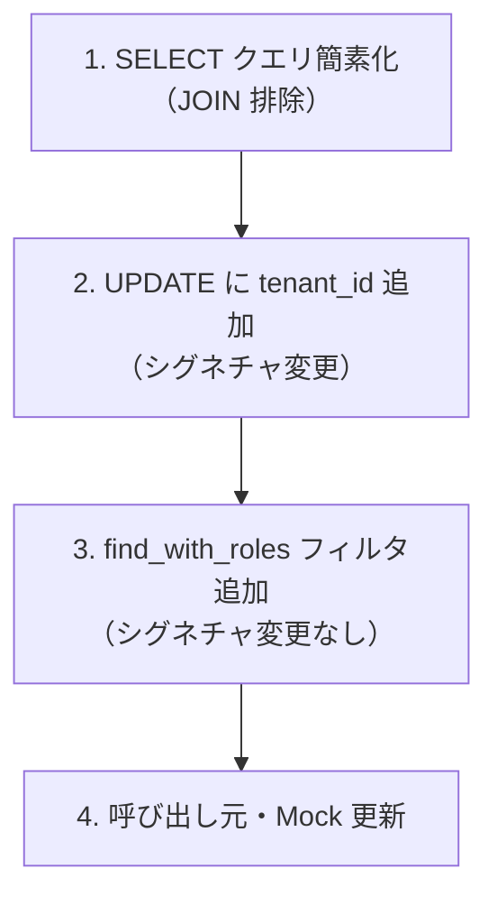
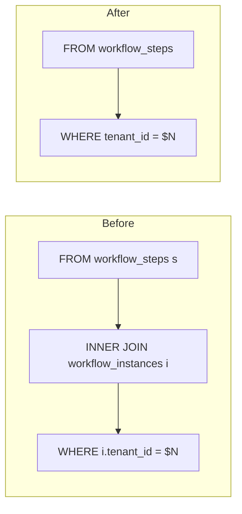
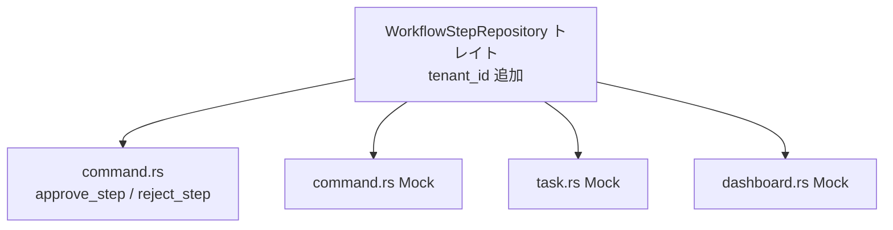
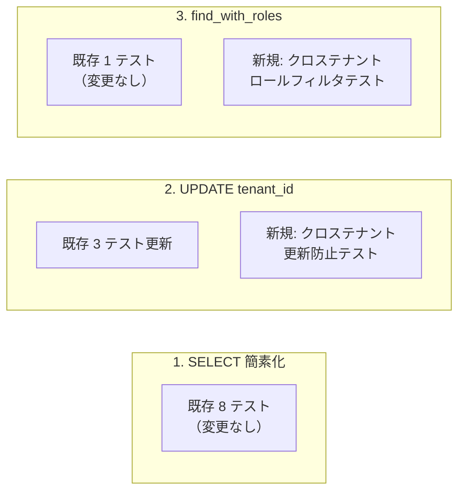

# RLS リポジトリ統合 - コード解説

対応 PR: [#420](https://github.com/ka2kama/ringiflow/pull/420)
対応 Issue: [#410](https://github.com/ka2kama/ringiflow/issues/410)

## 主要な型・関数

| 型/関数 | ファイル | 責務 |
|--------|---------|------|
| `WorkflowStepRepository` | [`workflow_step_repository.rs:27`](../../../backend/crates/infra/src/repository/workflow_step_repository.rs) | ステップ CRUD トレイト |
| `PostgresWorkflowStepRepository` | [`workflow_step_repository.rs:78`](../../../backend/crates/infra/src/repository/workflow_step_repository.rs) | PostgreSQL 実装 |
| `UserRepository` | [`user_repository.rs`](../../../backend/crates/infra/src/repository/user_repository.rs) | ユーザー CRUD トレイト |
| `PostgresUserRepository` | [`user_repository.rs`](../../../backend/crates/infra/src/repository/user_repository.rs) | PostgreSQL 実装 |

## コードフロー

本 PR はクエリの内部変更が中心。外部 API（トレイトシグネチャ）の変更は `update_with_version_check` のみ。



### 1. SELECT クエリの JOIN 排除（workflow_step_repository.rs）

4つの SELECT メソッドから `INNER JOIN workflow_instances` を削除し、直接 `tenant_id` を参照する。



```sql
-- Before (find_by_id)
SELECT s.id, s.instance_id, ...
FROM workflow_steps s
INNER JOIN workflow_instances i ON s.instance_id = i.id
WHERE s.id = $1 AND i.tenant_id = $2

-- After (find_by_id)
SELECT id, instance_id, ...
FROM workflow_steps
WHERE id = $1 AND tenant_id = $2
```

注目ポイント:

- テーブルエイリアス `s.` も不要になった（単一テーブルクエリ）
- sqlx `query!` マクロの返却フィールド名はカラム名と同一のため、Rust 側のマッピングコード（`r.id` 等）は変更不要

### 2. `update_with_version_check` の tenant_id 追加（workflow_step_repository.rs）

トレイトシグネチャに `tenant_id: &TenantId` を追加し、WHERE 句にテナントチェックを追加。

```rust
// workflow_step_repository.rs:127-131
async fn update_with_version_check(
   &self,
   step: &WorkflowStep,
   expected_version: Version,
   tenant_id: &TenantId,          // ← 追加
) -> Result<(), InfraError> {
```

```sql
-- Before
WHERE id = $8 AND version = $9

-- After
WHERE id = $8 AND version = $9 AND tenant_id = $10
```

注目ポイント:

- `rows_affected() == 0` で Conflict エラーを返す既存ロジックが、バージョン不一致だけでなくテナント不一致もカバーする
- INSERT は元々 `tenant_id` を受け取っていたため、CRUD 全操作でテナント分離が統一された

### 3. `find_with_roles` の内部フィルタ追加（user_repository.rs）

トレイトシグネチャは変更せず、内部の SQL クエリのみ変更。

```rust
// user_repository.rs:181-205
async fn find_with_roles(&self, id: &UserId) -> Result<Option<(User, Vec<Role>)>, InfraError> {
   let Some(user) = self.find_by_id(id).await? else {  // ① user を先に取得
      return Ok(None);
   };

   let role_rows = sqlx::query!(
      r#"
         SELECT r.id, r.tenant_id, ...
         FROM roles r
         INNER JOIN user_roles ur ON ur.role_id = r.id
         WHERE ur.user_id = $1 AND ur.tenant_id = $2    -- ② tenant_id フィルタ追加
      "#,
      id.as_uuid(),
      user.tenant_id().as_uuid()                         // ③ user から tenant_id を取得
   )
```

注目ポイント:

- ① `find_by_id` で取得した `user` から `tenant_id()` を参照
- ② `user_roles` テーブルの `tenant_id` でフィルタ（`roles` テーブルではない）
- ③ 外部から `tenant_id` を渡す必要がないため、Mock・呼び出し元の変更ゼロ

### 4. 呼び出し元・Mock 更新

`update_with_version_check` のシグネチャ変更に伴い、3箇所の Mock と2箇所の呼び出し元を更新。



呼び出し元（command.rs）では、既にスコープ内にある `tenant_id` を渡すだけ:

```rust
// command.rs:263-266
self.step_repo
   .update_with_version_check(&approved_step, step_expected_version, &tenant_id)
   .await
```

Mock では未使用パラメータとして `_tenant_id: &TenantId` を追加:

```rust
// command.rs:758 (Mock)
async fn update_with_version_check(
   &self,
   step: &WorkflowStep,
   expected_version: Version,
   _tenant_id: &TenantId,        // ← 追加（Mock では未使用）
) -> Result<(), InfraError> {
```

## テスト



| テスト | 検証対象 | 検証内容 |
|-------|---------|---------|
| `test_update_with_version_check_別テナントのステップは更新できない` | Step 2 | 別テナント ID で更新 → Conflict エラー |
| `test_find_with_roles_別テナントのロール割り当ては含まれない` | Step 3 | 別テナントのロール割り当てがフィルタされる |

### 実行方法

```bash
cd backend && cargo test --package ringiflow-infra --test workflow_step_repository_test
cd backend && cargo test --package ringiflow-infra --test user_repository_test
```

## 設計解説

コード実装レベルの判断を記載する。機能・仕組みレベルの判断は[機能解説](./07_リポジトリ統合_機能解説.md#設計判断)を参照。

### 1. `rows_affected() == 0` による Conflict 検出の二重利用

場所: `workflow_step_repository.rs:161-166`

```rust
if result.rows_affected() == 0 {
   return Err(InfraError::Conflict {
      entity: "WorkflowStep".to_string(),
      id:     step.id().as_uuid().to_string(),
   });
}
```

`WHERE id = $8 AND version = $9 AND tenant_id = $10` により、バージョン不一致とテナント不一致の両方が `rows_affected() == 0` として表面化する。エラーメッセージは `Conflict` で統一される。

| 案 | メリット | デメリット | 判断 |
|----|---------|-----------|------|
| Conflict で統一（採用） | 実装シンプル、セキュリティ的に安全（テナント不一致を明かさない） | デバッグ時に原因の区別が困難 | 採用 |
| テナント不一致を別エラーに | 原因が明確 | 攻撃者にテナント境界の情報を漏らす | 見送り |

### 2. クロステナントロールテストでの別ロール作成

場所: `user_repository_test.rs`

`user_roles` テーブルの一意制約 `(user_id, role_id)` により、同じユーザーに同じロールを別テナントで割り当てることができない。テストでは別テナント用の別ロールを作成して回避した。

```rust
// 別テナント用のロールを作成
let other_role_id = Uuid::now_v7();
sqlx::query!(
   r#"INSERT INTO roles (id, tenant_id, name, ...) VALUES ($1, $2, 'other-admin', ...)"#,
   other_role_id, other_tenant_id.as_uuid()
)
```

一意制約を `(user_id, role_id, tenant_id)` に変更する選択肢もあるが、現時点ではビジネス要件として同一ユーザーが複数テナントに同じロールを持つケースがないため、テスト側で対応した。

## 関連ドキュメント

- [機能解説](./07_リポジトリ統合_機能解説.md)
- [RLS スキーマ準備 - コード解説](./02_スキーマ準備_コード解説.md)
- [RLS コネクション管理 - コード解説](./04_コネクション管理_コード解説.md)
- [RLS 統合テスト - コード解説](./06_統合テスト_コード解説.md)
